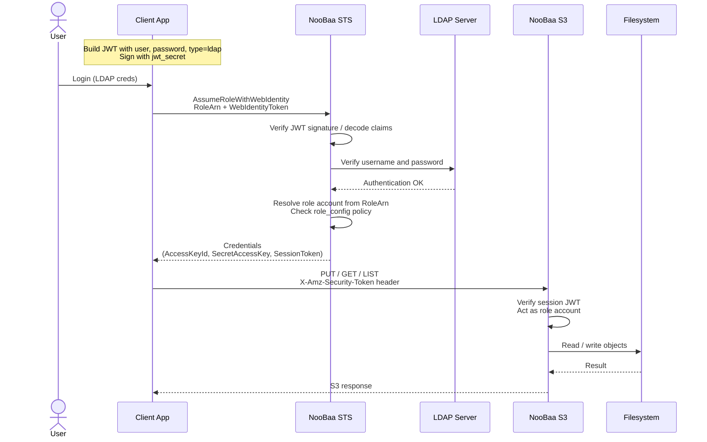

# LDAP on NooBaa Non-Containerized (NC) — Step-by-Step Guide

## Table of Contents

0. [What is LDAP?](#what-is-ldap)
   - [Request sequence](#request-sequence-assumerolewithwebidentity--s3)
1. [Prerequisites](#1-prerequisites)
2. [Start the LDAP test server](#2-start-the-ldap-test-server)
3. [Verify LDAP connectivity](#3-verify-ldap-connectivity)
4. [Configure LDAP in NooBaa](#4-configure-ldap-in-noobaa)
5. [Start the NC endpoint](#5-start-the-nc-endpoint)
6. [Create a role account](#6-create-a-role-account)
7. [Generate the web-identity JWT](#7-generate-the-web-identity-jwt)
8. [Call AssumeRoleWithWebIdentity](#8-call-assumerolewithwebidentity)
9. [Use temporary credentials for S3](#9-use-temporary-credentials-for-s3)
10. [Troubleshooting](#10-troubleshooting)

---

## What is LDAP?

**LDAP** (Lightweight Directory Access Protocol) is a standard protocol for accessing and maintaining directory information — typically usernames, passwords, group memberships, and organizational data.

In NooBaa, LDAP acts as an **external identity provider**: NooBaa delegates username/password validation to your existing directory at STS request time, so users can authenticate with credentials they already know.

## Why is LDAP integration required?

Without LDAP, every person who needs S3 access must have a **dedicated NooBaa account** with permanent access keys.

LDAP integration addresses this by letting organizations **reuse their existing directory credentials** to obtain **short-lived STS tokens** for S3. Users never receive permanent NooBaa access keys; they authenticate once against LDAP and receive temporary credentials.

## How NooBaa uses LDAP

NooBaa integrates LDAP through the AWS-compatible STS operation **`AssumeRoleWithWebIdentity`**:

1. A client application builds a **JWT web-identity token** containing the LDAP username and password.
2. The client calls the NooBaa STS endpoint with that token and a **Role ARN** pointing to a pre-configured role account in NooBaa.
3. NooBaa parses and verifies the JWT
4. NooBaa validates the credentials against the external LDAP server.
5. On success, NooBaa issues **temporary access keys + session token** for the target role account.
6. Client uses those credentials (plus SessionToken) for S3 operations.

### Request sequence (AssumeRoleWithWebIdentity → S3)



## What you need to set up

| Component | Purpose |
|-------|---------|
| External LDAP server | Source of truth for user credentials |
| LDAP config file `/etc/noobaa-server/ldap_config` | LDAP server details so NooBaa can connect |
| NC account with `role_config` | Defines the STS role that LDAP users assume (buckets, FS identity, policies) |
| JWT signing secret (`jwt_secret`) | To encode/decode JWT tokens |
| STS HTTPS port | `7443` (configurable via `ENDPOINT_SSL_STS_PORT`) |
| S3 HTTPS port | `6443` |
| Role ARN format | `arn:aws:sts::<role-account-access-key>:role/<role_name>` |
---

## 1. Prerequisites

- NooBaa NC source tree (or RPM installed).
- Node.js (to run `nsfs.js` / `manage_nsfs.js`).
- Docker (for the LDAP test server).
- `openldap` CLI tools (`ldapsearch`) — `brew install openldap` on macOS.
- AWS CLI v2.
- `jsonwebtoken` npm package (for generating test tokens).

---

## 2. Start the LDAP test server
Ensure you have the following in .env
LOCAL_MD_SERVER=true
JWT_SECRET=<your-secret>

```bash
docker run --rm -it \
  -p 1389:389 \
  -p 1636:636 \
  ghcr.io/ldapjs/docker-test-openldap/openldap:latest
```

Keep this container running in a dedicated terminal.

---

## 3. Verify LDAP connectivity

Search for a user (no TLS):

```bash
ldapsearch -H ldap://127.0.0.1:1389 -x \
  -D "cn=admin,dc=planetexpress,dc=com" -w GoodNewsEveryone \
  -b "ou=people,dc=planetexpress,dc=com" "(uid=fry)" ou
```
Note: Above details can be found on [LDAP testing details](https://github.com/ldapjs/docker-test-openldap/pkgs/container/docker-test-openldap%2Fopenldap)

If these succeed, the LDAP server is ready.

---

## 4. Configure LDAP in NooBaa

Create `/etc/noobaa-server/ldap_config` on the host where the NC endpoint runs:

```bash
sudo mkdir -p /etc/noobaa-server

sudo tee /etc/noobaa-server/ldap_config <<'EOF'
{
  "uri": "ldaps://127.0.0.1:1636",
  "admin": "cn=admin,dc=planetexpress,dc=com",
  "secret": "GoodNewsEveryone",
  "search_dn": "ou=people,dc=planetexpress,dc=com",
  "dn_attribute": "uid",
  "search_scope": "sub",
  "jwt_secret": "<same as env>",
  "tls_options": {
    "rejectUnauthorized": false
  }
}
EOF
```
---

## 5. Start the NC endpoint

In a separate terminal, from the noobaa-core repo root:

```bash
sudo node src/cmd/nsfs.js --debug=5
```

The endpoint starts S3 (port `6443`) and STS (port `7443`) HTTPS servers.

Confirm LDAP connected — look for this in the debug output:

```text
_connect: initial connect succeeded
```

If bind fails you will see retry messages every 3 seconds until LDAP is reachable.

---

## 6. Create a role account

LDAP users do not call STS with permanent access keys. Instead they call `AssumeRoleWithWebIdentity` against an account that has a **`role_config`**. The role account's access key is used in the Role ARN.

Create a new account with a role in one step using `noobaa-cli` / `manage_nsfs.js`:

```bash
mkdir -p /private/tmp/noobaa-buckets

sudo node src/cmd/manage_nsfs.js account add \
  --name ldap_role \
  --uid 501 \
  --gid 20 \
  --new_buckets_path /private/tmp/noobaa-buckets \
  --role_config '{"role_name":"ldap_user","assume_role_policy":{"statement":[{"effect":"allow","action":["sts:*"],"principal":["*"]}]}}'
```

Sample response:
```
{
  "response": {
    "code": "AccountCreated",
    "message": "Account has been created successfully: ldap_role",
    "reply": {
      "_id": "6a2bdeabf5c8e167f92cb079",
      "name": "ldap_role",
      "email": "ldap_role",
      "creation_date": "2026-06-12T10:25:47.422Z",
      "access_keys": [
        {
          "access_key": "uLKzwrCVTMjBgeKW8PJ7",
          "secret_key": "EAXGSIHbsUnq/2ybL66uSo5axOz6mv6pPjyaf5MA"
        }
      ],
      "nsfs_account_config": {
        "uid": 501,
        "gid": 20,
        "new_buckets_path": "/private/tmp/noobaa-buckets"
      },
      "role_config": {
        "role_name": "ldap_user",
        "assume_role_policy": {
          "statement": [
            {
              "effect": "allow",
              "action": [
                "sts:*"
              ],
              "principal": [
                "*"
              ]
            }
          ]
        }
      },
      "allow_bucket_creation": true
    }
  }
}
```

If you already have an account, to add `role_config` to an existing account:

```bash
sudo node src/cmd/manage_nsfs.js account update \
  --name ldap_role \
  --role_config '{"role_name":"ldap_user","assume_role_policy":{"statement":[{"effect":"allow","action":["sts:*"],"principal":["*"]}]}}'
```

Remove `role_config`:

```bash
sudo node src/cmd/manage_nsfs.js account update \
  --name ldap_role \
  --role_config ''
```

Retrieve the access key (needed for the Role ARN):

```bash
sudo node src/cmd/manage_nsfs.js account status \
  --name ldap_role \
  --show_secrets
```

#### `role_config` JSON structure

```json
{
  "role_name": "ldap_user",
  "assume_role_policy": {
    "statement": [{
      "effect": "allow",
      "action": ["sts:*"],
      "principal": ["*"]
    }]
  }
}
```

| Field | Description |
|-------|-------------|
| `role_name` | Name used in the STS Role ARN |
| `assume_role_policy.statement[].effect` | `allow` or `deny` |
| `assume_role_policy.statement[].action` | e.g. `["sts:*"]` or `["sts:AssumeRoleWithWebIdentity"]` |
| `assume_role_policy.statement[].principal` | Who may assume the role. `["*"]` allows any anonymous LDAP web-identity caller |

---

## 7. Generate the web-identity JWT

The JWT payload must contain `user` and `password`.

**Important:** the signing secret must match `jwt_secret` in `/etc/noobaa-server/ldap_config`.

```bash
export JWT_SECRET=<secret_string>

# Token for fry
TOKEN=$(node -e "
const jwt = require('jsonwebtoken');
console.log(jwt.sign({
  user: 'fry',
  password: 'fry'
}, process.env.JWT_SECRET));
")

# Token for leela
TOKEN_LEELA=$(node -e "
const jwt = require('jsonwebtoken');
console.log(jwt.sign({
  user: 'leela',
  password: 'leela'
}, process.env.JWT_SECRET));
")

echo "Fry token:  $TOKEN"
echo "Leela token: $TOKEN_LEELA"
```

### Unsigned token (only when `jwt_secret` is NOT set in ldap_config)

```bash
node -e "
const jwt = require('jsonwebtoken');
console.log(jwt.sign(
  { user: 'fry', password: 'fry', type: 'ldap' },
  undefined,
  { algorithm: 'none' }
));
"
```

---

## 8. Call AssumeRoleWithWebIdentity

Set the role account access key from [step 6](#6-create-a-role-account):

```bash
export ROLE_ACCESS_KEY=<access-key-from-step-6>   # from `account status --show_secrets`
```

Call STS — **no caller AWS credentials required**:

```bash
aws sts assume-role-with-web-identity \
  --endpoint https://127.0.0.1:7443 \
  --role-arn "arn:aws:sts::${ROLE_ACCESS_KEY}:role/ldap_user" \
  --role-session-name fry1 \
  --web-identity-token "$TOKEN" \
  --no-verify-ssl
```

Example successful response:

```json
{
  "Credentials": {
    "AccessKeyId": "67H8BDvKqR6otsEdHYlb",
    "SecretAccessKey": "IS3F1/G0iRXdK9xpxAUcw+05+nVolYuU53nacGu1",
    "SessionToken": "eyJhbGciOiJIUzI1NiIsInR5cCI6IkpXVCJ9...",
    "Expiration": "2026-04-24T08:08:40+00:00"
  },
  "AssumedRoleUser": {
    "AssumedRoleId": "eFqt2bpoL9TwrOlGxTFF:fry1",
    "Arn": "arn:aws:sts::eFqt2bpoL9TwrOlGxTFF:assumed-role/ldap_user/fry1"
  },
  "SourceIdentity": "cn=Philip J. Fry,ou=people,dc=planetexpress,dc=com"
}
```

Test with a different LDAP user (leela):

```bash
aws sts assume-role-with-web-identity \
  --endpoint https://127.0.0.1:7443 \
  --role-arn "arn:aws:sts::${ROLE_ACCESS_KEY}:role/ldap_user" \
  --role-session-name leela-session \
  --web-identity-token "$TOKEN_LEELA" \
  --no-verify-ssl
```

### Role ARN reference

```text
arn:aws:sts::<role-account-access-key>:role/<role_name>
```

- `<role-account-access-key>` — permanent access key of the account that owns `role_config`
- `<role_name>` — must match `role_config.role_name` exactly

---

## 9. Use temporary credentials for S3

Export the credentials from the STS response:

```bash
export TEMP_ACCESS_KEY=67H8BDvKqR6otsEdHYlb
export TEMP_SECRET_KEY='IS3F1/G0iRXdK9xpxAUcw+05+nVolYuU53nacGu1'
export TEMP_SESSION_TOKEN='eyJhbGciOiJIUzI1NiIsInR5cCI6IkpXVCJ9...'
```

List buckets:

```bash
AWS_ACCESS_KEY_ID="$TEMP_ACCESS_KEY" \
AWS_SECRET_ACCESS_KEY="$TEMP_SECRET_KEY" \
AWS_SESSION_TOKEN="$TEMP_SESSION_TOKEN" \
aws --endpoint-url https://127.0.0.1:6443 --no-verify-ssl s3 ls
```

(
if 6443 port not working, try:
```
AWS_ACCESS_KEY_ID="$TEMP_ACCESS_KEY" \
AWS_SECRET_ACCESS_KEY="$TEMP_SECRET_KEY" \
AWS_SESSION_TOKEN="$TEMP_SESSION_TOKEN" \
aws --endpoint-url http://127.0.0.1:6001 --no-verify-ssl s3 ls 
```
)

Create buckets:
```
AWS_ACCESS_KEY_ID="$TEMP_ACCESS_KEY" \
AWS_SECRET_ACCESS_KEY="$TEMP_SECRET_KEY" \
AWS_SESSION_TOKEN="$TEMP_SESSION_TOKEN" \
aws --region us-east-1 \
  --endpoint-url http://127.0.0.1:6001 \
  s3 mb s3://test-bucket-fry
```
---

## 10. Troubleshooting

### LDAP connection

| Symptom | Check |
|---------|-------|
| `_connect: initial connect failed` | LDAP docker running? Ports `1389`/`1636` mapped? |
| `LDAP is not configured or not connected` | File exists at `/etc/noobaa-server/ldap_config`? Endpoint restarted after creating it? |

### JWT / web identity

| Symptom | Check |
|---------|-------|
| `INVALID_WEB_IDENTITY_TOKEN` | `jwt_secret` in ldap_config matches token signing secret |
| `Missing a required claim: user` | JWT must include `user` and `password` fields |
| `invalid signature` | Regenerate token with correct `JWT_SECRET` |

### Role / STS

| Symptom | Check |
|---------|-------|
| `NO_SUCH_ROLE` | Account has `role_config`; `role_name` in ARN matches |
| `issue with LDAP authentication` | Wrong username/password; check `search_dn` and `dn_attribute` |

```bash
# Verify role_config on NC account
sudo node src/cmd/manage_nsfs.js account status \
  --name ldap_role \
  --show_secrets
```