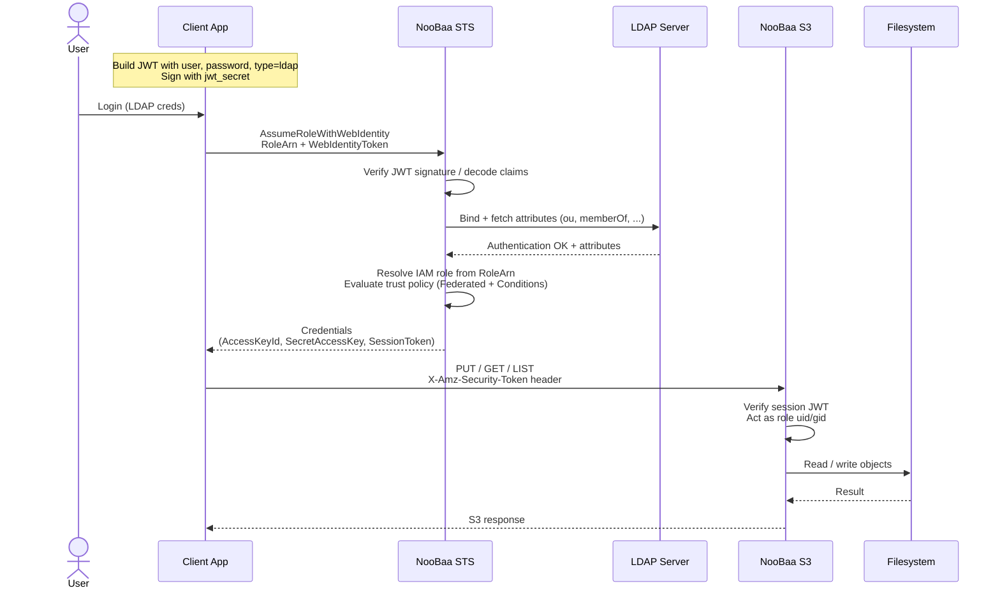

# LDAP on NooBaa Non-Containerized (NC) — Step-by-Step Guide

> IAM Roles design (trust vs permission policy, schemas, CRUD, diagrams) lives in [IAM NC Design](../design/iam_nc.md#iam-roles). This guide covers LDAP-specific setup and the STS `AssumeRoleWithWebIdentity` flow for **S3** access.

## Table of Contents

1. [What is LDAP?](#what-is-ldap)
   - [Request sequence](#request-sequence-assumerolewithwebidentity--s3)
2. [Prerequisites](#1-prerequisites)
3. [Start the LDAP test server (optional)](#2-start-the-ldap-test-server-optional)
4. [Verify LDAP connectivity](#3-verify-ldap-connectivity)
5. [Configure LDAP in NooBaa](#4-configure-ldap-in-noobaa)
6. [Start the NC endpoint](#5-start-the-nc-endpoint)
7. [Create a role for LDAP users](#6-create-a-role-for-ldap-users)
8. [Generate the web-identity JWT](#7-generate-the-web-identity-jwt)
9. [Call AssumeRoleWithWebIdentity](#8-call-assumerolewithwebidentity)
10. [Use temporary credentials for S3](#9-use-temporary-credentials-for-s3)
11. [Troubleshooting](#10-troubleshooting)

---

## What is LDAP?

**LDAP** (Lightweight Directory Access Protocol) is a standard protocol for accessing and maintaining directory information — typically usernames, passwords, group memberships, and organizational data.

In NooBaa, LDAP acts as an **external identity provider**: NooBaa delegates username/password validation to your existing directory at STS request time, so users can authenticate with credentials they already know.

## Why is LDAP integration required?

Without LDAP, every person who needs S3 access must have a **dedicated NooBaa account** with permanent access keys.

LDAP integration addresses this by letting organizations **reuse their existing directory credentials** to obtain **short-lived STS tokens** for S3. Users never receive permanent NooBaa access keys; they authenticate once against LDAP and receive temporary credentials.

Roles themselves are not LDAP-specific — the same IAM role model is used for STS `AssumeRole` and for other web-identity providers. LDAP is one federated identity source that can assume those roles. See [IAM NC Design](../design/iam_nc.md#iam-roles).

## How NooBaa uses LDAP

NooBaa integrates LDAP through the AWS-compatible STS operation **`AssumeRoleWithWebIdentity`**:

1. A client application builds a **JWT web-identity token** containing the LDAP username and password.
2. The client calls the NooBaa STS endpoint with that token and a **Role ARN** for a pre-configured IAM role.
3. NooBaa parses and verifies the JWT.
4. NooBaa validates the credentials against the external LDAP server and fetches bind attributes (for example `ou`, `memberOf`).
5. NooBaa evaluates the role trust policy (`Principal.Federated`, `Action`, optional `ldap:*` `Condition`s).
6. On success, NooBaa issues **temporary access keys + session token** for the target role.
7. The client uses those credentials (plus `SessionToken`) for **S3** operations.

### Request sequence (AssumeRoleWithWebIdentity → S3)


```mermaid
sequenceDiagram
    actor User
    participant App as Client App
    participant STS as NooBaa STS
    participant LDAP as LDAP Server
    participant S3 as NooBaa S3
    participant FS as Filesystem

    Note over App: Build JWT with user, password, type=ldap<br/>Sign with jwt_secret

    User->>App: Login (LDAP creds)
    App->>STS: AssumeRoleWithWebIdentity<br/>RoleArn + WebIdentityToken

    STS->>STS: Verify JWT signature / decode claims
    STS->>LDAP: Bind + fetch attributes (ou, memberOf, ...)
    LDAP-->>STS: Authentication OK + attributes

    STS->>STS: Resolve IAM role from RoleArn<br/>Evaluate trust policy (Federated + Conditions)
    STS-->>App: Credentials<br/>(AccessKeyId, SecretAccessKey, SessionToken)

    App->>S3: PUT / GET / LIST<br/>X-Amz-Security-Token header
    S3->>S3: Verify session JWT<br/>Act as role uid/gid
    S3->>FS: Read / write objects
    FS-->>S3: Result
    S3-->>App: S3 response
```

## What you need to set up

| Component | Purpose |
| --- | --- |
| External LDAP server | Source of truth for user credentials (production or lab). A Docker test image is optional for local trials. |
| LDAP config file `/etc/noobaa-server/ldap_config` | LDAP server details so NooBaa can connect |
| IAM role with trust policy (preferred) | Standalone role with `Principal.Federated` + optional `ldap:*` conditions. See [IAM NC Design](../design/iam_nc.md#iam-roles). |
| JWT signing secret (`jwt_secret` in ldap_config) | Used to encode/decode LDAP web-identity JWTs |
| STS HTTPS port | `7443` (configurable via `ENDPOINT_SSL_STS_PORT`) |
| S3 HTTPS port | `6443` |
| IAM HTTPS port (for CreateRole) | Enable via `ENDPOINT_SSL_IAM_PORT` (for example `7005`) |
| Role ARN formats | IAM roles: `arn:aws:iam::<owner_account_id>:role/<role_name>` · Legacy `role_config`: `arn:aws:sts::<access_key>:role/<role_name>` |

---

## 1. Prerequisites

- NooBaa NC source tree (or RPM installed).
- Node.js (to run `nsfs.js` / `manage_nsfs.js`).
- An LDAP directory you can bind against. For a **local lab only**, Docker can run the optional test OpenLDAP image in [step 2](#2-start-the-ldap-test-server-optional). Production use should point `ldap_config` at your real LDAP/AD server.
- `openldap` CLI tools (`ldapsearch`) — helpful for verifying connectivity to either the test container or a real server (`brew install openldap` on macOS).
- AWS CLI v2.
- `jsonwebtoken` npm package (for generating test tokens).

---

## 2. Start the LDAP test server (optional)

Skip this section if you already have a real LDAP server. The Docker image below is only a **convenience for local testing**; it is not a replacement for a production directory.

```bash
docker run --rm -it \
  -p 1389:389 \
  -p 1636:636 \
  ghcr.io/ldapjs/docker-test-openldap/openldap:latest
```

Keep this container running in a dedicated terminal when using it.

---

## 3. Verify LDAP connectivity

Use `ldapsearch` against your directory (test container or real server). Example against the optional test image (no TLS on port `1389`):

```bash
ldapsearch -H ldap://127.0.0.1:1389 -x \
  -D "cn=admin,dc=planetexpress,dc=com" -w GoodNewsEveryone \
  -b "ou=people,dc=planetexpress,dc=com" "(uid=fry)" ou memberOf
```

For a real LDAP server, substitute your host, bind DN, password, and search base. Confirm you can search the user and see attributes you plan to use in trust-policy conditions (`ou`, `memberOf`, and so on).

Test-image directory details: [ldapjs docker-test-openldap](https://github.com/ldapjs/docker-test-openldap/pkgs/container/docker-test-openldap%2Fopenldap).

If the search succeeds, the LDAP server is ready.

---

## 4. Configure LDAP in NooBaa

Create `/etc/noobaa-server/ldap_config` on the host where the NC endpoint runs.

Field names must be `admin_user` and `admin_password` (mapped internally to the LDAP bind credentials):

```bash
sudo mkdir -p /etc/noobaa-server

sudo tee /etc/noobaa-server/ldap_config <<'EOF'
{
  "uri": "ldaps://127.0.0.1:1636",
  "admin_user": "cn=admin,dc=planetexpress,dc=com",
  "admin_password": "GoodNewsEveryone",
  "search_dn": "ou=people,dc=planetexpress,dc=com",
  "dn_attribute": "uid",
  "search_scope": "sub",
  "jwt_secret": "<jwt-signing-secret>",
  "tls_options": {
    "rejectUnauthorized": false
  }
}
EOF
```

Point `uri`, `admin_user`, `admin_password`, and `search_dn` at your real LDAP server when not using the test image. Set `jwt_secret` to the secret you will use to sign web-identity JWTs.

---

## 5. Start the NC endpoint

In a separate terminal, from the noobaa-core repo root:

```bash
sudo node src/cmd/nsfs.js --debug=5
```

`ENDPOINT_SSL_IAM_PORT` enables the IAM HTTPS endpoint so you can call `CreateRole` (see [step 6](#6-create-a-role-for-ldap-users)). S3 defaults to `6443` and STS to `7443`.

Confirm LDAP connected — look for this in the debug output:

```text
_connect: initial connect succeeded
```

If bind fails you will see retry messages every 3 seconds until LDAP is reachable.

---

## 6. Create a role for LDAP users

LDAP callers do not present permanent access keys. They call `AssumeRoleWithWebIdentity` against a role whose trust policy allows federated LDAP principals.

### Preferred: standalone IAM role (`CreateRole`)

Roles are first-class identities under the owner account (see [IAM NC Design](../design/iam_nc.md#iam-roles)). Uniqueness is **`(owner account id, role name)`**, not global role name alone.

1. Create (or reuse) an owner account that has access keys and an `nsfs_account_config` (uid/gid) — the role inherits filesystem identity from that account unless overridden by the role entity.

```bash
mkdir -p /private/tmp/noobaa-buckets

sudo node src/cmd/manage_nsfs.js account add \
  --name ldap_role_owner \
  --uid 501 \
  --gid 20 \
  --new_buckets_path /private/tmp/noobaa-buckets
```

2. Create a role with a Federated trust policy. `Principal.Federated` must match the LDAP URI in `ldap_config` (scheme is stripped when matching). Optional `Condition` blocks restrict by LDAP attributes such as `ou` or `memberOf`:

```bash
export OWNER_ACCESS_KEY=<owner-access-key>
export OWNER_SECRET_KEY=<owner-secret-key>

# Trust: any authenticated user from this LDAP server
cat > /tmp/ldap-trust-policy.json <<'EOF'
{
  "Version": "2012-10-17",
  "Statement": [{
    "Effect": "Allow",
    "Principal": { "Federated": "ldaps://127.0.0.1:1636" },
    "Action": "sts:AssumeRoleWithWebIdentity"
  }]
}
EOF

AWS_ACCESS_KEY_ID="$OWNER_ACCESS_KEY" \
AWS_SECRET_ACCESS_KEY="$OWNER_SECRET_KEY" \
aws iam create-role \
  --role-name ldap_user \
  --assume-role-policy-document file:///tmp/ldap-trust-policy.json \
  --endpoint-url https://127.0.0.1:7005 \
  --no-verify-ssl
```

Restrict by department (`ldap:ou`) and/or group (`ldap:memberOf`) — see [IAM NC Design — Federated Principal](../design/iam_nc.md#assumerolewithwebidentity--federated-principal-eg-ldap) for AND/OR examples.

Role ARN format:

```text
arn:aws:iam::<owner_account_id>:role/ldap_user
```

Retrieve the owner account id from `account status` / identity JSON as needed for the ARN.

> **Permission policy note:** Trust policy controls **who may assume** the role. What the assumed role may do on S3 is controlled by a **role permission / inline policy** (`PutRolePolicy` and related APIs — Phase 2). Until then, S3 access for an assumed role is governed primarily by the role’s filesystem identity (uid/gid).

### Legacy: embedded `role_config` on an account

Previously a role was embedded into an account via `role_config`. Different permission sets required different accounts. Prefer standalone IAM roles above; keep this only for older setups.

```bash
sudo node src/cmd/manage_nsfs.js account add \
  --name ldap_role \
  --uid 501 \
  --gid 20 \
  --new_buckets_path /private/tmp/noobaa-buckets \
  --role_config '{"role_name":"ldap_user","assume_role_policy":{"statement":[{"effect":"allow","action":["sts:AssumeRoleWithWebIdentity"],"principal":["*"]}]}}'
```

Legacy Role ARN:

```text
arn:aws:sts::<role-account-access-key>:role/ldap_user
```

```bash
sudo node src/cmd/manage_nsfs.js account status \
  --name ldap_role \
  --show_secrets
```

---

## 7. Generate the web-identity JWT

The JWT payload must contain `user` and `password`.

**Important:** the signing secret must match `jwt_secret` in `/etc/noobaa-server/ldap_config`.

```bash
export JWT_SECRET=<jwt-signing-secret>

# Token for fry
TOKEN=$(node -e "
const jwt = require('jsonwebtoken');
console.log(jwt.sign({
  user: 'fry',
  password: 'fry'
}, process.env.JWT_SECRET));
")

# Token for leela
TOKEN_LEELA=$(node -e "
const jwt = require('jsonwebtoken');
console.log(jwt.sign({
  user: 'leela',
  password: 'leela'
}, process.env.JWT_SECRET));
")

echo "Fry token:  $TOKEN"
echo "Leela token: $TOKEN_LEELA"
```

### Unsigned token (only when `jwt_secret` is NOT set in ldap_config)

```bash
node -e "
const jwt = require('jsonwebtoken');
console.log(jwt.sign(
  { user: 'fry', password: 'fry', type: 'ldap' },
  undefined,
  { algorithm: 'none' }
));
"
```

---

## 8. Call AssumeRoleWithWebIdentity

```bash
export ROLE_ARN=arn:aws:iam::<owner_account_id>:role/ldap_user
# Legacy role_config ARN instead:
# export ROLE_ARN=arn:aws:sts::<role-account-access-key>:role/ldap_user
```

Call STS — **no caller AWS credentials required**:

```bash
aws sts assume-role-with-web-identity \
  --endpoint-url https://127.0.0.1:7443 \
  --role-arn "$ROLE_ARN" \
  --role-session-name fry1 \
  --web-identity-token "$TOKEN" \
  --no-verify-ssl
```

Example successful response (placeholders):

```json
{
  "Credentials": {
    "AccessKeyId": "<TEMP_ACCESS_KEY>",
    "SecretAccessKey": "<TEMP_SECRET_KEY>",
    "SessionToken": "<SESSION_TOKEN>",
    "Expiration": "2026-04-24T08:08:40+00:00"
  },
  "AssumedRoleUser": {
    "AssumedRoleId": "<assumed-role-id>:fry1",
    "Arn": "arn:aws:sts::<owner_or_key>:assumed-role/ldap_user/fry1"
  },
  "SourceIdentity": "cn=Philip J. Fry,ou=people,dc=planetexpress,dc=com"
}
```

Test with a different LDAP user (leela):

```bash
aws sts assume-role-with-web-identity \
  --endpoint-url https://127.0.0.1:7443 \
  --role-arn "$ROLE_ARN" \
  --role-session-name leela-session \
  --web-identity-token "$TOKEN_LEELA" \
  --no-verify-ssl
```

---

## 9. Use temporary credentials for S3

Export the credentials from the STS response:

```bash
export TEMP_ACCESS_KEY=<TEMP_ACCESS_KEY>
export TEMP_SECRET_KEY=<TEMP_SECRET_KEY>
export TEMP_SESSION_TOKEN=<SESSION_TOKEN>
```

List buckets:

```bash
AWS_ACCESS_KEY_ID="$TEMP_ACCESS_KEY" \
AWS_SECRET_ACCESS_KEY="$TEMP_SECRET_KEY" \
AWS_SESSION_TOKEN="$TEMP_SESSION_TOKEN" \
aws --endpoint-url https://127.0.0.1:6443 --no-verify-ssl s3 ls
```

If port `6443` is not available, try the HTTP endpoint:

```bash
AWS_ACCESS_KEY_ID="$TEMP_ACCESS_KEY" \
AWS_SECRET_ACCESS_KEY="$TEMP_SECRET_KEY" \
AWS_SESSION_TOKEN="$TEMP_SESSION_TOKEN" \
aws --endpoint-url http://127.0.0.1:6001 --no-verify-ssl s3 ls
```

Create a bucket:

```bash
AWS_ACCESS_KEY_ID="$TEMP_ACCESS_KEY" \
AWS_SECRET_ACCESS_KEY="$TEMP_SECRET_KEY" \
AWS_SESSION_TOKEN="$TEMP_SESSION_TOKEN" \
aws --region us-east-1 \
  --endpoint-url http://127.0.0.1:6001 \
  s3 mb s3://test-bucket-fry
```

---

## 10. Troubleshooting

### LDAP connection

| Symptom | Check |
| --- | --- |
| `_connect: initial connect failed` | Can the NC host reach the LDAP URI in `ldap_config`? For the optional Docker test image: is the container running and are ports `1389`/`1636` mapped? For a real server: firewall, TLS, and correct host/port. |
| `LDAP is not configured or not connected` | File exists at `/etc/noobaa-server/ldap_config`? Keys are `admin_user` / `admin_password`? Endpoint restarted after creating/updating it? |
| Bind / search failures against a real server | Run `ldapsearch` with the same URI, bind DN, and base as `ldap_config`. Confirm `search_dn` / `dn_attribute` match your directory schema. |

Example real-server check:

```bash
ldapsearch -H "$LDAP_URI" -x \
  -D "$BIND_DN" -w "$BIND_PASSWORD" \
  -b "$SEARCH_BASE" "(uid=someuser)" dn ou memberOf
```

### JWT / web identity

| Symptom | Check |
| --- | --- |
| `INVALID_WEB_IDENTITY_TOKEN` | `jwt_secret` in ldap_config matches token signing secret |
| `Missing a required claim: user` | JWT must include `user` and `password` fields |
| `invalid signature` | Regenerate token with the correct secret |

### Role / STS

| Symptom | Check |
| --- | --- |
| `NO_SUCH_ROLE` | IAM role exists under the owner account (`CreateRole`); ARN owner id + role name match. For legacy: account has `role_config` and `role_name` matches. |
| Access denied after LDAP bind | Trust policy `Principal.Federated` URI matches `ldap_config.uri` (scheme stripped). `Condition` (`ldap:ou` / `ldap:memberOf`) matches bind attributes. |
| `issue with LDAP authentication` | Wrong username/password; check `search_dn` and `dn_attribute` |

```bash
# Get role
aws iam get-role \  
  --role-name ldap_user \
  --endpoint-url https://127.0.0.1:7005 \
  --no-verify-ssl
```

```bash
# Legacy: verify role_config on NC account
sudo node src/cmd/manage_nsfs.js account status \
  --name ldap_role \
  --show_secrets
```
