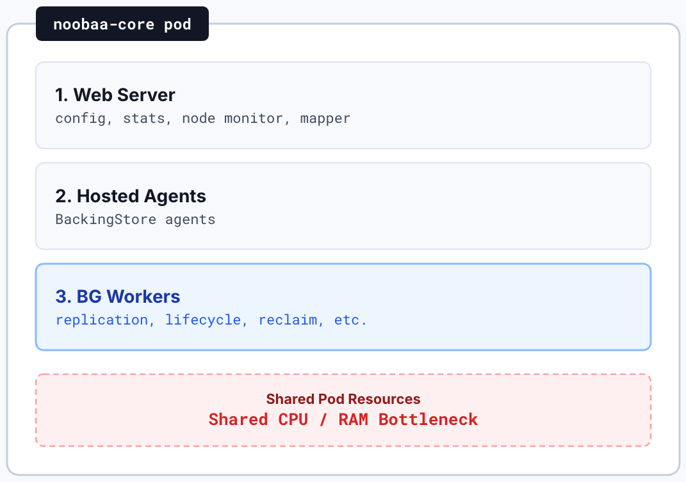
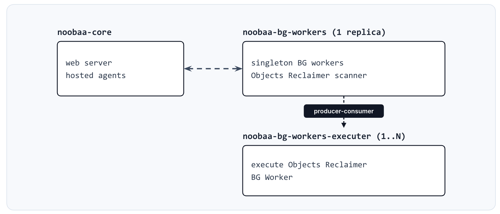

## Background Workers Separation

### Table of Contents

* [Introduction](#introduction)
* [Goals](#goals)
* [In Scope](#in-scope)
* [Out of Scope](#out-of-scope)
* [Feature Technical Details](#feature-technical-details)
* [Affected Components](#affected-components)
* [Limitations](#limitations)
* [Dependencies](#dependencies)
* [Effort Estimation](#effort-estimation)
* [Questions](#open-questions)

---

## Introduction

Today the `noobaa-core` pod holds three responsibilities:

1. **Web server** — Configuration, stats, node monitor, mapper, management and object-metadata APIs.
2. **Hosted agents** — Service-based BackingStores.
3. **Background workers** — Replication, lifecycle expiry and transition, Objects reclaimer, stats, DB cleaner, scrubber, and more.

* All these processes are running via supervisord.
---
### Motivation
* Several of those BG workers are heavy on DB or I/O. They compete for CPU and memory with each other and with the web-server and hosted agents processes.

* Each BG worker is a named singleton: it processes one batch of work per cycle, then sleeps. That can be scaled vertically, but not horizontally, so expiry, transition, replication, or a bulk delete of millions of objects cannot gain throughput by adding replicas.

* Some past customer cases showed latency on some heavy BG workers, such as Replication, DB cleaner etc.

---

## Goals

The primary goal of this epic is to take the background workers process out of `noobaa-core-0` pod and run it on a separate pod with configurable dedicated resources.
Heavy BG workers flows such as lifecycle, replication, and DB cleaner no longer compete with the main noobaa-core process for CPU and memory. 
That split is also the prerequisite for later horizontal-scale.


---

## Goals


The second goal is to introduce a **producer-consumer** pattern on one BG worker first: 
the **producer** discovers work, the **consumer** executes it, and **consumer can scale**. Other workers can be moved to the same pattern later, once that first split is proven.

---

## In Scope

**New Deployments/Pods**
* A new BG-Workers/BG-Workers-executer Deployments with independent `resources`.
* New dedicated pods run the existing singleton BG workers and the new BG workers producer and consumer.

**New Service**
* A new BG workers service for pod-pod communication.

**NooBaa CR Additions**
* Resources and other settings of the BG-Workers/BG-Workers-executer can be configured via NooBaa CR.

---

## In Scope

**BG Workers Internals**
* Some BG workers such as scrubber, stats-aggregator and others that must communicate with noobaa-core or other components will adapt a pod-pod communication instead of communicating via localhost.

**Metrics**
* A new BG ServiceMonitor should scrape the BG worker pods.

---

## In Scope

* Split the Objects Reclaimer BG worker into producer (scan/discover), and consumer (execute) pattern.
* Other BG Workers move to the new producer pod but are not split in the first phase.

---

## Out of Scope

* Moving **hosted agents** out of core.
* Kubernetes **HPA / auto-scale** of BG pods.
* Apply sharded discovery on the **producer**. The option to scale will be available on future versions.
* Replication, Lifecycle Transition, DB Cleaner and other BG workers will be separated to a producer-consumer on future versions.

---

## Feature Technical Details

### Current state



---
## Feature Technical Details

### Current state

* Web-server and BG-workers are already separate **processes** but they share one **pod** and compete over the CPU and memory resources. 

* Each BG worker is a Singleton, while batch size, cycle delay and other configurations are configurable, horizontal scaling is not available with the current implementation.

* As for today, a user can't increase the CPU/memory resources of a specific BG worker therefore, heavy BG workers are not progressing as expected.

---

**Proposed Architecture** —




---

**BG Workers Internals**

* First phase Producer-Consumer split - Objects Reclaimer.

* BG-workers that can be divided to Producer-Consumer in future versions -
  * Replication, Lifecycle (Transition), Scrubber, Mirror Writer.

* Singleton BG Workers - Other BG workers are currently not evaluated to be divided, therefore they stay as singleton loops on the producer side.

---

**BG Workers Pods Scale**

**BG-Workers (Objects Reclaimer Producer and other BG workers)** - 
  * **Vertical Scale** - CPU and memory are set on the BG-Workers Deployment (spec.backgroundWorkers.producer.resources), independently of coreResources.
  * **Horizontal Scale - Out of Scope** - means sharded discovery (bucket, rule, key etc). On this version, we will keep a **single** BG-Workers replica. Scaling the BG-Workers later depends on sharding the BG worker scanners.

---

**BG Workers Pods Scale**

**BG-Workers-Executer (Consumer)** -
* **Horizontal Scale -** N competing replicas. Each replica claims a unit of work and executes it according to the task type. 
Replica count is configurable, while the default remains 1.
* **Vertical scale -** CPU and memory are set on the consumer Deployment (spec.backgroundWorkers.executer.resources).
---


### NooBaa CRD Changes

```yaml
spec:
  backgroundWorkers:
    producer:
      replicaCount: 1          # opt-in >1 when sharding is implemented
      resources:               # default performance profile
        requests:
          cpu: "250m"
          memory: 1Gi
        limits:
          cpu: "1"
          memory: 3Gi
    consumer:
      replicaCount: 1          # default; raise to scale execution
      resources:               # default performance profile
        requests:
          cpu: "250m"
          memory: 1Gi
        limits:
          cpu: "1"
          memory: 3Gi
```

---

## Resources

After Background workers are removed from core, NooBaa-core resources can be reduced. The new Background worker pods receive dedicated CPU and memory.


### Updating Resources vs Performance Profiles

A value set on the NooBaa CR for `backgroundWorkers.producer.resources`, or `backgroundWorkers.consumer.resources` or `coreResources`, takes precedence over the profile.

---

<!-- _footer: "" -->

### Performance profiles changes


| Component | Profile | Request | Limit |
|---|---|---|---|
| Core | `default` | 400m CPU, 1Gi | 1 CPU, 4Gi |
| Producer | `default` | 250m CPU, 1Gi | 1 CPU, 3Gi |
| Consumer | `default` | 250m CPU, 1Gi | 1 CPU, 3Gi |

---

## Traffic

### Inbound 

Some NooBaa paths need to **call into BG on demand**.
For instance, NooBaa endpoint (object map paths) and NooBaa-Core (nodes monitor rebuilds) calls the Scrubber BG worker (`build_chunks`) when chunks must be rebuilt during reads/writes or node recovery.

They need a stable address: a dedicated noobaa-bg-worker Service (`noobaa-bg-worker:8445`).

---

## Traffic

### Outbound

BG workers also reaches out to -

- **Postgres**
- **NooBaa-Core**
- **Hosted agents**
- **S3 / cloud**

When BG lived in the core pod, many of those calls used **localhost**. Off-pod, the operator must give the bg-workers pod the same kind of addresses endpoints already get (`MGMT_ADDR`, `MD_ADDR`, `HOSTED_AGENTS_ADDR`, DB secrets).

---

## Metrics

Prometheus endpoints already exist per process.
`web server :7001, background workers :7002, hosted agents :7003`.
At present, BG metrics are reached only through a core-side reverse proxy `/metrics/bg_workers → localhost:7002`. 

Once BG runs in a separate pod, that proxy is no longer valid.
A new dedicated BG ServiceMonitor must scrape the new aggregated/non aggregated metrics.

---

## Affected Components

* NooBaa-Core
* NooBaa-Operator

New Components - 
* NooBaa-BG-Workers
* NooBaa-BG-Workers-Executer

---

## Limitations

* The `noobaa-core` pod remains highly available. Client-facing paths continue to run on core.

* Only the producer loses high availability. This version deploys a single producer replica, and the producer is not on the client request path. While the producer is unavailable, discovery and the singleton background workers are paused. Client traffic is not affected.

---

## Dependencies

None

---

## Effort Estimation

XL

---

## Questions
