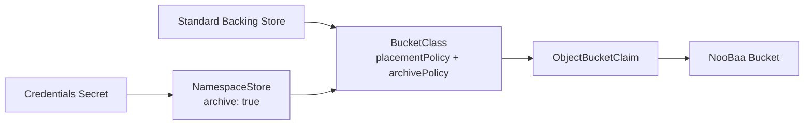
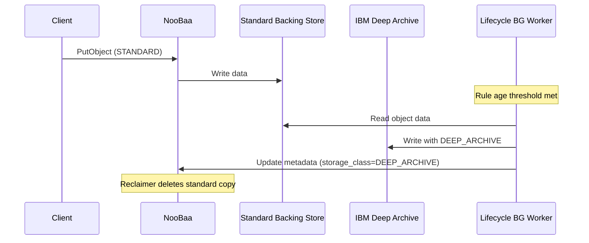

# Support NooBaa Glacier APIs to connect to DeepArchive-S3


### Table of Contents

* [Introduction](#introduction)
* [S3 Glacier Storage Classes Overview](#s3-glacier-storage-classes-overview)
* [Goals](#goals)
* [In Scope](#in-scope)
* [Out of Scope](#out-of-scope)
* [Stretch Goals](#stretch-goals)
* [Feature Technical Details](#feature-technical-details)
    * [Configuration](#feature-technical-details---configuration)
    * [S3 API](#feature-technical-details---s3-api) 
* [Affected Components](#affected-components)
* [Dependencies](#dependencies)
* [Effort Estimation](#effort-estimation)
* [Questions](#questions)
* [Links](#links)
* [Happy Path Guide](#happy-path-guide)

---

### Introduction

AI workloads are driving rapid data growth. Customers currently pay **standard storage rates even for cold/infrequently accessed data**, leading to unnecessary cost.

IBM Deep Archive provides **tape-based, ultra-low-cost long-term storage** accessible via an S3-compatible API, using `DEEP_ARCHIVE` or `GLACIER` as the storage class designation.

This feature integrates IBM Deep Archive into NooBaa, enabling applications to **write directly to archive storage**, **transition data automatically** via lifecycle rules, and **restore archived objects** on demand — all through the standard S3 API.

---
### S3 Glacier Storage Classes Overview

The Amazon S3 Glacier storage classes -
* Stores long term, infrequently accessed data.
* Cost-effective compared to standard storage class.
* There are 3 Glacier storage classes - 
  * S3 Glacier Instant Retrieval
  * S3 Glacier Flexible Retrieval
  * S3 Glacier Deep Archive

S3 Deep Archive storage class - 
* Objects stored in this storage class are archived and not available for real-time access, takes ~12 hours to be restored.
* The lowest-cost storage option in AWS.
* Designed for retaining data sets for multiple years to meet compliance requirements.

---

### Goals


The primary goal of this epic is to integrate IBM Deep Archive as a supported cold storage class within NooBaa by exposing archive field in NamespaceStore CRD, archivePolicy field in BucketClass CRD, and extend NooBaa CLI, While enabling permissioned users to manage deep archive data via S3 APIs.

---

### In Scope - Configuration

* CRD changes - 
  - Add new optional `archive` boolean field to `NamespaceStore` CRD.
  - Add new optional `archivePolicy` field to `BucketClass` CRD. Can be added to existing bucketclasses.
- CLI - extend the existing `namespacestore`, `bucketclass`, and `bucket` commands to support archive fields:
  - `namespacestore create s3-compatible ... --archive`
  - `bucketclass` / BucketClass CR — `archivePolicy.deepArchiveResource`
  - `bucket update <name> --deep-archive-resource <store>` / `--remove-archive-policy`

---

### In Scope - S3 API

- Write objects directly to deep archive - when received `StorageClass=DEEP_ARCHIVE` header.
- Restore Object - create a temporary copy of the archived object to standard storage class.
  - Extend bucket policy support to include the `s3:RestoreObject` action, enabling permission-based control over who can initiate object restores.
- Extend Bucket lifecycle to allow automatic transition of objects from standard to deep archive based on bucket lifecycle transition rules.
- Other S3 APIs.

---

### Out of Scope

- Support for non-IBM Deep Archive glacier endpoints (AWS Glacier, GCS Archive, etc.)
- Restore API will not support - 
  - bulk tier
  - outputLocation
  - batch
- Restore Quota per account
- Setting replication policy and lifecycle transition policy on the same bucket.

---
### Stretch Goals

- Metrics for Lifecycle Transition Actions
- Bucket Notifications for Transition & Restore Actions
- Bucket Logging for Transition Actions

---

### Feature Technical Details - Configuration

An `archive` boolean is added to `NamespaceStoreSpec`:

```go
// NamespaceStoreSpec defines the desired state of NamespaceStore
type NamespaceStoreSpec struct {
    // S3Compatible specifies a namespace store of type s3-compatible
    // +optional
    S3Compatible *S3CompatibleSpec `json:"s3Compatible,omitempty"`

    // Archive marks this namespace store as a deep-archive (Glacier) endpoint.
    // When true, the store can only be referenced via archivePolicy on a placement
    // BucketClass; it cannot be used in a namespace policy or as an account default resource.
    // +optional
    Archive bool `json:"archive,omitempty"`
}
```
---
### Feature Technical Details - Configuration

An `archive` boolean is added to `NamespaceStoreSpec`:
```go
// S3CompatibleSpec specifies a namespace store of type s3-compatible
type S3CompatibleSpec struct {
    // TargetBucket is the name of the target S3 bucket
    TargetBucket string `json:"targetBucket"`

    // Secret refers to a secret that provides the credentials.
    // The secret should define AWS_ACCESS_KEY_ID and AWS_SECRET_ACCESS_KEY.
    Secret corev1.SecretReference `json:"secret"`

    // Endpoint is the S3 compatible endpoint: http(s)://host:port
    Endpoint string `json:"endpoint"`

    // SignatureVersion specifies the client signature version to use when signing requests.
    // +optional
    SignatureVersion S3SignatureVersion `json:"signatureVersion,omitempty"`
}
```

---

### Feature Technical Details - Configuration

Example NamespaceStore CR:
```yaml
apiVersion: noobaa.io/v1alpha1
kind: NamespaceStore
metadata:
  name: ibm-deep-archive-store
spec:
  type: s3-compatible
  s3Compatible:
    targetBucket: my-archive-bucket
    endpoint: https://s3.us-south.cloud-object-storage.appdomain.cloud
    signatureVersion: v2
    secret:
      name: ibm-deep-archive-credentials
      namespace: openshift-storage
  archive: true
```

---

### Feature Technical Details — Configuration

New optional `archivePolicy` field added to `BucketClassSpec`:

```go
// ArchivePolicy configures a deep-archive namespace store as the cold-storage
// target for a placement-policy BucketClass.
type ArchivePolicy struct {
    // DeepArchiveResource is the name of the ibm-deep-archive NamespaceStore with archive: true.
    DeepArchiveResource string `json:"deep_archive_resource"`
}
```

---

### Feature Technical Details - Configuration

Example BucketClass CR:
```yaml
apiVersion: noobaa.io/v1alpha1
kind: BucketClass
metadata:
  name: archive-bucketclass
spec:
  placementPolicy:
    tiers:
      - backingStores:
          - standard-backing-store
  archivePolicy:
    deepArchiveResource: ibm-deep-archive-store   # must have spec.archive: true
```

---

### Feature Technical Details - Configuration

* In this version, `archive: true` is only supported on s3-compatible namespace stores.
* A NamespaceStore with `archive: true` can only be referenced via `archivePolicy` — it cannot be used in a `namespacePolicy` or as an account's `defaultResource`.
* `archive: true` is immutable after creation (changing it would silently orphan archived objects).
* NooBaa will reject creating 2 NamespaceStores with `archive: true` pointing to the same endpoint and target bucket.
* `placementPolicy` must be present on any BucketClass that sets `archivePolicy`; it configures the standard storage tier.
* The referenced namespacestore in `archivePolicy` must have `spec.archive: true`. Validation enforces this at the CLI /admission and reconcile time.
* OBC Deletion — When reclaiming an OBC, NooBaa will delete all the bucket's objects from the archive store.

#### Update archive policy on an existing bucket (NooBaa CLI)

Archive policy can be set at bucket creation (via BucketClass `archivePolicy` or operator reconcile) or updated on an existing bucket with the NooBaa CLI:

```bash
# Add or change archive policy
noobaa bucket update my-archive-bucket --deep-archive-resource ibm-deep-archive-store

# Verify
noobaa bucket status my-archive-bucket

# Remove (only when bucket has no DEEP_ARCHIVE / GLACIER objects)
noobaa bucket update my-archive-bucket --remove-archive-policy
```

Constraints:

* `--deep-archive-resource` and `--remove-archive-policy` are mutually exclusive.
* The referenced NamespaceStore must exist and have `spec.archive: true`.
* Update or removal is rejected when the bucket contains completed objects in `DEEP_ARCHIVE` or `GLACIER` storage classes.
* Changing or removing `archivePolicy` on a BucketClass only affects new OBCs; use `noobaa bucket update` for existing buckets.

See [Step 5 — Update archive policy on a bucket](#step-5--update-archive-policy-on-a-bucket-noobaa-cli) in the [Happy Path Guide](#happy-path-guide) for a full walkthrough.

---

### Feature Technical Details — S3 API

| Operation | Behavior |
|-----------|----------|
| **PutObject / CompleteMultipartUpload** - (storageClass=DEEP_ARCHIVE)| Create a DB entity for the object metadata and passthrough the data to IBM Deep Archive namespace resource
| **RestoreObject** | Updates the object's restore_status to be ongoing and will call S3 RestoreObject on the Deep Archive, while the background worker will create the temporary copy of the archived object to standard storage class. If already restored, extend the expiry_time. Allowed for bucket owner/ permissioned accounts - `s3:RestoreObject` permission.|
| **PutBucketLifecycleConfiguration** | Processes and stores `Transition` / `NonCurrentVersionTransition` lifecycle actions |
| **GetBucketLifecycleConfiguration** | Return value includes `Transition` / `NonCurrentVersionTransition` elements |

---

### Feature Technical Details — S3 API

| Operation | Behavior |
|-----------|----------|
| **HeadObject** | Returns `x-amz-storage-class: DEEP_ARCHIVE` and `x-amz-restore` header from `restore_status` |
| **GetObject** | If object not restored - throws `InvalidObjectState` error. Else, reads from standard copy when `restore_status.expiry_time` is set and not expired |
| **GetObjectAttributes** | Returns `StorageClass` from object metadata |
| **ListObjects** | Served from object metadata — no direct IBM Deep Archive query |
| **CopyObject** - (source archived) | If object not restored - throws `InvalidObjectState` error. Else, copies the temporary copy from standard to standard/deep archive when target's `storageClass=DEEP_ARCHIVE` |
| **DeleteObject** | Deletes the object metadata and eventually passthrough delete to IBM Deep Archive endpoint to avoid orphaned data |

---

## Feature Technical Details — S3 Lifecycle Transition Rules

S3 Lifecycle rules allow automatic movement of objects between standard to Deep Archive storage classes over time.  
Users configure them via `PutBucketLifecycleConfiguration`.

`Transition` action key fields: 
- **StorageClass** - `DEEP_ARCHIVE`
- **Days** - the number of days after creation of an object before transitioning the object to Deep Archive.
- **Date** - absolute date when transitioning the object to Deep Archive. 

`NonCurrentVersionTransition` action key fields:
- **StorageClass** - `DEEP_ARCHIVE`
- **NewerNoncurrentVersions** - how many noncurrent versions will retain in the standard storage class before transitioning object to Deep Archive.
- **NoncurrentDays** - the number of days an object is noncurrent before transitioning the object to Deep Archive.

Note - All other lifecycle rule fields — such as expiration and filter — remain fully supported and work in conjunction with the new transition rules.

---
Example - 
```xml
<LifecycleConfiguration>
  <Rule>
    <ID>move-to-deep-archive</ID>
    <Status>Enabled</Status>
    <Filter>
      <Prefix>logs/</Prefix>
    </Filter>
    <Transition>
      <Days>90</Days>
      <StorageClass>DEEP_ARCHIVE</StorageClass>
    </Transition>
    <NoncurrentVersionTransition>
      <NoncurrentDays>30</NoncurrentDays>
      <StorageClass>DEEP_ARCHIVE</StorageClass>
    </NoncurrentVersionTransition>
  </Rule>
</LifecycleConfiguration>
```
---

### Feature Technical Details — Lifecycle Transition

The existing lifecycle bg worker currently **skips** `Transition` / `NoncurrentVersionTransition` rules.

**New behavior -**
1. Read transition lifecycle rules per bucket, gate on bucket having `archive_resources`
2. For each object that should be transitioned:
   - Set the object's transition_status to be `in_progress`
   - Read object data from standard storage class
   - Writes object data to IBM Deep Archive (S3-compatible write, per-request timeout)
   - Update object DB metadata fields - `storage_class = 'DEEP_ARCHIVE'`, `transition_status = "done"`, `data_expired = "timestamp"` 
3. The already existing object reclaimer BG worker will do the actual data deletion

**Notes -**
* The lifecycle BG worker works in batches
* Per-object errors - log and **continue** — do not abort the bucket's transition run, retry on next cycle.
* Object's metadata **is not deleted** - `storage_class = DEEP_ARCHIVE` signals archive location to all S3 operations

---

### Feature Technical Details — Restore & Expiry

**Deep Archive Restore is async** — IBM Deep Archive (tape) retrieval takes up to 12 hours.

**RestoreObject API** - Set object's metadata `restore_status = { ongoing: true }` and will call S3 RestoreObject on deep archive / extend the expiry_time if already restored and return immediately.

**Restore BG Worker** - 
1. Iterate over objects metadata that their restore_status is ongoing, for each -
    * call headObject to fetch the status from the deep archive
    * when restored on deep archive -
       * getObject from deep archive 
       * write the data to standard storage class
       * update the object's metadata `restore_status={ ongoing: false, expiry_time: Days+now }`

**Restore Expiry BG Worker**
Fetches from NooBaa DB expired temporary restored objects and sets data_expired to timestamp. 
The already existing object reclaimer BG worker will do the actual data deletion and will reset the restore status

---

### Affected Components

1. noobaa-core
2. noobaa-operator
3. noobaa-cli
4. UI

---

## Dependencies

- IBM Deep Archive endpoint - Must be S3-compatible and accessible from the cluster
- Versioning — NooBaa will support transitioning and restoring versioned objects to Deep Archive. Full versioning support depends on IBM Deep Archive enabling versioning on their end.

---

## Effort Estimation

XL

---

## Questions

---

## Links

* [Happy Path Guide](#happy-path-guide)
* [IBM Deep Archive documentation](https://www.ibm.com/products/deep-archive#:~:text=Standardized%20interface%20to%20tape%20utilizing%20the%20S3%20Glacier%20storage%20classes%20for%20all%20supported%20object%20data%20on%20a%20scalable%20infrastructure.)

AWS documentation - 
* [Understanding S3 Glacier storage classes for long-term data storage](https://docs.aws.amazon.com/AmazonS3/latest/userguide/glacier-storage-classes.html)
* [Amazon S3 Glacier storage classes](https://aws.amazon.com/s3/storage-classes/glacier/)
* [Understanding archival storage in S3 Glacier Deep Archive](https://docs.aws.amazon.com/AmazonS3/latest/userguide/archival-storage.html)
* [Working with archived objects](https://docs.aws.amazon.com/AmazonS3/latest/userguide/archived-objects.html)
* [Understanding archive retrieval options](https://docs.aws.amazon.com/AmazonS3/latest/userguide/restoring-objects-retrieval-options.html)
* [Restoring an archived object](https://docs.aws.amazon.com/AmazonS3/latest/userguide/restoring-objects.html)
* [RestoreObject API](https://docs.aws.amazon.com/AmazonS3/latest/API/API_RestoreObject.html)
* [Managing the lifecycle of objects](https://docs.aws.amazon.com/AmazonS3/latest/userguide/object-lifecycle-mgmt.html)
* [Transitioning objects](https://docs.aws.amazon.com/AmazonS3/latest/userguide/lifecycle-transition-general-considerations.html)
* [PutBucketLifecycleConfiguration API](https://docs.aws.amazon.com/AmazonS3/latest/API/API_PutBucketLifecycleConfiguration.html)
* [S3 lifecycle event notifications](https://docs.aws.amazon.com/AmazonS3/latest/userguide/lifecycle-configure-notification.html)
* [S3 lifecycle and logging](https://docs.aws.amazon.com/AmazonS3/latest/userguide/lifecycle-and-other-bucket-config.html#lifecycle-general-considerations-logging)
* [Understanding and managing Amazon S3 storage classes](https://docs.aws.amazon.com/AmazonS3/latest/userguide/storage-class-intro.html)
* [Storage classes for rarely accessed objects](https://docs.aws.amazon.com/AmazonS3/latest/userguide/storage-class-intro.html#sc-glacier)
* [Amazon S3 Event Notifications](https://docs.aws.amazon.com/AmazonS3/latest/userguide/EventNotifications.html)
* [Restore-object CLI documentation](https://docs.aws.amazon.com/cli/latest/reference/s3api/restore-object.html)

---

## Happy Path Guide

Step-by-step walkthroughs for the most common IBM Deep Archive success scenarios in NooBaa.

This guide assumes a containerized NooBaa deployment on OpenShift/Kubernetes with an IBM Deep Archive S3-compatible endpoint already provisioned.

---

### Table of Contents

1. [Prerequisites](#prerequisites)
2. [Setup](#setup)
3. [S3 API](#s3-api)
4. [Lifecycle transition to Deep Archive](#lifecycle-transition-to-deep-archive)
5. [Lifecycle expiry of a Deep Archive object](#lifecycle-expiry-of-a-deep-archive-object)
6. [Quick reference — API responses by object state](#quick-reference--api-responses-by-object-state)

---

### Prerequisites

| Requirement | Notes |
|-------------|-------|
| IBM Deep Archive endpoint | S3-compatible; reachable from the NooBaa cluster |
| Deep Archive credentials | `AWS_ACCESS_KEY_ID` and `AWS_SECRET_ACCESS_KEY` in a Kubernetes Secret |
| Standard backing store | A placement-policy backing store for hot/standard tier data |
| NooBaa S3 endpoint | Endpoint URL and account credentials for issuing S3 requests |
| NooBaa CLI | Installed and configured against the NooBaa system namespace |

Set these shell variables for the examples below:

```bash
export NOOBAA_ENDPOINT="https://s3.openshift-storage.svc:443"
export AWS_ACCESS_KEY_ID="<noobaa-account-access-key>"
export AWS_SECRET_ACCESS_KEY="<noobaa-account-secret-key>"
export BUCKET="my-archive-bucket"
```

---

### Setup

Wire NooBaa to IBM Deep Archive by creating an archive NamespaceStore, a BucketClass with `archivePolicy`, and a bucket backed by that BucketClass. Alternatively, attach an archive policy to an existing bucket with the NooBaa CLI (Step 5). Step 6 covers OBC reclaim teardown.

Each step below shows two options: **YAML** (apply with `kubectl`) or **NooBaa CLI**. Use one or the other per resource.

#### Step 1 — Create credentials Secret

The archive NamespaceStore needs credentials whether you create it via YAML or CLI. Create a Kubernetes Secret in the NooBaa system namespace:

```yaml
apiVersion: v1
kind: Secret
metadata:
  name: ibm-deep-archive-credentials
  namespace: openshift-storage
type: Opaque
stringData:
  AWS_ACCESS_KEY_ID: "<deep-archive-access-key>"
  AWS_SECRET_ACCESS_KEY: "<deep-archive-secret-key>"
```

```bash
kubectl apply -f deep-archive-secret.yaml
```

When using the NooBaa CLI with `--secret-name`, this Secret must exist before creating the NamespaceStore. Alternatively, omit `--access-key` and `--secret-key` on the CLI command and NooBaa will prompt for credentials securely at the terminal.

#### Step 2 — Create archive NamespaceStore

The store must have `archive: true` and type `s3-compatible`. It can only be referenced through `archivePolicy` on a BucketClass — not via `namespacePolicy` or as a default resource.

##### Option A — YAML

```yaml
apiVersion: noobaa.io/v1alpha1
kind: NamespaceStore
metadata:
  name: ibm-deep-archive-store
  namespace: openshift-storage
spec:
  type: s3-compatible
  archive: true
  s3Compatible:
    targetBucket: my-archive-bucket
    endpoint: <archive-endpoint-address>
    signatureVersion: v4
    secret:
      name: ibm-deep-archive-credentials
      namespace: openshift-storage
```

```bash
kubectl apply -f ibm-deep-archive-store.yaml
```

##### Option B — NooBaa CLI

```bash
noobaa namespacestore create s3-compatible ibm-deep-archive-store \
  --archive \
  --endpoint <archive-endpoint-address> \
  --target-bucket my-archive-bucket \
  --secret-name ibm-deep-archive-credentials \
  --signature-version v4
```

Verify:

```bash
noobaa namespacestore status ibm-deep-archive-store
```

**Expected result:** NamespaceStore `ibm-deep-archive-store` reaches `Ready`.

#### Step 3 — Create BucketClass with archivePolicy

`placementPolicy` defines the standard tier. `archivePolicy.deepArchiveResource` must reference the archive NamespaceStore from Step 2.

##### Option A — YAML

```yaml
apiVersion: noobaa.io/v1alpha1
kind: BucketClass
metadata:
  name: archive-bucketclass
  namespace: openshift-storage
spec:
  placementPolicy:
    tiers:
      - backingStores:
          - standard-backing-store
  archivePolicy:
    deepArchiveResource: ibm-deep-archive-store
```

```bash
kubectl apply -f archive-bucketclass.yaml
```

##### Option B — NooBaa CLI

```bash
noobaa bucketclass create placement-bucketclass archive-bucketclass \
  --backingstores standard-backing-store \
  --deep-archive-resource ibm-deep-archive-store
```

Verify:

```bash
noobaa bucketclass status archive-bucketclass
```

**Expected result:** BucketClass `archive-bucketclass` is reconciled successfully.

#### Step 4 — Create a bucket (ObjectBucketClaim)

##### Option A — YAML

```yaml
apiVersion: objectbucket.io/v1alpha1
kind: ObjectBucketClaim
metadata:
  name: my-archive-bucket
  namespace: app-namespace
spec:
  bucketName: my-archive-bucket
  storageClassName: noobaa.noobaa.io
  bucketClass: archive-bucketclass
```

```bash
kubectl apply -f my-archive-bucket.yaml
```

##### Option B — NooBaa CLI

```bash
noobaa obc create my-archive-bucket \
  --exact \
  --bucketclass archive-bucketclass
```

> Note: You can also use a generated bucket name (`generateBucketName` in YAML, or omit `--exact` in the CLI). If you do, set `BUCKET` to the name returned by `obc status` before running the S3 examples.

Verify and retrieve credentials:

```bash
noobaa obc status my-archive-bucket
```

**Expected result:** OBC binds and the bucket is available on the NooBaa S3 endpoint. Use the access key and secret from `obc status` (or the bound Secret in the app namespace) for `AWS_ACCESS_KEY_ID` / `AWS_SECRET_ACCESS_KEY` in the S3 examples below.

#### Step 5 — Update archive policy on a bucket (NooBaa CLI)

Attach, change, or remove the archive policy on an existing NooBaa bucket using the `noobaa bucket update` command. This enables Deep Archive S3 operations (`StorageClass=DEEP_ARCHIVE`, lifecycle transitions, restore) on buckets that were created without an `archivePolicy` on their BucketClass.

Use this step for buckets created via the S3 API (`CreateBucket`), which do not inherit an `archivePolicy` from a BucketClass — Steps 3–4 only cover OBC / BucketClass–backed buckets.

**Preconditions:**

- NooBaa CLI installed and configured (`noobaa status` succeeds).
- An archive NamespaceStore exists with `spec.archive: true` (see Step 2).
- Target bucket exists and has **no completed objects** in `DEEP_ARCHIVE` or `GLACIER` storage classes.
  - NooBaa rejects archive-policy updates when archived objects are present, because changing or removing the policy would leave those objects inaccessible.

##### Add or update the archive policy

Point the bucket at an archive NamespaceStore:

```bash
noobaa bucket update my-archive-bucket \
  --deep-archive-resource ibm-deep-archive-store
```

**Expected result:** Command completes without error. The bucket's `archive_policy.deep_archive_resource` is set to `ibm-deep-archive-store`.

The CLI validates that:

- The NamespaceStore exists in the NooBaa namespace.
- The NamespaceStore has `spec.archive: true`.

To switch to a different archive store (only when the bucket has no archived objects):

```bash
noobaa bucket update my-archive-bucket \
  --deep-archive-resource ibm-deep-archive-store-2
```

##### Verify the archive policy

```bash
noobaa bucket status my-archive-bucket
```

**Expected output** includes:

```text
 Archive Resource       : ibm-deep-archive-store
```

After the policy is applied, the bucket supports the S3 flows below (S3 API, lifecycle transitions, restore).

##### Remove the archive policy

Only when the bucket contains no `DEEP_ARCHIVE` / `GLACIER` objects:

```bash
noobaa bucket update my-archive-bucket --remove-archive-policy
```

**Expected result:** Command completes without error. `noobaa bucket status` no longer shows an Archive Resource line.

`--deep-archive-resource` and `--remove-archive-policy` are mutually exclusive; using both fails immediately.

##### BucketClass vs per-bucket updates

| Change type | Affects existing buckets? | How to apply |
|-------------|---------------------------|--------------|
| Add `archivePolicy` to a BucketClass that had none | Yes — operator applies to existing OBC buckets without a policy | Edit BucketClass CR; operator reconciles |
| Change or remove `archivePolicy` on a BucketClass | No — only new OBCs | Edit BucketClass CR for new buckets; use `noobaa bucket update` for existing buckets |
| `noobaa bucket update --deep-archive-resource` | Yes — the named bucket only | NooBaa CLI (this step) |

##### Negative checks

| Condition | Expected error |
|-----------|----------------|
| Bucket has `DEEP_ARCHIVE` / `GLACIER` objects | Update/remove rejected (`FORBIDDEN`) |
| NamespaceStore does not exist | CLI error: NamespaceStore not found |
| NamespaceStore without `archive: true` | CLI error: must have `spec.archive=true` |
| Both `--deep-archive-resource` and `--remove-archive-policy` | CLI error: cannot use both flags |

#### Step 6 — Delete OBC (archive reclaim)

When an OBC is deleted and the bucket is reclaimed, NooBaa deletes the bucket's objects from the archive store as well as from NooBaa metadata — so IBM Deep Archive is not left with orphaned data.

```bash
noobaa obc delete my-archive-bucket
```

Or:

```bash
kubectl delete objectbucketclaim my-archive-bucket -n app-namespace
```

**Expected result:** The OBC and bucket are removed. Archived object data for that bucket is deleted from IBM Deep Archive as part of reclaim.

Use this only as a teardown check after the S3 and lifecycle scenarios, or on a dedicated test bucket — reclaim permanently deletes the bucket and its objects.

#### Setup flow (overview)



---

### S3 API

Object-level S3 operations on buckets with an `archivePolicy`. Metadata for all storage classes is served from the NooBaa DB; object data for `DEEP_ARCHIVE` / `GLACIER` objects lives on IBM Deep Archive.

#### Preconditions

- [Setup](#setup) completed (BucketClass with `archivePolicy`, or Step 5 applied archive policy to the bucket).
- Caller has the relevant S3 permissions on the bucket.

Use `example-object` as the example archived object key below. Upload it first with **PutObject** before exercising read, list, or copy operations.

---

#### PutObject / CompleteMultipartUpload

Upload an object directly to IBM Deep Archive by setting `StorageClass=DEEP_ARCHIVE`.

**Single-put upload:**

```bash
echo "cold data payload" > /tmp/example-object.txt

aws s3api put-object \
  --endpoint-url "$NOOBAA_ENDPOINT" \
  --bucket "$BUCKET" \
  --key "example-object" \
  --body /tmp/example-object.txt \
  --storage-class DEEP_ARCHIVE
```

**Multipart upload** — set `StorageClass=DEEP_ARCHIVE` on `CreateMultipartUpload`:

```bash
UPLOAD_ID=$(aws s3api create-multipart-upload \
  --endpoint-url "$NOOBAA_ENDPOINT" \
  --bucket "$BUCKET" \
  --key "example-multipart-object" \
  --storage-class DEEP_ARCHIVE \
  --query UploadId --output text)

aws s3api upload-part \
  --endpoint-url "$NOOBAA_ENDPOINT" \
  --bucket "$BUCKET" \
  --key "example-multipart-object" \
  --part-number 1 \
  --body /tmp/example-object.txt \
  --upload-id "$UPLOAD_ID"

aws s3api complete-multipart-upload \
  --endpoint-url "$NOOBAA_ENDPOINT" \
  --bucket "$BUCKET" \
  --key "example-multipart-object" \
  --upload-id "$UPLOAD_ID" \
  --multipart-upload '{"Parts":[{"ETag":"\"<etag-from-upload-part>\"","PartNumber":1}]}'
```

**Expected:** `200 OK` with ETag. NooBaa stores metadata in the DB and writes object data to IBM Deep Archive.

**Abort an in-progress `DEEP_ARCHIVE` multipart upload:**

```bash
UPLOAD_ID=$(aws s3api create-multipart-upload \
  --endpoint-url "$NOOBAA_ENDPOINT" \
  --bucket "$BUCKET" \
  --key "example-multipart-abort" \
  --storage-class DEEP_ARCHIVE \
  --query UploadId --output text)

aws s3api abort-multipart-upload \
  --endpoint-url "$NOOBAA_ENDPOINT" \
  --bucket "$BUCKET" \
  --key "example-multipart-abort" \
  --upload-id "$UPLOAD_ID"
```

**Expected:** `204 No Content`. The upload is removed from `ListMultipartUploads` and no completed archived object is created.

---

#### HeadObject

Returns object metadata from the NooBaa DB, including storage class and restore status.

```bash
aws s3api head-object \
  --endpoint-url "$NOOBAA_ENDPOINT" \
  --bucket "$BUCKET" \
  --key "example-object"
```

**Expected (archived, not restored):**

- `x-amz-storage-class: DEEP_ARCHIVE`
- No `x-amz-restore` header

**Expected (restore in progress):** `x-amz-restore: ongoing-request="true"`

**Expected (restored, within expiry):** `x-amz-restore: ongoing-request="false", expiry-date="..."`

---

#### GetObject

Reads object data. Archived objects require an active restore before data can be returned.

```bash
aws s3api get-object \
  --endpoint-url "$NOOBAA_ENDPOINT" \
  --bucket "$BUCKET" \
  --key "example-object" \
  /tmp/report.bin
```

| Object state | Expected |
|--------------|----------|
| `DEEP_ARCHIVE`, not restored | `403 InvalidObjectState` |
| `DEEP_ARCHIVE`, restore in progress | `403 InvalidObjectState` |
| `DEEP_ARCHIVE`, restored (within expiry) | `200 OK` — data from temporary standard copy |
| `DEEP_ARCHIVE`, restore expired | `403 InvalidObjectState` |
| `STANDARD` | `200 OK` — data from standard tier |

---

#### ListObjects / ListObjectsV2

Lists objects from NooBaa metadata. No direct query to IBM Deep Archive is made.

```bash
aws s3api list-objects-v2 \
  --endpoint-url "$NOOBAA_ENDPOINT" \
  --bucket "$BUCKET"
```

**Expected:** Archived objects appear in the listing with `StorageClass: DEEP_ARCHIVE`.

Beyond the basic listing, also exercise list parameters such as `Prefix`, `Delimiter`, `MaxKeys`, `StartAfter` / `ContinuationToken` (ListObjectsV2), and `Marker` (ListObjects) to confirm pagination and filtering behave correctly for archived objects.

**Optional restore status in listings** — request `RestoreStatus` to see restore progress and expiry without calling `HeadObject` per key:

```bash
aws s3api list-objects-v2 \
  --endpoint-url "$NOOBAA_ENDPOINT" \
  --bucket "$BUCKET" \
  --optional-object-attributes RestoreStatus
```

**Expected:** Each archived object may include `RestoreStatus` with `IsRestoreInProgress` and, when restored, `RestoreExpiryDate`.

---

#### ListObjectVersions

Lists object versions from NooBaa metadata. Use this with versioning-enabled buckets when exercising `NoncurrentVersionTransition` or `NoncurrentVersionExpiration`.

```bash
aws s3api put-bucket-versioning \
  --endpoint-url "$NOOBAA_ENDPOINT" \
  --bucket "$BUCKET" \
  --versioning-configuration Status=Enabled

# Upload several versions of the same key (latest stays STANDARD; older become noncurrent)
aws s3api put-object \
  --endpoint-url "$NOOBAA_ENDPOINT" \
  --bucket "$BUCKET" \
  --key "example-versioned-object" \
  --body /tmp/example-object.txt

aws s3api put-object \
  --endpoint-url "$NOOBAA_ENDPOINT" \
  --bucket "$BUCKET" \
  --key "example-versioned-object" \
  --body /tmp/example-object.txt

aws s3api list-object-versions \
  --endpoint-url "$NOOBAA_ENDPOINT" \
  --bucket "$BUCKET" \
  --prefix "example-versioned-object"
```

**Expected:** Versions are listed with `StorageClass` (`STANDARD` or `DEEP_ARCHIVE` after transition). Also exercise `KeyMarker`, `VersionIdMarker`, `MaxKeys`, and `Delimiter`.

---

#### ListMultipartUploads

Lists in-progress multipart uploads from NooBaa metadata (same source as `ListObjects`).

```bash
aws s3api list-multipart-uploads \
  --endpoint-url "$NOOBAA_ENDPOINT" \
  --bucket "$BUCKET"
```

**Expected:** Returns uploads still in progress. Completed `DEEP_ARCHIVE` multipart uploads appear in `ListObjects`, not here.

Also test list parameters such as `Prefix`, `KeyMarker`, `UploadIdMarker`, `Delimiter`, and `MaxUploads`.

---
#### GetObjectAttributes

Returns selected attributes from object metadata.

```bash
aws s3api get-object-attributes \
  --endpoint-url "$NOOBAA_ENDPOINT" \
  --bucket "$BUCKET" \
  --key "example-object" \
  --object-attributes "ObjectSize" "StorageClass" "ETag"
```

**Expected:** Response includes `StorageClass: DEEP_ARCHIVE` and other requested attributes from the NooBaa DB record. No call to IBM Deep Archive is required.

---

#### CopyObject

Copies an object within or across buckets. When the source is archived, it must be restored and within its expiry window.

**Copy to standard storage** (source restored):

```bash
aws s3api copy-object \
  --endpoint-url "$NOOBAA_ENDPOINT" \
  --bucket "$BUCKET" \
  --key "example-object-copy" \
  --copy-source "$BUCKET/example-object"
```

**Copy to Deep Archive** (source restored):

```bash
aws s3api copy-object \
  --endpoint-url "$NOOBAA_ENDPOINT" \
  --bucket "$BUCKET" \
  --key "example-object-archived-copy" \
  --copy-source "$BUCKET/example-object" \
  --storage-class DEEP_ARCHIVE
```

**Copy from unrestored archive** (negative check):

```bash
aws s3api copy-object \
  --endpoint-url "$NOOBAA_ENDPOINT" \
  --bucket "$BUCKET" \
  --key "example-object-copy-should-fail" \
  --copy-source "$BUCKET/unrestored-example-object"
```

| Scenario | Expected |
|----------|----------|
| Source archived, not restored | `InvalidObjectState` |
| Source restored (within expiry) → STANDARD | `200 OK` |
| Source restored (within expiry) → `DEEP_ARCHIVE` | `200 OK` — new object written to IBM Deep Archive |

---

#### DeleteObject

Deletes object metadata and the archive data on IBM Deep Archive.

```bash
aws s3api delete-object \
  --endpoint-url "$NOOBAA_ENDPOINT" \
  --bucket "$BUCKET" \
  --key "example-object"
```

**Expected:** `204 No Content`. For `DEEP_ARCHIVE` / `GLACIER` objects, NooBaa removes object metadata immediately; archive data on IBM Deep Archive is deleted eventually by a background worker.

---

#### DeleteObjects

Deletes multiple objects in one request. Include a mix of `STANDARD` and `DEEP_ARCHIVE` keys to confirm each object is deleted from the correct tier.

```bash
# Prepare one STANDARD and one DEEP_ARCHIVE object
aws s3api put-object \
  --endpoint-url "$NOOBAA_ENDPOINT" \
  --bucket "$BUCKET" \
  --key "example-object-standard" \
  --body /tmp/example-object.txt

aws s3api put-object \
  --endpoint-url "$NOOBAA_ENDPOINT" \
  --bucket "$BUCKET" \
  --key "example-object-archived" \
  --body /tmp/example-object.txt \
  --storage-class DEEP_ARCHIVE

aws s3api delete-objects \
  --endpoint-url "$NOOBAA_ENDPOINT" \
  --bucket "$BUCKET" \
  --delete '{
    "Objects": [
      { "Key": "example-object-standard" },
      { "Key": "example-object-archived" }
    ]
  }'
```

**Expected:** `200 OK` with both keys listed under `Deleted`.

| Key | Storage class | Delete behavior |
|-----|---------------|-----------------|
| `example-object-standard` | `STANDARD` | Metadata and standard-tier data removed |
| `example-object-archived` | `DEEP_ARCHIVE` | Metadata removed; archive data deleted eventually by a background worker |

A mixed batch must not fail the whole request because some keys are archived.

---

#### Granting restore permissions via bucket policy

By default, only the bucket owner can call `RestoreObject`. Grant the action to additional principals with a bucket policy.

```bash
cat > /tmp/restore-policy.json <<'EOF'
{
  "Version": "2012-10-17",
  "Statement": [
    {
      "Sid": "AllowRestore",
      "Effect": "Allow",
      "Principal": { "AWS": ["restore-user"] },
      "Action": ["s3:RestoreObject"],
      "Resource": ["arn:aws:s3:::my-archive-bucket/*"]
    }
  ]
}
EOF

aws s3api put-bucket-policy \
  --endpoint-url "$NOOBAA_ENDPOINT" \
  --bucket "$BUCKET" \
  --policy file:///tmp/restore-policy.json
```

Account `restore-user` can now initiate restores on objects in `my-archive-bucket`.

---

#### RestoreObject

Requires `s3:RestoreObject` permission (see [Granting restore permissions](#granting-restore-permissions-via-bucket-policy)).

Initiates or extends a temporary restore of an archived object. Retrieval from IBM Deep Archive is asynchronous (up to ~12 hours).

**Initiate restore:**

```bash
aws s3api restore-object \
  --endpoint-url "$NOOBAA_ENDPOINT" \
  --bucket "$BUCKET" \
  --key "example-object" \
  --restore-request '{"Days":7}'
```

**Expected:** `202 Accepted`. NooBaa sets `restore_status.ongoing = true` and calls `RestoreObject` on IBM Deep Archive. A background worker eventually polls the archive, writes a temporary copy to standard storage, and sets `restore_status.expiry_time`.

**Extend expiry** (object already restored and within expiry):

```bash
aws s3api restore-object \
  --endpoint-url "$NOOBAA_ENDPOINT" \
  --bucket "$BUCKET" \
  --key "example-object" \
  --restore-request '{"Days":14}'
```

**Expected:** `200 OK` — `expiry_time` extended; no new archive retrieval started.

**Check restore status and expiry** with [HeadObject](#headobject):

```bash
aws s3api head-object \
  --endpoint-url "$NOOBAA_ENDPOINT" \
  --bucket "$BUCKET" \
  --key "example-object"
```

| Restore phase | `x-amz-restore` header |
|---------------|------------------------|
| In progress | `ongoing-request="true"` |
| Complete, temporary copy available | `ongoing-request="false", expiry-date="..."` |

The `expiry-date` value is when the temporary restored copy expires.

**GetObject after restore** (within expiry):

```bash
aws s3api get-object \
  --endpoint-url "$NOOBAA_ENDPOINT" \
  --bucket "$BUCKET" \
  --key "example-object" \
  /tmp/example-object-restored.bin
```

**Expected:** `200 OK` — data from the temporary standard copy.

**GetObject after restore expired:**

After `expiry-date` has passed (and the restore-expiry background worker has cleaned up the temporary copy), repeat the same `get-object` call.

**Expected:** `403 InvalidObjectState` — the temporary copy is gone; initiate a new restore to read the object again.

---

### Lifecycle transition to Deep Archive

Write objects to standard storage, then let a lifecycle rule transition them to Deep Archive after a configured period.

#### Preconditions

- [Setup](#setup) completed.
- Bucket has no conflicting replication + lifecycle transition policy (see design doc out-of-scope note).

#### Step 1 — Upload to standard storage

This example is for a versioning-**disabled** bucket. For a versioning-**enabled** or versioning-**suspended** bucket, upload several versions of the same key so `NoncurrentVersionTransition` can apply to older versions — suspended buckets behave the same as enabled for this flow.

```bash
aws s3api put-object \
  --endpoint-url "$NOOBAA_ENDPOINT" \
  --bucket "$BUCKET" \
  --key "example-lifecycle-object" \
  --body /tmp/example-object.txt
```

Default storage class is `STANDARD`. Data lands on the standard backing store.

#### Step 2 — Configure lifecycle transition rule

```bash
cat > /tmp/lifecycle.json <<'EOF'
{
  "Rules": [
    {
      "ID": "move-to-deep-archive",
      "Status": "Enabled",
      "Filter": { "Prefix": "example-lifecycle-" },
      "Transition": {
        "Days": 90,
        "StorageClass": "DEEP_ARCHIVE"
      },
      "NoncurrentVersionTransition": {
        "NoncurrentDays": 30,
        "StorageClass": "DEEP_ARCHIVE"
      }
    }
  ]
}
EOF

aws s3api put-bucket-lifecycle-configuration \
  --endpoint-url "$NOOBAA_ENDPOINT" \
  --bucket "$BUCKET" \
  --lifecycle-configuration file:///tmp/lifecycle.json
```

#### Expected behavior over time

| Phase | `storage_class` | `GetObject` | `HeadObject` |
|-------|-----------------|-------------|--------------|
| After upload | `STANDARD` | Returns data from standard tier | `x-amz-storage-class: STANDARD` |
| During transition | `STANDARD` (transition in progress) | Returns data from standard tier | Unchanged |
| After transition completes | `DEEP_ARCHIVE` | `InvalidObjectState` | `x-amz-storage-class: DEEP_ARCHIVE` |

#### Verify lifecycle configuration

```bash
aws s3api get-bucket-lifecycle-configuration \
  --endpoint-url "$NOOBAA_ENDPOINT" \
  --bucket "$BUCKET"
```

Response includes the `Transition` and `NoncurrentVersionTransition` elements with `StorageClass: DEEP_ARCHIVE`.

#### Transition flow (overview)



---

### Lifecycle expiry of a Deep Archive object

Expire (permanently delete) objects that are already in `DEEP_ARCHIVE` using a lifecycle `Expiration` rule. Unlike [Transition](#lifecycle-transition-to-deep-archive), Expiration removes the object entirely — it does not move data between tiers.

Expiration rules apply regardless of storage class: the lifecycle worker matches by age and filters (prefix, tags, size), with no `StorageClass` gate. `DEEP_ARCHIVE` / `GLACIER` objects are expired the same way as `STANDARD` objects.

#### Preconditions

- [Setup](#setup) completed.
- Object exists with `storage_class = DEEP_ARCHIVE` (uploaded with `StorageClass=DEEP_ARCHIVE`, or already transitioned).

#### Step 1 — Configure lifecycle Expiration rule

```bash
cat > /tmp/lifecycle-expire.json <<'EOF'
{
  "Rules": [
    {
      "ID": "expire-deep-archive",
      "Status": "Enabled",
      "Filter": { "Prefix": "archive/" },
      "Expiration": {
        "Days": 365
      },
      "NoncurrentVersionExpiration": {
        "NoncurrentDays": 90
      }
    }
  ]
}
EOF

aws s3api put-bucket-lifecycle-configuration \
  --endpoint-url "$NOOBAA_ENDPOINT" \
  --bucket "$BUCKET" \
  --lifecycle-configuration file:///tmp/lifecycle-expire.json
```

`Expiration.Days` is measured from object creation. There is no `StorageClass` field on Expiration (unlike Transition).

#### Expected behavior over time

| Phase | Object visible? | `GetObject` | Archive data |
|-------|-----------------|-------------|--------------|
| Before age threshold | Yes (`DEEP_ARCHIVE`) | `InvalidObjectState` (unless restored) | Present on IBM Deep Archive |
| After Expiration runs | No | `NoSuchKey` | Deleted eventually by BG worker |

#### Verify lifecycle configuration

```bash
aws s3api get-bucket-lifecycle-configuration \
  --endpoint-url "$NOOBAA_ENDPOINT" \
  --bucket "$BUCKET"
```

Response includes the `Expiration` and optional `NoncurrentVersionExpiration` elements.

---

### Quick reference — API responses by object state

| Object state | HeadObject | GetObject | ListObjects | GetObjectAttributes | CopyObject (source) | DeleteObject |
|--------------|------------|-----------|-------------|---------------------|---------------------|--------------|
| STANDARD | `STANDARD` | `200 OK` | Listed, `STANDARD` | `StorageClass: STANDARD` | `200 OK` | `204` |
| DEEP_ARCHIVE, not restored | `DEEP_ARCHIVE` | `InvalidObjectState` | Listed, `DEEP_ARCHIVE` | `StorageClass: DEEP_ARCHIVE` | `InvalidObjectState` | `204` (archive delete via BG worker) |
| DEEP_ARCHIVE, restore in progress | `DEEP_ARCHIVE`, `ongoing-request="true"` | `InvalidObjectState` | Listed, `DEEP_ARCHIVE` | `StorageClass: DEEP_ARCHIVE` | `InvalidObjectState` | `204` |
| DEEP_ARCHIVE, restored (within expiry) | `DEEP_ARCHIVE`, expiry-date set | `200 OK` | Listed, `DEEP_ARCHIVE` | `StorageClass: DEEP_ARCHIVE` | `200 OK` | `204` |
| DEEP_ARCHIVE, restore expired | `DEEP_ARCHIVE` | `InvalidObjectState` | Listed, `DEEP_ARCHIVE` | `StorageClass: DEEP_ARCHIVE` | `InvalidObjectState` | `204` |

`ListMultipartUploads` returns only in-progress uploads from NooBaa metadata; completed archive objects appear in `ListObjects` instead.

`DeleteObjects` with a mixed batch of `STANDARD` and `DEEP_ARCHIVE` keys returns `200 OK` and deletes each object from its tier (see [DeleteObjects](#deleteobjects)).
