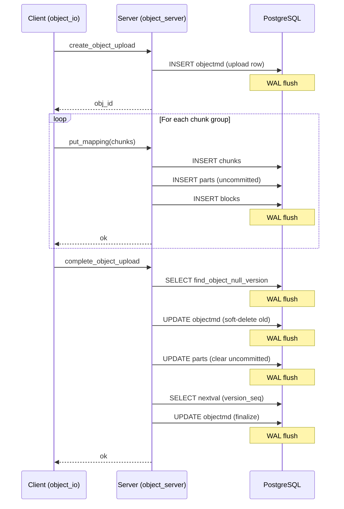
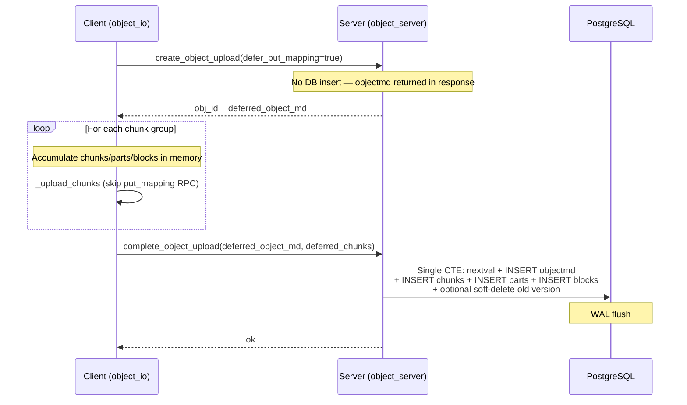
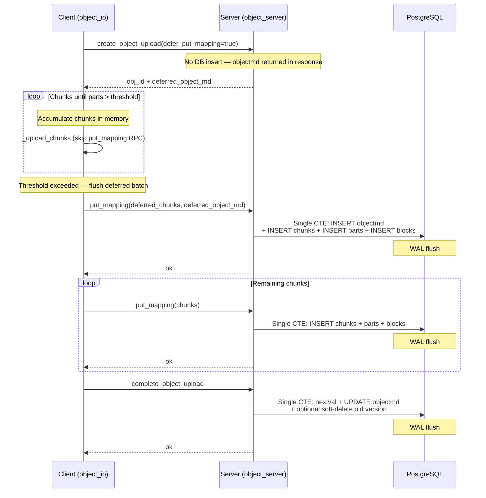

# Deferred Object Upload: Reducing PostgreSQL WAL Writes for Small Objects

## Background

NooBaa stores object metadata in PostgreSQL. Every S3 `PUT` object goes through
a multi-step upload flow that issues several independent INSERT/UPDATE
statements against the database. Each statement triggers its own WAL (Write-Ahead
Log) flush, which is the primary bottleneck for small-object workloads where the
I/O payload is negligible compared to the metadata overhead.

## Previous Implementation

A simple `PutObject` (non-multipart) followed this sequence of database
round-trips:

For a single 4 KB object this meant **at least 5–7 separate statements**, each
with its own WAL flush. At high throughput the WAL device becomes saturated long
before CPU or network are the limiting factor.

### Specific Problems for Small Objects

- **WAL amplification**: A 4 KB object generates ~2–4 KB of actual data I/O but
  several kilobytes of WAL writes across multiple transactions.
- **Latency**: Each database round-trip adds network + query planning + WAL
  sync latency, which dominates the overall PUT latency for small payloads.
- **`_complete_object_parts`**: After `put_mapping`, the completion path ran
  `_complete_object_parts` which updated every part to clear the `uncommitted`
  flag and set the final byte ranges — an extra UPDATE per part that only matters
  for multipart uploads.

## New Implementation

### Guiding Principle

Collapse as many SQL statements as possible into a **single PostgreSQL Common
Table Expression (CTE)** so the database performs one WAL flush per upload
instead of many.

### Small Object (parts <= threshold, DISABLED versioning)

### Large Object (parts > threshold, DISABLED versioning)

### Changes by Component

#### 1. Client Side — `object_io.js`

- `upload_object` always requests `defer_put_mapping = true` for non-copy simple
  uploads.
- `_upload_chunks` accumulates mapping metadata (chunks, parts, blocks) in memory
  as `complete_params.deferred_chunks` instead of calling the `put_mapping` RPC.
- When the accumulated parts count exceeds `DEFERRED_PUT_MAPPING_MAX_PARTS`
  (default 30), the deferred chunks are flushed to the database together with the
  deferred object metadata in a single `put_mapping` call, and subsequent chunks
  follow the normal (non-deferred) path. This avoids unbounded memory growth for
  large objects.
- On error, if the upload is still deferred (object metadata was never inserted),
  the abort RPC is skipped since there is nothing in the database to clean up.

#### 2. Server Side — `create_object_upload` in `object_server.js`

- When `defer_put_mapping` is requested and the bucket's versioning is `DISABLED`,
  the `INSERT INTO objectmds` is **skipped**.
- Instead, the constructed `objectmd` record is returned in the RPC response
  as `deferred_object_md`. The client carries it through the upload and sends it
  back at completion.
- For versioned buckets (`ENABLED` / `SUSPENDED`) or multipart uploads, deferral
  is not used and the flow is unchanged.

#### 3. Server Side — `put_mapping` / `PutMapping.update_db()` in `map_server.js`

- `PutMapping.update_db()` **always** wraps all mapping inserts (chunks, parts,
  blocks) into a single CTE via `MDStore.insert_mappings_in_transaction()`,
  regardless of whether the upload is deferred.
- When `deferred_object_md` is present (first batch for a large object that
  exceeded the parts threshold), the object INSERT is included in the same CTE.

#### 4. Server Side — `complete_object_upload` in `object_server.js`

- Split into `_complete_simple_upload` (simple PUT) and
  `_complete_multipart_upload` (multipart). Multipart is unchanged.
- For simple uploads, the `_complete_object_parts` step is eliminated entirely.
  Parts are inserted without the `uncommitted` flag, so there is no need to
  clear it during completion.
- For `DISABLED` versioning, completion is handled by
  `MDStore.complete_simple_upload_disabled()`, which performs all remaining
  work in a single CTE:
  - `nextval('mdsequences')` to allocate `version_seq`.
  - `INSERT` (deferred) or `UPDATE` (non-deferred) of the `objectmd` row.
  - Bulk `INSERT` of deferred chunks, parts, and blocks when applicable.
  - Optimistic soft-delete of the prior null-version when needed.
- For `ENABLED` / `SUSPENDED` versioning, the existing
  `_put_object_handle_latest` flow is used with the allocated `version_seq`.

#### 5. Database Layer — `MDStore` in `md_store.js`

- **`insert_mappings_in_transaction`**: Builds a single `WITH ... INSERT ...`
  CTE for all chunk, part, and block inserts. Optionally includes an
  `INSERT INTO objectmds` when `deferred_object_md` is provided.
- **`complete_simple_upload_disabled`**: Single-CTE completion for disabled
  versioning. Three soft-delete strategies depending on what the caller knows:
  1. `mark_deleted_obj_id` — prior version's `_id` is known (conditional
     headers); goes directly to a `PgTransaction`.
  2. `mark_deleted_by_key` — no prior lookup; uses an **optimistic CTE** first
     (no soft-delete). On a `23505` unique-index violation, falls back to a
     `PgTransaction` that soft-deletes the old row then re-runs the CTE.
  3. Neither — conditional headers found no prior row; plain CTE.
- **`_add_bulk_insert_ctes`**: Shared helper that generates parameterized bulk
  INSERT CTEs, reused by both `insert_mappings_in_transaction` and
  `complete_simple_upload_disabled`.

### What Did Not Change

- **Multipart uploads** (`CreateMultipartUpload` / `UploadPart` /
  `CompleteMultipartUpload`): The full original flow is preserved.
  `_complete_multipart_upload` still calls `_complete_object_parts` to
  resequence parts.
- **Versioned buckets** (`ENABLED` / `SUSPENDED`): Object metadata is always
  inserted at `create_object_upload` time. The deferred path is limited to
  `DISABLED` versioning.
- **`put_mapping` for large objects**: When the deferred parts threshold is
  exceeded during streaming, chunks are flushed to the database via the normal
  `put_mapping` RPC (with the deferred object metadata piggy-backed on the
  first call). Subsequent chunks go through the regular non-deferred path.

## WAL Flush Comparison

| Scenario | Before | After |
|---|---|---|
| Small object, new key, DISABLED versioning | 5–7 flushes | **1 flush** |
| Small object, overwrite, DISABLED versioning | 6–8 flushes | **1–2 flushes** (optimistic or fallback) |
| Small object, ENABLED versioning | 5–7 flushes | **3–4 flushes** (unchanged except mapping batch) |
| Large object (> threshold), DISABLED versioning | 5–7+ flushes | **2–3 flushes** (first batch + completion) |

## Future Work

The `UploadPart` S3 op follows a similar pattern to simple `PutObject`: it calls
`put_mapping` per part, each generating its own WAL flush. For workloads with
many small parts, the same deferred-mapping strategy can be applied:

1. **Deferred part mappings**: Accumulate chunk/part/block metadata in memory
   across `UploadPart` calls and flush them in a single CTE at
   `CompleteMultipartUpload`, collapsing N `put_mapping` round-trips into one.
2. **Single-CTE completion for multipart**: Extend
   `complete_simple_upload_disabled` (or a similar function) to handle
   multipart completion with deferred mappings, including part resequencing.
3. **Deferred uploads for versioned buckets**: Currently deferral and the
   single-CTE completion path are limited to `DISABLED` versioning. Extending
   them to `ENABLED` and `SUSPENDED` buckets requires:
   - **`ENABLED` versioning**: Every upload creates a new version. The CTE must
     allocate `version_seq` via `nextval('mdsequences')`, insert the new
     `objectmd` (deferred or update existing), and insert mappings — all
     atomically. No previous version needs to be soft-deleted, so the CTE is
     simpler than the DISABLED overwrite case.
   - **`SUSPENDED` versioning**: Uploads replace the current null-version. The
     CTE must allocate `version_seq`, soft-delete the existing null-version
     (similar to `_mark_delete_by_key_sql` but filtering on the
     `null_version_index` partial expression instead of `latest_version_index`),
     and insert/update the new object with mappings. The optimistic approach
     used for DISABLED (attempt without prior object, fall back on `23505`
     unique constraint violation) can be reused here.
   - **`_put_object_handle_latest` consolidation**: Add ENABLED and SUSPENDED
     branches to `_put_object_handle_latest` for simple uploads (detected by
     presence of `deferred_object_md`), with corresponding `MDStore` CTE
     functions (e.g. `complete_simple_upload_enabled`,
     `complete_simple_upload_suspended`).
   - **`create_object_upload` deferral**: Allow `create_object_upload` to skip
     the DB insert for versioned buckets as well, returning the `objectmd` in
     the RPC response. The `version_seq` allocation moves entirely into the
     completion CTE, eliminating the early `nextval` call.
4. **Batch `put_mapping` across concurrent parts**: When multiple parts stream
   concurrently, a shared write queue could batch their mapping inserts into
   fewer, larger CTE statements.

## Configuration

| Parameter | Default | Description |
|---|---|---|
| `DEFERRED_PUT_MAPPING_MAX_PARTS` | 30 | Maximum number of deferred parts to accumulate in memory before flushing to the database. Controls the trade-off between memory usage and WAL reduction. |
