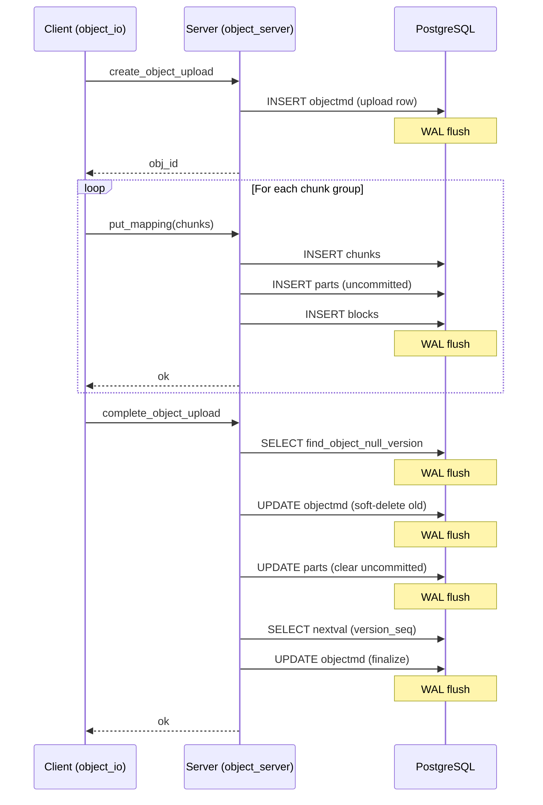
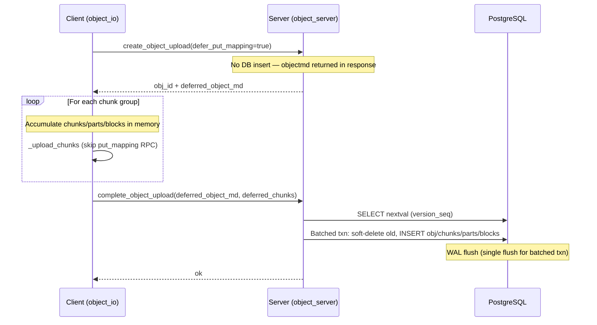
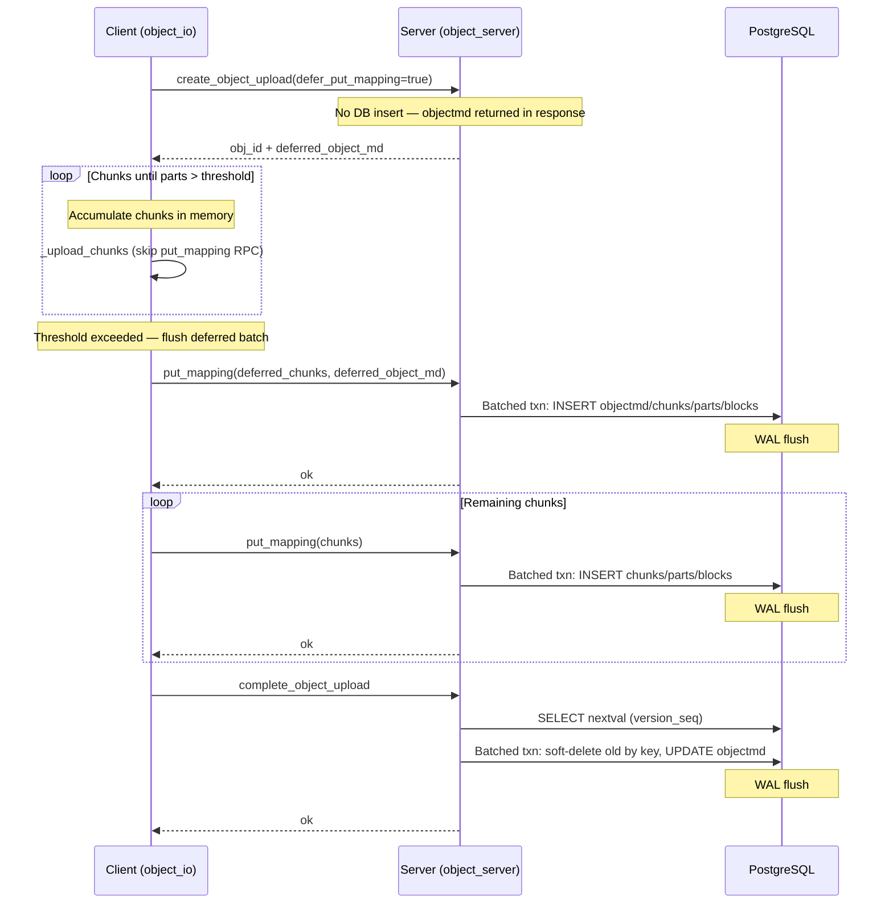

# Deferred Object Upload: Reducing PostgreSQL WAL Writes for Small Objects

## Background

NooBaa stores object metadata in PostgreSQL. Every S3 `PUT` object goes through
a multi-step upload flow that issues several independent INSERT/UPDATE
statements against the database. Each statement triggers its own WAL (Write-Ahead
Log) flush, which is the primary bottleneck for small-object workloads where the
I/O payload is negligible compared to the metadata overhead.

## Previous Implementation

A simple `PutObject` (non-multipart) followed this sequence of database
round-trips:

For a single 4 KB object this meant **at least 5–7 separate statements**, each
with its own WAL flush. At high throughput the WAL device becomes saturated long
before CPU or network are the limiting factor.

### Specific Problems for Small Objects

- **WAL amplification**: A 4 KB object generates ~2–4 KB of actual data I/O but
  several kilobytes of WAL writes across multiple transactions.
- **Latency**: Each database round-trip adds network + query planning + WAL
  sync latency, which dominates the overall PUT latency for small payloads.
- **`_complete_object_parts`**: After `put_mapping`, the completion path ran
  `_complete_object_parts` which updated every part to clear the `uncommitted`
  flag and set the final byte ranges — an extra UPDATE per part that only matters
  for multipart uploads.

## New Implementation

### Guiding Principle

Batch multiple SQL statements into a **single database round-trip** using
`MultiTableBulkOp` (a new cross-table bulk operation class) and batched
`BEGIN; ...; COMMIT` transactions, so the database performs one WAL flush per
upload instead of many.

### Small Object (parts <= threshold, DISABLED versioning)

When no conditional headers (`If-Match`, `If-None-Match`, etc.) are present —
the common case — the `find_object_null_version` SELECT is eliminated entirely.
The soft-delete of any prior object is performed by key inside the same batched
transaction.

When conditional headers **are** present, a separate
`find_object_null_version` SELECT is issued first so the conditions can be
evaluated before the write.

### Large Object (parts > threshold, DISABLED versioning)

### Changes by Component

#### 1. Client Side — `object_io.js`

- `upload_object` always requests `defer_put_mapping = true` for non-copy simple
  uploads.
- `_upload_chunks` accumulates mapping metadata (chunks, parts, blocks) in memory
  as `complete_params.deferred_chunks` instead of calling the `put_mapping` RPC.
- When the accumulated parts count exceeds `DEFERRED_PUT_MAPPING_MAX_PARTS`
  (default 30), the deferred chunks are flushed to the database together with the
  deferred object metadata in a single `put_mapping` call, and subsequent chunks
  follow the normal (non-deferred) path. This avoids unbounded memory growth for
  large objects.
- On error, if the upload is still deferred (object metadata was never inserted),
  the abort RPC is skipped since there is nothing in the database to clean up.

#### 2. Server Side — `create_object_upload` in `object_server.js`

- When `defer_put_mapping` is requested and the bucket's versioning is `DISABLED`,
  the `INSERT INTO objectmds` is **skipped**.
- Instead, the constructed `objectmd` record is returned in the RPC response
  as `deferred_object_md`. The client carries it through the upload and sends it
  back at completion.
- For versioned buckets (`ENABLED` / `SUSPENDED`) or multipart uploads, deferral
  is not used and the flow is unchanged.

#### 3. Server Side — `put_mapping` / `PutMapping.update_db()` in `map_server.js`

- `PutMapping.update_db()` **always** wraps all mapping inserts (chunks, parts,
  blocks) into a single batched transaction via
  `MDStore.insert_mappings_in_transaction()`, regardless of whether the upload
  is deferred.
- When `deferred_object_md` is present (first batch for a large object that
  exceeded the parts threshold), the object INSERT is included in the same
  transaction.

#### 4. Server Side — `complete_object_upload` in `object_server.js`

- Split into `_complete_simple_upload` (simple PUT) and
  `_complete_multipart_upload` (multipart). Multipart is unchanged.
- For simple uploads, the `_complete_object_parts` step is eliminated entirely.
  Parts are inserted without the `uncommitted` flag, so there is no need to
  clear it during completion.
- `version_seq` is allocated via `alloc_object_version_seq()` for all
  versioning modes.
- Completion delegates to `_put_object_handle_latest_with_retries()` for all
  versioning modes (DISABLED, ENABLED, SUSPENDED).
- For DISABLED versioning, `_put_object_handle_latest` checks for conditional
  headers (`If-Match`, etc.) via `has_md_conditions()`:
  - **No conditions (common path)**: the `find_object_null_version` SELECT is
    skipped. Instead, any existing object is soft-deleted by key inside the
    same batched transaction — either via `delete_and_insert_deferred` (deferred
    path) or `complete_object_upload_mark_remove_by_key` (non-deferred path).
  - **With conditions**: the SELECT is issued first so the conditions can be
    evaluated, then the appropriate insert/update is performed as before.

#### 5. Database Layer — `postgres_client.js`

- **`PgTransaction.execute_batch()`**: New method that acquires a connection,
  sends a full batch query string (including `BEGIN` and `COMMIT`), and
  guarantees cleanup on failure. Enables single-round-trip transactions.
- **`BulkOp.execute()`**: Modified to use `execute_batch()` — batches
  `BEGIN; stmt1; stmt2; ...; COMMIT` as a single query string instead of
  separate `BEGIN`, batch, `COMMIT` round-trips.
- **`MultiTableBulkOp`**: New class extending `BulkOp` that can insert docs
  into multiple tables in a single batched transaction. Adds `insert_many()`
  for cross-table inserts while inheriting `add_query()` and `execute()` from
  `BulkOp`. Created via `PostgresClient.initializeMultiTableBulkOp(pool_name)`.
- **`escapeLiteral`**: Re-exported from `pg` for safe SQL string interpolation
  in raw queries (used by `MDStore` methods that build UPDATE-by-key SQL).

#### 6. Database Layer — `MDStore` in `md_store.js`

- **`insert_mappings_in_transaction`**: Uses `MultiTableBulkOp` to insert
  all chunk, part, and block rows (and optionally the object row for deferred
  uploads) in a single batched transaction.
- **`delete_and_insert_deferred`**: Soft-deletes an existing object and
  inserts the new object + deferred mappings in a single batched transaction
  (one round trip). Accepts either `delete_obj_id` (by id, when the object
  was already fetched for md_conditions) or `bucket_id` + `key` (by key,
  eliminating the prior SELECT).
- **`complete_object_upload_mark_remove_by_key`**: For non-deferred DISABLED
  uploads without md_conditions. Soft-deletes the existing null-version by
  key and updates `put_obj` in a single `OrderedBulkOp` batch. The key-based
  UPDATE is a no-op when no prior object exists.

### What Did Not Change

- **Multipart uploads** (`CreateMultipartUpload` / `UploadPart` /
  `CompleteMultipartUpload`): The full original flow is preserved.
  `_complete_multipart_upload` still calls `_complete_object_parts` to
  resequence parts.
- **Versioned buckets** (`ENABLED` / `SUSPENDED`): Object metadata is always
  inserted at `create_object_upload` time. The deferred path is limited to
  `DISABLED` versioning.
- **`put_mapping` for large objects**: When the deferred parts threshold is
  exceeded during streaming, chunks are flushed to the database via the normal
  `put_mapping` RPC (with the deferred object metadata piggy-backed on the
  first call). Subsequent chunks go through the regular non-deferred path.

## WAL Flush Comparison

DB round trips and WAL flushes for the common case (no conditional headers):

| Scenario | Before | After | DB round trips |
|---|---|---|---|
| Small object, new key, DISABLED versioning | 5–7 flushes | **1 flush** (batched txn) | nextval + 1 batch |
| Small object, overwrite, DISABLED versioning | 6–8 flushes | **1 flush** (soft-delete by key in same batch) | nextval + 1 batch |
| Small object, ENABLED versioning | 5–7 flushes | **3–4 flushes** (unchanged except mapping batch) | nextval + SELECT + batch |
| Large object (> threshold), DISABLED versioning | 5–7+ flushes | **2–3 flushes** (first batch + completion) | nextval + M batches |

When conditional headers are present (rare), DISABLED versioning adds one
extra round trip for the `find_object_null_version` SELECT.

## Future Work

The `UploadPart` S3 op follows a similar pattern to simple `PutObject`: it calls
`put_mapping` per part, each generating its own WAL flush. For workloads with
many small parts, the same deferred-mapping strategy can be applied:

1. **Deferred part mappings**: Accumulate chunk/part/block metadata in memory
   across `UploadPart` calls and flush them in a single batched transaction at
   `CompleteMultipartUpload`, collapsing N `put_mapping` round-trips into one.
2. **Deferred uploads for versioned buckets**: Currently deferral and the
   single-transaction completion path are limited to `DISABLED` versioning.
   Extending them to `ENABLED` and `SUSPENDED` buckets is straightforward since
   `_put_object_handle_latest_with_retries` already handles all versioning modes.
3. **Remove `version_seq` allocation for DISABLED versioning**: The `nextval`
   call is only needed for S3 event notification sequencer ordering. For
   DISABLED versioning the timestamp-based fallback sequencer is sufficient,
   so this round-trip can be eliminated entirely.
4. **Batch `put_mapping` across concurrent parts**: When multiple parts stream
   concurrently, a shared write queue could batch their mapping inserts into
   fewer, larger batched transactions.

## Configuration

| Parameter | Default | Description |
|---|---|---|
| `DEFERRED_PUT_MAPPING_MAX_PARTS` | 30 | Maximum number of deferred parts to accumulate in memory before flushing to the database. Controls the trade-off between memory usage and WAL reduction. |
