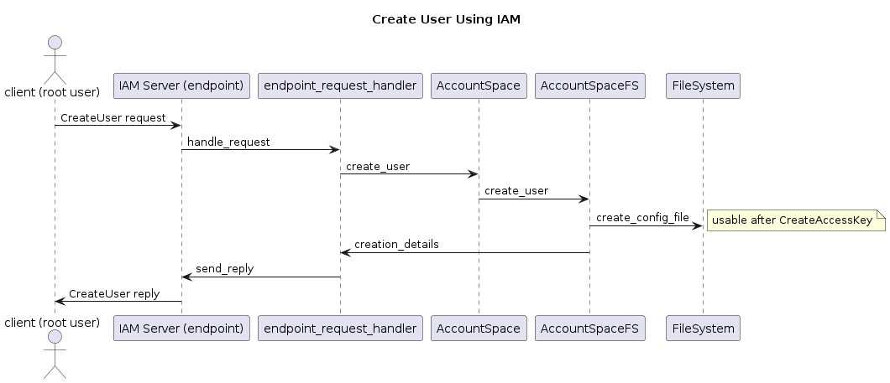

# IAM

## Glossary
**Access keys** = a pair of access key ID (in short: access key) and secret access key (in short: secret key)  
**ARN** = Amazon Resource Name  
**CRUD** = Create, Read, Update, Delete  
**IAM** =  Identity and Access Management  
**NC** = Non-Containerized  
**NSFS** = Namespace Store File System  


## Goal
Ability to operate NooBaa accounts for NC NSFS using IAM API ([AWS documentation](https://docs.aws.amazon.com/iam/)).  
A created user will be able to get access to NooBaa resources (buckets, objects).

## Background
- Currently, we create NC NSFS accounts using the Manage NSFS, which is a CLI command with root (privileged) permissions:
    ```bash
    sudo node src/cmd/manage_nsfs account add [flags]
    ```
- The NS NSFS account is saved as a JSON file with root permissions (under the default path: `/etc/noobaa.conf.d/accounts/<name>.json`).
- The structure of a valid account is determined by schema and validated using avj.  
There are a couple of required properties specific to NSFS: `nsfs_account_config` that include a UID and GID or a Distinguished Name.
- When an account is created the json reply contains all the details of the created account (as they are stored in the JSON file).

## Problem
As mentioned, for NooBaa NC NSFS deployments, the only way to create and update accounts is via the CLI.   
For certain deployments exposing the CLI is not a viable option (for security reasons, some organizations disable the SSH to a machine with root permissions).

## Scenarios
### In Scope
Support IAM API:  
- CreateUser, GetUser, UpdateUser, DeleteUser, ListUsers.  
- CreateAccessKey, GetAccessKeyLastUsed, UpdateAccessKey, DeleteAccessKey, ListAccessKeys.
### Out of Scope
At this point we will not support additional IAM resources (group, policy, role, etc).

## Architecture


- The boilerplate code is based on STS and S3 services  
- IAM service will be supported in NSFS service (which requires the endpoint)
- In the endpoint we created the `https_server_iam`
- The server would listen to a new port `https_port_iam`
  - It will be a separate port  
  - During development phase will default to -1 to avoid listening to the port
- To create the server we created the `endpoint_request_handler_iam`.
  - The `iam_rest` that either `handle_request` or `handle_error`
  - The `IamError` class.
  - The the ops directory and each supported action will be a file with name `iam_<action>`
- We created the `AccountSDK` class and the `AccountSpace` interface:
  - The `AccountSpace` interface is defined in `nb.d.ts`
  - The initial (current) implementation is only `AccountSpaceFS`
  - `AccountSpaceFS` will contain all our implementations related to users and access keys - like we have for other resources: `NamespaceFS` for objects, `BucketSpaceFS` for buckets, etc

### Clarification:
- NC NSFS account config - represents root accounts and IAM users details (both are called “account” in our system), contains the details of: `user`, `nsfs_account_config`, `access keys`.
- The design approach:
  - Multi-users FS - serves different GID and UIDs.
  - Multi-tenant - can be several root users.
- `owner` vs `creator` - owner is permission wise, creator is for internal information.


### The user and access keys creation flow:
One root and one user (just to understand the basic API relations and hierarchy)


One root account, multiple users (Multi-users FS)


Multiple root accounts, multiple users (Multi-users FS, Multi-tenant)


- Using Manage NSFS CLI to create a root account.
  - We need the request to have access key id and secret key in a known account.
- Use the access key and secret key of the root account to CreateUser
  - We will create the NSFS account with the same: `uid` and `gid` or `distinguished_name`, `new_buckets_path` and `allow_bucket_creation`.
  - At this point the user doesn’t have access keys (empty array), hence `account_data.access_keys = []`
- Use the access key and secret key of the root account to CreateAccessKey
  - First time - the root account will generate the access keys.
  - Then, CreateAccessKey can also be used by the user.
  - When a CreateAccessKey - need to verify that the array length is maximum 2.
Source: AccessKeys
- Then the user can run action from the S3 service on the resources (bucket and object operations in NC NSFS).
- **Implicit policy** that we use:
  - User (Create, Get, Update, Delete, List) - only root account
  - AccessKey (Create, Update, Delete, List)
    - root account
    - all IAM users only for themselves (except the first creation that can be done only by the root account).

### No Bucket Policy
If the resource doesn’t have a bucket policy the IAM user accounts can have access to the resources of the same root account.
For example: 
- root account creates 2 users (both are owned by it): user1, user2 and a bucket (bucket owner: <root-account-id>, bucket creator: <account-id-user1>).
- user1 upload a file to the bucket 
- user2 can delete this bucket (after it is empty): although user2 is not the creator, without a bucket policy his root account is the owner so it can delete the bucket.

### Root Accounts Manager
The root accounts managers are a solution for creating root accounts using the IAM API.

- The root accounts managers will be created only using the CLI (can have more than one root account manager).
- It is not mandatory to have a root account manager, it is only for allowing the IAM API for creating new root accounts, but this account does not owns the root accounts.
- The root accounts manager functionality is like root account in the IAM API perspective:
  - We use root accounts to create IAM users: We use root accounts manager to create root accounts
  - We use root accounts to create the first access key of an IAM user: We use root accounts manager to create the first access key of a root account.
- When using IAM users API:
  - root accounts manager can run IAM users create/update/delete/list - only on root accounts (not on other IAM users).
root accounts manager can run IAM access keys create/update/delete/list - only on root accounts and himself.

Here attached a diagram with all the accounts that we have in our system:


## Supported Actions and their request parameters
### Supported IAM User Operations
- IAM CreateUser: Path, UserName (not supported: PermissionsBoundary, Tags.member.N)
- IAM GetUser: UserName
- IAM UpdateUser: NewPath, NewUserName, UserName
- IAM DeleteUser: UserName
- IAM ListUsers: PathPrefix (not supported: Marker, MaxItems)

### Supported IAM Access Keys Operations
- IAM CreateAccessKey: UserName
- IAM GetAccessKeyLastUsed: AccessKeyId
- IAM UpdateAccessKey: AccessKeyId, Status, UserName
- IAM DeleteAccessKey: AccessKeyId, UserName
- IAM ListAccessKeys: UserName (not supported: Marker, MaxItems)

### Other
Would always return an empty list (to check that the user exists it runs GetUser)
- IAM ListGroupsForUser
- IAM ListAttachedUserPolicies
- IAM ListMFADevices
- IAM ListServiceSpecificCredentials
- IAM ListSigningCertificates
- IAM ListSSHPublicKeys
- IAM ListUserPolicies
- IAM ListUserTags
Would always return an empty list
- IAM ListAccountAliases
- IAM ListAttachedGroupPolicies
- IAM ListAttachedRolePolicies
- IAM ListGroupPolicies
- IAM ListGroups
- IAM ListInstanceProfiles
- IAM ListOpenIDConnectProviders
- IAM ListPolicies
- IAM ListRoles
- IAM ListSAMLProviders
- IAM ListServerCertificates
- IAM ListVirtualMFADevices
Would always return `NoSuchEntity` error
- IAM ListEntitiesForPolicy
- IAM ListInstanceProfilesForRole
- IAM ListInstanceProfileTags
- IAM ListMFADeviceTags
- IAM ListOpenIDConnectProviderTags
- IAM ListPolicyTags
- IAM ListPolicyVersions
- IAM ListRoleTags
- IAM ListServerCertificateTags

### Configuration Directory Components With users
If account creates a user its config file will be created under identities/<user-id>.identity.json and under the account will be created `users/` directory and inside it it will link to the config.
Example:
Note: In this example, we didn't use `system.json`, `config.json`, and `certificates/`.
1. Configuration directory with 1 account (name: alice, ID: 1111):

```sh
  > tree /etc/noobaa.conf.d/
├── access_keys
│   └── Zzto3OwtGflQrqD41h3SEXAMPLE.symlink -> ../identities/1111/identity.json
├── accounts_by_name
│   └── alice.symlink -> ../identities/1111/identity.json
├── buckets
├── identities
│   └── 1111
│       └── identity.json
└── master_keys.json
```

2. Configuration directory with 1 account (name: alice, ID: 1111) and 1 user (name: Robert, ID: 9999, without access key) - 
Notice the `users/` directory with a symlink of the username to its config file

```sh
├── access_keys
│   └── Zzto3OwtGflQrqD41h3SEXAMPLE.symlink -> ../identities/1111/identity.json
├── accounts_by_name
│   └── alice.symlink -> ../identities/1111/identity.json
├── buckets
├── identities
│   ├── 1111
│   │   ├── identity.json
│   │   └── users
│   │       └── Robert.symlink -> ../../9999/identity.json
│   └── 9999
│       └── identity.json
├── master_keys.json
└── system.json
```

#### Naming Scope
- Account names are unique between the accounts, for example, if we have account with name John, you cannot create a new account with the name John (and also cannot update the name of an existing account to John).
- Usernames are unique only inside the account, for example: username Robert can be under account-1, and another user with username Robert can be under account-2.
Note: The username cannot be the same as the account, for example: under account John we cannot create a username John (and also cannot update the name of an existing username to John). The reason for limiting it is that in the IAM API of Access Key (for example ListAccessKeys) it can be done by account on himself or on another user, and it passes the `--user-name` flag.

Example: 2 accounts (alice and bob) both of them have user with username Robert (notice the different ID number).
```sh
├── access_keys
│   ├── Zzto3OwtGflQrqD41h3SEXAMPLE.symlink -> ../identities/66d81ec79eac82ed43cdee73/identity.json
│   └── Yser45gyHaghebY62wsUEXAMPLE.symlink -> ../identities/66d8351a92b8dd91b550aa71/identity.json
├── accounts_by_name
│   ├── alice.symlink -> ../identities/66d81ec79eac82ed43cdee73/identity.json
│   └── bob.symlink -> ../identities/66d8351a92b8dd91b550aa71/identity.json
├── buckets
├── identities
│   ├── 66d81ec79eac82ed43cdee73
│   │   ├── identity.json
│   │   └── users
│   │       └── Robert.symlink -> ../../66d834df78e973023abd80cb/identity.json
│   ├── 66d834df78e973023abd80cb
│   │   └── identity.json
│   ├── 66d8351a92b8dd91b550aa71
│   │   ├── identity.json
│   │   └── users
│   │       └── Robert.symlink -> ../../66d83529e09267f53e705373/identity.json
│   └── 66d83529e09267f53e705373
│       └── identity.json
├── master_keys.json
└── system.json
```

## Other
### Terminology - AWS vs NooBaa
|   | AWS | NooBaa |
|---|-----|--------|
|   | root account  | account  |
|   | IAM user  | user  |

#### Root Account / Account
- In NooBaa NC, the term "root" is associated with Linux root permission, therefore, the term "account" will be the equivalent term used for "root account".
  - The account is the owner of the users that it created using the IAM API. The account owns the users and manage them (can create, read, update, delete or list them).
  - The account is the owner of the buckets that were created by it or by its users.
- In AWS root accounts are only created in the console.  
While in NooBaa, accounts can be created by - 
  1. NooBaa CLI `account add` command.
  2. IAM API CreateUser operation. The requesting account must have the `iam_operate_on_root_account` property set to true. An account that has `iam_operate_on_root_account` property set to true, will operate on accounts instead of users when calling the IAM API, although it does not own them.
- In NooBaa, an account is identified by:  
  - Name  - in the CLI we pass the account name. The account name is unique within all the accounts (you cannot create a new account with the name of an existing account).
  - Access key - in S3 API and IAM API the request is signed with the requesting account credentials.

#### Identity
- In general, we manage identities - currently accounts and users - but in the future, we might support roles, groups, etc.).

#### IAM User / User
- In NooBaa we decide to omit the "IAM" from the term "IAM users" as IAM is Identity & Access Management, and we thought it would be clear enough just the term "user" in our system.
- users are individual users within an account (for a single person or application), they aren't separate accounts. 
- users and their access keys have long-term credentials to the system resource, they give the ability to make programmatic requests to NooBaa service using the API or CLI.  
This was partially copied from [AWS IAM Guide - Intro](https://docs.aws.amazon.com/IAM/latest/UserGuide/introduction_identity-management.html#intro-identity-users) and [AWS IAM Guide - When To Use IAM](https://docs.aws.amazon.com/IAM/latest/UserGuide/when-to-use-iam.html#security_iam_authentication-iamuser).
- In NooBaa, a user is identified by:
  - Name - in the IAM API we pass the `--user-name` flag. The username is unique only under the account (not including the account name itself).
  - Access key - in S3 API and IAM API the request is signed with the requesting user credentials.
- Currently, users cannot use any IAM API operations on other users.
