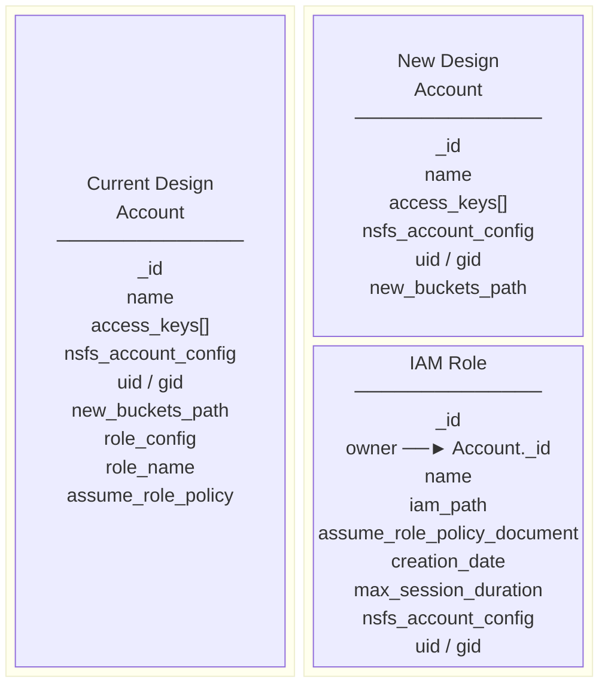
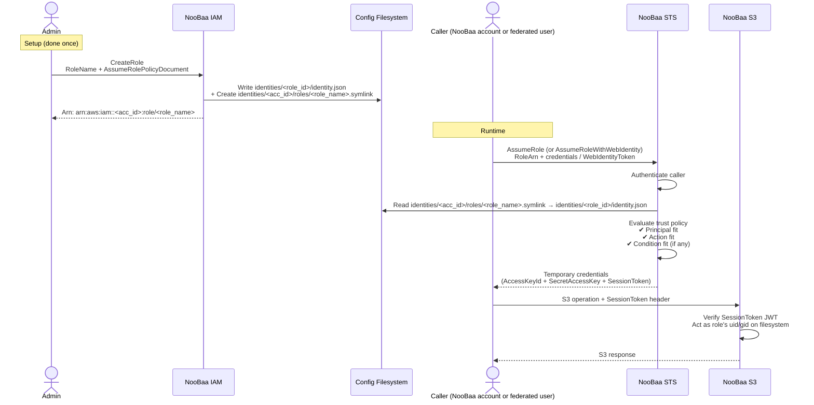

# NC IAM

This document is about the IAM implementation in NC deplyment.  
More information about IAM implemenation in Containerized at - [Containerized IAM design](./../design/iam_containerized.md).  

## Glossary
**Access keys** = a pair of access key ID (in short: access key) and secret access key (in short: secret key)  
**ARN** = Amazon Resource Name  
**IAM** =  Identity and Access Management  
**NC** = Non-Containerized
**NSFS** = Namespace Store File System

## Goal
Ability to operate NooBaa accounts for NC NSFS using IAM API ([AWS documentation](https://docs.aws.amazon.com/iam/)).  
A created user will be able to get access to NooBaa resources (buckets, objects).

## Background
- Currently, we create NC NSFS accounts using the Manage NSFS, which is a CLI command with root (privileged) permissions:
    ```bash
    sudo node src/cmd/manage_nsfs account add [flags]
    ```
- The NS NSFS account is saved as a JSON file with root permissions (under the default path: `/etc/noobaa.conf.d/accounts/<name>.json`).
- The structure of a valid account is determined by schema and validated using avj.  
There are a couple of required properties specific to NSFS: `nsfs_account_config` that include a UID and GID or a Distinguished Name.
- When an account is created the json reply contains all the details of the created account (as they are stored in the JSON file).

## Problem
As mentioned, for NooBaa NC NSFS deployments, the only way to create and update accounts is via the CLI.   
For certain deployments exposing the CLI is not a viable option (for security reasons, some organizations disable the SSH to a machine with root permissions).

## Scenarios
### In Scope
Support IAM API:  
- Users: CreateUser, GetUser, UpdateUser, DeleteUser, ListUsers.  
- Access Keys: CreateAccessKey, GetAccessKeyLastUsed, UpdateAccessKey, DeleteAccessKey, ListAccessKeys.
### Out of Scope
At this point we will not support additional IAM resources (group, policy, etc).

> **Note:** IAM Roles are now in scope — see the [IAM Roles](#iam-roles) section below.

## Architecture


- The boilerplate code is based on STS and S3 services  
- IAM service will be supported in NSFS service (which requires the endpoint)
- In the endpoint we created the `https_server_iam`
- The server would listen to a new port `https_port_iam`
  - It will be a separate port  
  - During development phase will default to -1 to avoid listening to the port
- To create the server we created the `endpoint_request_handler_iam`.
  - The `iam_rest` that either `handle_request` or `handle_error`
  - The `IamError` class.
  - The ops directory and each supported action will be a file with name `iam_<action>`
- We created the `AccountSDK` class and the `AccountSpace` interface:
  - The `AccountSpace` interface is defined in `nb.d.ts`
  - The initial (current) implementation is only `AccountSpaceFS`
  - `AccountSpaceFS` will contain all our implementations related to users and access keys - like we have for other resources: `NamespaceFS` for objects, `BucketSpaceFS` for buckets, etc

### Clarification:
- NC NSFS account config - represents root accounts and IAM users details (both are called “account” in our system), contains the details of: `user`, `nsfs_account_config`, `access keys`.
- The design approach:
  - Multi-users FS - serves different GID and UIDs.
  - Multi-tenant - can be several root users.
- `owner` vs `creator` - owner is permission wise, creator is for internal information.


### The user and access keys creation flow:
One root and one user (just to understand the basic API relations and hierarchy)


One root account, multiple users (Multi-users FS)


Multiple root accounts, multiple users (Multi-users FS, Multi-tenant)


- Using Manage NSFS CLI to create a root account.
  - We need the request to have access key id and secret key in a known account.
- Use the access key and secret key of the root account to CreateUser
  - We will create the NSFS account with the same: `uid` and `gid` or `distinguished_name`, `new_buckets_path` and `allow_bucket_creation`.
  - At this point the user doesn’t have access keys (empty array), hence `account_data.access_keys = []`
- Use the access key and secret key of the root account to CreateAccessKey
  - First time - the root account will generate the access keys.
  - Then, CreateAccessKey can also be used by the user.
  - When a CreateAccessKey - need to verify that the array length is maximum 2.
- Then the user can run action from the S3 service on the resources (bucket and object operations in NC NSFS).
- **Implicit policy** that we use:
  - User (Create, Get, Update, Delete, List) - only root account
  - AccessKey (Create, Update, Delete, List)
    - root account
    - all IAM users only for themselves (except the first creation that can be done only by the root account).

### No Bucket Policy
If the resource doesn’t have a bucket policy the IAM user accounts can have access to the resources of the same root account.
For example: 
- root account creates 2 users (both are owned by it): user1, user2 and a bucket (bucket owner: `<root-account-id>`, bucket creator: `<account-id-user1>`).
- user1 upload a file to the bucket 
- user2 can delete this bucket (after it is empty): although user2 is not the creator, without a bucket policy his root account is the owner so it can delete the bucket.

### Root Accounts Manager
The root accounts managers are a solution for creating root accounts using the IAM API.

- The root accounts managers will be created only using the CLI (can have more than one root account manager).
- It is not mandatory to have a root account manager, it is only for allowing the IAM API for creating new root accounts, but this account does not owns the root accounts.
- The root accounts manager functionality is like root account in the IAM API perspective:
  - We use root accounts to create IAM users: We use root accounts manager to create root accounts
  - We use root accounts to create the first access key of an IAM user: We use root accounts manager to create the first access key of a root account.
- When using IAM users API:
  - root accounts manager can run IAM users create/update/delete/list - only on root accounts (not on other IAM users).
root accounts manager can run IAM access keys create/update/delete/list - only on root accounts and himself.

Here attached a diagram with all the accounts that we have in our system:


## Supported Actions and their request parameters
### Supported IAM User Operations
- IAM CreateUser: Path, UserName (not supported: PermissionsBoundary, Tags.member.N)
- IAM GetUser: UserName
- IAM UpdateUser: NewPath, NewUserName, UserName
- IAM DeleteUser: UserName
- IAM ListUsers: PathPrefix (not supported: Marker, MaxItems)

### Supported IAM Access Keys Operations
- IAM CreateAccessKey: UserName
- IAM GetAccessKeyLastUsed: AccessKeyId
- IAM UpdateAccessKey: AccessKeyId, Status, UserName
- IAM DeleteAccessKey: AccessKeyId, UserName
- IAM ListAccessKeys: UserName (not supported: Marker, MaxItems)

### Other
Would always return an empty list (to check that the user exists it runs GetUser)
- IAM ListGroupsForUser
- IAM ListAttachedUserPolicies
- IAM ListMFADevices
- IAM ListServiceSpecificCredentials
- IAM ListSigningCertificates
- IAM ListSSHPublicKeys
- IAM ListUserPolicies
- IAM ListUserTags
Would always return an empty list
- IAM ListAccountAliases
- IAM ListAttachedGroupPolicies
- IAM ListAttachedRolePolicies
- IAM ListGroupPolicies
- IAM ListGroups
- IAM ListInstanceProfiles
- IAM ListOpenIDConnectProviders
- IAM ListPolicies
- IAM ListRoles
- IAM ListSAMLProviders
- IAM ListServerCertificates
- IAM ListVirtualMFADevices
Would always return `NoSuchEntity` error
- IAM ListEntitiesForPolicy
- IAM ListInstanceProfilesForRole
- IAM ListInstanceProfileTags
- IAM ListMFADeviceTags
- IAM ListOpenIDConnectProviderTags
- IAM ListPolicyTags
- IAM ListPolicyVersions
- IAM ListRoleTags
- IAM ListServerCertificateTags

### Configuration Directory Components With users
If account creates a user its config file will be created under identities/<user-id>.identity.json and under the account will be created `users/` directory and inside it it will link to the config.
Example:
Note: In this example, we didn't use `system.json`, `config.json`, and `certificates/`.
1. Configuration directory with 1 account (name: alice, ID: 1111):

```sh
  > tree /etc/noobaa.conf.d/
├── access_keys
│   └── Zzto3OwtGflQrqD41h3SEXAMPLE.symlink -> ../identities/1111/identity.json
├── accounts_by_name
│   └── alice.symlink -> ../identities/1111/identity.json
├── buckets
├── identities
│   └── 1111
│       └── identity.json
└── master_keys.json
```

2. Configuration directory with 1 account (name: alice, ID: 1111) and 1 user (name: Robert, ID: 9999, without access key) - 
Notice the `users/` directory with a symlink of the username to its config file

```sh
├── access_keys
│   └── Zzto3OwtGflQrqD41h3SEXAMPLE.symlink -> ../identities/1111/identity.json
├── accounts_by_name
│   └── alice.symlink -> ../identities/1111/identity.json
├── buckets
├── identities
│   ├── 1111
│   │   ├── identity.json
│   │   └── users
│   │       └── Robert.symlink -> ../../9999/identity.json
│   └── 9999
│       └── identity.json
├── master_keys.json
└── system.json
```

#### Naming Scope
- Account names are unique between the accounts, for example, if we have account with name John, you cannot create a new account with the name John (and also cannot update the name of an existing account to John).
- Usernames are unique only inside the account, for example: username Robert can be under account-1, and another user with username Robert can be under account-2.
Note: The username cannot be the same as the account, for example: under account John we cannot create a username John (and also cannot update the name of an existing username to John). The reason for limiting it is that in the IAM API of Access Key (for example ListAccessKeys) it can be done by IAM user on himself or by root account on another user, and it passes the `--user-name` flag.

Example: 2 accounts (alice and bob) both of them have user with username Robert (notice the different ID number).
```sh
├── access_keys
│   ├── Zzto3OwtGflQrqD41h3SEXAMPLE.symlink -> ../identities/66d81ec79eac82ed43cdee73/identity.json
│   └── Yser45gyHaghebY62wsUEXAMPLE.symlink -> ../identities/66d8351a92b8dd91b550aa71/identity.json
├── accounts_by_name
│   ├── alice.symlink -> ../identities/66d81ec79eac82ed43cdee73/identity.json
│   └── bob.symlink -> ../identities/66d8351a92b8dd91b550aa71/identity.json
├── buckets
├── identities
│   ├── 66d81ec79eac82ed43cdee73
│   │   ├── identity.json
│   │   └── users
│   │       └── Robert.symlink -> ../../66d834df78e973023abd80cb/identity.json
│   ├── 66d834df78e973023abd80cb
│   │   └── identity.json
│   ├── 66d8351a92b8dd91b550aa71
│   │   ├── identity.json
│   │   └── users
│   │       └── Robert.symlink -> ../../66d83529e09267f53e705373/identity.json
│   └── 66d83529e09267f53e705373
│       └── identity.json
├── master_keys.json
└── system.json
```

---

## IAM Roles

### What is an IAM Role?

An IAM Role is an identity with a set of permissions that defines what actions
an identity is allowed to perform.
It has two types of policies:
- **Trust policy** (`assume_role_policy_document`) — controls **who** is allowed
  to assume the role, and **via which STS action** (`AssumeRole` or `AssumeRoleWithWebIdentity`)
- **Permissions policy** (`iam_role_policies`) — controls **what** the assumed
  role is allowed to do on S3 resources (e.g. `s3:GetObject`, `s3:PutObject` on specific buckets). This will be added in Phase 2.

> **Note:** When implemented, role inline policies will apply to S3 service only.

A role can be assumed in two ways:
- **`AssumeRole`** — a known NooBaa account (root or IAM user) assumes the role using its own credentials. This is the basic STS flow and should be the primary use case.
- **`AssumeRoleWithWebIdentity`** — an external identity (e.g. an LDAP or OIDC-authenticated user) assumes the role by presenting a JWT token issued by an external identity provider. See the [LDAP NC guide](../NooBaaNonContainerized/ldap_non_containerised.md) for LDAP-specific setup.

---

### Why IAM Roles for NC?

Previously, a role was embedded into an account by adding `role_config` to the account. Hence, for different permissions, different accounts had to be created.

With the introduction of IAM roles, a role is a separate entity with its own
`nsfs_account_config` (uid/gid) — independent of the owner account's identity.
This allows multiple roles under one account, each with a different filesystem identity, without creating separate accounts.

Phase 2: Introduce role policy (what can be done after the role is assumed)

---

### APIs

The following IAM APIs need to be supported for full role lifecycle management:

| API          | Description                                  |
| ------------ | -------------------------------------------- |
| `CreateRole` | Create a new role with a trust policy        |
| `GetRole`    | Read role metadata and trust policy          |
| `UpdateRole` | Update description or `max_session_duration` |
| `DeleteRole` | Delete a role                                |
| `ListRoles`  | List all roles under the requesting account  |

Phase 2 APIs (future — after Phase 1 CRUD is complete):

| API                | Description                                             |
| ------------------ | ------------------------------------------------------- |
| `PutRolePolicy`    | Attach or replace an inline permission policy on a role |
| `GetRolePolicy`    | Read a specific inline policy from a role               |
| `DeleteRolePolicy` | Remove an inline policy from a role                     |
| `ListRolePolicies` | List names of inline policies on a role                 |

> **Note on role inline policies:** NC currently does not implement inline policies for IAM users. Role inline policies are also deferred to Phase 2 to maintain consistency.

---

### Trust Policy & Role JSON

A trust policy is a JSON document that defines **who can assume the role** (`Principal`), **via which STS action** (`Action`), and optionally **required conditions** (`Condition`). It is separate from any permission policies that define what the assumed role can do.

---

#### `AssumeRole` — AWS Principal (Primary Flow)

Used when a known NooBaa account (root or IAM user) assumes a role using its own long-term credentials.

> **Note (not yet implemented for NC):** The current `AssumeRole` code (`sts_post_assume_role.js`) does not evaluate the trust policy (`assume_role_policy_document`) and resolves roles via `system_store` (containerized only). For NC, role lookup via `config_fs` / `AccountSpaceFS` and trust policy evaluation need to be implemented as part of Phase 1.

**Allow a specific account to assume the role:**

```json
{
  "Version": "2012-10-17",
  "Statement": [{
    "Effect": "Allow",
    "Principal": { "AWS": "arn:aws:iam::<account_id>:root" },
    "Action": "sts:AssumeRole"
  }]
}
```

**Allow any authenticated principal to assume the role:**

```json
{
  "Version": "2012-10-17",
  "Statement": [{
    "Effect": "Allow",
    "Principal": { "AWS": "*" },
    "Action": "sts:AssumeRole"
  }]
}
```

---

#### `AssumeRoleWithWebIdentity` — Federated Principal (e.g. LDAP)

Used when an external identity provider (LDAP etc.) authenticates the user. NooBaa validates the token details against the external provider and checks the trust policy.

**Scope to a specific LDAP server (Federated principal):**

```json
{
  "Version": "2012-10-17",
  "Statement": [{
    "Effect": "Allow",
    "Principal": { "Federated": "ldap://127.0.0.1:1389" },
    "Action": "sts:AssumeRoleWithWebIdentity"
  }]
}
```
The `Federated` URI must match the LDAP server URI in `/etc/noobaa-server/ldap_config`. Matching 
strips the `ldap://` / `ldaps://` prefix.

**Federated principal + condition on a single LDAP attribute:**

```json
{
  "Version": "2012-10-17",
  "Statement": [{
    "Effect": "Allow",
    "Principal": { "Federated": "ldap://127.0.0.1:1389" },
    "Action": "sts:AssumeRoleWithWebIdentity",
    "Condition": {
      "StringEquals": { "ldap:ou": "Delivering Crew" }
    }
  }]
}
```

**Federated principal + condition on a multi-valued LDAP attribute (group membership):**

```json
{
  "Version": "2012-10-17",
  "Statement": [{
    "Effect": "Allow",
    "Principal": { "Federated": "ldap://127.0.0.1:1389" },
    "Action": "sts:AssumeRoleWithWebIdentity",
    "Condition": {
      "ForAnyValue:StringEquals": { "ldap:ou": ["Delivering Crew", "Service Staff"] }
    }
  }]
}
```

Condition keys use the `ldap:<attribute>` format. NooBaa strips the `ldap:` prefix and looks up the attribute value from the LDAP user entry returned after a successful bind. Supported operators: `StringEquals` (exact match) and `ForAnyValue:StringEquals` (any value in a multi-valued attribute matches the policy list).

> For full LDAP setup instructions, see the [LDAP NC guide](../NooBaaNonContainerized/ldap_non_containerised.md).

---

### Current Request Flow (Phase 1)

#### Flow 1: `AssumeRole` (Primary — NooBaa account assumes a role)

```
Client (NooBaa root account or IAM user)
        │
        │  1. Sign request with own AccessKey + SecretKey
        │     Action=AssumeRole, RoleArn=arn:aws:iam::<owner_id>:role/<role_name>
        ▼
NooBaa STS
  AssumeRole
        │
        ├─► 2. Authenticate caller — verify access key against NC accounts
        ├─► 3. [TODO] Resolve role from RoleArn
        │       └─ look up standalone role entity via config_fs / AccountSpaceFS
        │          (currently uses system_store — containerized only)
        ├─► 4. [TODO] Evaluate trust policy
        │       ├─ Principal fit  (AWS ARN or "*")
        │       └─ Action fit     (sts:AssumeRole)
        └─► 5. Issue temporary credentials (AccessKeyId + SecretAccessKey + SessionToken)
                scoped to the role's uid/gid

Client
        │  6. Use temporary credentials for S3 operations
```

---

#### Flow 2: `AssumeRoleWithWebIdentity` (Federated — LDAP user assumes a role)

```
Client (external user, e.g. LDAP)
        │
        │  1. Build JWT: { user, password } signed with jwt_secret
        ▼
NooBaa STS
  AssumeRoleWithWebIdentity
        │
        ├─► 2. Decode JWT, verify signature
        ├─► 3. Bind to LDAP server, fetch user attributes
        ├─► 4. [TODO] Resolve role from RoleArn
        │       └─ look up role entity via config_fs / AccountSpaceFS
        │          [Phase 2: look up standalone role entity by owner_id, role_name]
        ├─► 5. [TODO] Evaluate trust policy
        │       ├─ Principal fit  (Federated URI match / "*" / AWS ARN)
        │       ├─ Action fit     (sts:AssumeRoleWithWebIdentity)
        │       └─ Condition fit  (e.g. ldap:ou == "Engineering")
        └─► 6. Issue temporary credentials (AccessKeyId + SecretAccessKey + SessionToken)
                scoped to the role's uid/gid

Client
        │  7. Use temporary credentials for S3 operations
```
---

### IAM Role Management Flow (CRUD)

**CreateRole**

```
IAM Client
        │
        │  API: CreateRole
        │  Body: RoleName, AssumeRolePolicyDocument
        ▼
NooBaa IAM endpoint
        │
        ├─► 1. Validate params (role_name, assume_role_policy_document, trust policy schema)
        ├─► 2. Authorize request origin - allow root account only (TBD)
        ├─► 3. Precondition checks
        │       ├─ role_name must be unique per account
        │       └─ max number of roles per account? (1000 as per iam_constants.js)
        ├─► 4. Persist new role
        │       └─ NC: write /etc/noobaa.conf.d/identities/<role_id>/identity.json
        │              and /etc/noobaa.conf.d/identities/<account_id>/roles/<role_name>.symlink
        └─► 5. Return role info
                └─ Arn: arn:aws:iam::<owner_account_id>:role/<role_name>
```

**UpdateRole**

```
IAM Client
        │
        │  Action=UpdateRole, Body
        ▼
NooBaa IAM endpoint
        │
        ├─► 1. Validate params
        ├─► 2. Find role by (owner_account_id, role_name)
        ├─► 3. Apply updates
        └─► 4. Return success
```

> **Note:** Deleting an account is only allowed if no roles are linked. Any other restrictions for DeleteRole are TBD.

---

### Schema — NC Role JSON File

A new JSON schema for role files:

```js
{
  "_id": "7f3a1c2d4e5b6f7a8b9c0d1e",
  "name": "s3-read-role",
  "owner": "6a2bdeabf5c8e167f92cb079",
  "iam_path": "/",
  "creation_date": "2026-07-03T09:00:00.000Z",
  "description": "Role assumable by a trusted NooBaa account",
  "nsfs_account_config": {"uid": 501, "gid": 501},
  "max_session_duration": 3600,
  "assume_role_policy_document": {
    "Version": "2012-10-17",
    "Statement": [
      {
        "Effect": "Allow",
        "Principal": { "AWS": "arn:aws:iam::<owner_account_id>:root" },
        "Action": "sts:AssumeRole"
      }
    ]
  }
}
```

For the `AssumeRoleWithWebIdentity` (LDAP) variant, the `assume_role_policy_document` would instead use `Federated` principal and an optional `Condition` block. See the [LDAP NC guide](../NooBaaNonContainerized/ldap_non_containerised.md) for a full example.

Phase 2 — append `iam_role_policies`:
```js
"iam_role_policies": [
    {
      "policy_name": "s3-read-write",
      "policy_document": {
        "Version": "2012-10-17",
        "Statement": [
          {
            "Effect": "Allow",
            "Action": ["s3:GetObject", "s3:PutObject", "s3:ListBucket"],
            "Resource": "*"
          }
        ]
      }
    }
  ]
```
---

### Code Changes

1. Implement all role CRUD methods in `src/sdk/accountspace_fs.js` and `config_fs.js`
2. Add support for `Principal.Federated` in `sts_rest.js` — `_is_principal_fit()`
3. Load `assume_role_policy_document` from role entity via `config_fs` / role cache
4. Implement LDAP and Keycloak condition evaluation for trust policy (`_is_identity_condition_fit`)
5. Implement role cache load logic (similar to account cache)
6. Schema changes for roles

---

### Diagrams

#### Legacy Design vs New Design — Data Model



**Key difference:** In Legacy design the role trust policy is an embedded sub-document inside an account. In New design the role is a first-class entity that references the owner account via `owner`, allowing multiple roles per account and independent lifecycle management.

---

#### NC Config Directory Structure

```
/etc/noobaa.conf.d/
│
├── system.json                          ← system metadata
│
├── buckets/
│   └── <bucket_name>.json
│
├── access_keys/
│   └── <access_key>.symlink  ──────────────────────────────┐
│                                                            │
├── accounts_by_name/                                        │
│   └── <account_name>.symlink ───────────────────────┐     │
│                                                      │     │
└── identities/                                        │     │
    └── <account_id>/                                  │     │
    │   ├── identity.json  ◄────────────────────────── ┘ ◄──┘
    │   └── roles/                    ← New
    │        └── <role_name>.symlink  ───────────────────────────► ../../<role_id>/identity.json
    └── <role_id>
             └── identity.json            ← Actual role json
```

---

#### End-to-End Flow — Phase 2



---

### End-to-End Flow Summary

**Step 1: Create Role**

```
CreateRole API called
        ↓
NooBaa creates:
  /identities/<role_id>/identity.json            ← role data (uid/gid, trust policy)
  /identities/<owner_id>/roles/<role_name>.symlink  → points to identity.json above
```

**Step 2: Caller Assumes the Role**

```
Caller (NooBaa account using AssumeRole,
        or federated user using AssumeRoleWithWebIdentity)
        │
        │  "Want to assume Role A"
        │  RoleArn = arn:aws:iam::<owner_id>:role/role-a
        │  Credentials = AccessKey+SecretKey (AssumeRole)
        │              OR WebIdentityToken/JWT (AssumeRoleWithWebIdentity)
        ▼
NooBaa STS
    │
    ├─ 1. Authenticate caller
    │       AssumeRole: verify access key against NC accounts
    │       AssumeRoleWithWebIdentity: verify JWT → bind with identity provider
    │
    ├─ 2. Find role  → /identities/<owner_id>/roles/role-a.symlink
    │                → /identities/<role_id>/identity.json
    │      → get trust policy
    │
    ├─ 3. Verify trust policy → Principal + Action + Condition match? YES ✓
    │
    └─ 4. Issue temporary credentials
           SessionToken = JWT { temp_AccessKey, temp_SecretKey, assumed_role_access_key, role_id(new) }

    Returns: AccessKeyId, SecretAccessKey, SessionToken
```

**Step 3: S3 Operation with Temp Credentials**

```
User
    │
    │  GET /my-bucket/file.txt
    │  Authorization: Credential=temp_AccessKey, signed with temp_SecretKey
    │  x-amz-security-token: <JWT>
    ↓
NooBaa S3
    │
    ├─ 1. Decode SessionToken (JWT) → get role_id
    │
    ├─ 2. Load Role → identities/<role_id>/identity.json
    │
    ├─ 3. Check bucket policy (if exists) → check role ARN/name against policy
    │
    └─ 4. Perform S3 operation as role's uid/gid
```

---

### QnA

**1. How can we know if we're looking at a user or a role when we read it?**

Currently, as per `nsfs_account_schema.js`, we have `role_config`. For backward compatibility, we can keep `role_config` and add `assume_role_policy_document` which uses the AWS-compatible schema that can help us identify that it is a role.

- `owner` = empty + `assume_role_policy_document` = empty → root account
- `owner` = value + `assume_role_policy_document` = empty → IAM user
- `owner` = value + `assume_role_policy_document` = value → Role

> **Suggestion:** Introduce a `type` field for future purposes and easy identification.

**2. How to list roles?**

Since roles owned by an account will be inside `/etc/noobaa.conf.d/identities/<account_id>/roles/<role_name>.symlink`, listing roles works the same way as listing users:

- `list_accounts()` → reads from `accounts_by_name/` → only accounts
- `list_users_under_account()` → reads from `identities/<account_id>/users/` → only users
- *(New)* `list_roles_under_account()` → reads from `identities/<account_id>/roles/` → only roles

**3. What properties does a role have that users don't? And vice versa?**

- Similar fields: `_id`, `name`, `creation_date`, `owner`, `iam_path`, `nsfs_account_config`
- Extra fields for roles: `assume_role_policy_document`
- Not applicable for roles (to be blocked/marked optional): `access_keys`, `allow_bucket_creation`, `email`, `master_key_id`

**4. Do you need to have a bucket policy on principals of a role?**

By default, a role operates with its own nsfs_account_config (uid/gid). Without iam_role_policies, no additional S3-level permission policy is enforced — resource access is governed purely by the role's own filesystem permissions (uid/gid).

For bucket policy principal support, ARN matching for roles is required, but that can be done once CRUD operations for roles are implemented for NC.

Phase 2: new field to be introduced : iam_role_policies. A role policy will define the permissions a user who assumed the role have
---

## Other
### Terminology - AWS vs NooBaa
|   | AWS | NooBaa |
|---|-----|--------|
|   | root account  | account  |
|   | IAM user  | user  |

#### Root Account / Account
- In NooBaa NC, the term "root" is associated with Linux root permission, therefore, the term "account" will be the equivalent term used for "root account".
  - The account is the owner of the users that it created using the IAM API. The account owns the users and manage them (can create, read, update, delete or list them).
  - The account is the owner of the buckets that were created by it or by its users.
- In AWS root accounts are only created in the console.  
While in NooBaa, accounts can be created by - 
  1. NooBaa CLI `account add` command.
  2. IAM API CreateUser operation. The requesting account must have the `iam_operate_on_root_account` property set to true. An account that has `iam_operate_on_root_account` property set to true, will operate on accounts instead of users when calling the IAM API, although it does not own them.
- In NooBaa, an account is identified by:  
  - Name  - in the CLI we pass the account name. The account name is unique within all the accounts (you cannot create a new account with the name of an existing account).
  - Access key - in S3 API and IAM API the request is signed with the requesting account credentials.

#### Identity
- In general, we manage identities - currently accounts and users - but in the future, we might support roles, groups, etc.

#### IAM User / User
- In NooBaa we decide to omit the "IAM" from the term "IAM users" as IAM is Identity & Access Management, and we thought it would be clear enough just the term "user" in our system.
- users are individual users within an account (for a single person or application), they aren't separate accounts. 
- users and their access keys have long-term credentials to the system resource, they give the ability to make programmatic requests to NooBaa service using the API or CLI.  
This was partially copied from [AWS IAM Guide - Intro](https://docs.aws.amazon.com/IAM/latest/UserGuide/introduction_identity-management.html#intro-identity-users) and [AWS IAM Guide - When To Use IAM](https://docs.aws.amazon.com/IAM/latest/UserGuide/when-to-use-iam.html#security_iam_authentication-iamuser).
- In NooBaa, a user is identified by:
  - Name - in the IAM API we pass the `--user-name` flag. The username is unique only under the account (not including the account name itself).
  - Access key - in S3 API and IAM API the request is signed with the requesting user credentials.
- Currently, users cannot use any IAM API operations on other users.
