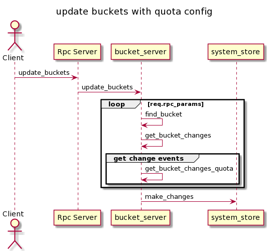
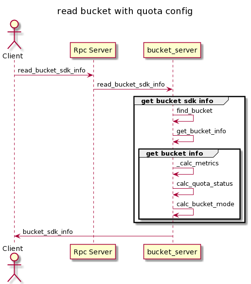
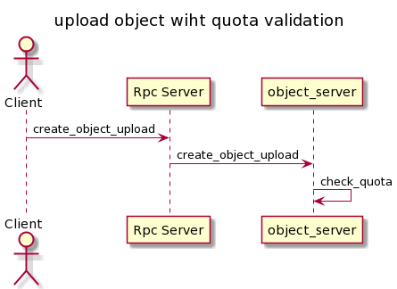
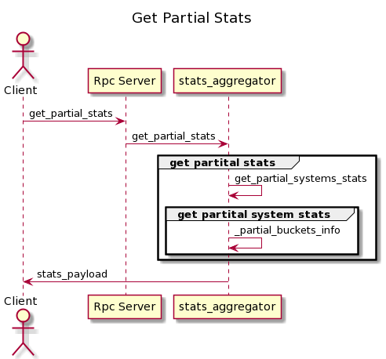
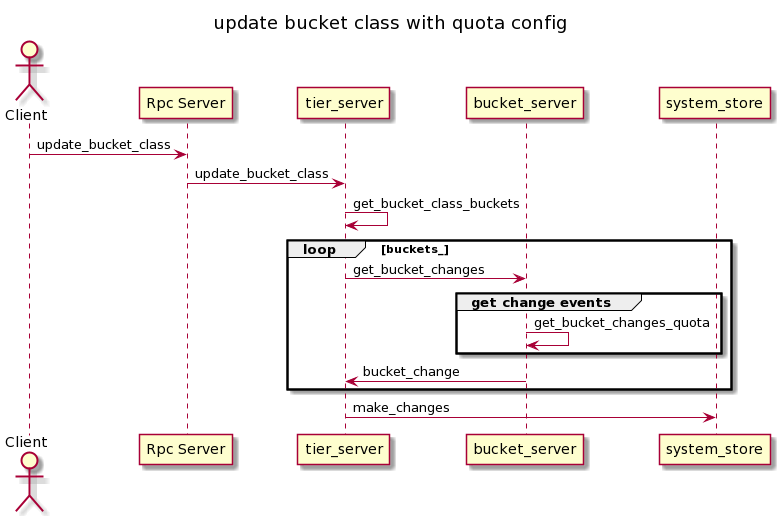
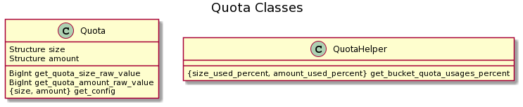

# NooBaa support for bucket quota

## Overview
Quota is a known tool for limiting the max total size / max number of objects per bucket.

By having this limitation on noobaa object buckets, we can avoid resource starvation by a single consumer.

## Goals
* Provide an option to Configure Quota per Bucket on an OBC level and on the BucketClass level. 
If both exist, minimum between the two would be chosen. 
* Set a quota of object bucket claim, which limits the max number of objects per bucket (MaxObjects).
* Set a quota of object bucket claim, which limits the max total size per bucket (MaxSize).
* Remove quota configuration from the bucket.
* Update Quota’s on exiting buckets (updating the OBC only).
* Update BucketClass quota, will be effective in new buckets using this BucketClass.
* Add to NooBaa CLI new options for creating object bucket claims while providing one of the 2 types of quota.
* Metrics and Alerts - upon calculation statistics based:
    * Will provide the admin the quota status.
    * Alert the admin when the number of objects / total size of objects reaches 80% and 100% of the quota.

## Out of scope
* Quota on Namespace OBCs.
* Quota on Cache OBCs.

## Technical Details
* Versioning Enabled Bucket
    * Each version counts as a different object towards num objects quota and its size towards size quota.
    * Delete marker is counted as a new object towards num objects quota. This means deletion of a non specific version can fail if num objects quota exceeded.
    * Delete for a specific version would work, since its not creating a delete marker.
* Non Versioned Bucket
    * Delete should always succeed
* Multipart Uploads
    * If multipart upload init succeeded, the upload can be completed. Quota will be checked on init to avoid an increasing number of uncompleted uploads taking up space.
### Limitations
* Non strict quota - quota calculation is based on statistics aggregation. 
    * Statistics calculation cycle is executed every few minutes (2m) - will only limit the user if he exceeded the quota after the next statistics calculation cycle will end.


## Solution

### **noobaa-core component**
  
Noobaa-core component uses rpc server with rich API that allows to communicate with client based on JSON schema.  
buckets manipulations is described in bucket_api schema (bucket_api.js)
* update_buckets - update buckets with quota config based on provided buckets list.
* update_bucket - update single bucket with quota configuration. internally uses update_buckets.
* read_bucket/read_bucket_sdk_info - return bucket_info definition which includes bucket quota configuration. 

quota config schema:

```
quota_config: {
    type: 'object',
    properties: {
        size: {
            type: 'object',
            required: ['value', 'unit'],
            properties: {
                value: {
                    type: 'integer',
                    "minimum": 1
                },
                unit: {
                    type: 'string',
                    enum: ['GIGABYTE', 'TERABYTE', 'PETABYTE']
                },
            },
        },
        amount: {
            type: 'object',
            required: ['value'],
            properties: {
                value: {
                    type: 'integer',
                    "minimum": 1
                }
            },
        }
    }
}
```  

**The following sequence diagram illustrates the update buckets flow with quota configuration.**



Each bucket object has a storage_stats structure which has the bucket's stats.
These storage stats are calculated in the background by the md_aggregator.
* objects_size - total bucket size
* objects_count - total objects in the bucket.

Based on thеse stats, noobaa-core process can calculate the bucket usage percentages relative to him quota config.  

While reading a bucket info, the process calculates the quota status:
* QUOTA_NOT_SET - quota is disabled.
* EXCEEDING_QUOTA - the bucket has exceeded one of the quota limits. (exceeded 100%). it also affets on the bucket mode.
* APPROUCHING_QUOTA - the bucket approaches to one of the quota limits. (exceeded 80%).

**The following sequence diagram illustrates the read buckets flow with quota configuration.**



While uploading objects, noobaa-core alerts, if the quota limits have been reached and throws an exception to client.

**The following sequence diagram illustrates the upload object flow to bucket with quota configuration.**



While getting partial stats, the process adds bucket usage percentage per limit (quota_size_precent, quota_amount_precent).  
**The following sequence diagram illustrates the get partial stats flow with quota.**



Update quota configuration from BucketClass  
**The following sequence diagram illustrates the update bucket class flow with quota.**



**Deserialization**  
New 'Quota' class is implemented for deserialization. Additionally, the class has all required method related to quota config.  
For example, calculate raw_value of quota based on provided value and unit parameters.  
In order to return to client a simple quota configuration, the class has the get_config method.  

**The following diagrams describes additional classes with related methods.**


