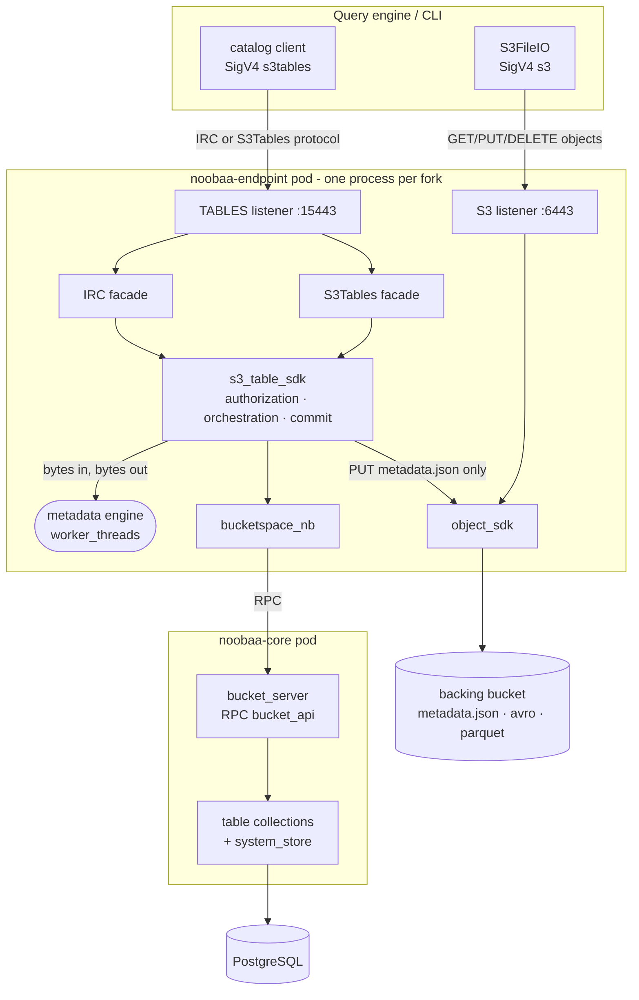
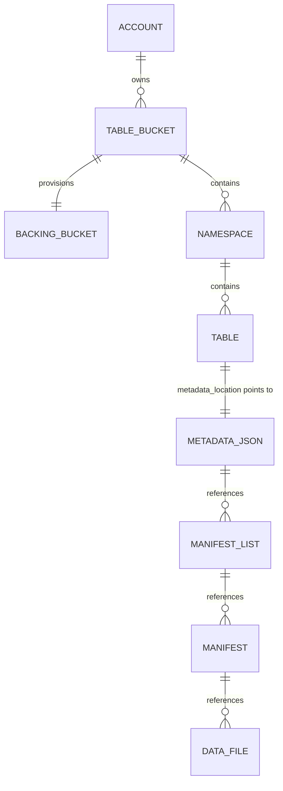
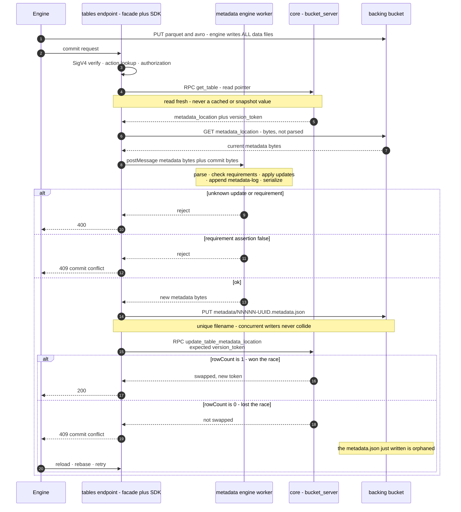

# S3 Tables in NooBaa - high-level design

Status: high-level design for the S3 Tables Developer Preview
([RHSTOR-7673](https://redhat.atlassian.net/browse/RHSTOR-7673)). No code
accompanies this document.

Audience: NooBaa maintainers who will implement this, plus reviewers checking the
security and concurrency stories. The document is self-contained - background from
the exploration phase is explained inline rather than referenced. Claims about
NooBaa carry a `path:line` reference; claims about Iceberg or AWS link to a primary
source; engineering judgment is marked `(assessment)`.

## 1. Introduction and background

This section exists so a reviewer who has never used Iceberg can read the rest of
the document. Maintainers already fluent in Iceberg can skip to §2.

### 1.1 What Apache Iceberg is, and what a catalog does

Iceberg is a **table format**: a convention for describing a SQL table whose bytes
live in object storage. A table is not a directory that engines list - it is a tree
of metadata files naming exactly which data files belong to the table at a given
point in time ([Iceberg table spec](https://iceberg.apache.org/spec/)):

```
catalog pointer  ─►  vN.metadata.json     schemas, partition specs, sort orders,
                          │               snapshots, refs, snapshot-log, properties
                          ├─► manifest list (.avro)      one per snapshot
                          │        └─► manifest (.avro)  a batch of data files + stats
                          │                 └─► data file (.parquet)
                          └─► older snapshots (time travel)
```

Three properties follow from that shape, and they drive every decision below:

- **Everything is immutable and additive.** A write never edits a file. It writes
  new Parquet, new manifests, and a new `metadata.json` describing a new *snapshot*.
  Readers keep using the old snapshot until the pointer moves.
- **Query planning reads metadata, not listings.** Engines prune partitions and
  files using statistics stored in manifests, which is why Iceberg scales where
  `LIST`-based table layouts do not.
- **Exactly one thing must be atomic: moving the pointer** from `vN.metadata.json`
  to `vN+1.metadata.json`. The spec deliberately does not standardize how - "the
  atomic operation used to commit metadata depends on how tables are tracked and is
  not standardized by this spec."

A **catalog** is the component that owns that pointer. It answers "what is the
current metadata file for table `db.orders`?" and performs the atomic swap. That is
nearly its whole job. In particular:

**The engine writes every data and manifest file; the catalog writes only
`metadata.json` and owns the swap.** This is the single most important fact in this
document, and it was established empirically during exploration rather than assumed:
after driving a prototype catalog through a complete PyIceberg lifecycle (create
namespace → create table → append → scan → append → add column → set properties →
tag → drop), the table's prefix held 2 `.parquet` and 4 `.avro` files written by the
client, and 8 `.metadata.json` files written by the server. The server's storage
layer only ever wrote `*.metadata.json`.

That small job is also the thing standing between an ODF user and a lakehouse today.
To use Iceberg on NooBaa they must deploy, secure, back up and upgrade a **separate
stateful service** - [Lakekeeper](https://github.com/lakekeeper/lakekeeper) (Rust +PostgreSQL), [Apache Polaris](https://github.com/apache/polaris) (Java 21),
[Nessie](https://projectnessie.org/guides/iceberg-rest/) (Java), or Hive Metastore - and wire their engines to two systems with two credential domains. 

### 1.2 What S3 Tables is, and what it solves

AWS S3 Tables is the productization of "put the catalog inside the storage service."
It is three layers stacked on the split above:

1. **A control-plane API** - the `s3tables` service: table buckets, namespaces,
   tables, policies, encryption, maintenance, replication.
   [49 operations](https://docs.aws.amazon.com/AmazonS3/latest/API/API_Operations_Amazon_S3_Tables.html).
2. **An Iceberg REST Catalog endpoint** at
   `https://s3tables.<region>.amazonaws.com/iceberg`, SigV4-signed with signing name
   `s3tables`, implementing a deliberately small
   [13-operation profile](https://docs.aws.amazon.com/AmazonS3/latest/userguide/s3-tables-integrating-open-source.html)
   of the open Iceberg REST spec.
3. **Managed maintenance** - compaction, snapshot expiry and unreferenced-file
   removal run by the service, with a few user-visible knobs.

What that buys a user: **no separate catalog service, no second credential domain,
no second thing to back up.** One endpoint URL plus the
object-storage credentials they already have. Storage-native encryption and
maintenance follow for free because the catalog and the bytes are the same product.

### 1.3 Glossary

**Iceberg terms**, from the
[table spec](https://iceberg.apache.org/spec/) and the
[REST spec](https://github.com/apache/iceberg/blob/main/open-api/rest-catalog-open-api.yaml):

| Term | Meaning |
|---|---|
| **table format** | The convention describing a table as metadata files plus data files in object storage. Iceberg, Delta Lake and Hudi are the three in common use |
| **catalog** | The service mapping a table name to its current metadata file and performing the atomic pointer swap. The only stateful part |
| **table metadata** / `metadata.json` | One JSON document holding the table's entire logical state: schemas, partition specs, sort orders, snapshot list, refs, logs, properties. Rewritten in full on every commit |
| **snapshot** | The complete set of data files constituting the table at one instant. Identified by a `snapshot-id`; never modified once written |
| **manifest list** | One Avro file per snapshot, listing that snapshot's manifests with partition ranges for pruning |
| **manifest** | An Avro file listing data files with per-column statistics used for file pruning |
| **data file** | A Parquet file holding rows. Written by the engine, never by the catalog |
| **schema** / **partition spec** / **sort order** | Versioned, id-numbered descriptions of columns, how rows map to partitions, and write ordering. A table keeps every historical version |
| **ref** (**branch** / **tag**) | A named pointer to a snapshot. `main` is the branch whose head is the table's current state; tags are fixed labels for time travel |
| **snapshot-log** / **metadata-log** | Append-only histories of `main`'s movements and of previous `metadata.json` files |
| **format version** | The table-spec version. v2 adds row-level deletes; v3 adds deletion vectors, row lineage and the variant type. This design creates v2 by default and accepts v3 (§8.2) |
| **commit** | One update to a table: a set of **requirements** (preconditions the server asserts, e.g. "`main` still points at snapshot S") plus a set of **updates** (changes to apply, e.g. `add-snapshot`, `set-snapshot-ref`) |
| **optimistic concurrency** | The concurrency model: no locks. Losing a race returns `409` and the client rebases and retries |

**S3 Tables terms**, with the
[naming rules](https://docs.aws.amazon.com/AmazonS3/latest/userguide/s3-tables-buckets-naming.html)
this design must validate against:

| Term | Meaning |
|---|---|
| **table bucket** | The top-level container, holding namespaces and tables. ARN `arn:aws:s3tables:<region>:<account>:bucket/<name>`. 3–63 characters, lowercase letters, digits and hyphens, and **must not end in the reserved suffix `--table-s3`**. Unlike ordinary S3 buckets, table bucket names are not globally unique - only unique per account per region |
| **namespace** | A single-level grouping of tables inside a table bucket - the `db` in `db.orders`. 1–255 characters, lowercase letters, digits and underscores, no hyphens or periods, must not start with `aws`. AWS supports one level only, though the Iceberg REST spec allows nesting |
| **table** | One Iceberg table inside a namespace. Same naming rules as namespaces. Has its own ARN |
| **warehouse location** | The `s3://` prefix under which one table's files live. AWS generates it as an opaque, system-chosen bucket, e.g. `s3://63a8e430-…--table-s3` - no namespace or table name appears in it |
| **version token** | The opaque token guarding the commit. An update to the metadata pointer succeeds only if the caller's token matches the stored one |

**NooBaa terms introduced by this design:**

| Term | Meaning |
|---|---|
| **backing bucket** | The ordinary NooBaa bucket holding one table bucket's data, named `<table-bucket>--table-s3` (§3.2) |
| **table pointer** | The stored record holding a table's `metadata_location` and `version_token`. The target of the atomic swap (§7) |
| **`s3_table_sdk`** | The shared logic layer both protocol servers call (§6) |

### 1.4 The two protocols

S3 Tables is reachable over **two different wire protocols covering the same
entities**. Both create namespaces and tables and both can commit; they differ in
who speaks them, what the JSON looks like, and - for the commit - in who computes
the new metadata. This design implements **both**.

| | **IRC protocol** (Iceberg REST) | **S3Tables protocol** |
|---|---|---|
| Standard | [Open, OpenAPI-specified](https://github.com/apache/iceberg/blob/main/open-api/rest-catalog-open-api.yaml) | [AWS-proprietary](https://docs.aws.amazon.com/AmazonS3/latest/API/API_Operations_Amazon_S3_Tables.html) |
| Spoken by | Query engines directly: Spark, PyIceberg, Trino, Flink, DuckDB | The `aws s3tables` CLI, the AWS console, and AWS's [S3 Tables catalog client library](https://github.com/awslabs/s3-tables-catalog) for Spark and Flink |
| Shape | Path-routed REST, `/v1/{prefix}/namespaces/{ns}/tables/{t}`, Iceberg-shaped JSON | AWS SDK operations, ARN-addressed, AWS-shaped JSON |
| Operation count | 13 in AWS's profile | 49 in full; 10 are needed by the catalog client library |
| Auth | SigV4, signing name `s3tables`, no OAuth | SigV4, signing name `s3tables` |

The same intent in both dialects:

| Intent | IRC protocol | S3Tables protocol |
|---|---|---|
| create a namespace | `POST /v1/{prefix}/namespaces` | `CreateNamespace` |
| create a table | `POST …/namespaces/{ns}/tables` | `CreateTable` |
| read a table | `loadTable` | `GetTable` + `GetTableMetadataLocation` |
| **commit** | `updateTable` | `UpdateTableMetadataLocation` |
| rename | `POST /v1/{prefix}/tables/rename` | `RenameTable` |
| attach a policy | *(not in IRC)* | `PutTablePolicy` |

**The commit is where they genuinely differ**, and it shapes the whole design. The
IRC protocol's `updateTable` is *declarative*: the client sends requirements and
updates, and **the server** validates them, builds the new `metadata.json`, writes
it, and swaps the pointer. The S3Tables protocol's `UpdateTableMetadataLocation` is
*imperative*: the **client** has already written the new `metadata.json` and merely
asks the server to swap the pointer if the version token still matches.

So the IRC protocol obliges us to own a metadata engine; the S3Tables protocol does
not. Both, however, end at the same atomic swap - which is why one shared layer can
serve both (§6).

Note that a third protocol is always in play: the **S3 data path**. Whichever
catalog protocol an engine uses, it reads and writes Parquet and Avro with ordinary
S3 object operations - AWS states that
"[S3 Tables supports Amazon S3 API operations such as `GetObject` and `PutObject`](https://docs.aws.amazon.com/AmazonS3/latest/API/developing-s3-tables-APIs.html)"
for table-level reads and writes. Three protocols, one set of bytes.

### 1.5 How a table bucket differs from a regular S3 bucket

**At AWS**, a table bucket is a distinct bucket *type*, not an ordinary bucket with
a convention on top:

| | Regular (general purpose) bucket | Table bucket |
|---|---|---|
| Contains | Objects, addressed by key | Namespaces → tables, addressed by name; objects are an implementation detail |
| Name scope | Globally unique across all AWS accounts in a partition | Unique per account per region only |
| Naming | General purpose rules | 3–63 chars, no underscores or periods, `--table-s3` is a reserved suffix |
| ARN namespace | `arn:aws:s3:::<name>` | `arn:aws:s3tables:<region>:<account>:bucket/<name>` |
| Public access | Possible, if Block Public Access is turned off (all four settings on by default) | **Impossible.** "[All table buckets and tables are private and can't be made public](https://docs.aws.amazon.com/AmazonS3/latest/userguide/s3-tables-buckets.html)" |
| Policies | Bucket policy + object ACLs, `s3:` actions | Table-bucket and per-table resource policies, `s3tables:` actions |
| Where the bytes live | In the bucket, at the key you chose | In a per-table system-generated location, e.g. `s3://<opaque-id>--table-s3` |
| Object-level API | The full S3 object API | A supported subset, authorized as `s3tables:GetTableData` / `PutTableData` rather than `s3:GetObject` / `s3:PutObject` |
| Maintenance | User-configured lifecycle rules | Service-run compaction and snapshot management |
| Encryption | Optional, configurable | Default SSE-S3, optionally SSE-KMS, chosen at bucket creation |

**In NooBaa**, the answer is narrower, and worth stating plainly so nobody assumes
more isolation than exists. Per §3.2 the backing bucket **is** an ordinary NooBaa
bucket, created through the ordinary bucket flow - deliberately, because that is how
it inherits the encrypted chunk layer, conditional writes, batched deletes and
multipart. What it does **not** inherit is bucket-level configuration: those settings
belong to the table bucket, and the S3 operations that change them are refused
(§3.2). The remaining rows below are provenance or deferrals, not restrictions:

| | Ordinary NooBaa bucket | Backing bucket |
|---|---|---|
| Created by | `CreateBucket` / OBC | `CreateTableBucket`, which provisions it |
| Naming | User-chosen | Derived: `<table-bucket>--table-s3` |
| Data path, storage, encryption | Standard internal path | **Identical** - same tiering, same AES-256-GCM chunk layer |
| S3 object API | Full | **Full** - required; engines write all data files themselves |
| S3 bucket-configuration API | Full | **Restricted** (§3.2, §10) - policy, lifecycle, versioning, object lock, replication, encryption and bucket deletion are refused |
| Visible in `ListBuckets` | Yes | Yes for now. Hiding it belongs with console integration, and is only meaningful once the destructive operations are actually refused |
| Per-table authorization on object I/O | n/a | **Not in this phase** - deferred (§9) |

## 2. Scope

**This phase ships both protocols over one shared logic layer**, so that a Developer Preview user can reach a working lakehouse either by pointing an
AWS-documented Spark, PyIceberg, Trino or DuckDB configuration at a NooBaa URL, or by
using the `aws s3tables` CLI and AWS's Spark catalog client library.

In scope:

1. A new TLS endpoint service hosting **two REST facades** - the IRC protocol in
   AWS's dialect, and the S3Tables protocol.
2. **`s3_table_sdk`** - the shared layer holding all catalog logic, authorization
   and orchestration (§6).
3. **Persistence through `BucketSpace`**, so the containerized and NSFS paths are
   two implementations of one interface rather than two codebases (§3.1).
4. **The metadata engine** - applying Iceberg updates to a table metadata document
   and writing the new `metadata.json`, for format versions 2 and 3 (§8).
5. **Atomic commit** - a compare-and-swap on the table pointer, serving both
   protocols' commit paths (§7).
6. **Table bucket lifecycle**, including provisioning the backing bucket.
7. **Security items**: a backing-bucket policy guard, encryption reporting, and
   AWS-shaped `NotImplemented` responses for everything else (§10).
8. **Operator wiring** and a test strategy (§11, §12).

Explicitly deferred, in rough order of likely demand:

| Deferred | Why it can wait |
|---|---|
| **Per-table authorization on object I/O** (`s3tables:GetTableData` / `PutTableData` enforced at the S3 endpoint), resource policies on table buckets and tables, cross-account sharing | No grant path to a third party exists in this phase, so nothing is exposed that enforcement would close (§9) |
| **Managed maintenance** - snapshot expiry, unreferenced-file removal, compaction | Engines ship their own `rewrite_data_files` and expiry; this is a convenience, and expiry needs Avro manifest *reading*, which nothing here does |
| **Remaining S3Tables operations** - policies, tagging, replication, metrics configuration, storage class, record expiration | Answered with AWS-shaped `NotImplemented`; no client needs them to run a workload |
| **Views, CTAS / `stage-create`, multi-table transactions** | AWS's own IRC endpoint excludes all three, so client configurations already work without them |
| **Credential vending and remote signing** | Callers use their own SigV4 credentials, exactly as against AWS's endpoint |
| **Customer-managed KMS keys** | `aws:kms` is explicitly rejected rather than recorded and ignored (§10) |

Containerized ODF is the primary target. NSFS is not being built in this phase, but
must not be designed out - every decision below carries a note on what extending to
it takes, and §3.1 makes that a matter of a second `BucketSpace` implementation
rather than a parallel codebase.

### 2.1 What Developer Preview status means here

This ships as a Red Hat **Developer Preview**, which is a weaker commitment than
Technology Preview:
[Developer Preview features](https://access.redhat.com/articles/6966848) are "not
supported by Red Hat's product support and customers will not be able to submit
support cases," carry "very limited, if any, documentation," and "may not be
fully/completely tested." Both preview levels are opt-in and "default to being
disabled."

Three consequences shape this design:

1. **The service must be off by default and explicitly enabled** (§3.7). This is a
   product requirement, not a convenience.
2. **We are not committing to storage-format or schema stability.** Record layouts,
   collection names and the on-disk table layout may change before general
   availability without a migration path. That materially lowers the cost of being
   wrong about §3.3 and §5.
3. **It does not lower the correctness bar.** The commit path either is atomic or it
   silently corrupts a user's table - a defect no preview label excuses. The
   completeness bar drops (fewer operations, thinner docs, narrower client matrix);
   the data-integrity bar does not, which is why §12 spends its budget on
   concurrency, crash safety and metadata conformance rather than coverage breadth.

Note that decisions which look like they exist for backward compatibility mostly do
not. The reason to match AWS's dialect exactly (§3.5, §3.6, §9) is **compatibility
with AWS's documented client configurations**, which is unaffected by our own
preview status. Those decisions stand at full strength; the internal ones relax.

## 3. Design decisions

Seven decisions are hard to reverse once clients depend on them. Each is stated with
its rationale and what extending to NSFS would take.

### 3.1 Layering: one logic layer, two protocol facades, `BucketSpace` for persistence

**Decision.** All catalog logic lives in a new **`s3_table_sdk`**. The two REST
facades are thin: they parse their own wire format, call the SDK, and map the SDK's
semantic errors onto their own error shape. Persistence goes through the existing
**`BucketSpace`** interface, gaining table methods alongside the vector-bucket
methods already there (`src/sdk/nb.d.ts:915-975`).

```
IRC facade          S3Tables facade
      └────────┬────────┘
          s3_table_sdk          ← authorization, orchestration, commit protocol
        ┌───────┼────────┐
   metadata   object_sdk   BucketSpace
    engine    (warehouse   ├─ bucketspace_nb → RPC → core → dedicated collections
   (worker)     I/O)       └─ bucketspace_fs → config_fs
```

Three reasons this shape rather than two independent servers:

1. **The two protocols share one action vocabulary.** AWS maps both an IRC operation
   and its S3Tables counterpart onto the *same* `s3tables:` IAM action - `loadTable`
   and `GetTableMetadataLocation` both authorize `s3tables:GetTableMetadataLocation`.
   The authorization decision is therefore protocol-independent and belongs below the
   facades, not duplicated in each. This is a deliberate divergence from the vector
   service, which authorizes in its REST layer
   (`src/endpoint/vector/vector_rest.js:213-231`) - it has only one facade, so
   drift is not possible there.
2. **The two commit paths must not diverge.** Both funnel into one compare-and-swap
   (§7), so a client using one protocol and a client using the other serialize
   correctly against the same table *structurally*, not because two implementations
   happen to agree.
3. **`BucketSpace` is where NooBaa already varies persistence by deployment.**
   `bucketspace_nb` is pure RPC to core - it references neither `system_store` nor
   `db_client` - while `bucketspace_fs` calls `config_fs` directly
   (`src/sdk/bucketspace_fs.js:1254-1271`). Adding table methods there means the NSFS
   variant is a second implementation of an existing interface rather than a new
   abstraction invented for this feature.

What stays **out** of the SDK: wire-format error mapping. The SDK throws semantic
errors (`TableNotFound`, `CommitConflict`, `RequirementFailed`); each facade renders
them in its own shape - `IcebergErrorResponse` for the IRC protocol, AWS exception
shapes for the S3Tables protocol. An SDK that threw an Iceberg-shaped error would
leak one protocol into the other.

What sits **beside** the SDK rather than under it: the metadata engine. It is a pure
function over a JSON document, independent of deployment and of protocol (§8).

*NSFS later:* this decision is what makes NSFS tractable - a `bucketspace_fs`
implementation of the table methods, and nothing else.

### 3.2 The backing bucket model

**Decision. A table bucket's data lives in one ordinary, S3-addressable NooBaa
bucket, named `<table-bucket>--table-s3`, whose bucket-policy attachment is refused.
Each table's files sit under a single opaque first path segment - the table's id.**

AWS reserves `--table-s3` as a
[forbidden suffix on table bucket names](https://docs.aws.amazon.com/AmazonS3/latest/userguide/s3-tables-buckets-naming.html)
precisely so a user-chosen name can never collide with a system-generated one.
Adopting it gives two validation rules:

- reject `--table-s3` as a suffix on user-supplied table bucket names;
- reject `CreateTableBucket` when the derived backing name already exists as an
  ordinary bucket - `validate_bucket_creation` already raises `BUCKET_ALREADY_EXISTS`
  (`src/server/system_services/bucket_server.js:1627-1636`).

The authoritative link is a `backing_bucket` id stored on the table-bucket record;
the name is a convenience for operators and for the policy guard. `--` is legal under
NooBaa's bucket-name rule (`src/server/system_services/bucket_server.js:43-44`), and
the ten-character suffix caps table bucket names at 53
(`src/server/system_services/bucket_server.js:1621-1626`).

Why this and not AWS's model - a system-generated bucket per *table*:

1. **Engines write every data and manifest file themselves**, with their own SigV4
   credentials, through an ordinary S3 endpoint. A location not reachable that way
   would need a second data plane.
2. **Provisioning through the ordinary bucket flow buys the whole data path for
   free.** `create_bucket` builds tier, tiering policy, chunk config and mirrors from
   the account's default resource
   (`src/server/system_services/bucket_server.js:216-280`), which brings the
   always-on AES-256-GCM chunk layer (`config.js:456`), correct conditional writes,
   batched deletes and multipart.
3. **A bucket per table does not scale here.** AWS's quota is 10,000 tables per
   bucket; in NooBaa each bucket costs a bucket, a tier, a tiering policy and a
   wrapped master key, and buckets live in `system_store`, which every endpoint fork
   holds in memory (`src/server/system_services/system_store.js:608`). Cloning AWS's
   granularity trades a future convenience for a system-wide scale hazard
   (assessment).
4. **Table-id-as-first-segment keeps future per-table authorization cheap.** The
   expensive part of enforcing `s3tables:GetTableData` at the S3 endpoint is
   resolving a key prefix back to a table. With this layout it is: take the first key
   segment, look the table up by primary key, confirm its table bucket's backing
   bucket matches the bucket being addressed. One parse, one primary-key lookup - not
   a scan, not a heuristic.

**The object plane is regular; the configuration plane is not.** Iceberg's file I/O
*is* ordinary S3 object access, so `GetObject`, `PutObject`, `DeleteObject`,
`DeleteObjects`, multipart, `HeadObject`, ranged reads and listing must all behave
exactly as on any other bucket - blocking any of them breaks the feature. Bucket-level
*configuration* is the opposite case: the table bucket owns it, and each setting an S3
caller could change is one the catalog would never learn about.

| S3 operation | On a backing bucket | Why |
|---|---|---|
| Object operations, multipart, listing | **Allowed - required** | This is how engines write tables |
| `DeleteBucket`, `DeleteBucketAndObjects` | **Refused** | Destroys every table in the table bucket and leaves catalog records pointing at nothing |
| `PutBucketLifecycle` | **Refused** | An expiry or transition rule silently deletes or de-tiers data that live snapshots still reference |
| `PutBucketVersioning` | **Refused** | No benefit - Iceberg writes unique keys and never overwrites - and delete markers change read behaviour |
| `PutObjectLockConfiguration` | **Refused** | Blocks the engine's own cleanup and blocks table deletion |
| `PutBucketReplication` | **Refused** | Replicates data without the catalog; the target is a half-table |
| `PutBucketEncryption` | **Refused** | The table-bucket encryption operations own this; divergence would make the reported `AES256` false |
| `PutBucketPolicy` | **Refused** | No grant path to a third party (§9.1) |
| `CreateBucket` with a `--table-s3` name | **Refused** | Prevents collision and name hijack |
| CORS, website, notification, tagging | Allowed | No data-loss path |

Two of these matter more than the policy guard, and for a different reason: the
policy refusal is a *security* control, while `DeleteBucket` and lifecycle are *data-loss*
controls. A single `aws s3 rb` against a backing bucket would destroy every table it
holds, and a routine "expire after 90 days" rule would delete live data files with no
error at the time - reads simply start failing later, far from the cause.

**What this phase still accepts, stated plainly.** Any principal that can already
reach the backing bucket over S3 can read and write table *bytes* directly, bypassing
the catalog. Object-level access is not scoped per table. That is safe here only
because no grant path to a third party exists - the argument is in §9, and the guards
holding it up are in §10.

*NSFS later:* the model is bucket-shaped, so an NSFS-backed bucket works the same
way; only the future enforcement hook location differs.

### 3.3 Where table metadata is stored

**Decision. Always write a real `metadata.json` into the table's location.** The
catalog never keeps table metadata only in its own database. This is the escape
hatch that prevents lock-in: any table can be registered into another Iceberg catalog
later, because the on-disk form is standard Iceberg.

```
s3://<table-bucket>--table-s3/          # one ordinary NooBaa bucket per table bucket
  <table-id>/                           # 24-hex id of the table record, opaque
    metadata/
      00000-<uuid>.metadata.json        # catalog-written - the ONLY thing we write
      00001-<uuid>.metadata.json
      snap-<n>-<m>-<uuid>.avro          # client-written manifest list
      <uuid>-m0.avro                    # client-written manifest
    data/
      00000-0-<uuid>.parquet            # client-written
```

- The catalog owns `*.metadata.json` names only: a five-digit zero-padded version
  (the length of the metadata log) plus a random UUID.
- The version number is cosmetic. **The UUID is what makes two concurrent writers
  produce different filenames**, which is what makes the write-then-swap protocol in
  §7 safe.
- **The location contains no namespace or table name**, so renaming a table is a
  pure pointer update that never moves a byte. AWS makes the same choice - its
  generated location is an opaque id. The cost is that a human browsing the bucket
  sees table ids rather than names; the stored record is the decoder (assessment).

**Two consequences of writing real Iceberg files, both worth stating plainly.**

*Tables can leave, but cannot arrive in place.* Every path inside Iceberg metadata is
a fully-qualified URI - [before format v4, all path fields must be
fully-qualified](https://github.com/apache/iceberg/blob/main/format/spec.md) - from
`metadata.json` down through manifest lists, manifests and data files. So another
catalog can adopt one of our tables by registering its `metadata.json`, and nothing
moves. The reverse does not hold: adopting a foreign table would leave its data
outside the backing bucket, breaking the encryption claim (§10), cleanup, and the
prefix resolution §3.2 relies on. Migrating a table *in* therefore requires copying
the data, typically with `CREATE TABLE AS SELECT`. AWS is in the same position and
for the same reason - it
[does not support in-place migration into table buckets](https://docs.aws.amazon.com/prescriptive-guidance/latest/apache-iceberg-on-aws/table-migration.html)
either, so this is parity rather than a NooBaa-specific gap. Format v4 introduces
relative paths, which would change the calculus.

*Never point a second catalog at these tables as a writer.* Iceberg's atomicity rests
on one authoritative pointer per table. Two catalogs each hold their own, neither sees
the other's swap, and both commits succeed against their own view - so one snapshot is
silently lost, with no error anywhere. Preconditions do not help, because each catalog
validates against its own pointer. A second catalog is safe only as a **read-only**
consumer, and even then only while no maintenance is deleting files it still
references. This is worth documenting for users, because "no separate catalog service"
invites someone to run both during an evaluation.

*NSFS later:* the layout is object-store-shaped and applies unchanged.

### 3.4 The commit mechanism

**Decision. A table's pointer is swapped by a conditional update whose matched-row
count is checked, executed in core, keyed on an opaque version token.**

**Why not the ordinary configuration store.** `system_store.make_changes` cannot
express a compare-and-swap. Updates become unconditional bulk `updateOne`s and only
`res.ok` is inspected - matched counts are discarded
(`src/server/system_services/system_store.js:795-837, 885-893`). It does accept a
`$find` predicate, so the *filter* is expressible; the *result* is not. Its reads are
also a snapshot that can be stale: `refresh()` serves cached data for up to ten
minutes and only forces a reload after an hour
(`src/server/system_services/system_store.js:396-397, 450-466`).

**The primitive already exists.** `PostgresTable.updateOne` emits
`UPDATE … SET data = … WHERE <selector> RETURNING _id, data` and returns `rowCount`
(`src/util/postgres_client.js:842-861`); `md_store` treats `rowCount !== 1` as
failure through `check_update_one`
(`src/server/object_services/md_store.js:223, 240, 373`;
`src/util/postgres_client.js:1924-1929`). `rowCount === 1` is the whole mechanism.

One caveat: `updateOne` has **no `LIMIT 1`** and asserts `rowCount <= 1`
(`src/util/postgres_client.js:855`), so the filter must always include the record id.

**Where it runs.** In core, reached over RPC. `bucketspace_nb` is pure RPC - it
touches neither `system_store` nor `db_client` - so a new `bucket_api` operation
carries the swap, and core performs the conditional update against dedicated
collections. Endpoint forks do hold a direct PostgreSQL connection (the operator sets
`LOCAL_MD_SERVER=true` on the endpoint deployment, which makes the endpoint call
`md_server.register_rpc()` and connect, `src/endpoint/endpoint.js:179-186`,
`src/server/md_server.js:9-10`) - that connection is how `object_sdk` writes the
`metadata.json` - but routing the swap through `BucketSpace` keeps one persistence
seam instead of two.

The added round trip is not significant (assessment): a commit already performs a
pointer read, an object GET of the current `metadata.json`, a transform, and an
object PUT. A few milliseconds of RPC is noise, and commits happen per write batch,
not per object. What it does mean is that **core is the commit throughput
chokepoint**, which is the existing single-writer topology and is called out as
something to measure (§15).

**What the swap is keyed on.** An opaque **version token**, regenerated on every
successful commit, rather than the metadata location. That is exactly the S3Tables
protocol's own commit primitive, so the second facade is a facade rather than a
second mechanism, and it separates *which version* from *where the bytes are*.

**Where the records live.** Table buckets are low-cardinality and needed in memory
for authorization, so they are a `system_store` collection like vector buckets
(`src/server/system_services/system_store.js:168-176`). Namespaces and tables are
high-cardinality and must be read fresh, so core defines them as **dedicated
collections** the way `md_store` defines its own
(`src/server/object_services/md_store.js:74-105`) - outside the in-memory snapshot.

*NSFS later:* `bucketspace_fs` has the primitive it needs. `native_fs_utils` exposes
`safe_link(fs_context, src, dst, mtimeNsBigint, ino)` and `safe_unlink(…)`
(`src/util/native_fs_utils.js:282-302`), which replace or delete a file **guarded by
its mtime and inode** - a compare-and-swap by another name - and `create_config_file`
uses `fs.link()` (`src/util/native_fs_utils.js:431`), which fails `EEXIST` and so is
an atomic create-if-absent. The NSFS swap would read the pointer file capturing its
stat, write a temporary file, then `safe_link` it over the old one guarded by the old
`(mtime, ino)`. This is **available, not proven** - GPFS takes a different branch and
the multi-endpoint shared-filesystem case needs verifying.

### 3.5 Addressing: table bucket ARNs and the IRC prefix

**Decision.** Every IRC URL carries a free-form `{prefix}` segment; in AWS's dialect
it is the percent-encoded table bucket ARN. The parser is **permissive on input,
canonical on output**: after percent-decoding, accept
`arn:aws:s3tables:<region>:<account>:bucket/<name>` with region and account optional
or empty, and also accept a bare `<name>`. Region and account are ignored - there is
one system, and the caller's identity comes from the SigV4 credential. The **table
bucket name is the key**.

AWS's documented client configurations put the full ARN in the `warehouse` property,
so accepting it verbatim means a user changes only the endpoint URL. Permissiveness
costs one regular expression and guarantees we never have to break a client.

Two ARN shapes stay distinct, because different code consumes them:

| Purpose | Shape |
|---|---|
| IRC `{prefix}` and S3Tables ARN paths (client-facing) | `arn:aws:s3tables:<region>:<account>:bucket/<name>`, percent-encoded |
| Authorization resource (internal) | `arn:aws:s3tables:::<table-bucket>` and `arn:aws:s3tables:::<table-bucket>/<namespace>/<table>` |

The internal shape comes free: `iam_utils._get_resource_arn_from_req` builds
`arn:aws:${service}:::${bucket_name}` and appends `/${req.params.key}` when set
(`src/endpoint/iam/iam_utils.js:1326-1334`), mirroring the vector service's flat
`arn:aws:s3vectors:::<name>` (`src/endpoint/vector/vector_rest.js:296`). Setting the
key to `<namespace>/<table>` yields the two-level resource ARN with no new code.

*NSFS later:* prefix parsing is deployment-agnostic.

### 3.6 Authentication and the action vocabulary

**Decision.** SigV4 only, signing name `s3tables`, no OAuth - matching AWS, whose own
endpoint does not support OAuth either. The action vocabulary is **AWS-identical**
(§9). Both facades authenticate identically, because both protocols use the same
signing name.

Authentication reuses `signature_utils.authenticate_request_by_service`
(`src/util/signature_utils.js:374-389`) exactly as the vector service does
(`src/endpoint/vector/vector_rest.js:244-255`). The signing service string is read
out of the credential scope and passed through to the signer, never asserted against
a fixed value (`src/util/signature_utils.js:39-59, 99-101`), so `s3tables`-signed
requests need no change there.

**One real problem, and it applies to both facades.** `_aws_request` unconditionally
rewrites `%2F` to `/` before parsing the URL, then for any non-`s3` service
normalizes the path with `path.normalize(decodeURI(...))`
(`src/util/signature_utils.js:205-213`). Both protocols put percent-encoded ARNs in
URL paths, and an ARN contains exactly one encoded slash (`bucket%2F<name>`).
Reproduced against the vendored `aws-sdk` 2.1693.0 signer for the request target
`/v1/arn%3Aaws%3As3tables%3A%3A%3Abucket%2Fmytables/namespaces`:

```
client, single-encoded : /v1/arn%3Aaws%3As3tables%3A%3A%3Abucket%2Fmytables/namespaces
client, double-encoded : /v1/arn%253Aaws%253As3tables%253A%253A%253Abucket%252Fmytables/namespaces
NooBaa computes        : /v1/arn%253Aaws%253As3tables%253A%253A%253Abucket/mytables/namespaces
```

NooBaa's colons match the double-encoded form, but the encoded slash has become a
literal `/`, so the canonical URI matches **neither** candidate and every signed
request would fail with `SignatureDoesNotMatch`. The vector service never hits this
because its URLs are single flat segments
(`src/endpoint/vector/vector_rest.js:183-188`).

The fix is a service-specific canonical-path branch that does not collapse `%2F` and
applies the non-S3 SigV4 rule - URI-encode each real path segment, twice. Which
encoding real clients emit must be pinned empirically before the branch is written
(§15). Budget roughly two days plus a client round trip, not zero.

*NSFS later:* `signature_utils` is shared; the fix serves both deployments.

### 3.7 Service name and port

**Decision.** A service type `TABLES`, by convention across core and operator, cloned
from the vector service. No environment plumbing - the vector service needed none,
because port and certificate path are convention on both sides.

| Thing | Value | Precedent |
|---|---|---|
| Service enum entry | `TABLES: 'TABLES'` | `src/endpoint/endpoint.js:61-68` |
| TLS port | `config.ENDPOINT_SSL_TABLES_PORT = 15443` | vector 14443, `config.js:1124` |
| Certificate path | `config.TABLES_SERVICE_CERT_PATH = '/etc/tables-secret'` | `config.js:77` |
| Certificate map entry | `certs.TABLES` | `src/util/ssl_utils.js:44-53` |
| Feature flag | `config.S3_TABLES_ENABLED = false` - the listener starts only when set | required for Developer Preview (§2.1) |
| Format-version cap | `config.S3_TABLES_MAX_FORMAT_VERSION = 3` - an operator can dial back to 2 | §8.2 |
| TLS-configurable list | add `'TABLES'` | `config.js:81-88` |
| Operator Service / Route / cert secret | `tables` / `tables` / `noobaa-tables-serving-cert` | `deploy/internal/service-vectors.yaml` |

The feature flag gates the listener itself: when `config.S3_TABLES_ENABLED` is
false, no port is opened, no collections are defined, and the operator creates no
Service or Route. Nothing about the feature is reachable, which is what "default to
being disabled" has to mean for a network service.

Both facades share the listener and are separated by path:

| Path | Facade |
|---|---|
| `/iceberg/v1/...` and `/v1/...` | IRC protocol |
| everything else (`/buckets`, `/namespaces/...`, `/tables/...`) | S3Tables protocol |

Serving the IRC protocol under `/iceberg` matches AWS, whose endpoint is
`https://s3tables.<region>.amazonaws.com/iceberg`, so a user changes only the host.
Accepting it at `/v1` as well keeps generic Iceberg clients working. `/iceberg` is an
ordinary path segment for signing purposes.

*NSFS later:* the listener is deployment-agnostic; NSFS needs only certificate
directory handling.

## 4. Architecture

The service is a new listener in the existing endpoint process. It adds no pod, no
sidecar and no second runtime.



Reading the diagram:

- **Both facades share one listener and one logic layer.** They differ only in URL
  routing, request/response shape, and error rendering.
- **Only the SDK talks to persistence**, and only through `BucketSpace`. Nothing in
  the facades touches storage.
- **The engine writes exactly one kind of file.** Everything else in the backing
  bucket arrives over the ordinary S3 listener, written by the client.
- **Catalog records live in core.** `bucketspace_nb` is pure RPC, so the swap and
  every record read execute in `bucket_server`. Endpoint forks do hold their own
  PostgreSQL connection - the operator sets `LOCAL_MD_SERVER=true` on the endpoint
  deployment, which makes the endpoint call `md_server.register_rpc()` and connect
  (`src/endpoint/endpoint.js:179-186`, `src/server/md_server.js:9-10`) - and that is
  how `object_sdk` writes the `metadata.json`. It is not used for catalog records.

**The endpoint pod after this change:** one additional TLS listener on 15443, sharing
the existing fork model; one additional serving-certificate secret mounted at
`/etc/tables-secret`; one worker thread per fork, created lazily on first commit. No
new container, probe or environment variable. Certificate reload is inherited from
`http_utils.start_https_server` (`src/util/http_utils.js:1006-1020`). When the
feature flag is off, none of it exists.

## 5. Entities and stored records



Everything left of `METADATA_JSON` is NooBaa's. Everything from `METADATA_JSON`
rightward is the Iceberg table format, and only `METADATA_JSON` is written by us.

| Data | Stored where | Why there |
|---|---|---|
| Table bucket: name, owner, backing bucket id, encryption setting, creation time | `table_buckets` - a **`system_store` collection** | Low cardinality; ownership is consulted on every authorization decision, exactly like vector buckets (`src/server/system_services/system_store.js:168-176`) |
| Namespace: table bucket, name, properties | `table_namespaces` - a **dedicated collection in core** | Thousands per system; no need to be in the in-memory snapshot |
| Table pointer: table bucket, namespace, name, `metadata_location`, `version_token`, `table_uuid`, `kind` | `table_pointers` - a **dedicated collection in core** | High cardinality, and must be read fresh on every commit (§3.4) |
| Table metadata: schemas, partition specs, sort orders, snapshots, refs, logs, properties | `<location>/metadata/NNNNN-<uuid>.metadata.json` | The no-lock-in escape hatch (§3.3) |
| Manifest lists, manifests | `<location>/metadata/*.avro` - **client-written** | Iceberg contract |
| Data files | `<location>/data/*.parquet` - **client-written** | Iceberg contract |

Dedicated collections are defined in core the way `md_store` defines its own
(`src/server/object_services/md_store.js:74-105`, via
`db_client.instance().define_collection`, `src/util/postgres_client.js:1603-1616`).
This is a core-side holder for collection handles, not a cross-deployment
abstraction - the point where persistence varies by deployment is `BucketSpace`
(§3.1).

**Indexes**, following the unique-partial pattern already used for buckets and vector
indices (`src/server/system_services/schemas/bucket_indexes.js`,
`vector_index_indexes.js`):

| Collection | Fields | Options |
|---|---|---|
| `table_buckets` | `{system, name}` | unique, `partialFilterExpression: {deleted: null}` |
| `table_namespaces` | `{table_bucket, name}` | unique, `partialFilterExpression: {deleted: null}` |
| `table_pointers` | `{table_bucket, namespace, name}` | unique, `partialFilterExpression: {deleted: null}` |

The unique index on `table_pointers` does double duty: it makes concurrent
`CreateTable` and `RenameTable` resolve to one winner through a duplicate-key error,
the same technique `object_server` uses for racing conditional writes
(`src/server/object_services/object_server.js:2290-2302`).

Illustrative pointer record - field names follow existing conventions, this is not
final:

```js
// ILLUSTRATIVE - table_pointers
{
    _id:               ObjectId,   // == the <table-id> path segment in the location
    table_bucket:      ObjectId,
    namespace:         ObjectId,
    name:              SensitiveString,
    metadata_location: String,     // s3://bucket--table-s3/<id>/metadata/N-uuid.metadata.json
    version_token:     String,     // regenerated on every commit; the swap predicate
    table_uuid:        String,     // Iceberg table-uuid, stable across renames
    kind:              String,     // 'table' - 'view' reserved, unused in this phase
    created_at:        Date,
    deleted:           Date,
}
```

`kind` is always `'table'` here. It costs nothing now and spares views a record
migration later (assessment).

## 6. `s3_table_sdk` operations

The SDK is constructed per request, like the vector SDK
(`src/sdk/vector_sdk.js:22-34`), carrying the authenticated account and a
`BucketSpace`. It owns authorization, orchestration and the commit protocol; the
facades own only wire format.

### 6.1 Operation catalogue

Twenty-one operations cover **all thirteen** IRC operations and every S3Tables
operation this phase implements - including the ten that AWS's Spark catalog client
library requires. "Serves" lists the protocol operations each one backs.

**Catalog configuration**

| SDK operation | What it does | Serves |
|---|---|---|
| `get_catalog_config(table_bucket)` | Returns the Iceberg catalog configuration document - defaults, overrides, and the explicit endpoint list, so clients do not rely on assumed defaults | IRC `getConfig` |

**Table buckets**

| SDK operation | What it does | Serves |
|---|---|---|
| `create_table_bucket(name)` | Validates the name (including the reserved `--table-s3` suffix), provisions the backing bucket through the ordinary bucket flow, then writes the table-bucket record. Owns the rollback if either half fails (§6.4) | S3Tables `CreateTableBucket` |
| `get_table_bucket(name)` | Returns the record - name, ARN, owner, creation time | S3Tables `GetTableBucket`; also resolves the `{prefix}` on every IRC request |
| `list_table_buckets(page)` | Lists the caller's table buckets, paginated | S3Tables `ListTableBuckets` |
| `delete_table_bucket(name)` | Refuses while namespaces remain; deletes the record and the backing bucket | S3Tables `DeleteTableBucket` |
| `get_table_bucket_encryption(name)` / `put_…` / `delete_…` | Reports `AES256`; rejects `aws:kms` and SSE-C explicitly (§10) | S3Tables `Get/Put/DeleteTableBucketEncryption` |
| `get_table_encryption(table_bucket, namespace, name)` | Reports the table's effective encryption, inherited from its table bucket | S3Tables `GetTableEncryption` |

**Namespaces**

| SDK operation | What it does | Serves |
|---|---|---|
| `create_namespace(table_bucket, name, properties)` | Validates the single-level name and creates the record | IRC `createNamespace`; S3Tables `CreateNamespace` |
| `get_namespace(table_bucket, name)` | Returns name and properties; raises `NamespaceNotFound` if absent | IRC `loadNamespaceMetadata` and `namespaceExists`; S3Tables `GetNamespace` |
| `list_namespaces(table_bucket, page)` | Lists namespaces, paginated | IRC `listNamespaces`; S3Tables `ListNamespaces` |
| `delete_namespace(table_bucket, name)` | Refuses while tables remain | IRC `dropNamespace`; S3Tables `DeleteNamespace` |

**Tables**

| SDK operation | What it does | Serves |
|---|---|---|
| `create_table(table_bucket, namespace, name, spec)` | Builds the initial table metadata from the supplied schema, partition spec, sort order and properties; writes the first `metadata.json`; inserts the pointer. Rejects staged creation | IRC `createTable`; S3Tables `CreateTable` |
| `load_table(table_bucket, namespace, name)` | Reads the pointer, fetches the `metadata.json`, returns both | IRC `loadTable` |
| `get_table_info(table_bucket, namespace, name)` | Returns the pointer only - **`warehouseLocation`**, `metadataLocation`, `versionToken`, ARN, timestamps - **without** fetching the metadata document. This is how a client on the S3Tables protocol learns where to write (§6.2) | IRC `tableExists`; S3Tables `GetTable` and `GetTableMetadataLocation` |
| `list_tables(table_bucket, namespace, page)` | Lists table identifiers, paginated | IRC `listTables`; S3Tables `ListTables` |
| `delete_table(table_bucket, namespace, name)` | Removes the pointer. Data files are not purged in this phase (§7.4) | IRC `dropTable`; S3Tables `DeleteTable` |
| `rename_table(source, destination)` | Moves the pointer between namespaces or names. Never moves data, because the location contains neither (§3.3) | IRC `renameTable`; S3Tables `RenameTable` |

**Commit - the two entry points**

| SDK operation | What it does | Serves |
|---|---|---|
| `commit_table(table_bucket, namespace, name, {requirements, updates})` | The declarative path. Reads the pointer, fetches current metadata, checks requirements and applies updates in the worker, writes the new `metadata.json`, swaps the pointer | IRC `updateTable` |
| `set_table_metadata_location(table_bucket, namespace, name, {metadata_location, version_token})` | The imperative path. Validates a **client-supplied** location, then swaps the pointer on the caller's token | S3Tables `UpdateTableMetadataLocation` |

Both end in the same private `_swap_pointer(table_id, expected_token, next)`. That is
what makes the two protocols serialize correctly against one table structurally,
rather than because two implementations happen to agree.

`set_table_metadata_location` accepts a pointer chosen by the caller, so **validation
is the feature, not a formality**. It must confirm the location lies within that
table's own prefix, ends in `.metadata.json`, exists, and contains a `table-uuid`
matching the record. Without the prefix check, a caller could aim a table at
arbitrary bytes; without the uuid check, at a different table in the same backing
bucket. The uuid check means fetching a document that can reach 50 MB, so it takes
the same size cap and worker discipline as the commit path (§8.3).

### 6.2 How a client learns where to write

Both protocols answer the same question — *where do I put my files?* — and in both the
**server** supplies the answer. Only the delivery differs:

| Protocol | Client asks | Server answers with | Client then writes to |
|---|---|---|---|
| IRC | `loadTable` / `createTable` | the `location` field inside the returned metadata document | `<location>/data/...`, `<location>/metadata/...` |
| S3Tables | `GetTable` / `GetTableMetadataLocation` | the `warehouseLocation` response field | the same |

**These must be the same string.** Both are the table's location, derived once from the
backing bucket and the table id (§3.3). If the two surfaces ever report different
values, the two protocols write the same table to different places. One source of
truth, reported twice.

Note that the *layout beneath* the location legitimately differs by client. AWS's
catalog client library writes data files as
`<location>/data/<24-bit hash>-00000-0-<uuid>.parquet` — entropy-prefixed for request
distribution, with partition directories deliberately omitted — while engines on the
IRC path usually write `<location>/data/<partition>/<file>`. Both are correct, because
manifests record absolute paths and nothing scans directories, and the same table may
carry both layouts across different snapshots. Nothing in this design may assume a key
structure beneath the table id; the only path we validate is the `metadata.json`
location, whose naming comes from Iceberg's table operations rather than from the
client's layout choice.

### 6.3 What `BucketSpace` gains

The SDK reaches persistence only through these, added alongside the existing
vector-bucket methods (`src/sdk/nb.d.ts:915-975`):

| Method | Containerized (`bucketspace_nb`) | NSFS (`bucketspace_fs`) |
|---|---|---|
| `create_table_bucket` / `get_table_bucket` / `list_table_buckets` / `delete_table_bucket` | RPC → `system_store` collection | `config_fs` records |
| `create_table_namespace` / `get_table_namespace` / `list_table_namespaces` / `delete_table_namespace` | RPC → dedicated collection | `config_fs` records |
| `create_table` / `get_table` / `list_tables` / `delete_table` / `rename_table` | RPC → dedicated collection | `config_fs` records |
| **`update_table_metadata_location`** | RPC → conditional update, `rowCount ∈ {0,1}` | `safe_link` guarded by `(mtime, ino)` |

Every containerized method becomes a new `bucket_api` operation implemented in
`bucket_server`, mirroring how vector-bucket operations are declared
(`src/api/bucket_api.js:979-998`) and served
(`src/server/system_services/bucket_server.js:2307-2343`).

**The swap is a declared capability, not an assumption.** `BucketSpace`
implementations that cannot perform a conditional update must say so rather than
degrade to last-writer-wins, and the SDK must refuse commits there. Silent
degradation here is table corruption.

### 6.4 Four rules for the SDK

1. **Never cache the table pointer.** The vector SDK wraps its lookups in a
   one-second cache (`src/sdk/vector_sdk.js:8-20`). Applied to the pointer that would
   reintroduce exactly the staleness §3.4 exists to eliminate: a commit would validate
   requirements against a stale record and the swap would mask it as a spurious
   conflict. Table-bucket and namespace lookups may be cached; the pointer read on
   the commit path may not.
2. **Own the cross-store compensation.** `create_table_bucket` provisions a backing
   bucket and writes a record - two calls, no transaction. Create the backing bucket
   first, write the record second, and delete the bucket if the record write fails.
   AWS's own catalog client library does the same dance in reverse, deleting a table
   it just created when the first commit fails.
3. **Reject write paths that leave the table's location.** Iceberg lets a client
   redirect file writes with the `write.data.path` and `write.metadata.path` table
   properties, and the location provider honours them ahead of the table location. Left
   unchecked, a client could point its data files at a different bucket entirely; the
   catalog would commit it, because we validate the `metadata.json` location and never
   read manifests. The result is a table whose data sits outside the backing bucket —
   outside the encryption claim (§10), outside `delete_table` cleanup, and outside any
   future per-table authorization. Validate both properties on `create_table` and on
   any `set-properties` update, and reject values outside the table's own location.
   This is not a privilege escalation — the caller is using their own credentials on
   their own table — but it silently breaks properties this design asserts.
4. **Throw semantic errors only.** `TableNotFound`, `NamespaceNotEmpty`,
   `CommitConflict`, `RequirementFailed`, `UnsupportedOperation`. Each facade renders
   them (§7.3, §9).

## 7. The commit path

Committing is the only operation that must be atomic, and the only one where
returning the wrong status code has consequences beyond the request.



### 7.1 The steps

1. **Route and authenticate.** Resolve the table bucket from the ARN or prefix
   (§3.5), verify SigV4 (§3.6), map the operation to an `s3tables:` action, run the
   authorization check (§9).
2. **Read the pointer**, through `BucketSpace` to core. This read is explicitly
   uncached and never comes from the `system_store` snapshot - a value up to ten
   minutes stale would let a commit validate its preconditions against metadata that
   has already moved.
3. **Fetch the current metadata bytes** from `metadata_location` through
   `object_sdk.read_object_stream` (`src/sdk/object_sdk.js:747-762`). The main thread
   never parses them.
4. **Transform, in the worker** (§8): validate the requirement allow-list, check each
   requirement, validate the update allow-list, apply each update, append the previous
   location to the metadata log, serialize.
5. **Write the new `metadata.json`** through `object_sdk.upload_object`
   (`src/sdk/object_sdk.js:881-900`). The UUID in the filename guarantees racing
   committers write different keys, so this step needs no condition and destroys
   nothing.
6. **Swap the pointer** - one conditional update in core filtered on the record id
   and the expected version token, checking `rowCount === 1`.
7. **Won** → `200`, with the new location and metadata.
8. **Lost** → `409`. The file written in step 5 is orphaned. This is the designed-for
   outcome, not an error path to be avoided.
9. **Respond without re-parsing.** The worker returns serialized bytes; the facade
   splices them into its response envelope rather than parsing and re-serializing a
   document that can reach 50 MB.

The imperative path (`set_table_metadata_location`, §6.1) skips steps 3–5 and
substitutes validation of the caller's location, then joins at step 6.

**In-process serialization is an optimization, not the correctness boundary.**
Wrapping steps 2–6 in a per-table `KeysSemaphore(1)` - the primitive `bucket_server`
and `map_server` already use (`src/util/keys_semaphore.js:21-35`;
`src/server/system_services/bucket_server.js:218`) - collapses same-fork races into a
queue, so the loser reads fresh state and fails its precondition check *before*
writing an orphan. Across forks and pods it changes nothing. The conditional update
in core is what makes this correct.

### 7.2 Error semantics

Iceberg clients treat `409` and `5xx` completely differently. A `409` means "your
assumptions were stale, reload and rebase." A `500`, `502` or `504` means **the
commit state is unknown** - the
[REST spec](https://github.com/apache/iceberg/blob/main/open-api/rest-catalog-open-api.yaml)
attaches exactly that language to those three codes - and the client must not assume
either outcome. Getting this table wrong is the most likely way to corrupt a user's
table.

| Stage | Failure | Status | Commit happened? |
|---|---|---|---|
| body parse | malformed request | `400` | no |
| allow-list | unknown update action or requirement type | **`400`** | no - required by the REST spec, which states servers "are required to fail with a 400 status code if any unknown updates or requirements are received" |
| auth | bad signature, no permission | `403` | no |
| pointer read | no such table or namespace | `404` | no |
| requirement check | assertion false | **`409`** | no - reload, rebase, retry |
| transform | worker died or ran out of memory | **`503`** | **definitely not** - the transform is pure |
| metadata write | object PUT failed | **`503`** | **definitely not** - the pointer has not moved |
| swap | `rowCount === 0` | **`409`** | no; one file orphaned |
| swap | error or timeout, **result not observed** | **`500`** | **unknown** - the only such window |

The discipline: **`5xx` is reserved for genuine uncertainty.** Every failure before
the conditional update is issued is a provable no-op, so it returns `503` - retryable
and honest - rather than `500`. The single window where the outcome is genuinely
indeterminate is between issuing the update and observing its result. That, and only
that, returns `500`. Dressing a lost race up as `500`, or a genuine unknown up as
`409`, are the two ways to make a client do the wrong thing.

### 7.3 How each facade renders those errors

The SDK throws one semantic error; the facades render it twice. This is the only
place the two protocols legitimately diverge in behaviour.

| SDK error | IRC facade | S3Tables facade |
|---|---|---|
| `CommitConflict` | `409` `CommitFailedException` in an `IcebergErrorResponse` body | `409` `ConflictException` |
| `RequirementFailed` | `409` `CommitFailedException` | `409` `ConflictException` |
| `TableNotFound` | `404` `NoSuchTableException` | `404` `NotFoundException` |
| `NamespaceNotEmpty` | `409` `NamespaceNotEmptyException` | `409` `ConflictException` |
| `UnsupportedOperation` | `400` or `501` per the Iceberg spec | `400` `BadRequestException` |
| commit state unknown | `500` `CommitStateUnknownException` | `500` `InternalServerException` |

### 7.4 Concurrency, crashes, and orphaned files

| Scenario | Outcome |
|---|---|
| Two commits, same table, same fork | The semaphore queues them; the second reads fresh state and conflicts at the precondition check, before writing anything |
| Two commits, same table, different forks or pods | Both transform, both write to distinct keys, both attempt the swap; exactly one gets `rowCount === 1`. The loser conflicts and its file is orphaned |
| **One commit over each protocol, same table** | Identical to the row above - both funnel into the same conditional update on the same record (§6.1) |
| Crash between the metadata write and the swap | Pointer unchanged. The table loads at the old version; the new file is orphaned. **Swapping only after writing gives crash safety for free** |
| Crash between the swap and the response | The commit **succeeded**. The client sees a dropped connection, retries, and its precondition now fails; it reloads and finds its own snapshot already present. This is exactly what those preconditions exist for |
| Two `CreateTable` on the same name | The unique partial index rejects the loser with a duplicate key → `409` already-exists |
| Endpoint pod restarts mid-commit | Same as the crash rows; no in-flight state exists outside core and the backing bucket |

This behaviour was verified during exploration rather than reasoned about: twenty
rounds of two clients racing the same parent commit produced exactly one success and
one conflict per round, every loser rebased and retried successfully, and all forty
snapshots landed with correct sequence numbers. Injecting a crash between the
metadata write and the swap left the table loading at the old version with the new
file merely orphaned.

**Orphaned files have no owner in this phase, by design.** Each lost race or crash
leaves one `metadata.json` of a few kilobytes to a few megabytes - the price of the
crash-safety property. `DeleteTable` likewise removes the pointer without purging
data files. Reclaiming both belongs to deferred maintenance work, which needs Avro
manifest *reading* to compute reachability - something nothing in this design does.
Two counters ship instead, `commit_conflicts` and `orphaned_metadata_writes`, so the
preview tells us whether the rate is interesting.

## 8. The metadata engine

### 8.1 Structure

Four modules, mirroring a prototype built during exploration that reached roughly
1,000 lines of Node with a single runtime dependency:

| Module | Responsibility | Purity |
|---|---|---|
| `table_metadata.js` | The table-metadata document model, Iceberg constants, initial-metadata construction | pure |
| `commit_engine.js` | `check_requirements` and `apply_updates`; the allow-lists; a dispatch table keyed by action name | pure, no I/O |
| `commit_worker.js` | Worker entry: bytes → parse → the two pure functions → serialize → bytes | pure |
| `engine.js` | Worker pool, request correlation, failure handling | I/O |

**The model is the parsed JSON document itself**, not a typed class hierarchy. That
is the structural choice that keeps format versions and views additive:

- **Format versions are data, not code shape.** Handlers dispatch on action name, not
  version. Because the document is deep-cloned and never round-tripped through a typed
  model that drops unknown fields, a field this engine does not recognise survives a
  commit unchanged.
- **Views stay additive.** A view is a parallel entity with its own metadata document
  and its own paths, reusing the pointer record, the swap, and the write-then-swap
  protocol unchanged. The `kind` discriminator in §5 is the only concession made now.
- **The allow-list is the safety net for both.** An unknown action returns `400`
  rather than being ignored, so a newer client fails loudly instead of writing a table
  we half-understand.

**Format-v2 constants that diverge from the reference implementation if guessed.**
All of these were confirmed during exploration by diffing against the Apache
reference catalog:

- Sort-order id `0` is reserved for "unsorted", so a real write order becomes id `1`.
- `last-partition-id` is `999` for an unpartitioned table, and partition field ids
  start at `1000`. Initializing it to `0` diverges.
- `assert-ref-snapshot-id` with a null snapshot id means **"the ref must not exist"**
  - it is what a client's very first append sends. Treating null as snapshot `0`
  breaks every first commit.
- `add-snapshot` does **not** move the current snapshot pointer. It appends to the
  snapshot list and raises the sequence number; the accompanying `set-snapshot-ref`
  on `main` is what sets the current pointer and appends to the snapshot log. They are
  two separate updates inside one commit.
- Clients assign snapshot ids and sequence numbers themselves. The server takes the
  maximum for `last-sequence-number`; no server-side sequence assignment is needed.

### 8.2 Format version 3

Tables are created at v2 by default, and v3 is accepted. Most of what v3 adds is
invisible to a catalog: deletion vectors are Puffin files the client writes and
references from a manifest, and the variant, geometry and `unknown` types are
pass-through JSON in a document model that does not interpret types. **Row lineage is
the entire server-side cost**, and it is small - but one part of it is subtle.

The client supplies both inputs. The REST spec's `Snapshot` schema carries
`first-row-id` ("the first `_row_id` assigned to the first row in the first data file
in the first manifest") and `added-rows` ("the upper bound of the number of rows with
assigned row IDs"), both required for v3, and `add-snapshot` embeds the whole
snapshot. The table spec states that `added-rows`
"[can be used safely to increment the table's `next-row-id` during a
commit](https://github.com/apache/iceberg/blob/main/format/spec.md)". So the engine
needs arithmetic on two integers it was handed - **no Avro manifest reading**:

```js
// ILLUSTRATIVE - on add-snapshot, v3 tables
metadata['next-row-id'] = Math.max(
    metadata['next-row-id'],
    snapshot['first-row-id'] + snapshot['added-rows']);
```

**The subtle part: `first-row-id` is not client-authoritative.** Unlike snapshot ids
and sequence numbers, which clients assign freely, the spec says a snapshot's
`first-row-id` "is assigned to the table's current `next-row-id` on each commit
attempt. If a commit is retried, the `first-row-id` must be reassigned based on the
table's current `next-row-id`." A client that sends a stale value produces
**overlapping row-ID ranges** - two rows in one table sharing a `_row_id` - with no
error anywhere.

The requirement types offer no way to guard this. The complete set is `assert-create`,
`assert-table-uuid`, `assert-ref-snapshot-id`, `assert-last-assigned-field-id`,
`assert-current-schema-id`, `assert-last-assigned-partition-id`, `assert-default-spec-id`
and `assert-default-sort-order-id`. **There is no `assert-next-row-id`.** So the server
must enforce it directly:

```js
// ILLUSTRATIVE - the check that turns silent corruption into a retryable conflict
if (snapshot['first-row-id'] !== metadata['next-row-id']) {
    throw errors.commit_conflict('stale first-row-id: table advanced concurrently');
}
```

That converts the dangerous case into a `409` the client already handles by reloading
and rebasing. Together with an assertion that `next-row-id` never decreases, these two
invariants are what make shipping v3 without a full conformance suite defensible
(§14).

The rest of v3 support:

| Work | Size |
|---|---|
| Maintain `next-row-id` on `add-snapshot` | ~5 lines |
| Validate `first-row-id` against `next-row-id`; monotonicity assertion | ~5 lines |
| Initialize `next-row-id = 0` on upgrade to v3 | ~2 lines |
| Raise the accepted version cap | config (§3.7) |
| New schema types and column defaults | pass-through; confirm the field-id walk handles them |
| Deletion vectors | none - invisible to the catalog |
| Table encryption keys (`add-encryption-key`) | deferred; the allow-list returns `400` |

**The cap is configuration, not a constant.** `config.S3_TABLES_MAX_FORMAT_VERSION`
defaults to 3 and gates two entry points - `create_table` with a `format-version`
property, and an `upgrade-format-version` update. An operator can set it to 2 to stop
new v3 tables without a rebuild; tables already at v3 keep working, since the check
gates creation and upgrade only. Upgrading is one-way in Iceberg, so this is a
one-directional valve by nature.

**Deferring v3 would not have stranded anyone**, which is worth recording in case the
cap is ever dialled back: v3 is a metadata-only, in-place upgrade, so a v2 table
becomes v3 later without rewriting data.

### 8.3 The worker boundary

The **transform, and only the transform**, crosses into the worker. Authentication,
routing, the pointer read, the object write and the swap all stay on the main thread - they
are I/O-bound and belong on the event loop.

What crosses, in both directions, is **bytes**:

```js
// ILLUSTRATIVE - the worker protocol
// main -> worker: two opaque buffers, never parsed on the main thread
worker.postMessage(
    { id, metadata_bytes, commit_bytes },
    [metadata_bytes.buffer, commit_bytes.buffer]);   // transfer, do not copy

// worker -> main: serialized new metadata plus the few fields the caller needs
// { id, ok: true, next_bytes, header: { version, location, table_uuid } }
```

Never structured-clone the parsed object graph. This was measured during
exploration: at 50 MB of metadata - 172,000 snapshots, AWS's documented cap - an
in-process transform stalls the event loop for roughly 648 ms at p99, while running
it in a worker holds the stall at about 13 ms. Passing a 50 MB buffer by
`postMessage` costs a ~15 ms main-thread copy; transferring the underlying buffer
removes even that, at the cost of neutering it on the main thread, which is fine
because nothing there reads it.

The same measurements ruled out a second runtime. A Go implementation using
`apache/iceberg-go` produced byte-identical metadata and matched the worker on
event-loop lag (~12 ms versus ~13 ms), but was three times slower at the transform
itself and cost a 60 MB static binary, a pre-1.0 dependency tree and a new supply
chain for a Node-based image. The worker is roughly fifty lines of in-house code.

**Worker lifecycle and death.** One long-lived worker per fork, created lazily, with
a pending-request map keyed by a monotonic id. On error or non-zero exit: reject
every pending request with `503`, clear the map, drop the reference so the next
commit creates a fresh worker. `503` is the honest code because the transform is pure
and precedes every write, so a worker death provably means no commit happened.

The isolation property a worker does *not* provide, recorded so nobody is surprised:
a worker running out of memory kills the whole endpoint process, where a separate
process would only fail commits. Judged acceptable - peak resident memory was 954 MB
at the 50 MB cap, and metadata that large is pathological. §14 lists what would
change the answer.

## 9. Authentication and authorization

Authentication is described in §3.6: SigV4, signing name `s3tables`, identical for
both facades, plus the canonical-path fix that both require.

**Authorization happens once, in the SDK**, not in either facade. Every operation
maps to an `s3tables:` action, and the check runs through
`authorize_request_iam_policy_impl(req, action, table_bucket_name, 's3tables')`
(`src/endpoint/iam/iam_utils.js:1379-1434`) - the same call the vector service makes
with `'s3vectors'`. The action names are AWS's, taken from
[AWS's published operation-to-action mapping](https://docs.aws.amazon.com/AmazonS3/latest/userguide/s3-tables-integrating-open-source.html):

| SDK operation | `s3tables:` action(s) |
|---|---|
| `get_catalog_config` | `GetTableBucket` |
| `create_table_bucket` / `get_table_bucket` / `list_table_buckets` / `delete_table_bucket` | `CreateTableBucket` / `GetTableBucket` / `ListTableBuckets` / `DeleteTableBucket` |
| `create_namespace` / `get_namespace` / `list_namespaces` / `delete_namespace` | `CreateNamespace` / `GetNamespace` / `ListNamespaces` / `DeleteNamespace` |
| `create_table` | `CreateTable`, `PutTableData` |
| `load_table` | `GetTableMetadataLocation`, `GetTableData` |
| `get_table_info` | `GetTable`, `GetTableMetadataLocation` |
| `list_tables` / `delete_table` / `rename_table` | `ListTables` / `DeleteTable` / `RenameTable` |
| `commit_table` | `UpdateTableMetadataLocation`, `PutTableData`, `GetTableData` |
| `set_table_metadata_location` | `UpdateTableMetadataLocation` |
| `get/put/delete_table_bucket_encryption`, `get_table_encryption` | the matching operation name |

`GetTableData` and `PutTableData` are checked here, on the catalog request. They are
the same names AWS uses for object-level access, which is what makes future
enforcement at the S3 endpoint a matter of adding an evaluation point rather than
inventing a vocabulary.

AWS dialect behaviours adopted because clients depend on them: staged creation
(`stage-create`) returns `400`; dropping a table without purge returns `400`;
multi-level namespaces return `400`; view endpoints return `501`; a `metadata.json`
over 50 MB returns `400`.

### 9.1 Why it is safe to ship without per-table authorization on object I/O

The honest statement: **the catalog authorizes catalog operations, and the S3
endpoint authorizes the backing bucket. There is no per-table check on object I/O.**
That is not a hole in this phase, because no grant path exists that would open one:

1. **No resource policies exist for table entities.** There is no
   `PutTableBucketPolicy` or `PutTablePolicy` here, so no third party can be granted
   anything on a table.
2. **The backing bucket cannot be given a bucket policy.** The guard in §10 refuses
   it. With no policy attached, `authorize_request_policy` falls into its
   `if (!s3_policy)` branch, which admits only the bucket owner and IAM users under
   that root account and otherwise denies (`src/endpoint/s3/s3_rest.js:298-307`). The
   system owner short-circuits earlier (`src/endpoint/s3/s3_rest.js:280-281`).
3. **Anonymous access is impossible.** `authorize_anonymous_access` denies outright
   when no policy exists and otherwise requires an explicit allow
   (`src/endpoint/s3/s3_rest.js:375-385`); with no policy attachable, that allow
   cannot exist. This matches AWS's promise that table buckets
   "[are private and can't be made public](https://docs.aws.amazon.com/AmazonS3/latest/userguide/s3-tables-buckets.html)".

So the effective grant set for table bytes is exactly {system owner, table-bucket
owner, IAM users under it} - a **subset** of who may call the catalog. What later
enforcement adds is *scoping down*: an engine credential that today reaches the whole
backing bucket should reach only its own tables. That is an improvement, not a fix
(assessment).

The thing that must not happen first is shipping a grant path - resource policies,
presigned exposure, a public bucket - before the enforcement point exists. Two grant
paths to the same bytes is a privilege-escalation bug.

*NSFS later:* `authorize_request_iam_policy_impl` already branches on
`nsfs_config_root` (`src/endpoint/iam/iam_utils.js:1413`), and the vector service's
policy code shows the dual-path shape.

## 10. Security posture

**Backing-bucket guards.** One shared check - "is this bucket backing a table
bucket?", answered from the stored `backing_bucket` reference rather than by matching
on the name - called from each bucket-configuration operation in `bucket_server`:
`put_bucket_policy` (`:633-655`), `put_bucket_lifecycle`, `set_bucket_versioning`,
`put_object_lock_configuration`, `put_bucket_replication` (`:2117`),
`put_bucket_encryption` (`:556`), `delete_bucket` (`:1171`) and
`delete_bucket_and_objects` (`:1130`). Roughly one line per operation.

The policy refusal is what makes the security argument in §9.1 hold. The others are
data-loss controls rather than security controls, and two of them matter more than the
policy guard does - see the table in §3.2.

The internal path used by `delete_table_bucket` (§6.1) bypasses the guard, since
deleting the table bucket is the one legitimate way for the backing bucket to go away.
There is precedent for this shape: `delete_bucket` is already refused for OBC-owned
buckets on the grounds that another system manages their lifecycle
(`src/endpoint/s3/s3_rest.js:274-277`). Effort: days.

**Encryption.** Report `AES256` unconditionally, and mean it: the internal data path
always encrypts chunks with AES-256-GCM (`config.js:456`) using per-chunk keys wrapped
by a per-bucket master key (`src/server/system_services/schemas/bucket_schema.js:37`;
unwrapped at `src/server/object_services/map_db_types.js:90-93`). Because §3.2
provisions through the ordinary bucket flow, **table data is encrypted at rest with
no new work** and reporting it is honest rather than aspirational. The operations
mirror the existing bucket-encryption pair
(`src/server/system_services/bucket_server.js:511-539, 556-567`). `aws:kms` and SSE-C
are **rejected explicitly**, not recorded and ignored - a silently dropped encryption
request is worse than a clear error.

**`NotImplemented` responses.** AWS-shaped errors for the S3Tables operation families
this phase does not implement - policies, tagging, replication, metrics
configuration, storage class, record expiration, maintenance - so AWS SDKs fail
cleanly rather than confusingly. This matters more with two facades than one: a
caller who reaches `CreateTableBucket` will reasonably try `PutTableBucketPolicy`
next.

**Scope the claim.** Because the S3Tables facade answers table, namespace and bucket
management but not policies or maintenance, release notes should say so plainly -
"S3 Tables API: table bucket, namespace and table management; table data access via
the Iceberg REST endpoint" - rather than an unqualified "S3 Tables support."

*NSFS later:* the policy guard and the stubs are deployment-agnostic; the encryption
claim is specific to the containerized chunk layer and NSFS needs its own honest
statement.

## 11. Operator and deployment

Cloned from the vector service, one file at a time, and gated on the feature flag:

| Change | File | Model |
|---|---|---|
| Service `tables`, port 443 → target 15443, serving-cert annotation `noobaa-tables-serving-cert` | `deploy/internal/service-tables.yaml` | `service-vectors.yaml` |
| Route `tables`, target port `tables-https`, reencrypt termination | `deploy/internal/route-tables.yaml` | `route-vectors.yaml` |
| Volume `tables-secret`, optional secret | `deploy/internal/deployment-endpoint.yaml:45-48` | `vectors-secret` |
| `containerPort: 15443`, name `tables-https` | same file, `:96` | `vectors-https` |
| Mount `/etc/tables-secret` | same file, `:201-202` | `/etc/vector-secret` |
| Reconcile and status wiring, **conditional on the feature flag** | `pkg/system/…` | the vector path |

No new environment variable, container or probe - the vector service needed none,
because port and certificate path are convention on both sides. `pkg/bundle/deploy.go`
is generated from the YAML.

Because this is a Developer Preview, the Service and Route are created only when the
feature is enabled; a default install has no table endpoint at all.

*NSFS later:* not applicable.

## 12. Test strategy

The smallest set that would let a maintainer believe this works, ordered by
confidence bought per hour. Developer Preview lowers the completeness bar, not the
correctness bar - so the budget goes to concurrency, crash safety and metadata
conformance rather than breadth.

| # | Test | What it pins |
|---|---|---|
| 1 | **Differential conformance** against the Apache Iceberg REST reference implementation - drive both servers through one identical client scenario, normalize uuid, timestamps, absolute paths and client-random snapshot ids, then diff the resulting `metadata.json` | Bookkeeping no unit test catches. Exploration established the baseline: five differences, every one explained (the reference emits two optional empty arrays and a default compression property; we emit an empty identifier-field list where it omits it - empty is equivalent to absent). CI asserts that known-difference allow-list, so any *new* divergence fails hard |
| 2 | **Concurrency** - N clients racing one parent commit, M rounds, **across forks** | Exactly one success and N−1 conflicts per round; every retry lands; sequence numbers and the snapshot log correct at the end. In one process this tests only the semaphore, never the conditional update |
| 3 | **Cross-protocol concurrency** - one client committing over each protocol against the same table | That both commit paths really do funnel into one swap (§6.1). This is the test that would catch the two facades drifting apart |
| 4 | **Crash safety** - inject a crash between the metadata write and the swap | The table still loads at the old version; the new file is merely orphaned |
| 5 | **Error semantics** - one unit case per row of §7.2, asserting status **and** the rendered error shape for both facades (§7.3) | Unknown action → `400`, not ignored and not `501`; failed precondition → `409`; lost swap → `409`; unobserved swap → `500`. Cheap, and the table most likely to rot |
| 6 | **SigV4 canonical path** - a signed request from a real client with an ARN in the path | The §3.6 defect, pinned. Until this passes, nothing else is reachable over the wire |
| 7 | **Client matrix** - PyIceberg, then Spark, then DuckDB over the IRC protocol; the `aws s3tables` CLI and AWS's Spark catalog client library over the S3Tables protocol | The preview's actual promise. Pin Python 3.12: PyArrow wheels lag and newer Pythons break the install |
| 8 | **Backing-bucket guards** - attempt each refused operation from §3.2 against a backing bucket over the ordinary S3 endpoint, and confirm `delete_table_bucket` still removes it | That the guards fire on the external path and the internal path is exempt. `DeleteBucket` and lifecycle are the two worth asserting first: both destroy data silently, and neither has any other backstop |
| 9 | **Write-path validation** - `create_table` and `set-properties` carrying a `write.data.path` outside the table's location | That §6.4's rule 3 rejects it. Without this a table's data silently lands outside the backing bucket, invalidating the encryption and cleanup claims |
| 10 | **Authorization matrix** - per action: owner, IAM user under the owner, unrelated account, anonymous | Small here precisely because no resource policies exist; it grows when they arrive |
| 11 | **Row-lineage invariants** - a commit carrying a stale `first-row-id`, and a sequence of v3 commits checked for monotonic `next-row-id` | That §8.2's two guards fire. Full v3 conformance is deferred (§14), so these invariants are the only thing standing between a bookkeeping bug and silent lineage corruption - they are not optional |

Placement follows existing convention: unit tests under `src/test/unit_tests/`,
integration under `src/test/integration_tests/api/tables/` alongside the vector
equivalents, and a workflow modeled on the existing client-suite jobs.

## 13. Work breakdown

Rough sequencing for one engineer already familiar with the codebase. The metadata
engine - historically the feared unknown - was prototyped during exploration, which
is why the estimate is front-loaded elsewhere.

| # | Item | Depends on | Effort (assessment) |
|---|---|---|---|
| 1 | Service wiring: enum, port, certificate, listener, feature flag, dual-facade router | - | 4–5 d |
| 2 | SigV4 canonical-path fix plus a real-client round-trip proof | 1 | 2–3 d |
| 3 | Records: schemas, collections and indexes in core; `bucket_api` operations; `bucketspace_nb` methods | - | 5–7 d |
| 4 | `s3_table_sdk` skeleton plus table-bucket, namespace and table CRUD | 3 | 5–7 d |
| 5 | Metadata engine: model, requirements, updates, allow-lists | - | 5–7 d |
| 5b | Format version 3: `next-row-id` maintenance, `first-row-id` validation, upgrade initialization | 5 | 2–3 d |
| 6 | Worker boundary: worker entry, pool, transfer protocol, death handling | 5 | 2–3 d |
| 7 | Commit path: `commit_table`, the swap, error semantics | 3,5,6 | 4–5 d |
| 8 | IRC facade: routing, request/response shapes, error rendering | 1,4,7 | 4–5 d |
| 9 | S3Tables facade: routing, AWS shapes, pagination, full error model | 1,4,7 | 7–10 d |
| 10 | `set_table_metadata_location` plus its validation | 7,9 | 3–4 d |
| 11 | Backing-bucket provisioning and guards (§3.2), encryption reporting, `NotImplemented` responses | 4 | 5–7 d |
| 12 | Authorization: action map and the check, in the SDK | 2,4 | 3–4 d |
| 13 | Operator: Service, Route, certificate secret, deployment delta, flag gating | 1 | 2–3 d |
| 14 | Tests and CI: §12 items 1–6, 8, 9 and 11 | 8,9,12 | 8–12 d |
| 15 | Client matrix, documentation, hardening | 14 | 5–7 d |

Roughly **13–16 weeks for one engineer**, or **8–10 with two** splitting
engine/commit/IRC against records/S3Tables-facade/operator. Items 1, 3, 5 and 13 are
independent and parallelize immediately.

## 14. Risks

| Risk | Why it could invalidate the plan | Mitigation |
|---|---|---|
| **SigV4 canonical path** | Reproduced, not hypothetical: an ARN in a URL path cannot authenticate today, and it affects **both** facades. If real clients disagree with each other on single versus double encoding, per-client tolerance may be needed | Do item 2 in week one, against a real client, before anything else is built on top |
| **AWS's catalog client library may reject our ARN shape** | §3.5 makes region and account optional, but the library builds requests from the configured ARN through the AWS SDK, which may validate ARN structure client-side | Half-day spike: point the library at a stub endpoint, issue one `CreateNamespace`, inspect what the SDK sends. De-risks items 9 and 10 |
| **Partial-index statistics** | Every index in §5 is a unique *partial expression* index over a JSON field (`src/util/postgres_client.js:735-746`) - the shape where PostgreSQL under-estimates selectivity and falls back to sequential scans, as previously diagnosed elsewhere in this codebase | Check the plans for the pointer read and the swap on a populated table early; `CREATE STATISTICS` is the known remedy |
| **Core as the commit chokepoint** | Every commit is an RPC into core (§3.4). Under many concurrent writers that serializes on one process | Measure during the preview. If it binds, the swap can move to the endpoint's own connection without changing the mechanism - only which process issues the statement |
| **Metadata size in the tail** | 50 MB of metadata costs roughly 954 MB resident in the worker; several concurrent large commits on one fork could exhaust memory, and a worker doing so kills the endpoint process | Cap concurrent transforms per fork; reject documents over 50 MB as AWS does |
| **Orphan accumulation** | Nothing reclaims orphaned metadata files or dropped-table data; a client in a hot retry loop could generate many | Ship the two counters in §7.4; if the preview shows a real rate, pull maintenance work forward |
| **Silent row-lineage corruption** | v3 ships with its conformance suite deferred to general availability. A bookkeeping bug in `next-row-id` does not fail a commit - it quietly produces wrong `_row_id` values, so a preview user would not report it because they would not see it | The two invariants in §8.2 - rejecting a stale `first-row-id`, and asserting `next-row-id` never decreases - convert the silent case into a `409` clients already handle. §12 test 11 covers both. `config.S3_TABLES_MAX_FORMAT_VERSION` is the fallback if the preview surfaces trouble |
| **Two facades, one behaviour** | The value of §3.1 depends on the facades staying thin. Logic leaking into either one reintroduces the drift the layering exists to prevent | Test 3 in §12 is the regression guard; treat any storage or authorization call inside a facade as a review defect |

## 15. Open questions

- **Which encoding real clients sign.** The §3.6 reproduction shows NooBaa matches
  neither single- nor double-encoding, so the fix is needed either way - but the
  target must be pinned empirically. Iceberg's SigV4 support has moved
  (`rest.sigv4-enabled` is deprecated in favour of `rest.auth.type=sigv4`), and the
  AWS SDK's double-encoding default for non-S3 services was not verified from a
  primary source here.
- **The exact set of S3 object operations AWS supports on table data.** AWS states
  that "[S3 Tables supports Amazon S3 API operations such as `GetObject` and
  `PutObject`](https://docs.aws.amazon.com/AmazonS3/latest/API/developing-s3-tables-APIs.html)",
  so table data *is* reachable over the object API - the part §3.2 depends on. The
  full supported-operation table on that page did not render for retrieval, so whether
  multipart or batch delete are included is unconfirmed.
- **Trino and Flink end to end.** Both are configuration-compatible on paper -
  Trino's Iceberg connector supports a REST catalog with SigV4 and a configurable
  signing name - but neither was verified end to end. Trino cannot use AWS's catalog
  client library at all, because its catalog type is a fixed set with no plug-in
  mechanism, so Trino is reachable only over the IRC protocol.
- **Full v3 conformance.** The row-lineage mechanics are settled from the spec (§8.2)
  and guarded by two invariants, but differential conformance against a v3-capable
  reference and a v3 client-matrix run are deliberately deferred to general
  availability. This is a considered trade for a Developer Preview: feedback from a
  user who tried v3 and hit a problem is worth more than blocking v3 outright - which
  holds only so long as problems are visible, hence the invariants.
- **Required commit concurrency for real workloads.** Unknown until the preview. It
  decides whether the swap must move out of core.
- **Catalog configuration content.** The prototype returned empty defaults and
  overrides and clients were satisfied; whether Spark or Trino need specific values
  was not tested.
- **Whether a Developer Preview reaches enough users to answer any of this.** With no
  support cases and no bug reporting, feedback has to arrive through direct
  engagement. Worth deciding who is expected to try this, and how they will tell us,
  before the completeness trade-offs above are locked in.
