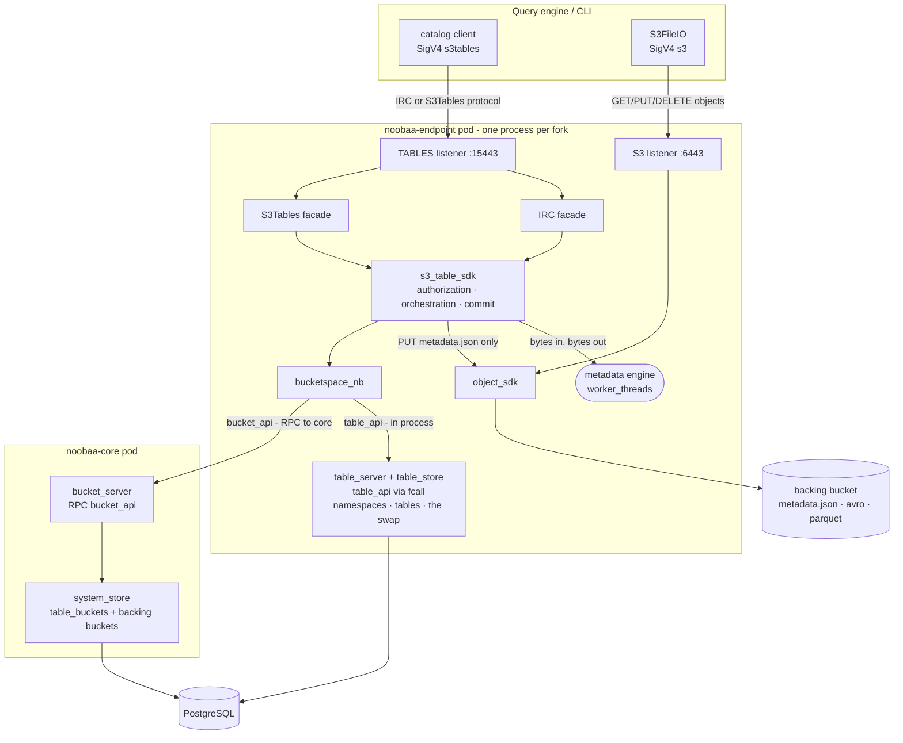
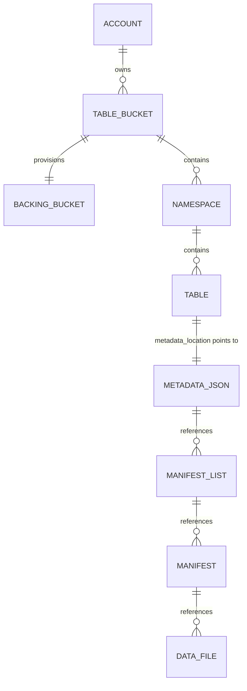
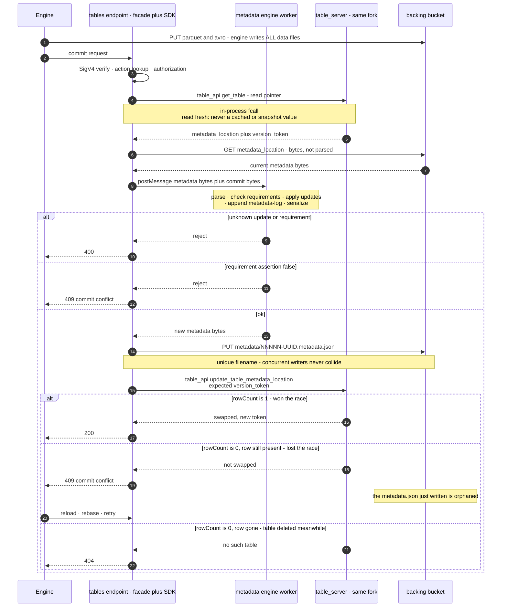

# S3 Tables in NooBaa - design brief

Status: condensed design specification for the S3 Tables Developer Preview
([RHSTOR-7673](https://redhat.atlassian.net/browse/RHSTOR-7673)). No code accompanies
this document.

This is the short form: **what is being built**, without the reasoning. Every
decision here was argued in
[s3-tables-design.md](s3-tables-design.md), and section references throughout point
at the argument. Readers who need background on Apache Iceberg, catalogs, or what AWS
S3 Tables is should read [§1](s3-tables-design.md#1-introduction-and-background) of the long document first - it is not repeated here.

---

## 1. Summary

NooBaa gains a **built-in Iceberg catalog**, so a user reaches a lakehouse with one
endpoint URL and their existing object-storage credentials, with no separate catalog
service to deploy, secure or back up.

The feature ships **two protocols over one shared logic layer**:

| | **IRC protocol** (Iceberg REST) | **S3Tables protocol** |
|---|---|---|
| Spoken by | Spark, PyIceberg, Trino, Flink, DuckDB | `aws s3tables` CLI, AWS console, AWS's S3 Tables catalog client library |
| Shape | `/v1/{prefix}/namespaces/{ns}/tables/{t}`, Iceberg JSON | AWS SDK operations, ARN-addressed, AWS JSON |
| Commit | *Declarative* - client sends requirements + updates, **server** builds the new `metadata.json` | *Imperative* - **client** wrote the new `metadata.json`, server only swaps the pointer |
| Auth | SigV4, signing name `s3tables` | SigV4, signing name `s3tables` |

A third protocol is always in play: the **ordinary S3 data path**. Whichever catalog
protocol an engine speaks, it reads and writes Parquet and Avro with normal S3 object
operations. **The engine writes every data and manifest file; the catalog writes only
`metadata.json` and owns the atomic pointer swap.**

*Long doc: [§1.1](s3-tables-design.md#11-what-apache-iceberg-is-and-what-a-catalog-does)–[§1.4](s3-tables-design.md#14-the-two-protocols).*

---

## 2. Scope

**In scope**

1. A new TLS endpoint service hosting **two REST facades** - IRC and S3Tables.
2. **`s3_table_sdk`** - the shared layer holding all catalog logic, authorization and
   orchestration.
3. **Persistence through `BucketSpace`**, so containerized and NSFS are two
   implementations of one interface.
4. **The metadata engine** - applying Iceberg updates to a metadata document, format
   versions 2 and 3.
5. **Atomic commit** - a compare-and-swap on the table pointer, serving both protocols.
6. **Table bucket lifecycle**, including provisioning the backing bucket.
7. **Security**: backing-bucket guards, encryption reporting, AWS-shaped
   `NotImplemented` for everything else.
8. **Operator wiring** and the test strategy.

**Deferred**: per-table authorization on object I/O, resource policies and
cross-account sharing; managed maintenance (compaction, snapshot expiry,
unreferenced-file removal); the remaining S3Tables operations (policies, tagging,
replication, metrics, storage class, record expiration); views, CTAS/`stage-create`
and multi-table transactions; credential vending and remote signing; customer-managed
KMS keys.

**Target**: containerized ODF. NSFS is not built in this phase but is not designed
out - it is a second `BucketSpace` implementation.

**Developer Preview** implies three things: the service is **off by default**; storage
formats and schemas are **not stability-committed**; the **correctness bar is
unchanged** - the commit path is atomic or it corrupts tables.

*Long doc: [§2](s3-tables-design.md#2-scope), [§2.1](s3-tables-design.md#21-what-developer-preview-status-means-here).*

---

## 3. Architecture

A new listener in the existing endpoint process. No new pod or container.



- One new TLS listener (15443) per endpoint fork, one serving-certificate secret mounted
  at `/etc/tables-secret`, one metadata-engine worker thread per fork (created lazily on
  first commit), and `table_api` registered alongside the object services. No new
  container or probe; one environment variable, `CONFIG_JS_S3_TABLES_ENABLED`, set by
  the operator.
- **Core is on the control-plane path only, never on the commit path** - on a
  production endpoint, where the operator sets `LOCAL_MD_SERVER=true` ([§4.4](#44-the-commit-mechanism)).
- With the feature flag off, none of it exists.

*Long doc: [§4](s3-tables-design.md#4-architecture).*

---

## 4. Decisions

### 4.1 Layering

```
IRC facade          S3Tables facade
      └────────┬────────┘
          s3_table_sdk          ← authorization, orchestration, commit protocol
        ┌───────┼────────┐
   metadata   object_sdk   BucketSpace
    engine    (warehouse   ├─ bucketspace_nb → RPC ┬→ table_server (endpoint-local)
   (worker)     I/O)       │                       │     → dedicated collections
                           │                       └→ bucket_server (core)
                           │                             → system_store
                           └─ bucketspace_fs → config_fs
```

- **`s3_table_sdk`** holds all catalog logic: authorization, orchestration and the
  commit protocol. It is constructed per request with the authenticated account and a
  `BucketSpace`.
- **Two thin facades**, IRC and S3Tables, share one listener. Each parses its own wire
  format, calls the SDK, and renders the SDK's errors in its own shape. A facade makes
  no storage or authorization calls.
- **The SDK throws semantic errors only**
  ([§7.3](s3-tables-design.md#73-how-each-facade-renders-those-errors)).
- **Persistence goes only through `BucketSpace`**, which gains table methods alongside
  the existing vector-bucket methods.
- **One interface, two destinations.** In `bucketspace_nb`, table-bucket methods go to
  `bucket_api` → `bucket_server` in core; namespace, table and swap methods go to
  `table_api` → `table_server` in the endpoint. The RPC router picks the destination by
  API id.
- **The metadata engine sits beside the SDK**: its transform is a pure function over
  a JSON document, run in a worker thread, independent of protocol and deployment.

*NSFS:* a `bucketspace_fs` implementation of the table methods; nothing else changes.

*Long doc: [§3.1](s3-tables-design.md#31-layering-one-logic-layer-two-protocol-facades-bucketspace-for-persistence).*

### 4.2 The backing bucket model

- Each table bucket's data lives in **one ordinary, S3-addressable NooBaa bucket** - the
  backing bucket - provisioned through the ordinary bucket flow by `CreateTableBucket`.
- **One backing bucket per table bucket**, not per table. Each table's files sit under a
  single opaque first path segment: the table id.
- The backing bucket is named **`<table-bucket>--table-s3-nb`**. The authoritative link
  is a `backing_bucket` id on the table-bucket record; the name is a convenience.
- It remains visible in `ListBuckets` in this phase.

Naming rules:

- Reject `--table-s3-nb` as a suffix on user-supplied bucket names.
- Reject `--table-s3` as a suffix on user-supplied table bucket names.
- Reject `CreateTableBucket` when the derived backing name already exists.
- Cap table bucket names at **50 characters** (63 minus the 13-character suffix),
  rejected at `CreateTableBucket`.

S3 operations on a backing bucket - the object plane is fully open; bucket
configuration belongs to the table bucket:

| S3 operation | On a backing bucket |
|---|---|
| Object operations, multipart, listing | **Allowed - required** |
| `DeleteBucket`, `DeleteBucketAndObjects` | **Refused** |
| `PutBucketLifecycle` | **Refused** |
| `PutBucketVersioning` | **Refused** |
| `PutObjectLockConfiguration` | **Refused** |
| `PutBucketReplication` | **Refused** |
| `PutBucketEncryption` | **Refused** |
| `PutBucketPolicy` | **Refused** |
| `PutBucketWebsite` | **Refused** |
| `CreateBucket` with a `--table-s3-nb` name | **Refused** |
| CORS, notification, tagging, public access block | Allowed |

Object access over S3 is authorized per backing bucket, not per table
([§9](#9-authorization)).

Expected scale:

| Entity | Stored as | Expect |
|---|---|---|
| Table bucket | `system_store` document | single digits to tens |
| Backing bucket | ordinary NooBaa bucket, one per table bucket | single digits to tens |
| Table | row in a dedicated collection | **design target: 10,000** across all table buckets |

*Long doc: [§3.2](s3-tables-design.md#32-the-backing-bucket-model).*

### 4.3 Where table metadata is stored

- **Always write a real Iceberg `metadata.json`** into the table's location. Table
  metadata is never kept only in the catalog's database.
- The table location is `s3://<table-bucket>--table-s3-nb/<table-id>/`. It contains
  **no namespace or table name**; rename is a pointer update and moves no bytes.
- The catalog writes only `*.metadata.json`, named `NNNNN-<uuid>.metadata.json`: a
  five-digit zero-padded version (the metadata-log length) plus a random UUID.
  Everything else is client-written.
- The pointer stores the **ETag** of the current `metadata.json` alongside its
  location. Catalog reads of the current metadata pass it as `If-Match`; a mismatch
  (the file was overwritten over S3) fails the request.
- Nothing may assume a key structure beneath the table id.

```
s3://<table-bucket>--table-s3-nb/       # one ordinary NooBaa bucket per table bucket
  <table-id>/                           # 24-hex id of the table record, opaque
    metadata/
      00000-<uuid>.metadata.json        # catalog-written - the ONLY thing we write
      00001-<uuid>.metadata.json
      snap-<n>-<m>-<uuid>.avro          # client-written manifest list
      <uuid>-m0.avro                    # client-written manifest
    data/
      00000-0-<uuid>.parquet            # client-written
```

User-facing rules:

- A table can be registered into another Iceberg catalog as a **read-only** consumer.
  **Never point a second catalog at these tables as a writer.**
- Foreign tables cannot be adopted in place; migrating in means copying the data (e.g.
  `CREATE TABLE AS SELECT`).

*Long doc: [§3.3](s3-tables-design.md#33-where-table-metadata-is-stored).*

### 4.4 The commit mechanism

- The pointer swap is **one conditional update on the table-pointer record**, filtered
  on the record id and the expected version token, succeeding only when
  **`rowCount === 1`**.
- The swap is keyed on an **opaque version token**, regenerated on every successful
  commit.
- It is issued **in the endpoint fork serving the request**, by a new `table_server`
  backed by a `table_store`. `table_api` is routed to the `md` domain
  (`table_api: 'md'`). Production endpoints run with `LOCAL_MD_SERVER=true`, so this
  is an in-process `fcall`; the mode without it is described in
  [§3.4](s3-tables-design.md#34-the-commit-mechanism).
- `table_server` is registered by the **one helper** that both
  `md_server.register_rpc()` and the core web server call, as
  `register_object_services()` is.
- **Table-bucket operations run in core**, in `bucket_server`.
- **Where the records live:** table buckets in a `system_store` collection; namespaces
  and table pointers in dedicated collections, outside the in-memory snapshot.

*NSFS:* the swap uses `safe_link` guarded by the pointer file's `(mtime, ino)`.

*Long doc: [§3.4](s3-tables-design.md#34-the-commit-mechanism).*

### 4.5 Addressing

- Every IRC URL carries a `{prefix}` segment; in AWS's dialect it is the
  percent-encoded table bucket ARN.
- **Permissive on input:** after percent-decoding, accept
  `arn:aws:s3tables:<region>:<account>:bucket/<name>` with region and account optional
  or empty, and accept a bare `<name>`. Region and account are ignored; **the table
  bucket name is the key**.
- **Canonical on output:** documentation, examples and responses use the well-formed
  shape `arn:aws:s3tables:us-east-1:000000000000:bucket/<name>`.
- Table bucket names are unique **per system**, as all NooBaa bucket names are.

| Purpose | Shape |
|---|---|
| IRC `{prefix}` and S3Tables ARN paths (client-facing) | `arn:aws:s3tables:<region>:<account>:bucket/<name>`, percent-encoded |
| Authorization resource (internal) | `arn:aws:s3tables:::<table-bucket>` and `arn:aws:s3tables:::<table-bucket>/table/<table-id>` |

The table resource names the **table id**, not its namespace and name.

*Long doc: [§3.5](s3-tables-design.md#35-addressing-table-bucket-arns-and-the-irc-prefix).*

### 4.6 Authentication and the action vocabulary

- **SigV4 only**, signing name `s3tables`, no OAuth. Both facades authenticate
  identically through `signature_utils.authenticate_request_by_service`.
- **The action vocabulary is AWS-identical.** Each IRC operation and its S3Tables
  counterpart authorize the same `s3tables:` action; the full mapping is in
  [§9](#9-authorization).
- **Canonical-path fix in `signature_utils`:** a service-specific canonical-path branch
  that does not collapse `%2F` and URI-encodes each path segment twice. The target
  encoding is pinned against real clients before the branch is written.

*Long doc: [§3.6](s3-tables-design.md#36-authentication-and-the-action-vocabulary).*

### 4.7 Service name and port

| Thing | Value |
|---|---|
| Service enum entry | `TABLES: 'TABLES'` |
| TLS port | `config.ENDPOINT_SSL_TABLES_PORT = 15443` |
| Certificate path | `config.TABLES_SERVICE_CERT_PATH = '/etc/tables-secret'` |
| Certificate map entry | `certs.TABLES` |
| Feature flag | `config.S3_TABLES_ENABLED = false` - the listener starts only when set |
| Operator toggle | NooBaa CR annotation `noobaa.io/enable_s3_tables_dev_preview: "true"` |
| Format-version cap | `config.S3_TABLES_MAX_FORMAT_VERSION = 3` |
| Commit memory budget | `config.S3_TABLES_MEM_FRACTION = 0.25` of each fork's memory share |
| Abandoned-namespace timeout | `config.S3_TABLES_PENDING_TIMEOUT` = 10 minutes |
| TLS-configurable list | add `'TABLES'` |
| Operator Service / Route / cert secret | `tables` / `tables` / `noobaa-tables-serving-cert` |

Both facades share the listener, split by path:

| Path | Facade |
|---|---|
| `/iceberg/v1/...` and `/v1/...` | IRC protocol |
| everything else (`/buckets`, `/namespaces/...`, `/tables/...`) | S3Tables protocol |

- The feature flag gates the listener itself: with it off there is no port, no
  `table_store` or `table_api` (so no `table_namespaces` or `table_pointers`
  collections), and no operator Service or Route. The `table_buckets` `system_store`
  collection is declared and stays empty, and the table-bucket RPCs refuse every call.
- **The toggle is the NooBaa CR annotation** `noobaa.io/enable_s3_tables_dev_preview: "true"`, not a CRD
  field. When it is set, the operator creates the Service, Route and certificate
  secret, adds the endpoint's port, volume and mount, and sets
  `CONFIG_JS_S3_TABLES_ENABLED=true` on **both** the core statefulset and the endpoint
  deployment.
- Toggling the annotation rolls core and the endpoints. Removing it disables the
  feature and deletes nothing: records, collections and backing buckets stay.
- **The backing-bucket guards and the `--table-s3-nb` suffix rejection are always on**,
  independent of the flag.
- Operator changes are cloned from the vector service; no new container, probe or CRD
  field (no `status.services` or `loadBalancerSourceSubnets` entry).

*Long doc: [§3.7](s3-tables-design.md#37-service-name-and-port), [§11](s3-tables-design.md#11-operator-and-deployment).*

---

## 5. Entities and records



| Data | Stored where |
|---|---|
| Table bucket: name, owner, backing bucket id, encryption, creation time | `table_buckets` - a **`system_store` collection** |
| Namespace: table bucket, name, properties | `table_namespaces` - a **dedicated collection**, served by `table_server` in the endpoint |
| Table pointer: table bucket, namespace, name, `metadata_location` and its ETag, `version_token`, `table_uuid` | `table_pointers` - a **dedicated collection**, served by `table_server` in the endpoint |
| Table metadata | `<location>/metadata/NNNNN-<uuid>.metadata.json` |
| Manifest lists, manifests | `<location>/metadata/*.avro` - **client-written** |
| Data files | `<location>/data/*.parquet` - **client-written** |

Names are unique among live records - table buckets per system, namespaces per table
bucket, tables per namespace - so concurrent creates and renames onto one name
resolve to a single winner.

*Long doc: [§5](s3-tables-design.md#5-entities-and-stored-records).*

---

## 6. `s3_table_sdk`

Constructed per request, carrying the authenticated account and a `BucketSpace`.
Twenty-one operations cover **all thirteen** IRC operations and every S3Tables
operation in this phase.

| SDK operation | Serves |
|---|---|
| `get_catalog_config` | IRC `getConfig` |
| `create_table_bucket` / `get_table_bucket` / `list_table_buckets` / `delete_table_bucket` | S3Tables table-bucket CRUD; `get_table_bucket` also resolves the IRC `{prefix}` |
| `get/put/delete_table_bucket_encryption`, `get_table_encryption` | S3Tables encryption operations |
| `create_namespace` / `get_namespace` / `list_namespaces` / `delete_namespace` | IRC + S3Tables namespace operations |
| `create_table` | IRC `createTable`; S3Tables `CreateTable` |
| `load_table` | IRC `loadTable` |
| `get_table_info` | IRC `tableExists`; S3Tables `GetTable`, `GetTableMetadataLocation` |
| `list_tables` / `delete_table` / `rename_table` | IRC + S3Tables |
| **`commit_table`** | IRC `updateTable` - the declarative path |
| **`set_table_metadata_location`** | S3Tables `UpdateTableMetadataLocation` - the imperative path |

Both commit paths end in the same pointer swap.

**`set_table_metadata_location` applies exactly the checks the IRC path applies:**

*On the location:* inside the table's location, by exact match
([§6.1](s3-tables-design.md#61-operation-catalogue)); ends in `.metadata.json`;
gzip-compressed metadata is **rejected with `400`**; exists. The fetch captures its
ETag, stored with the pointer on a successful swap.

*On the document:*
- `table-uuid` matches the record;
- `location` equals the server-assigned location;
- `write.data.path` and `write.metadata.path` stay inside the table's location;
- `format-version` is unchanged, or raised no higher than the configured cap;
- it descends from the current metadata: its last `metadata-log` entry equals the
  pointer's current `metadata_location`;
- for v3, `first-row-id` equals `next-row-id` and `next-row-id` advances.

**Tables created without metadata.** An S3Tables `CreateTable` without metadata - how
AWS's catalog client creates tables - leaves the table **uninitialized**: a pointer and
version token, no metadata. S3Tables `ListTables` lists it; over IRC it is invisible
until its first commit, an imperative commit that establishes the table's uuid and has
no predecessor ([§6.1](s3-tables-design.md#61-operation-catalogue)).

**No live child under a deleted parent**, even across a crash. Creating or moving a
table and deleting its namespace are each one PostgreSQL transaction under a lock on
the namespace row; a new namespace stays invisible (`pending`) until its table bucket
is confirmed, and a table-bucket delete counts pending namespaces too
([§6.1](s3-tables-design.md#61-operation-catalogue)).

**Where a client learns to write.** Both protocols answer this, and the two answers
**must be the same string** - the table's location, derived once:

| Protocol | Client asks | Server answers with |
|---|---|---|
| IRC | `loadTable` / `createTable` | the `location` field inside the returned metadata document |
| S3Tables | `GetTable` / `GetTableMetadataLocation` | the `warehouseLocation` response field |

### `BucketSpace` additions

| Method | Containerized (`bucketspace_nb`) | NSFS (`bucketspace_fs`) |
|---|---|---|
| table-bucket CRUD | `bucket_api` → **RPC to core** → `system_store` | `config_fs` records |
| namespace CRUD | `table_api` → **endpoint-local** → dedicated collection | `config_fs` records |
| table CRUD + rename | `table_api` → **endpoint-local** → dedicated collection | `config_fs` records |
| **`update_table_metadata_location`** | `table_api` → **endpoint-local** → conditional update | atomic link on the pointer file |

The swap returns exactly three outcomes, and every implementation must distinguish
them: **swapped** (new location and ETag stored, new token returned) → `200`; **not swapped** (row exists, token mismatched) → `409`;
**no such table** → `404`. A timeout *after the update was issued* is none of these -
it is `500`, never collapsed into "not swapped". How a zero-row result is resolved:
[§6.3](s3-tables-design.md#63-what-bucketspace-gains).

The swap is a **declared capability**. An implementation that cannot do a conditional
update must say so; the SDK refuses commits there.

Naming: `set_table_metadata_location` is the **SDK** operation;
`update_table_metadata_location` is the **`BucketSpace`** method both commit paths use.

### Four rules

1. **Never cache the table pointer** on the commit path. Table-bucket and namespace
   *record* lookups may be cached, but every mutation acts on the ids it resolved,
   which the authoritative store rejects once deleted; **authorization decisions are
   never cached**. No commit or table operation reads from core.
2. **Own the cross-store compensation, with no window where the guard is blind.**
   `create_table_bucket` writes the record first in a `provisioning` state, then
   creates the bucket, then marks it ready. While `provisioning`, the guard matches the
   bucket by its derived name; once created, by the stored id. Deletion runs in
   reverse: mark `deleting`, delete the bucket, remove the record. Compensation must be idempotent and must
   confirm backing-bucket identity before any destructive step.
3. **Reject write paths that leave the table's location, and never move the
   location** - validate `write.data.path` and `write.metadata.path` on `create_table`
   and on any `set-properties`; reject any change to the metadata `location`.
4. **Throw semantic errors only**; each facade renders them in its own shape. The
   complete set: [§7.3](s3-tables-design.md#73-how-each-facade-renders-those-errors).

*Long doc: [§6.1](s3-tables-design.md#61-operation-catalogue)–[§6.4](s3-tables-design.md#64-four-rules-for-the-sdk).*

---

## 7. The commit path



Steps: authenticate and authorize → **read the pointer uncached** → fetch the current
metadata, checked against its stored ETag → **transform in the worker** → write a new,
uniquely named `metadata.json` → **swap** on the version token → `200` on win, `409`
on loss, `404` if the table was deleted meanwhile.

The imperative path skips the fetch/transform/write steps, substitutes validation of
the caller's location, and joins at the swap.

Concurrency is optimistic: **the conditional update alone decides the winner**, across
forks, pods and protocols.

### Error semantics

| Stage | Failure | Status | Commit happened? |
|---|---|---|---|
| admission | per-fork transform limit and queue full | **`429`** | no - rejected before the body is read |
| body parse | malformed request | `400` | no |
| allow-list | unknown update action or requirement type | **`400`** | no - required by the REST spec |
| auth | bad signature, no permission | `403` | no |
| pointer read | no such table or namespace | `404` | no |
| metadata fetch | `If-Match` fails - `metadata.json` modified outside the catalog | **`409`** | **definitely not** |
| requirement check | assertion false | **`409`** | no - reload, rebase, retry |
| transform | worker died or OOM | **`409`** | **definitely not** |
| metadata write | object PUT failed | **`409`** | **definitely not** |
| swap | `rowCount === 0`, row still present | **`409`** | no; one file orphaned |
| swap | `rowCount === 0`, row absent or deleted | `404` | no; one file orphaned |
| swap | error or timeout, **result not observed** | **`500`** | **unknown** - the only such window |

**On a commit, only an unobserved swap returns `5xx` (`500`)**; every provable no-op
returns `409` or `429`, never `503`. Details:
[§7.2](s3-tables-design.md#72-error-semantics). How each facade renders the SDK's
errors: [§7.3](s3-tables-design.md#73-how-each-facade-renders-those-errors).

### Concurrency and crashes

| Scenario | Outcome |
|---|---|
| Two commits, same table, same fork | Serialized; the second conflicts before writing anything |
| Two commits, same table, different forks or pods | Both write distinct keys; exactly one swap wins; the loser's file is orphaned |
| **One commit over each protocol, same table** | Identical - both funnel into the same conditional update |
| Crash between metadata write and swap | Pointer unchanged; table loads at the old version; new file orphaned |
| Crash between swap and response | The commit **succeeded**; the client's retry fails its precondition, reloads, finds its own snapshot |
| Two `CreateTable` on the same name | One wins; the other gets `409` already-exists |

**Orphaned files are not reclaimed in this phase** - each lost race or crash leaves
one `metadata.json`, and `DeleteTable` does not purge data files.

*Long doc: [§7.1](s3-tables-design.md#71-the-steps)–[§7.4](s3-tables-design.md#74-concurrency-crashes-and-orphaned-files).*

---

## 8. The metadata engine

An **effect-free** transform - no I/O, no database or socket access - that checks
requirements and applies updates to the metadata document. It operates on the parsed
JSON document itself, so fields it does not know survive a commit, and it matches the
Apache Iceberg reference implementation's behaviour, constants included. Modules and
constants: [§8.1](s3-tables-design.md#81-structure).

### Lossless integers

- **Every** integer literal outside JavaScript's safe range is kept as raw text,
  whatever the field, and written back unchanged; ids are compared as those exact
  strings.
- Fields the engine computes on, and values computed from them, must be safe
  integers; otherwise `400`.

Details: [§8.1](s3-tables-design.md#81-structure).

### Metadata growth

- **Honour `write.metadata.previous-versions-max` (default 100)** - trim `metadata-log`
  to that many entries on every IRC commit.
- **Nothing expires snapshots automatically.** `snapshots[]` grows on every commit and
  reaches AWS's 50 MB metadata limit at roughly 172,000 snapshots - about twenty months
  at a five-minute cadence, about **four months at one minute**. Expiry is a standard
  engine operation and the engine already implements `remove-snapshots`; scheduling it
  is the user's job and must be documented.

### Format version 3

Created at v2 by default, v3 accepted. Deletion vectors, variant/geometry/`unknown`
types are all invisible to the catalog. **Row lineage is the entire server-side cost:**
the server maintains `next-row-id`, rejects a stale `first-row-id` as a conflict, and
asserts `next-row-id` never decreases
([§8.2](s3-tables-design.md#82-format-version-3)). `add-encryption-key` is deferred
(allow-list returns `400`). `config.S3_TABLES_MAX_FORMAT_VERSION` gates `create_table`,
`upgrade-format-version`, and a version increase through `set_table_metadata_location`
only, so dialing it to 2 does not break existing v3 tables.

### The worker boundary

The **transform, and the imperative path's document validation**, run in the worker;
nothing else does. What crosses, both ways, is **bytes** - transferred buffers, never
parsed on the main thread.

- **Bound the backlog, not just the document.** A per-fork limit on concurrent
  transforms and a bounded queue, applied **before the request body is buffered**,
  rejecting excess as `Throttled` (`429`).
- **Lifecycle:** one long-lived worker per fork, created lazily. On error or exit,
  every pending request fails as `TransientFailure`.
- **Memory:** each fork gets a share of the pod's memory, and a configured fraction of
  that share (`config.S3_TABLES_MEM_FRACTION`) bounds its worker heap and in-flight
  commit buffers. Exhausting the worker heap kills only the worker.

*Long doc: [§8.1](s3-tables-design.md#81-structure)–[§8.3](s3-tables-design.md#83-the-worker-boundary).*

---

## 9. Authorization

Authorization happens **once, in the SDK**, never in a facade: identity policies
through `authorize_request_iam_policy_impl(req, action, table_bucket_name, 's3tables')`,
plus a **table-bucket ownership check**. The system owner and the table bucket's owner
are allowed; the owner's IAM users and assumed-role sessions only where their
identity policies allow the action;
everyone else is denied
([§9](s3-tables-design.md#9-authentication-and-authorization)).

| SDK operation | `s3tables:` action(s) |
|---|---|
| `get_catalog_config` | `GetTableBucket` |
| table-bucket CRUD | `CreateTableBucket` / `GetTableBucket` / `ListTableBuckets` / `DeleteTableBucket` |
| namespace CRUD | `CreateNamespace` / `GetNamespace` / `ListNamespaces` / `DeleteNamespace` |
| `create_table` | `CreateTable`, `PutTableData` |
| `load_table` | `GetTableMetadataLocation`, `GetTableData` |
| `get_table_info` | `GetTable`, `GetTableMetadataLocation` |
| `list_tables` / `delete_table` / `rename_table` | `ListTables` / `DeleteTable` / `RenameTable` |
| `commit_table` | `UpdateTableMetadataLocation`, `PutTableData`, `GetTableData` |
| `set_table_metadata_location` | `UpdateTableMetadataLocation` |
| encryption operations | the matching operation name |

**Two authorization points in this phase.** The catalog authorizes per table, against
`s3tables:` actions. The S3 data path authorizes per backing bucket, with ordinary S3
rules; there is no per-table check on object I/O. Access to table bytes over S3 is
limited to the system owner, the table-bucket owner and IAM users under it: there are
no resource policies, no bucket policy on the backing bucket, and no anonymous access.

**Rule:** no new grant path - table or table-bucket policies, a bucket policy on the
backing bucket, catalog-issued credentials, public exposure - ships before per-table
enforcement on the S3 path exists. Presigned S3 URLs remain supported; they carry only
the signer's own access.

**Deferred per-table enforcement:** at policy-write time, compile each `s3tables:`
policy into a bucket policy on the backing bucket, scoped to
`arn:aws:s3:::<backing>/<table-id>/*` (`GetTableData` → `s3:GetObject`; `PutTableData`
→ `s3:PutObject`, `s3:DeleteObject`, `s3:AbortMultipartUpload`; never
`s3:ListBucket`). `authorize_request_policy` is not modified.

AWS dialect behaviours to adopt: `stage-create` → `400`; drop without purge → `400`;
multi-level namespaces → `400`; view endpoints → `501`; `metadata.json` over 50 MB →
`400`.

*Long doc: [§9](s3-tables-design.md#9-authentication-and-authorization), [§9.1](s3-tables-design.md#91-why-it-is-safe-to-ship-without-per-table-authorization-on-object-io), [§9.2](s3-tables-design.md#92-how-per-table-authorization-should-be-built-deferred).*

---

## 10. Security posture

- **Backing-bucket guards.** One shared check - "is this bucket backing a table
  bucket?", answered from the table-bucket records: the stored `backing_bucket` id, or
  the derived name for a record still `provisioning` -
  called from `put_bucket_policy`, `put_bucket_website`, `put_bucket_lifecycle`, `set_bucket_versioning`,
  `put_object_lock_configuration`, `put_bucket_replication`, `put_bucket_encryption`,
  `delete_bucket` and `delete_bucket_and_objects`. The internal path used by
  `delete_table_bucket` bypasses it. The guards are always on, whether or not the
  feature is enabled.
- **Encryption.** Report `AES256` unconditionally and mean it - the internal data path
  encrypts chunks with AES-256-GCM under a per-bucket master key, inherited free from
  the ordinary bucket flow. `aws:kms` and SSE-C are **rejected explicitly**, not
  recorded and ignored.
- **`NotImplemented` responses**, AWS-shaped, for every unimplemented S3Tables family.
- **Document scheduled snapshot expiry** as an operational requirement.
- **Scope the claim** in release notes: "S3 Tables API: table bucket, namespace and
  table management; table data access via the Iceberg REST endpoint" - not an
  unqualified "S3 Tables support".

*Long doc: [§10](s3-tables-design.md#10-security-posture).*

---

## 11. Test strategy

Budget goes to concurrency, crash safety and metadata conformance, not breadth: the
conditional update across forks and protocols, crash safety, error semantics as real
clients see them, protocol parity of validation, differential conformance against the
Apache Iceberg REST reference, and a client matrix over both protocols. The full list:
[§12](s3-tables-design.md#12-test-strategy).

---

## 12. Work breakdown

Stories, dependencies and the release gate:
[s3-tables-implementation-plan.md](s3-tables-implementation-plan.md). Estimates:
[§13](s3-tables-design.md#13-work-breakdown).

---

## 13. Risks and open questions

Risks and their mitigations: [§14](s3-tables-design.md#14-risks). Open questions:
[§15](s3-tables-design.md#15-open-questions).
