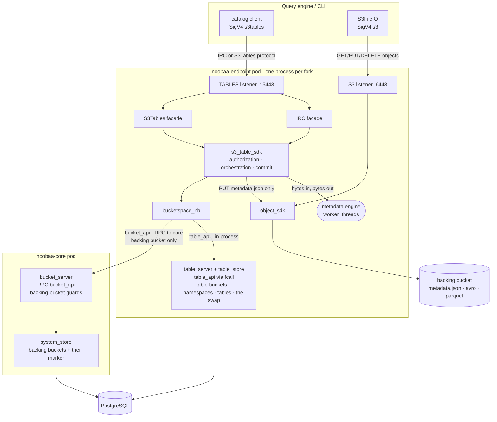
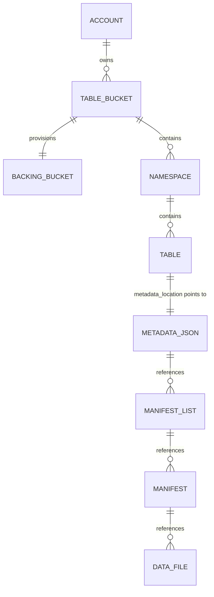
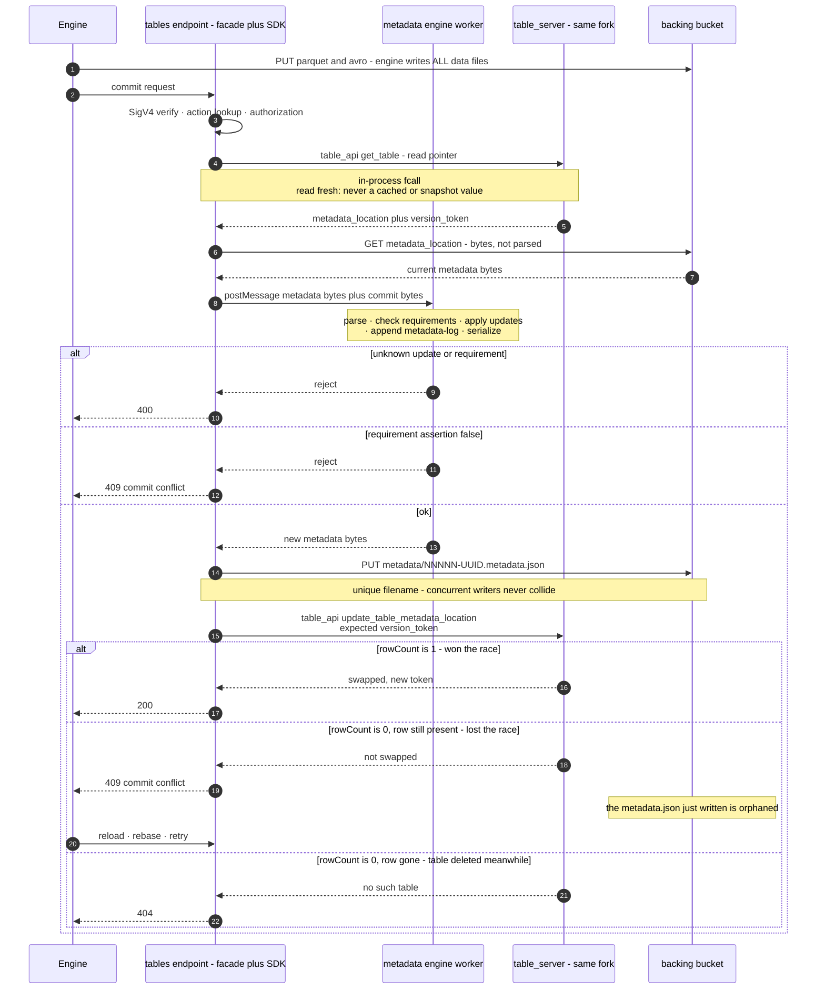

# S3 Tables in NooBaa - high-level design

Status: high-level design for the S3 Tables Developer Preview
([RHSTOR-7673](https://redhat.atlassian.net/browse/RHSTOR-7673)). No code
accompanies this document.

A condensed version of the specification - the decisions without the reasoning - is
in [s3-tables-design-brief.md](s3-tables-design-brief.md).

Audience: NooBaa maintainers who will implement this, plus reviewers checking the
security and concurrency stories. The document is self-contained - background from
the exploration phase is explained inline rather than referenced. Claims about
NooBaa carry a `path:line` reference; claims about Iceberg or AWS link to a primary
source; engineering judgment is marked `(assessment)`.

## 1. Introduction and background

This section exists so a reviewer who has never used Iceberg can read the rest of
the document. Maintainers already fluent in Iceberg can skip to §2.

### 1.1 What Apache Iceberg is, and what a catalog does

Iceberg is a **table format**: a convention for describing a SQL table whose bytes
live in object storage. A table is not a directory that engines list - it is a tree
of metadata files naming exactly which data files belong to the table at a given
point in time ([Iceberg table spec](https://iceberg.apache.org/spec/)):

```
catalog pointer  ─►  vN.metadata.json     schemas, partition specs, sort orders,
                          │               snapshots, refs, snapshot-log, properties
                          ├─► manifest list (.avro)      one per snapshot
                          │        └─► manifest (.avro)  a batch of data files + stats
                          │                 └─► data file (.parquet)
                          └─► older snapshots (time travel)
```

Three properties follow from that shape, and they drive every decision below:

- **Everything is immutable and additive.** A write never edits a file. It writes
  new Parquet, new manifests, and a new `metadata.json` describing a new *snapshot*.
  Readers keep using the old snapshot until the pointer moves.
- **Query planning reads metadata, not listings.** Engines prune partitions and
  files using statistics stored in manifests, which is why Iceberg scales where
  `LIST`-based table layouts do not.
- **Exactly one thing must be atomic: moving the pointer** from `vN.metadata.json`
  to `vN+1.metadata.json`. The spec deliberately does not standardize how - "the
  atomic operation used to commit metadata depends on how tables are tracked and is
  not standardized by this spec."

A **catalog** is the component that owns that pointer. It answers "what is the
current metadata file for table `db.orders`?" and performs the atomic swap. That is
nearly its whole job. In particular:

**The engine writes every data and manifest file; the catalog writes only
`metadata.json` and owns the swap.** This is the single most important fact in this
document, and it was established empirically during exploration rather than assumed:
after driving a prototype catalog through a complete PyIceberg lifecycle (create
namespace → create table → append → scan → append → add column → set properties →
tag → drop), the table's prefix held 2 `.parquet` and 4 `.avro` files written by the
client, and 8 `.metadata.json` files written by the server. The server's storage
layer only ever wrote `*.metadata.json`.

That small job is also the thing standing between an ODF user and a lakehouse today.
To use Iceberg on NooBaa they must deploy, secure, back up and upgrade a **separate
stateful service** - [Lakekeeper](https://github.com/lakekeeper/lakekeeper) (Rust +PostgreSQL), [Apache Polaris](https://github.com/apache/polaris) (Java 21),
[Nessie](https://projectnessie.org/guides/iceberg-rest/) (Java), or Hive Metastore - and wire their engines to two systems with two credential domains. 

### 1.2 What S3 Tables is, and what it solves

AWS S3 Tables is the productization of "put the catalog inside the storage service."
It is three layers stacked on the split above:

1. **A control-plane API** - the `s3tables` service: table buckets, namespaces,
   tables, policies, encryption, maintenance, replication.
   [49 operations](https://docs.aws.amazon.com/AmazonS3/latest/API/API_Operations_Amazon_S3_Tables.html).
2. **An Iceberg REST Catalog endpoint** at
   `https://s3tables.<region>.amazonaws.com/iceberg`, SigV4-signed with signing name
   `s3tables`, implementing a deliberately small
   [13-operation profile](https://docs.aws.amazon.com/AmazonS3/latest/userguide/s3-tables-integrating-open-source.html)
   of the open Iceberg REST spec.
3. **Managed maintenance** - compaction, snapshot expiry and unreferenced-file
   removal run by the service, with a few user-visible knobs.

What that buys a user: **no separate catalog service, no second credential domain,
no second thing to back up.** One endpoint URL plus the
object-storage credentials they already have. Storage-native encryption and
maintenance follow for free because the catalog and the bytes are the same product.

### 1.3 Glossary

**Iceberg terms**, from the
[table spec](https://iceberg.apache.org/spec/) and the
[REST spec](https://github.com/apache/iceberg/blob/main/open-api/rest-catalog-open-api.yaml):

| Term | Meaning |
|---|---|
| **table format** | The convention describing a table as metadata files plus data files in object storage. Iceberg, Delta Lake and Hudi are the three in common use |
| **catalog** | The service mapping a table name to its current metadata file and performing the atomic pointer swap. The only stateful part |
| **table metadata** / `metadata.json` | One JSON document holding the table's entire logical state: schemas, partition specs, sort orders, snapshot list, refs, logs, properties. Rewritten in full on every commit |
| **snapshot** | The complete set of data files constituting the table at one instant. Identified by a `snapshot-id`; never modified once written |
| **manifest list** | One Avro file per snapshot, listing that snapshot's manifests with partition ranges for pruning |
| **manifest** | An Avro file listing data files with per-column statistics used for file pruning |
| **data file** | A Parquet file holding rows. Written by the engine, never by the catalog |
| **schema** / **partition spec** / **sort order** | Versioned, id-numbered descriptions of columns, how rows map to partitions, and write ordering. A table keeps every historical version |
| **ref** (**branch** / **tag**) | A named pointer to a snapshot. `main` is the branch whose head is the table's current state; tags are fixed labels for time travel |
| **snapshot-log** / **metadata-log** | Append-only histories of `main`'s movements and of previous `metadata.json` files |
| **format version** | The table-spec version. v2 adds row-level deletes; v3 adds deletion vectors, row lineage and the variant type. This design creates v2 by default and accepts v3 (§8.2) |
| **commit** | One update to a table: a set of **requirements** (preconditions the server asserts, e.g. "`main` still points at snapshot S") plus a set of **updates** (changes to apply, e.g. `add-snapshot`, `set-snapshot-ref`) |
| **optimistic concurrency** | The concurrency model: no locks. Losing a race returns `409` and the client rebases and retries |

**S3 Tables terms**, with the
[naming rules](https://docs.aws.amazon.com/AmazonS3/latest/userguide/s3-tables-buckets-naming.html)
this design must validate against:

| Term | Meaning |
|---|---|
| **table bucket** | The top-level container, holding namespaces and tables. ARN `arn:aws:s3tables:<region>:<account>:bucket/<name>`. 3–63 characters, lowercase letters, digits and hyphens, and **must not end in the reserved suffix `--table-s3`**. Unlike ordinary S3 buckets, table bucket names are not globally unique - only unique per account per region |
| **namespace** | A single-level grouping of tables inside a table bucket - the `db` in `db.orders`. 1–255 characters, lowercase letters, digits and underscores, no hyphens or periods, must not start with `aws`. AWS supports one level only, though the Iceberg REST spec allows nesting |
| **table** | One Iceberg table inside a namespace. Same naming rules as namespaces. Has its own ARN |
| **warehouse location** | The `s3://` prefix under which one table's files live. AWS generates it as an opaque, system-chosen bucket, e.g. `s3://63a8e430-…--table-s3` - no namespace or table name appears in it |
| **version token** | The opaque token guarding the commit. An update to the metadata pointer succeeds only if the caller's token matches the stored one |

**NooBaa terms introduced by this design:**

| Term | Meaning |
|---|---|
| **backing bucket** | The ordinary NooBaa bucket holding one table bucket's data, named `<table-bucket>--table-s3-nb` (§3.2) |
| **table pointer** | The stored record holding a table's `metadata_location` and `version_token`. The target of the atomic swap (§7) |
| **`s3_table_sdk`** | The shared logic layer both protocol servers call (§6) |

### 1.4 The two protocols

S3 Tables is reachable over **two different wire protocols covering the same
entities**. Both create namespaces and tables and both can commit; they differ in
who speaks them, what the JSON looks like, and - for the commit - in who computes
the new metadata. This design implements **both**.

| | **IRC protocol** (Iceberg REST) | **S3Tables protocol** |
|---|---|---|
| Standard | [Open, OpenAPI-specified](https://github.com/apache/iceberg/blob/main/open-api/rest-catalog-open-api.yaml) | [AWS-proprietary](https://docs.aws.amazon.com/AmazonS3/latest/API/API_Operations_Amazon_S3_Tables.html) |
| Spoken by | Query engines directly: Spark, PyIceberg, Trino, Flink, DuckDB | The `aws s3tables` CLI, the AWS console, and AWS's [S3 Tables catalog client library](https://github.com/awslabs/s3-tables-catalog) for Spark and Flink |
| Shape | Path-routed REST, `/v1/{prefix}/namespaces/{ns}/tables/{t}`, Iceberg-shaped JSON | AWS SDK operations, ARN-addressed, AWS-shaped JSON |
| Operation count | 13 in AWS's profile | 49 in full; 10 are needed by the catalog client library |
| Auth | SigV4, signing name `s3tables`, no OAuth | SigV4, signing name `s3tables` |

The same intent in both dialects:

| Intent | IRC protocol | S3Tables protocol |
|---|---|---|
| create a namespace | `POST /v1/{prefix}/namespaces` | `CreateNamespace` |
| create a table | `POST …/namespaces/{ns}/tables` | `CreateTable` |
| read a table | `loadTable` | `GetTable` + `GetTableMetadataLocation` |
| **commit** | `updateTable` | `UpdateTableMetadataLocation` |
| rename | `POST /v1/{prefix}/tables/rename` | `RenameTable` |
| attach a policy | *(not in IRC)* | `PutTablePolicy` |

**The commit is where they genuinely differ**, and it shapes the whole design. The
IRC protocol's `updateTable` is *declarative*: the client sends requirements and
updates, and **the server** validates them, builds the new `metadata.json`, writes
it, and swaps the pointer. The S3Tables protocol's `UpdateTableMetadataLocation` is
*imperative*: the **client** has already written the new `metadata.json` and merely
asks the server to swap the pointer if the version token still matches.

So the IRC protocol obliges us to own a metadata engine; the S3Tables protocol does
not. Both, however, end at the same atomic swap - which is why one shared layer can
serve both (§6).

Note that a third protocol is always in play: the **S3 data path**. Whichever
catalog protocol an engine uses, it reads and writes Parquet and Avro with ordinary
S3 object operations - AWS states that
"[S3 Tables supports Amazon S3 API operations such as `GetObject` and `PutObject`](https://docs.aws.amazon.com/AmazonS3/latest/API/developing-s3-tables-APIs.html)"
for table-level reads and writes. Three protocols, one set of bytes.

### 1.5 How a table bucket differs from a regular S3 bucket

**At AWS**, a table bucket is a distinct bucket *type*, not an ordinary bucket with
a convention on top:

| | Regular (general purpose) bucket | Table bucket |
|---|---|---|
| Contains | Objects, addressed by key | Namespaces → tables, addressed by name; objects are an implementation detail |
| Name scope | Globally unique across all AWS accounts in a partition | Unique per account per region only |
| Naming | General purpose rules | 3–63 chars, no underscores or periods, `--table-s3` is a reserved suffix |
| ARN namespace | `arn:aws:s3:::<name>` | `arn:aws:s3tables:<region>:<account>:bucket/<name>` |
| Public access | Possible, if Block Public Access is turned off (all four settings on by default) | **Impossible.** "[All table buckets and tables are private and can't be made public](https://docs.aws.amazon.com/AmazonS3/latest/userguide/s3-tables-buckets.html)" |
| Policies | Bucket policy + object ACLs, `s3:` actions | Table-bucket and per-table resource policies, `s3tables:` actions |
| Where the bytes live | In the bucket, at the key you chose | In a per-table system-generated location, e.g. `s3://<opaque-id>--table-s3` |
| Object-level API | The full S3 object API | A supported subset, authorized as `s3tables:GetTableData` / `PutTableData` rather than `s3:GetObject` / `s3:PutObject` |
| Maintenance | User-configured lifecycle rules | Service-run compaction and snapshot management |
| Encryption | Optional, configurable | Default SSE-S3, optionally SSE-KMS, chosen at bucket creation |

**In NooBaa**, the answer is narrower, and worth stating plainly so nobody assumes
more isolation than exists. Per §3.2 the backing bucket **is** an ordinary NooBaa
bucket, created through the ordinary bucket flow - deliberately, because that is how
it inherits the encrypted chunk layer, conditional writes, batched deletes and
multipart. What it does **not** inherit is bucket-level configuration: those settings
belong to the table bucket, and the S3 operations that change them are refused
(§3.2). The remaining rows below are provenance or deferrals, not restrictions:

| | Ordinary NooBaa bucket | Backing bucket |
|---|---|---|
| Created by | `CreateBucket` / OBC | `CreateTableBucket`, which provisions it |
| Naming | User-chosen | Derived: `<table-bucket>--table-s3-nb` |
| Data path, storage, encryption | Standard internal path | **Identical** - same tiering, same AES-256-GCM chunk layer |
| S3 object API | Full | **Full** - required; engines write all data files themselves |
| S3 bucket-configuration API | Full | **Restricted** (§3.2, §10) - policy, lifecycle, versioning, object lock, replication, encryption and bucket deletion are refused |
| Visible in `ListBuckets` | Yes | Yes for now. Hiding it belongs with console integration, and is only meaningful once the destructive operations are actually refused |
| Per-table authorization on object I/O | n/a | **Not in this phase** - deferred (§9) |

## 2. Scope

**This phase ships both protocols over one shared logic layer**, so that a Developer Preview user can reach a working lakehouse either by pointing an
AWS-documented Spark, PyIceberg, Trino or DuckDB configuration at a NooBaa URL, or by
using the `aws s3tables` CLI and AWS's Spark catalog client library.

In scope:

1. A new TLS endpoint service hosting **two REST facades** - the IRC protocol in
   AWS's dialect, and the S3Tables protocol.
2. **`s3_table_sdk`** - the shared layer holding all catalog logic, authorization
   and orchestration (§6).
3. **Persistence through `BucketSpace`**, so the containerized and NSFS paths are
   two implementations of one interface rather than two codebases (§3.1).
4. **The metadata engine** - applying Iceberg updates to a table metadata document
   and writing the new `metadata.json`, for format versions 2 and 3 (§8).
5. **Atomic commit** - a compare-and-swap on the table pointer, serving both
   protocols' commit paths (§7).
6. **Table bucket lifecycle**, including provisioning the backing bucket.
7. **Security items**: a backing-bucket policy guard, encryption reporting, and
   AWS-shaped `NotImplemented` responses for everything else (§10).
8. **Operator wiring** and a test strategy (§11, §12).

Explicitly deferred, in rough order of likely demand:

| Deferred | Why it can wait |
|---|---|
| **Per-table authorization on object I/O**, resource policies on table buckets and tables, cross-account sharing | No grant path to a third party exists in this phase, so nothing is exposed that enforcement would close (§9.1). The intended mechanism is recorded in §9.2 - the layout chosen here is what keeps it cheap |
| **Managed maintenance** - snapshot expiry, unreferenced-file removal, compaction | Engines ship their own `rewrite_data_files` and expiry; this is a convenience, and expiry needs Avro manifest *reading*, which nothing here does |
| **Remaining S3Tables operations** - policies, tagging, replication, metrics configuration, storage class, record expiration | Answered with AWS-shaped `NotImplemented`; no client needs them to run a workload |
| **Views, CTAS / `stage-create`, multi-table transactions** | AWS's own IRC endpoint excludes all three, so client configurations already work without them |
| **Credential vending and remote signing** | Callers use their own SigV4 credentials, exactly as against AWS's endpoint |
| **Customer-managed KMS keys** | `aws:kms` is explicitly rejected rather than recorded and ignored (§10) |

Containerized ODF is the primary target. NSFS is not being built in this phase, but
must not be designed out - every decision below carries a note on what extending to
it takes, and §3.1 makes that a matter of a second `BucketSpace` implementation
rather than a parallel codebase.

### 2.1 What Developer Preview status means here

This ships as a Red Hat **Developer Preview**, which is a weaker commitment than
Technology Preview:
[Developer Preview features](https://access.redhat.com/articles/6966848) are "not
supported by Red Hat's product support and customers will not be able to submit
support cases," carry "very limited, if any, documentation," and "may not be
fully/completely tested." Both preview levels are opt-in and "default to being
disabled."

Three consequences shape this design:

1. **The service must be off by default and explicitly enabled** (§3.7). This is a
   product requirement, not a convenience.
2. **We are not committing to storage-format or schema stability.** Record layouts,
   collection names and the on-disk table layout may change before general
   availability without a migration path. That materially lowers the cost of being
   wrong about §3.3 and §5.
3. **It does not lower the correctness bar.** The commit path either is atomic or it
   silently corrupts a user's table - a defect no preview label excuses. The
   completeness bar drops (fewer operations, thinner docs, narrower client matrix);
   the data-integrity bar does not, which is why §12 spends its budget on
   concurrency, crash safety and metadata conformance rather than coverage breadth.

Note that decisions which look like they exist for backward compatibility mostly do
not. The reason to match AWS's dialect exactly (§3.5, §3.6, §9) is **compatibility
with AWS's documented client configurations**, which is unaffected by our own
preview status. Those decisions stand at full strength; the internal ones relax.

## 3. Design decisions

Seven decisions are hard to reverse once clients depend on them. Each is stated with
its rationale and what extending to NSFS would take.

### 3.1 Layering: one logic layer, two protocol facades, `BucketSpace` for persistence

**Decision.** All catalog logic lives in a new **`s3_table_sdk`**. The two REST
facades are thin: they parse their own wire format, call the SDK, and map the SDK's
semantic errors onto their own error shape. Persistence goes through the existing
**`BucketSpace`** interface, gaining table methods alongside the vector-bucket
methods already there (`src/sdk/nb.d.ts:915-975`).

```
IRC facade          S3Tables facade
      └────────┬────────┘
          s3_table_sdk          ← authorization, orchestration, commit protocol
        ┌───────┼────────┐
   metadata   object_sdk   BucketSpace
    engine    (warehouse   ├─ bucketspace_nb → RPC ┬→ table_server (endpoint-local)
   (worker)     I/O)       │                       │     → table_store collections:
                           │                       │       table buckets · namespaces · tables
                           │                       └→ bucket_server (core)
                           │                             → system_store: the backing bucket only
                           └─ bucketspace_fs → config_fs
```

Three reasons this shape rather than two independent servers:

1. **The two protocols share one action vocabulary.** AWS maps both an IRC operation
   and its S3Tables counterpart onto the *same* `s3tables:` IAM action - `loadTable`
   and `GetTableMetadataLocation` both authorize `s3tables:GetTableMetadataLocation`.
   The authorization decision is therefore protocol-independent and belongs below the
   facades, not duplicated in each. This is a deliberate divergence from the vector
   service, which authorizes in its REST layer
   (`src/endpoint/vector/vector_rest.js:213-231`) - it has only one facade, so
   drift is not possible there.
2. **The two commit paths must not diverge.** Both funnel into one compare-and-swap
   (§7), so a client using one protocol and a client using the other serialize
   correctly against the same table *structurally*, not because two implementations
   happen to agree.
3. **`BucketSpace` is where NooBaa already varies persistence by deployment.**
   `bucketspace_nb` is pure RPC - it references neither `system_store` nor
   `db_client`, and the router decides where each call lands - while `bucketspace_fs`
   calls `config_fs` directly
   (`src/sdk/bucketspace_fs.js:1254-1271`). Adding table methods there means the NSFS
   variant is a second implementation of an existing interface rather than a new
   abstraction invented for this feature.

**One seam, two destinations.** `BucketSpace` stays a single interface, but the
containerized implementation does not send every method to the same process. The whole
catalog hierarchy - table buckets, namespaces, tables and the pointer swap - lives in
dedicated collections served by a new `table_server` that runs *inside the endpoint*
(§3.4). Core is reached for one thing only: provisioning and deleting the *backing
bucket*, which is an ordinary NooBaa bucket and therefore a `system_store` document
belonging to `bucket_server`. The RPC router already expresses this per API rather than
per call (`src/api/api.js:102-120`), so `bucketspace_nb` writes
`rpc_client.table.get_table_bucket(...)` and
`rpc_client.bucket.create_bucket(...)` without knowing where either lands. One
seam, one interface, two destinations - not two seams.

What stays **out** of the SDK: wire-format error mapping. The SDK throws semantic
errors (`TableNotFound`, `CommitConflict`, `RequirementFailed`, … - the full set is in
§7.3); each facade renders
them in its own shape - `IcebergErrorResponse` for the IRC protocol, AWS exception
shapes for the S3Tables protocol. An SDK that threw an Iceberg-shaped error would
leak one protocol into the other.

What sits **beside** the SDK rather than under it: the metadata engine. It is a pure
function over a JSON document, independent of deployment and of protocol (§8).

*NSFS later:* this decision is what makes NSFS tractable - a `bucketspace_fs`
implementation of the table methods, and nothing else.

### 3.2 The backing bucket model

**Decision. A table bucket's data lives in one ordinary, S3-addressable NooBaa
bucket, named `<table-bucket>--table-s3-nb`, whose bucket-policy attachment is refused.
Each table's files sit under a single opaque first path segment - the table's id.**

**Why `--table-s3-nb` and deliberately not AWS's `--table-s3`.** AWS reserves a set of
bucket-name suffixes, and every one of them marks a name whose requests an AWS SDK
resolves to a *different endpoint or signing scheme* - `-s3alias` for access point
aliases, `--ol-s3` for Object Lambda, `.mrap` for Multi-Region Access Points, `--x-s3`
for directory buckets, and `--table-s3` for S3 Tables. Critically, `--table-s3` is
reserved in the
[general purpose bucket naming rules](https://docs.aws.amazon.com/AmazonS3/latest/userguide/bucketnamingrules.html),
not merely in the table bucket namespace.

Iceberg's file I/O runs on the AWS SDK. Naming our backing bucket with a suffix AWS
has reserved for special endpoint resolution risks the SDK routing or signing those
requests as something other than a plain request against our S3 endpoint - silently,
and for exactly the clients that matter most. Whether any SDK special-cases
`--table-s3` today is unverified; the point is that we gain nothing by depending on it
not doing so. `--table-s3-nb` is DNS-legal and absent from AWS's reserved list. Every
reserved name above is a *suffix* - the SDKs' endpoint rules match on how a bucket name
ends - so a name that merely contains `--table-s3` without ending in it is an ordinary
bucket as far as the SDK is concerned (assessment; §12 test 9 is what proves it). **Do
not shorten it to `--table-s3` for the sake of AWS parity.**

**Why a deliberately uncommon suffix.** The suffix has to be one no existing
installation is plausibly using already, because a collision costs something even
though it cannot corrupt anything. The guards key on a marker stored on the bucket
record itself (§10), not on the name, so a pre-existing user bucket that happens to end
in the suffix is never treated as a backing bucket. But `CreateTableBucket` fails for any
table bucket whose derived name is taken, and the first validation rule below starts
refusing a naming convention that users may already rely on. A generic suffix such as
`--tables` is the kind of name a person chooses - `analytics--tables` - while
`--table-s3-nb` is not, and it keeps a visible resemblance to AWS's own suffix for
operators browsing the bucket list.

Three validation rules follow:

- reject `--table-s3-nb` as a suffix on user-supplied bucket names, so nothing a user
  creates can collide with a generated backing bucket;
- reject `--table-s3` as a suffix on user-supplied *table bucket* names - this one is
  real AWS parity, and costs nothing;
- reject `CreateTableBucket` when the derived backing name already exists as an
  ordinary bucket - `validate_bucket_creation` already raises `BUCKET_ALREADY_EXISTS`
  (`src/server/system_services/bucket_server.js:1627-1636`).

The authoritative link is a `backing_bucket` id stored on the table-bucket record;
the name is a convenience for operators and for the policy guard. `--` is legal under
NooBaa's bucket-name rule (`src/server/system_services/bucket_server.js:43-44`), and
the thirteen-character suffix caps table bucket names at 50, against AWS's 63
(`src/server/system_services/bucket_server.js:1621-1626`). Names longer than 50 are
rejected at `CreateTableBucket` with a clear error rather than failing later inside
bucket provisioning.

**What AWS does instead, and what it buys them.** AWS gives every *table* its own
system-generated bucket - opaque, machine-named, outside the general purpose bucket
namespace, with no bucket-policy or ACL surface at all. Data is still reached with
ordinary `GetObject`/`PutObject`, but authorized as `s3tables:GetTableData`. That is
not a cosmetic difference; it buys three real properties:

- **Per-table authorization for free.** Bucket *is* table, so an IAM statement on the
  table's storage needs no prefix resolution anywhere.
- **Privacy by absence.** "Private and can't be made public" is not enforced; there is
  simply nothing to attach a policy to.
- **Isolation.** One table's storage cannot be misconfigured or deleted in a way that
  touches another.

It is crucial to AWS's *security and isolation model*. It is **not** crucial to
Iceberg working: every path inside Iceberg metadata is absolute, so one-bucket-per-table
versus prefixes-within-one-bucket is invisible to a query engine.

**Why we do not copy it: cardinality.** In NooBaa a bucket is a `system_store`
document, and `system_store` is loaded into memory in **every endpoint fork**
(`src/server/system_services/system_store.js:608`). The only bucket-count signal in
the codebase is a health warning at 5,000 buckets
(`config.NC_HEALTH_BUCKETS_COUNT_LIMIT_WARNING`, `config.js:1162`); there is no hard
limit. AWS's quota is 10,000 tables per table bucket. Bucket-per-table would put a
lakehouse feature's *normal* operating range at twice the point where NooBaa's own
health check starts complaining, and would make the scale ceiling of this feature the
scale ceiling of NooBaa's bucket machinery - a component never designed for that
cardinality.

Note this is an argument about `system_store`, not about provisioning cost. Backing
buckets can share a tiering policy - `create_bucket` accepts an existing policy by
name (`src/server/system_services/bucket_server.js:229`, `resolve_tiering_policy`) -
so the per-bucket cost is a bucket document plus a wrapped master key, not a bucket
plus tier plus tiering policy plus key (assessment).

**What the chosen model costs us**, stated plainly rather than argued away:

- per-table authorization stops being structural and becomes deferred work with a
  prefix-resolution step;
- privacy becomes *enforced by refusal* (the table below) rather than guaranteed by
  the absence of a surface - a bug in the guard is a hole, where AWS has no hole to
  have a bug in;
- one backing bucket holds every table in its table bucket, so the blast radius of a
  storage-level mistake is the table bucket, not the table;
- there is no natural per-table metering or quota.

**And it is partly reversible.** Each table's location is recorded in its own
metadata, so bucket-per-table could be adopted for *new* table buckets later while
existing ones keep the prefix layout. Not reversible for tables already created. If
per-table sharing turns out to be the top request after the preview, changing the
storage model is a live option and probably a better one than building prefix-based
enforcement on the S3 hot path (assessment).

**What makes the deferred enforcement tractable meanwhile** is the table id as the
first path segment: resolving a key prefix back to a table is one segment parse plus
one primary-key lookup, then confirming that table bucket's backing bucket matches the
bucket being addressed. Not a scan, not a heuristic.

**Expected scale.**

| Entity | Stored as | Expect |
|---|---|---|
| Table bucket | row in a dedicated collection (§5) | single digits to tens |
| Backing bucket | ordinary NooBaa bucket - a `system_store` document - one per *table bucket* | single digits to tens |
| Table | row in a dedicated collection (§5) | **design target: 10,000** across all table buckets |

The backing bucket is the entity that keeps this feature inside `system_store`'s
envelope, and it is one per table bucket rather than one per table. Moving the
table-bucket record out of `system_store` (§3.4) does not raise that ceiling and is not
claimed to: the ceiling is the backing bucket's.

The design target matches AWS's per-table-bucket quota. It is affordable because
tables are rows in a dedicated collection that scales like object metadata, not
`system_store` documents - roughly three orders of magnitude of headroom over the
bucket-per-table alternative.

Realistic usage is far below that. A single team landing ~20 Kafka topics into a
three-layer lakehouse (raw, curated, marts) produces around 50 tables in one table
bucket. The number that grows fastest in that workload is **not** tables - it is
commit rate and the metadata it accumulates, which is a maintenance concern rather
than a cardinality one (§8.2, §14).

**The object plane is regular; the configuration plane is not.** Iceberg's file I/O
*is* ordinary S3 object access, so `GetObject`, `PutObject`, `DeleteObject`,
`DeleteObjects`, multipart, `HeadObject`, ranged reads and listing must all behave
exactly as on any other bucket - blocking any of them breaks the feature. Bucket-level
*configuration* is the opposite case: the table bucket owns it, and each setting an S3
caller could change is one the catalog would never learn about.

| S3 operation | On a backing bucket | Why |
|---|---|---|
| Object operations, multipart, listing | **Allowed - required** | This is how engines write tables |
| `DeleteBucket`, `DeleteBucketAndObjects` | **Refused** | Destroys every table in the table bucket and leaves catalog records pointing at nothing |
| `PutBucketLifecycle` | **Refused** | An expiry or transition rule silently deletes or de-tiers data that live snapshots still reference |
| `PutBucketVersioning` | **Refused** | No benefit - Iceberg writes unique keys and never overwrites - and delete markers change read behaviour |
| `PutObjectLockConfiguration` | **Refused** | Blocks the engine's own cleanup and blocks table deletion |
| `PutBucketReplication` | **Refused** | Replicates data without the catalog; the target is a half-table |
| `PutBucketEncryption` | **Refused** | The table-bucket encryption operations own this; divergence would make the reported `AES256` false |
| `PutBucketPolicy` | **Refused** | No grant path to a third party (§9.1), and under §9.2 this policy becomes catalog-generated - an external write would be overwritten |
| `PutBucketWebsite` | **Refused** | `redirect_all_requests_to` is applied before authentication to every `GET`/`HEAD` without a query string (`src/endpoint/s3/s3_rest.js:200-217`), so it would redirect every engine read on the bucket; the index document also rewrites keys. It changes read behaviour, as versioning would. Not a grant path - reads still require authorization |
| `CreateBucket` with a `--table-s3-nb` name | **Refused** | Prevents collision and name hijack |
| Renaming the bucket - a legacy management-RPC parameter, not S3 | **Refused** | Every absolute path in every `metadata.json`, manifest list and manifest embeds the bucket name (§3.3), so a rename breaks the whole table bucket silently. The backing bucket's name is immutable (§10) |
| `Put/DeletePublicAccessBlock` | Allowed | Only ever restricts access. Anonymous access requires a bucket policy (`src/server/common_services/auth_server.js:697-708`), which is refused here, so no setting can expose anything |
| CORS, notification, tagging | Allowed | No data-loss path |

Two of these matter more than the policy guard, and for a different reason: the
policy refusal is a *security* control, while `DeleteBucket` and lifecycle are *data-loss*
controls. A single `aws s3 rb` against a backing bucket would destroy every table it
holds, and a routine "expire after 90 days" rule would delete live data files with no
error at the time - reads simply start failing later, far from the cause.

**What this phase still accepts, stated plainly.** Any principal that can already
reach the backing bucket over S3 can read and write table *bytes* directly, bypassing
the catalog. Object-level access is not scoped per table. That is safe here only
because no grant path to a third party exists - the argument is in §9, and the guards
holding it up are in §10.

*NSFS later:* the model is bucket-shaped, so an NSFS-backed bucket works the same
way; only the future enforcement hook location differs.

### 3.3 Where table metadata is stored

**Decision. Always write a real `metadata.json` into the table's location.** The
catalog never keeps table metadata only in its own database. This is the escape
hatch that prevents lock-in: any table can be registered into another Iceberg catalog
later, because the on-disk form is standard Iceberg.

```
s3://<table-bucket>--table-s3-nb/            # one ordinary NooBaa bucket per table bucket
  <table-id>/                           # 24-hex id of the table record, opaque
    metadata/
      00000-<uuid>.metadata.json        # catalog-written - the ONLY thing we write
      00001-<uuid>.metadata.json
      snap-<n>-<m>-<uuid>.avro          # client-written manifest list
      <uuid>-m0.avro                    # client-written manifest
    data/
      00000-0-<uuid>.parquet            # client-written
```

- The catalog owns `*.metadata.json` names only: a five-digit zero-padded version
  (the length of the metadata log) plus a random UUID.
- The version number is cosmetic. **The UUID is what makes two concurrent writers
  produce different filenames**, which is what makes the write-then-swap protocol in
  §7 safe.
- **The location contains no namespace or table name**, so renaming a table is a
  pure pointer update that never moves a byte. AWS makes the same choice - its
  generated location is an opaque id. The cost is that a human browsing the bucket
  sees table ids rather than names; the stored record is the decoder (assessment).
- **The pointer binds the exact bytes, not just the key.** The backing bucket accepts
  ordinary `PutObject`, so any principal with S3 access to it can overwrite a
  `*.metadata.json` after the catalog validated or wrote it. The pointer record
  therefore stores the object's ETag alongside `metadata_location`, captured when the
  catalog writes the file (IRC path) or fetches it for validation (S3Tables path).
  Every later read of the current metadata passes it as `If-Match`, which the read
  path already enforces (`src/server/object_services/object_server.js:1056`). A
  mismatch means the file changed outside the catalog: the request fails, and the
  table is not silently served or committed on top of bytes nobody validated. The
  binding covers every read the *catalog* makes; S3Tables clients fetch
  `metadata.json` from the location themselves, and for them - as for data and
  manifest files, which get no such binding - protection is only who can reach the
  bucket (§9.1).

**Two consequences of writing real Iceberg files, both worth stating plainly.**

*Tables can leave, but cannot arrive in place.* Every path inside Iceberg metadata is
a fully-qualified URI - [before format v4, all path fields must be
fully-qualified](https://github.com/apache/iceberg/blob/main/format/spec.md) - from
`metadata.json` down through manifest lists, manifests and data files. So another
catalog can adopt one of our tables by registering its `metadata.json`, and nothing
moves. The reverse does not hold: adopting a foreign table would leave its data
outside the backing bucket, breaking the encryption claim (§10), cleanup, and the
prefix resolution §3.2 relies on. Migrating a table *in* therefore requires copying
the data, typically with `CREATE TABLE AS SELECT`. AWS is in the same position and
for the same reason - it
[does not support in-place migration into table buckets](https://docs.aws.amazon.com/prescriptive-guidance/latest/apache-iceberg-on-aws/table-migration.html)
either, so this is parity rather than a NooBaa-specific gap. Format v4 introduces
relative paths, which would change the calculus.

*Never point a second catalog at these tables as a writer.* Iceberg's atomicity rests
on one authoritative pointer per table. Two catalogs each hold their own, neither sees
the other's swap, and both commits succeed against their own view - so one snapshot is
silently lost, with no error anywhere. Preconditions do not help, because each catalog
validates against its own pointer. A second catalog is safe only as a **read-only**
consumer, and even then only while no maintenance is deleting files it still
references. This is worth documenting for users, because "no separate catalog service"
invites someone to run both during an evaluation.

*NSFS later:* the layout is object-store-shaped and applies unchanged.

### 3.4 The commit mechanism

**Decision. A table's pointer is swapped by a conditional update whose matched-row
count is checked, issued by the endpoint fork serving the request, keyed on an opaque
version token.**

**Why not the ordinary configuration store.** `system_store.make_changes` cannot
express a compare-and-swap. Updates become unconditional bulk `updateOne`s and only
`res.ok` is inspected - matched counts are discarded
(`src/server/system_services/system_store.js:795-837, 885-893`). It does accept a
`$find` predicate, so the *filter* is expressible; the *result* is not. Its reads are
also a snapshot that can be stale: `refresh()` serves cached data for up to ten
minutes and only forces a reload after an hour
(`src/server/system_services/system_store.js:396-397, 450-466`).

**The primitive already exists.** `PostgresTable.updateOne` emits
`UPDATE … SET data = … WHERE <selector> RETURNING _id, data` and returns `rowCount`
(`src/util/postgres_client.js:842-861`); `md_store` treats `rowCount !== 1` as
failure through `check_update_one`
(`src/server/object_services/md_store.js:223, 240, 373`;
`src/util/postgres_client.js:1924-1929`). `rowCount === 1` is the whole mechanism.

One caveat: `updateOne` has **no `LIMIT 1`** and asserts `rowCount <= 1`
(`src/util/postgres_client.js:855`), so the filter must always include the record id.
And the swap reads `rowCount` itself rather than passing the result to
`check_update_one`: that helper throws `NO_SUCH_*` for any zero-row result
(`src/util/postgres_client.js:1931-1935`), which would report every lost race as a
missing table. §6.3 defines how a zero-row result is resolved.

**Where it runs. In the endpoint, in process** - in a new `table_server` backed by a
`table_store`, exactly the shape `object_server` and `md_store` already have, and
registered the same way.

Endpoint forks already hold a direct PostgreSQL connection: the operator sets
`LOCAL_MD_SERVER=true` on the endpoint deployment, which makes the fork call
`md_server.register_rpc()` (`src/endpoint/endpoint.js:179-187`,
`src/server/md_server.js:9-23`). That call connects `db_client`, registers the object
services, and then sets `rpc.router.md = 'fcall://fcall'`. Every API mapped to the
`md` domain in `api_routes` (`src/api/api.js:112-120`) therefore becomes an
**in-process function call** in that fork - `RpcFcallConnection` clones the message
and emits it, with no socket and no wire encoding (`src/rpc/rpc_fcall.js:16-35`).
Adding `table_api: 'md'` to that map is a one-line change, and `bucketspace_nb` needs
no new plumbing at all: it calls `rpc_client.table.<op>(...)` and the router picks the
destination.

Compared with serving the swap from core over RPC, three properties follow, and the
third is the one that matters most:

1. **Commit throughput scales with endpoints, not with core.** The swap is a
   PostgreSQL statement issued by the fork that is already serving the request, so the
   ceiling is PostgreSQL and the endpoint count - the same envelope as the object data
   path - rather than one management process. Commit rate is the number this workload
   grows fastest (§3.2), so this is the axis worth not constraining.
2. **Latency.** A commit already performs a pointer read, an object GET, a transform
   and an object PUT; avoiding two more network round trips is a modest win, and
   honestly the least important of the three.
3. **One unknown-outcome window, not two.** §7.2 reserves `500` on a commit for
   genuine uncertainty, and `CommitStateUnknownException` is the worst answer an Iceberg client
   can receive. Over RPC to core there would be *two* independent ways to lose the
   outcome: PostgreSQL may commit without core observing it, **or** core may observe it
   and the RPC back to the endpoint may time out. In process, only the statement itself can be
   indeterminate. Fewer hops is fewer unknown-outcome windows, which is a correctness
   property and not merely a performance one.

**What stays in core:** provisioning and deleting the *backing bucket*, and nothing
else. That bucket is an ordinary NooBaa bucket - a `system_store` document, created
through the ordinary bucket flow with tiering-policy resolution and master-key wrapping -
and only core mutates `system_store`. It propagates changes to endpoints through
`redirector.publish_to_cluster` → `load_system_store`
(`src/server/system_services/system_store.js:719-735`), which endpoints receive because
`md_server.register_rpc()` also registers `server_inter_process_api`. Provisioning
happens twice in a table bucket's life, so a round trip costs nothing there.

**Why not `bucket_server` for the catalog.** `bucket_server` is a `system_store`
service: its own CRUD path runs through `system_store.make_changes`, which is precisely
the mechanism this section rejects because it discards matched counts. Hosting a
`rowCount`-checked `updateOne` there would make it the only place mixing both
persistence models on its own primary path, while `md_store`, with its `rowCount`-checked
`updateOne` calls (`src/server/object_services/md_store.js:223`), is the established
home for exactly this primitive.

**Two costs, stated plainly.** First, `md` is not always `fcall` - without
`LOCAL_MD_SERVER` it resolves to `MD_ADDR`, so `table_server` must be registered by the
same helper that both `md_server.register_rpc()` and `web_server.js:57` call, exactly as
`register_object_services()` is today. Get that wrong and it works in one deployment and
404s in the other. In that mode core *is* on the commit path and the swap crosses one
RPC; §7.2 already covers it - any failure after the call is sent is `500` - so the
contract is unchanged, with the second unknown-outcome window point 3 describes. That
mode serves development and test setups; the operator sets `LOCAL_MD_SERVER=true` on
every production endpoint, and "endpoint-local" in this document means that
configuration. Second, it adds a new api schema, server and store - more surface than
extending `bucket_api` would, accepted for the three properties above. Note
that, with the feature enabled, every endpoint fork will run `CREATE TABLE IF NOT
EXISTS` and the index DDL on startup (`src/util/postgres_client.js:716-745`); that is
already what `md_store` does from every fork today, but the unique partial indexes of
§5 being created by racing forks deserves an explicit test (§12).

**What the swap is keyed on.** An opaque **version token**, regenerated on every
successful commit, rather than the metadata location. That is exactly the S3Tables
protocol's own commit primitive, so the second facade is a facade rather than a
second mechanism, and it separates *which version* from *where the bytes are*.

**Where the records live. The whole catalog hierarchy - table buckets, namespaces and
tables - is dedicated collections**, defined the way `md_store` defines its own
(`src/server/object_services/md_store.js:74-105`), outside the in-memory snapshot, and
served by `table_server` in the endpoint. The backing bucket stays an ordinary
`system_store` bucket. The parent lives with its children.

**Why not `system_store` for table buckets**, which would follow the vector-bucket
pattern (`src/server/system_services/system_store.js:168-176`):

1. **A parent in another store cannot be locked with its children.** `delete_namespace`
   and `create_table` already serialize through a row lock because both rows are in
   PostgreSQL (§6.1.2). Split the table bucket off into `system_store` and the same
   race between a table bucket and its namespaces has no lock to take, so it needs a
   durable `pending` state on every namespace, a timeout to reclaim abandoned ones, and
   a deletion token with a lease to keep two overlapping deletions from interleaving.
   All of that disappears when `create_namespace` can lock its table-bucket row
   `FOR SHARE` in the transaction that inserts the namespace. The coordination is the
   argument; everything below is secondary.
2. **The in-memory snapshot was never on this path anyway.** `bucketspace_nb` is pure
   RPC (§3.1), so an endpoint resolving a table bucket does not read its own
   `system_store` - it calls core. "Needed in memory for authorization" would describe
   core, not the process that actually performs the check. In a dedicated collection
   the same lookup is an in-process read on the connection the fork already holds, and
   core leaves the request path entirely.
3. **Freshness.** `system_store` reads are a snapshot that can be up to ten minutes
   stale (`src/server/system_services/system_store.js:396-397, 450-466`); these reads
   are not.

**What it costs, stated plainly.**

- **The backing-bucket guards lose their source.** They run in `bucket_server` and must
  work with the feature disabled (§3.7), when `table_store` does not exist. So core
  recognises a backing bucket from a **marker on the bucket record itself** rather than
  from a table-bucket record (§10). This is not optional; it is what makes the move
  possible.
- **Two stores now point at each other** - the table-bucket record names its backing
  bucket, the bucket's marker names its table bucket - so a crash between the two steps
  can leave one side alone. Recoverable and idempotent (§6.4 rule 2), but it is a
  reconciliation rule where previously both records lived in one store and one process.
- **Core loses its in-memory view.** Anything in core that wants table buckets - UI,
  `read_system`, diagnostics - queries PostgreSQL.
- **Account deletion still works, through the backing bucket.** `delete_account` refuses
  while the account owns any bucket
  (`src/server/system_services/account_server.js:1253-1258`) - it does not cascade - and
  a backing bucket cannot be deleted directly, because the guards refuse it (§10). So the
  only way to release the account is `DeleteTableBucket`, which removes the catalog rows
  as well. The catalog rows being outside `system_store` therefore costs nothing here.
  One residual case: a deletion that crashes after removing the backing bucket but before
  removing the record leaves a `deleting` row whose owner can then be deleted. It is a
  single row and it has no children - the deletion established that - but it still holds
  its name: `table_buckets` is unique on `{system, name}` (§5), so that table-bucket name
  stays reserved **system-wide** and any later `CreateTableBucket` for it fails
  `AlreadyExists` while `GetTableBucket` reports not found. The recovery is the same as
  for a stuck creation - `DeleteTableBucket` on the name, which acts in any state
  (§6.1.5) - and reclaiming such rows automatically is deferred with the other cleanup
  work (§7.4).
- **It diverges from the vector-bucket precedent**, which is the reason this
  subsection exists.

*NSFS later:* `bucketspace_fs` has the primitive it needs. `native_fs_utils` exposes
`safe_link(fs_context, src, dst, mtimeNsBigint, ino)` and `safe_unlink(…)`
(`src/util/native_fs_utils.js:282-302`), which replace or delete a file **guarded by
its mtime and inode** - a compare-and-swap by another name - and `create_config_file`
uses `fs.link()` (`src/util/native_fs_utils.js:431`), which fails `EEXIST` and so is
an atomic create-if-absent. The NSFS swap would read the pointer file capturing its
stat, write a temporary file, then `safe_link` it over the old one guarded by the old
`(mtime, ino)`. This is **available, not proven** - GPFS takes a different branch and
the multi-endpoint shared-filesystem case needs verifying.

### 3.5 Addressing: table bucket ARNs and the IRC prefix

**Decision.** Every IRC URL carries a free-form `{prefix}` segment; in AWS's dialect
it is the percent-encoded table bucket ARN. The parser is **permissive on input,
canonical on output**: after percent-decoding, accept
`arn:aws:s3tables:<region>:<account>:bucket/<name>` with region and account optional
or empty, and also accept a bare `<name>`. Region and account are ignored - there is
one system, and the caller's identity comes from the SigV4 credential. The **table
bucket name is the key**.

AWS's documented client configurations put the full ARN in the `warehouse` property,
so accepting it verbatim means a user changes only the endpoint URL. Permissiveness
costs one regular expression and guarantees we never have to break a client.

**Permissive on input does not mean we should publish the loose form.** AWS's
documented ARN pattern requires a non-empty region and a **12-digit account id** -
`arn:aws[-a-z0-9]*:[a-z0-9]+:[-a-z0-9]*:[0-9]{12}:bucket/[a-z0-9_-]{3,63}`. If an AWS
SDK validates that pattern client-side, a flat `arn:aws:s3tables:::bucket/<name>`
never leaves the client, and our willingness to accept it is irrelevant. So the
documentation and every example should use a well-formed placeholder such as
`arn:aws:s3tables:us-east-1:000000000000:bucket/<name>`, and responses should echo
that shape back. Accepting the loose form stays as tolerance, not as the advertised
contract.

Two ARN shapes stay distinct, because different code consumes them:

| Purpose | Shape |
|---|---|
| IRC `{prefix}` and S3Tables ARN paths (client-facing) | `arn:aws:s3tables:<region>:<account>:bucket/<name>`, percent-encoded |
| Authorization resource (internal) | `arn:aws:s3tables:::<table-bucket>` and `arn:aws:s3tables:::<table-bucket>/table/<table-id>` |

**The table resource names the table id, not its namespace and name.** AWS documents
table ARNs as
`arn:aws:s3tables:<region>:<account>:bucket/<bucket>/table/<table-id>`
([Tables in S3 table buckets](https://docs.aws.amazon.com/AmazonS3/latest/userguide/s3-tables-tables.html)),
and the reason is not cosmetic: `renameTable` can change both the namespace and the
name, so an ARN built from them **breaks every policy referencing that table the
moment it is renamed**. The id is stable for the table's life. Policies that need to
select tables by name use the `s3tables:namespace` and `s3tables:tableName` condition
keys, which is exactly how AWS expresses it. This also lines up with §9.2, whose
translation resolves name to id anyway.

**Names are unique per system, not per account.** NooBaa buckets are keyed
`{system, name}` for every bucket type, so two accounts cannot hold same-named table
buckets and region plays no part. AWS's names are unique per account per region. This
is NooBaa's existing model rather than a restriction this feature introduces, but it
is a real difference from AWS and callers should not expect otherwise.

The bucket-level shape comes free: `iam_utils._get_resource_arn_from_req` builds
`arn:aws:${service}:::${bucket_name}` and appends `/${req.params.key}` when set
(`src/endpoint/iam/iam_utils.js:1326-1334`), mirroring the vector service's flat
`arn:aws:s3vectors:::<name>` (`src/endpoint/vector/vector_rest.js:296`). Setting the
key to `table/<table-id>` yields the table resource ARN with no new code.

*NSFS later:* prefix parsing is deployment-agnostic.

### 3.6 Authentication and the action vocabulary

**Decision.** SigV4 only, signing name `s3tables`, no OAuth - matching AWS, whose own
endpoint does not support OAuth either. The action vocabulary is **AWS-identical**
(§9). Both facades authenticate identically, because both protocols use the same
signing name.

Authentication reuses `signature_utils.authenticate_request_by_service`
(`src/util/signature_utils.js:374-389`) exactly as the vector service does
(`src/endpoint/vector/vector_rest.js:244-255`). The signing service string is read
out of the credential scope and passed through to the signer, never asserted against
a fixed value (`src/util/signature_utils.js:39-59, 99-101`), so `s3tables`-signed
requests need no change there.

**One real problem, and it applies to both facades.** `_aws_request` unconditionally
rewrites `%2F` to `/` before parsing the URL, then for any non-`s3` service
normalizes the path with `path.normalize(decodeURI(...))`
(`src/util/signature_utils.js:205-213`). Both protocols put percent-encoded ARNs in
URL paths, and an ARN contains exactly one encoded slash (`bucket%2F<name>`).
Reproduced against the vendored `aws-sdk` 2.1693.0 signer for the request target
`/v1/arn%3Aaws%3As3tables%3A%3A%3Abucket%2Fmytables/namespaces`:

```
client, single-encoded : /v1/arn%3Aaws%3As3tables%3A%3A%3Abucket%2Fmytables/namespaces
client, double-encoded : /v1/arn%253Aaws%253As3tables%253A%253A%253Abucket%252Fmytables/namespaces
NooBaa computes        : /v1/arn%253Aaws%253As3tables%253A%253A%253Abucket/mytables/namespaces
```

NooBaa's colons match the double-encoded form, but the encoded slash has become a
literal `/`, so the canonical URI matches **neither** candidate and every signed
request would fail with `SignatureDoesNotMatch`. The vector service never hits this
because its URLs are single flat segments
(`src/endpoint/vector/vector_rest.js:183-188`).

The fix is a service-specific canonical-path branch that does not collapse `%2F` and
applies the non-S3 SigV4 rule - URI-encode each real path segment, twice. Which
encoding real clients emit must be pinned empirically before the branch is written
(§15). Budget roughly two days plus a client round trip, not zero.

*NSFS later:* `signature_utils` is shared; the fix serves both deployments.

### 3.7 Service name and port

**Decision.** A service type `TABLES`, by convention across core and operator, cloned
from the vector service. Port and certificate path are convention on both sides, as for
the vector service. The only new environment variable is the feature flag, set by the
operator from an annotation on the NooBaa CR.

| Thing | Value | Precedent |
|---|---|---|
| Service enum entry | `TABLES: 'TABLES'` | `src/endpoint/endpoint.js:61-68` |
| TLS port | `config.ENDPOINT_SSL_TABLES_PORT = 15443` | vector 14443, `config.js:1124` |
| Certificate path | `config.TABLES_SERVICE_CERT_PATH = '/etc/tables-secret'` | `config.js:77` |
| Certificate map entry | `certs.TABLES` | `src/util/ssl_utils.js:44-53` |
| Feature flag | `config.S3_TABLES_ENABLED = false` - the listener starts only when set. Set to `true` by the operator through `CONFIG_JS_S3_TABLES_ENABLED` | required for Developer Preview (§2.1) |
| Operator toggle | NooBaa CR annotation `noobaa.io/enable_s3_tables_dev_preview: "true"` | `noobaa.io/disable_db_default_monitoring`, `noobaa.io/pvc_access_mode_rwo` |
| Format-version cap | `config.S3_TABLES_MAX_FORMAT_VERSION = 3` - an operator can dial back to 2 | §8.2 |
| Commit memory budget | `config.S3_TABLES_MEM_FRACTION = 0.25` - share of each fork's memory for the worker heap and in-flight commit buffers; revisit against §12 test 19 | §8.3 |
| TLS-configurable list | add `'TABLES'` | `config.js:81-88` |
| Operator Service / Route / cert secret | `tables` / `tables` / `noobaa-tables-serving-cert` | `deploy/internal/service-vectors.yaml` |

**One toggle, two layers.** The user-facing switch is the NooBaa CR annotation
`noobaa.io/enable_s3_tables_dev_preview: "true"`. The operator derives everything from it: the Service, Route
and serving-certificate secret, the endpoint deployment's port, volume and mount, and
`CONFIG_JS_S3_TABLES_ENABLED=true` on **both** the core statefulset and the endpoint
deployment, which core's existing `CONFIG_JS_*` override applies to
`config.S3_TABLES_ENABLED` (`config.js:1355`). Both pods need the same value - the
endpoint serves the listener and `table_api` in process, and core provisions backing
buckets and, without `LOCAL_MD_SERVER`, serves `table_api` too - and deriving
both from one annotation keeps them from diverging. The annotation is not a CRD field:
the feature is a Developer Preview, and the name says so. Promoting it to a CRD field is
part of graduating the feature; no alias is kept.

The feature flag gates the listener itself: when `config.S3_TABLES_ENABLED` is
false, no port is opened, `table_store` and `table_api` are not registered - so the
`table_store` collections of §5 are never created, table buckets included - and the operator
creates no Service or Route. Nothing about the feature is reachable, which is what
"default to being disabled" has to mean for a network service.

**The guards do not depend on any of that.** They run in `bucket_server` and key on a
marker carried by the backing bucket's own `system_store` record (§10), which is present
whether or not `table_store` exists. This is the property that decides where
the table-bucket record lives (§3.4): a guard that had to consult the catalog would be
unable to answer with the feature off, precisely when backing buckets full of table data
still exist. The refusal of the `--table-s3-nb` suffix on `CreateBucket` is likewise
unconditional.

**Toggling.** Adding or removing the annotation changes the pods' environment, so it
rolls core and the endpoints. Removing it disables the feature without deleting
anything: the `table_store` collections, their records and the backing buckets with their
markers all stay, and re-adding the annotation brings them back. **The backing-bucket guards and the
`--table-s3-nb` suffix rejection are not gated on the flag** (§10) - disabling the
feature must never leave backing buckets full of table data open to `DeleteBucket` or a
lifecycle rule.

Both facades share the listener and are separated by path:

| Path | Facade |
|---|---|
| `/iceberg/v1/...` and `/v1/...` | IRC protocol |
| everything else (`/buckets`, `/namespaces/...`, `/tables/...`) | S3Tables protocol |

Serving the IRC protocol under `/iceberg` matches AWS, whose endpoint is
`https://s3tables.<region>.amazonaws.com/iceberg`, so a user changes only the host.
Accepting it at `/v1` as well keeps generic Iceberg clients working. `/iceberg` is an
ordinary path segment for signing purposes.

*NSFS later:* the listener is deployment-agnostic; NSFS needs only certificate
directory handling.

## 4. Architecture

The service is a new listener in the existing endpoint process. It adds no pod, no
sidecar and no second runtime.



Reading the diagram:

- **Both facades share one listener and one logic layer.** They differ only in URL
  routing, request/response shape, and error rendering.
- **Only the SDK talks to persistence**, and only through `BucketSpace`. Nothing in
  the facades touches storage.
- **The engine writes exactly one kind of file.** Everything else in the backing
  bucket arrives over the ordinary S3 listener, written by the client.
- **The catalog and the storage it provisions split by plane, and so do their servers**
  (§3.4). Table buckets, namespaces, tables and the pointer swap are dedicated
  collections served by `table_server` in the *endpoint*, over the `md` domain -
  which `md_server.register_rpc()` has already rewritten to `fcall://fcall`
  (`src/endpoint/endpoint.js:179-187`, `src/server/md_server.js:9-23`), making those
  calls in-process. The same PostgreSQL connection is what `object_sdk` uses to write
  the `metadata.json`. `bucketspace_nb` reaches core by RPC for one thing only:
  creating or deleting the backing bucket, twice in a table bucket's life. **Core is
  therefore off the table-catalog request path** - on a production endpoint, where the
  operator sets `LOCAL_MD_SERVER=true`; without it, `md` resolves to core (§3.4). It
  remains on two paths by design: backing-bucket lifecycle, and the guards, which run in
  `bucket_server` on bucket-management requests (§10).

**The endpoint pod after this change:** one additional TLS listener on 15443, sharing
the existing fork model; one additional serving-certificate secret mounted at
`/etc/tables-secret`; one worker thread per fork, created lazily on first commit; and
one more RPC service registered alongside the object services on the connection the
fork already opens. No new container or probe; one environment variable,
`CONFIG_JS_S3_TABLES_ENABLED`, set by the operator (§3.7). Certificate reload is inherited from
`http_utils.start_https_server` (`src/util/http_utils.js:1006-1020`). When the
feature flag is off, none of it exists.

## 5. Entities and stored records



Everything left of `METADATA_JSON` is NooBaa's. Everything from `METADATA_JSON`
rightward is the Iceberg table format, and only `METADATA_JSON` is written by us.

| Data | Stored where | Why there |
|---|---|---|
| Table bucket: name, owner, backing bucket id and derived name, state (`provisioning` / `ready` / `aborting` / `deleting`), encryption setting, creation time | `table_buckets` - a **dedicated collection**, served by `table_server` in the endpoint | It is the parent of the namespaces, so it must be lockable in the same transaction as its children (§3.4, §6.1.2) |
| Namespace: table bucket, name, properties | `table_namespaces` - a **dedicated collection**, served by `table_server` in the endpoint | Thousands per system; no need to be in the in-memory snapshot |
| Table pointer: table bucket, namespace name, name, `metadata_location`, `metadata_etag`, `version_token`, `table_uuid`, `kind` | `table_pointers` - a **dedicated collection**, served by `table_server` in the endpoint | High cardinality, and must be read fresh on every commit (§3.4) |
| Backing-bucket marker: the owning table bucket's id, on the ordinary bucket record | the `buckets` collection in **`system_store`** | What the guards in core key on, with the feature enabled or disabled (§10, §3.7) |
| Table metadata: schemas, partition specs, sort orders, snapshots, refs, logs, properties | `<location>/metadata/NNNNN-<uuid>.metadata.json` | The no-lock-in escape hatch (§3.3) |
| Manifest lists, manifests | `<location>/metadata/*.avro` - **client-written** | Iceberg contract |
| Data files | `<location>/data/*.parquet` - **client-written** | Iceberg contract |

Dedicated collections are defined in `table_store` the way `md_store` defines its own
(`src/server/object_services/md_store.js:74-105`, via
`db_client.instance().define_collection`, `src/util/postgres_client.js:1603-1616`), and
`table_store` is instantiated in whichever process serves the `md` domain - the endpoint
fork under `LOCAL_MD_SERVER=true`, the core web server otherwise (§3.4) - and only when
`config.S3_TABLES_ENABLED` is set (§3.7). This is a
holder for collection handles, not a cross-deployment abstraction - the point where
persistence varies by deployment is `BucketSpace` (§3.1).

Note the practical consequence of that instantiation: `define_collection` runs
`CREATE TABLE IF NOT EXISTS` plus the index DDL on connect
(`src/util/postgres_client.js:716-745`), so with the feature enabled every endpoint
fork creates `table_buckets`, `table_namespaces`, `table_pointers` and their indexes at
startup. Idempotent, and identical to what `md_store`
already does today, but it means the unique partial indexes below are created by
racing forks rather than by a single migration step.

**Indexes**, following the unique-partial pattern already used for buckets and vector
indices (`src/server/system_services/schemas/bucket_indexes.js`,
`vector_index_indexes.js`):

| Collection | Fields | Options |
|---|---|---|
| `table_buckets` | `{system, name}` | unique, `partialFilterExpression: {deleted: null}` |
| `table_namespaces` | `{table_bucket, name}` | unique, `partialFilterExpression: {deleted: null}` |
| `table_pointers` | `{table_bucket, namespace_name, name}` | unique, `partialFilterExpression: {deleted: null}` |

The unique index on `table_pointers` does double duty: it makes concurrent
`CreateTable` and `RenameTable` resolve to one winner through a duplicate-key error,
the same technique `object_server` uses for racing conditional writes
(`src/server/object_services/object_server.js:2290-2302`).

**A table names its namespace by name, not by id**, and that index is why: a table is
found in **one** indexed lookup, without resolving the namespace first. `load_table` and
both commit paths therefore never read a namespace record, and `list_tables` reads one
only when its page is empty (§6.1.2). Two existing rules make the name a safe key:

- **A namespace cannot be renamed.** There is no rename operation among the IRC
  namespace endpoints, and no `RenameNamespace` action in S3 Tables.
- **A namespace cannot be deleted while it holds tables** (§6.1.2), so no pointer can
  outlive its namespace or be adopted by a later namespace that reuses the name.

`table_bucket` is the first field of the key, so the same namespace name in two table
buckets is two unrelated rows. Storing the namespace `_id` alongside the name was
considered and rejected: the read path would not use it, the operations that attach a
table to a namespace resolve and lock that row anyway (§6.1.2), and two fields naming
one parent can disagree. Were a namespace rename ever added, one
`UPDATE … SET namespace_name = $new WHERE table_bucket = $tb AND namespace_name = $old`
inside the renaming transaction covers every table, whatever the count.

Illustrative pointer record - field names follow existing conventions, this is not
final:

```js
// ILLUSTRATIVE - table_pointers
{
    _id:               ObjectId,   // == the <table-id> path segment in the location
    table_bucket:      ObjectId,
    namespace_name:    SensitiveString, // by name, never by id - see above
    name:              SensitiveString,
    metadata_location: String,     // s3://bucket--table-s3-nb/<id>/metadata/N-uuid.metadata.json; null while uninitialized (§6.1.3)
    metadata_etag:     String,     // ETag of that object; every read passes it as If-Match (§3.3)
    version_token:     String,     // regenerated on every commit; the swap predicate
    table_uuid:        String,     // Iceberg table-uuid, stable across renames; set by the first commit if uninitialized
    kind:              String,     // 'table' - 'view' reserved, unused in this phase
    created_at:        Date,
    deleted:           Date,
}
```

`kind` is always `'table'` here. It costs nothing now and spares views a record
migration later (assessment).

## 6. `s3_table_sdk` operations

The SDK is constructed per request, like the vector SDK
(`src/sdk/vector_sdk.js:22-34`), carrying the authenticated account and a
`BucketSpace`. It owns authorization, orchestration and the commit protocol; the
facades own only wire format.

### 6.1 Operation catalogue

Twenty-one operations cover **all thirteen** IRC operations and every S3Tables
operation this phase implements - including the ten that AWS's Spark catalog client
library requires. "Serves" lists the protocol operations each one backs.

This subsection is the **index**: one line per operation. Rules that span several
operations, and the operations with real semantics, follow in their own subsections:

| Subsection | Holds |
|---|---|
| §6.1.1 Validating a client-supplied location | What "inside the table's location" means, and why it is a refusal rather than a prefix check. Referenced by §6.1.4 and §6.4 rule 3 |
| §6.1.2 Parent/child coordination | The invariant that no live child exists under a deleted parent, and the transactions enforcing it |
| §6.1.3 Lifecycle states | Table-bucket states, and uninitialized tables |
| §6.1.4 Validating a client-supplied metadata document | The checks both commit entry points apply |
| §6.1.5 Operation semantics | Per operation: preconditions, effect, errors |

**Catalog configuration**

| SDK operation | What it does | Serves |
|---|---|---|
| `get_catalog_config(table_bucket)` | Returns the Iceberg catalog configuration document - defaults, overrides, and the explicit endpoint list, so clients do not rely on assumed defaults | IRC `getConfig` |

**Table buckets**

| SDK operation | What it does | Serves |
|---|---|---|
| `create_table_bucket(name)` | Writes the record, provisions the backing bucket, marks the record ready - §6.1.5 | S3Tables `CreateTableBucket` |
| `get_table_bucket(name)` | Returns the record - name, ARN, owner, creation time - for a `ready` table bucket only (§6.1.5) | S3Tables `GetTableBucket`; also resolves the `{prefix}` on every IRC request |
| `list_table_buckets(page)` | Lists the caller's `ready` table buckets, paginated - §6.1.5 | S3Tables `ListTableBuckets` |
| `delete_table_bucket(name)` | Marks the record `deleting` only while it holds no namespaces, deletes the backing bucket, removes the record; also the recovery path for a record stuck in `provisioning` - §6.1.5 | S3Tables `DeleteTableBucket` |
| `get_table_bucket_encryption(name)` / `put_…` / `delete_…` | Reports `AES256`; rejects `aws:kms` and SSE-C explicitly (§10). `ready` table buckets only, as every other read does (§6.1.5) | S3Tables `Get/Put/DeleteTableBucketEncryption` |
| `get_table_encryption(table_bucket, namespace, name)` | Reports the table's effective encryption, inherited from its table bucket | S3Tables `GetTableEncryption` |

**Namespaces**

| SDK operation | What it does | Serves |
|---|---|---|
| `create_namespace(table_bucket, name, properties)` | Validates the single-level name and inserts the record under its live table bucket - §6.1.5 | IRC `createNamespace`; S3Tables `CreateNamespace` |
| `get_namespace(table_bucket, name)` | Returns name and properties; raises `NamespaceNotFound` if absent | IRC `loadNamespaceMetadata` and `namespaceExists`; S3Tables `GetNamespace` |
| `list_namespaces(table_bucket, page)` | Lists namespaces, paginated | IRC `listNamespaces`; S3Tables `ListNamespaces` |
| `delete_namespace(table_bucket, name)` | Refuses while tables remain, otherwise deletes - §6.1.5 | IRC `dropNamespace`; S3Tables `DeleteNamespace` |

**Tables**

| SDK operation | What it does | Serves |
|---|---|---|
| `create_table(table_bucket, namespace, name, spec)` | Builds the initial table metadata, writes the first `metadata.json`, inserts the pointer; without a schema, inserts an **uninitialized** pointer (§6.1.3) - §6.1.5 | IRC `createTable`; S3Tables `CreateTable` |
| `load_table(table_bucket, namespace, name)` | Reads the pointer, fetches the `metadata.json`, returns both | IRC `loadTable` |
| `get_table_info(table_bucket, namespace, name)` | Returns the pointer only - **`warehouseLocation`**, `metadataLocation`, `versionToken`, ARN, timestamps - **without** fetching the metadata document. This is how a client on the S3Tables protocol learns where to write (§6.2) | IRC `tableExists`; S3Tables `GetTable` and `GetTableMetadataLocation` |
| `list_tables(table_bucket, namespace, page)` | Lists table identifiers, paginated | IRC `listTables`; S3Tables `ListTables` |
| `delete_table(table_bucket, namespace, name)` | Removes the pointer; honours an optional version token. Data files are not purged in this phase (§7.4) - §6.1.5 | IRC `dropTable`; S3Tables `DeleteTable` |
| `rename_table(source, destination)` | Moves the pointer between namespaces or names. Never moves data, because the location contains neither (§3.3) - §6.1.5 | IRC `renameTable`; S3Tables `RenameTable` |

**Commit - the two entry points**

| SDK operation | What it does | Serves |
|---|---|---|
| `commit_table(table_bucket, namespace, name, {requirements, updates})` | The declarative path. Reads the pointer, fetches current metadata, checks requirements and applies updates in the worker, writes the new `metadata.json`, swaps the pointer | IRC `updateTable` |
| `set_table_metadata_location(table_bucket, namespace, name, {metadata_location, version_token})` | The imperative path. Validates a **client-supplied** location **and the document it points at**, then swaps the pointer on the caller's token | S3Tables `UpdateTableMetadataLocation` |

Both end in the same private `_swap_pointer(table_id, expected_token, next)`. That is
what makes the two protocols serialize correctly against one table structurally,
rather than because two implementations happen to agree.

#### 6.1.1 Validating a client-supplied location

Three request fields carry an `s3://` location the **client** chose: the
`metadata_location` of an imperative commit (§6.1.4), and the `write.data.path` and
`write.metadata.path` table properties (§6.4 rule 3). Each must name something inside
that table's own area, `s3://<backing-bucket>/<table-id>/`.

**Why this needs a rule rather than a prefix check.** The catalog validates the string;
the client's file I/O is what resolves it into an object. Those are two different
implementations - ours, and whichever library the engine uses. If a string means one
thing to us and another to the client, it was checked in one place and used in another,
and the check proved nothing. What that buys an attacker is a table pointing at a file
belonging to a different table in the same backing bucket, or data files written outside
the backing bucket altogether - outside the encryption claim (§10), outside
`delete_table` cleanup, and outside any future per-table authorization (§9.2).

**The rule has two halves.**

*Compare literally.* Split the URL and compare the pieces as they are given, with no
decoding, normalization or case folding first: the scheme is exactly `s3://`, the
authority is exactly the backing bucket's name, and the first key segment is exactly the
table id.

*Refuse anything whose meaning is not already fixed.* Reject the value if any key segment
is empty, `.` or `..`, or if the key contains `%`, `\`, `?` or `#`. Each of these is a
construct that lets one string resolve two ways: a relative segment a client collapses;
an encoded form of one - which is why the character `%` is refused outright, rather than
only the sequences it can spell; a separator some parsers accept; or a marker that can
truncate the key into a query or a fragment.

The comparison alone is not sufficient, because a value whose first segment is the table
id can still walk out of it. The refusal is what makes the comparison mean something.

A directory value such as `write.data.path` may end in a single `/`. Nothing else about
the shape is negotiable.

**Why refuse instead of cleaning the value up.** Normalizing means reproducing the
behaviour of every client's URI handling - Iceberg's Java `S3FileIO`, PyIceberg, DuckDB,
AWS's catalog client library - and any disagreement between our normalization and theirs
is a bypass. Refusal is one rule that holds against all of them, and it costs a
legitimate client nothing: locations produced by an engine contain none of these
constructs.

**Why the S3Tables path is the strict case.** There the client fetches the metadata file
from the location itself, so the `table-uuid` check and the ETag binding (§3.3) cover the
copy the *catalog* fetched, not the one the client later reads. If the two strings can
resolve differently, those checks never see the file that matters.

**Not the same problem as §3.6.** That fix concerns percent-encoding in SigV4 *request
paths*; this rule concerns a storage location inside a request *body*. Both involve
percent-encoding, and they are unrelated.

#### 6.1.2 Parent/child coordination

**The invariant: no live child ever exists under a deleted parent.** `delete_namespace`
and `delete_table_bucket` refuse while children remain, but children are created and
moved in other forks at the same time. Uncoordinated, `create_table` resolves a
namespace, `delete_namespace` counts zero tables and deletes it, and the pointer lands
under a deleted namespace - reported to its client as a success. Cross-namespace
`rename_table` has the same shape, and `create_namespace` against a table bucket being
deleted is worse, because that deletion removes storage. The coordination must hold even
when a request dies midway, so it cannot rely on a request finishing a cleanup or undo
step.

**One rule covers both levels, because all three entities are rows in one database**
(§3.4). Every operation that attaches a child to a parent runs in a single PostgreSQL
transaction (`PgTransaction`, `src/util/postgres_client.js:350-415`) and takes a row lock
on that parent:

| Operation | Parent row | Lock | Inside the same transaction |
|---|---|---|---|
| `create_namespace` | its table bucket | `FOR SHARE` | verify `ready`, insert the namespace |
| `create_table` | target namespace | `FOR SHARE` | verify live, insert the pointer |
| `rename_table` across namespaces | target namespace | `FOR SHARE` | verify live, move the pointer |
| `delete_namespace` | itself | `FOR UPDATE` | count live pointers, delete only if zero |
| `delete_table_bucket` | itself | `FOR UPDATE` | count live namespaces, mark `deleting` only if zero |

The row locks serialize the two sides, and a crash rolls the whole transaction back. A
rename therefore either commits into a live namespace or never leaves its source - it
needs no undo, and a concurrent reuse of the source name or deletion of the source
namespace cannot interfere, because the source namespace still counts the table until the
move commits.

**This is a foreign key written by hand.** In an ordinary schema the child would declare
`REFERENCES … ON DELETE RESTRICT` and PostgreSQL would take the parent lock itself.
`postgres_client` stores documents as JSONB in generic collections
(`src/util/postgres_client.js:1603-1616`), so there are no declared foreign keys, and
these two locks do that work. It is also why a pointer names its namespace by name rather
than by id (§5): there is no constraint that an id would satisfy, and the lock is taken on
the row the operation resolves anyway.

**Most operations need no parent row at all**, which is what keeps the read and commit
paths free of namespace lookups:

| Operation | Parent row needed? |
|---|---|
| `delete_table` | No - removing a child cannot create one under a deleted parent |
| `rename_table` within one namespace | No - the table itself holds the namespace's count above zero, so a concurrent delete refuses |
| `commit_table`, `set_table_metadata_location` | No - they update an existing pointer by id and version token, and the row's existence proves its namespace is live |
| `load_table`, `get_table_info` | No - pure reads |
| `list_tables` | Only when the page comes back **empty**, to tell an empty namespace from a missing one (below) |

**Every operation addressed by namespace and name updates conditionally on both.** A
request resolves a pointer by `{table_bucket, namespace_name, name}` and then writes by
id, and in between another request may have moved that pointer - a cross-namespace
rename is exactly such a move. So `rename_table` and `delete_table` filter on the
resolved `namespace_name` and `name` as well as the id, and require `rowCount === 1`:

- without it, a same-namespace rename could write its destination namespace onto a
  pointer that has since moved - recreating a child under a namespace that was emptied
  and deleted meanwhile - or rename a table inside a namespace its caller never named;
- with it, the loser of that race sees zero rows and fails `TableNotFound`, which is
  what a client that asked to rename `db.a` should be told once `db.a` no longer exists.

This is what makes the "no parent row" shortcut above sound: the table proves its
namespace is live only while it is *still that table*, and the condition is what proves
it still is.

**`list_tables` has one exception to the no-namespace-read rule.** An empty page cannot
distinguish an existing empty namespace from one that does not exist, and IRC
`listTables` must answer `404 NoSuchNamespace` for the second. So an empty result - and
only an empty result - is followed by an unlocked existence read of the namespace. A
page with rows proves the namespace exists and needs no such read.

**Deleting a table bucket is the one step that still crosses a store boundary.** Once the
transaction above has marked the record `deleting`, no namespace can be created under it -
`create_namespace` requires `ready` - so the zero count it observed stays true. The rest
runs outside the transaction: delete the backing bucket in core, then remove the record.
Both steps are idempotent and fenced by the backing-bucket id stored on the record, so a
retry after a crash completes rather than destroying a bucket that now belongs to someone
else, and two overlapping deletions converge instead of interleaving. **No pending state,
no timeout, no deletion token and no lease** - those existed only to coordinate a parent
held in `system_store` with children held in PostgreSQL (§3.4).

A crash between steps leaves a table bucket in `provisioning`, `aborting` or `deleting`.
All three are recognisable and retryable, the backing bucket stays guarded throughout
(§6.4 rule 2), and none of them leaves a live child under a deleted parent.

#### 6.1.3 Lifecycle states

**A table bucket has four states**, and only one of them is visible:

| State | Meaning | Clients see |
|---|---|---|
| `provisioning` | the record exists; the backing bucket may not yet | `TableBucketNotFound` |
| `ready` | normal operation | the table bucket |
| `aborting` | a failed creation is being cleaned up | `TableBucketNotFound` |
| `deleting` | a deletion has observed zero namespaces and is under way | `TableBucketNotFound`; `create_namespace` refuses |

**`provisioning` is left through exactly one conditional update.** A creation that
completes moves `provisioning → ready`; anything that gives up on it - the creation's own
compensation, or a `DeleteTableBucket` (below) - moves `provisioning → aborting`
**before** it deletes anything. Each is an update filtered on the record id and the
current state, requiring `rowCount === 1`, so one side wins and the loser does nothing.
Without it, a compensation holding the same id, and passing the same identity check,
could delete a bucket that the creation had just marked ready.

**A creation that loses that transition must not report success.** It returns
`TransientFailure` - its work was undone by whoever won - and must not fall back to
reporting the table bucket as created.

**Nothing else may adopt a `provisioning` record.** A second `CreateTableBucket` for the
same name fails `AlreadyExists`, whatever state the existing record is in and however old
it is. Creation never cleans up after another request, so there is no race to arbitrate,
no age bound and no timer. The price is that a record abandoned by a process that died
needs one deliberate call to clear, which is what `delete_table_bucket` is for.

`ready` and `deleting` need no such contest: `ready` is terminal until a deletion marks
it, and the marking transaction of §6.1.2 already establishes that the table bucket is
empty.

**Tables created without metadata.** AWS's catalog client never sends metadata to
`CreateTable`. It creates the table empty, reads `warehouseLocation` and the version
token through `GetTableMetadataLocation`, treats the empty `metadataLocation` as a new
table, writes its own first `metadata.json` - with a `table-uuid` it generated and an
empty `metadata-log` - and commits it through `UpdateTableMetadataLocation`
([`S3TablesCatalog.java`](https://github.com/awslabs/s3-tables-catalog/blob/main/src/software/amazon/s3tables/iceberg/S3TablesCatalog.java),
[`S3TablesCatalogOperations.java`](https://github.com/awslabs/s3-tables-catalog/blob/main/src/software/amazon/s3tables/iceberg/S3TablesCatalogOperations.java)).
On failure it deletes the table using the same token. So a table has an explicit
**uninitialized** state:

- `create_table` without a schema inserts the pointer with a fresh version token and
  no `metadata_location`, `metadata_etag` or `table_uuid`; nothing is written to the
  backing bucket.
- `get_table_info` reports `warehouseLocation` and the token, and no metadata location.
- Over IRC the table does not exist yet: `loadTable` and `tableExists` report
  `TableNotFound`, `listTables` omits it, and `createTable` on the same name fails
  `AlreadyExists`. S3Tables `ListTables` lists it, as AWS does.
- The **first commit** is an imperative commit against an uninitialized pointer. It
  runs every check in §6.1.4 except the two that need a predecessor: the `table-uuid`
  check is replaced by *establishing* the uuid - the swap stores the document's value -
  and descent is replaced by requiring an empty `metadata-log`. `location` must still
  equal the assigned location, the format-version cap applies as on creation, and v3
  row lineage is checked from an empty table. After that swap the table is ordinary.
- A declarative commit cannot reach an uninitialized table, because `loadTable` does
  not return it.

#### 6.1.4 Validating a client-supplied metadata document

`set_table_metadata_location` accepts a pointer chosen by the caller, so **validation
is the feature, not a formality** - and it must be the *same* validation the IRC path
applies. Anything checked on one protocol and not the other is a divergence a client
can exploit by simply choosing the other protocol.

Checks on the location itself:

- it lies inside that table's location, by the rule of §6.1.1 - without this a
  caller could aim a table at arbitrary bytes;
- it ends in `.metadata.json` - and is **rejected with `400` if gzip-compressed**.
  Iceberg's `write.metadata.compression-codec=gzip` produces
  `<version>.gz.metadata.json`, which *passes* a naive suffix check and then fails to
  parse; the older `.metadata.json.gz` form fails the suffix check outright. AWS
  accepts compressed metadata; this preview does not, and says so explicitly rather
  than failing obscurely. Supporting it means decompressing in the worker;
- it exists. Its ETag is captured by the same fetch and stored with the pointer on a
  successful swap (§3.3).

Checks on the **document** it points at, all of which the commit path already performs
and none of which this path may skip:

- `table-uuid` matches the record - without this, a caller could point at a different
  table in the same backing bucket;
- `location` equals the table's server-assigned location (§6.4 rule 3) - IRC clients
  treat it as the storage root, so a changed `location` would move the table's writes
  even with no write-path property set;
- `write.data.path` and `write.metadata.path` stay inside the table's location
  (§6.4 rule 3);
- `format-version` is either unchanged from the current metadata or raised no higher
  than the configured cap (§8.2) - the cap gates upgrades, so lowering it never blocks
  commits to tables already at a higher version;
- it **descends from the current metadata**: the last `metadata-log` entry of the new
  document equals the pointer's current `metadata_location`. Without this, a caller
  holding the current token could point the table back at an older `metadata.json`
  already inside its prefix and silently discard history. Every commit after the first
  carries at least one `metadata-log` entry, and the IRC path satisfies this by
  construction. A rollback remains possible the Iceberg way - a new metadata file that
  moves `main` to an older snapshot;
- for v3, the new snapshot's `first-row-id` equals the table's `next-row-id`, and
  `next-row-id` advances rather than regressing (§8.2).

Fetching the document costs no more than the uuid check already did, so running the
rest is close to free. It takes the same size cap and worker discipline as the commit
path (§8.3).

#### 6.1.5 Operation semantics

The operations with more to them than their catalogue line. Each entry is
preconditions, effect, errors - a bullet with nothing to say is omitted rather than
written as "none".

**`create_table_bucket(name)`**

- *Preconditions:* the name is 3–50 characters (§3.2) and ends in neither reserved
  suffix; **no record of any state holds it**; the derived backing-bucket name is free.
- *Effect:* inserts the record `provisioning`, provisions the backing bucket through the
  ordinary bucket flow in core - which stamps its marker (§10) - then moves the record
  `provisioning → ready` with the bucket's id, conditionally (§6.1.3). Record first, so
  the guard is never blind (§6.4 rule 2).
- *Never adopts an existing record.* A name held by a record in any state fails
  `AlreadyExists`, including a `provisioning` record left by a creation whose process
  died. Clearing such a record is `delete_table_bucket`'s job, not another creation's
  (§6.1.3).
- *Errors:* `InvalidRequest` on the name; `AlreadyExists`; `TransientFailure` if
  provisioning fails - after this request's own compensation has moved the record to
  `aborting`, deleted anything it created and removed the record - or if it loses the
  `provisioning → ready` transition to a concurrent deletion.

**`delete_table_bucket(name)`**

- *Preconditions:* for a `ready` table bucket, that it holds no namespaces - established
  in the marking transaction (§6.1.2).
- *Effect:* marks the record `ready → deleting`, deletes the backing bucket through the
  internal path that bypasses the guard (§10), removes the record. Idempotent and fenced
  by the stored backing-bucket id.
- **It is also the recovery path for a stuck creation**, and therefore acts on a record
  in **any** state. On a `provisioning` record it takes the `provisioning → aborting`
  transition instead of the `ready → deleting` one; a creation still running loses that
  transition and fails (§6.1.3) - the caller asked for the table bucket to go away, so
  that is the intended outcome. On a record **already** `aborting` or `deleting` - left
  by a failed creation's own compensation, or by a delete that crashed - there is no
  transition left to take, and the operation continues straight to the same two steps.
  Taking a transition is therefore a step that may legitimately match zero rows *when the
  record is already in the target state*, which is not the same as losing a race, and
  must not be reported as not found. Either way the final steps are the same: delete the
  marked bucket, remove the record. No namespace count is needed, because a record that
  never reached `ready` can have no children.
- *One visible asymmetry, and it is the documented recovery procedure.* A
  `provisioning` record is invisible to `get_table_bucket` and `list_table_buckets` but
  blocks `create_table_bucket` with `AlreadyExists`. A caller who sees
  already-exists-but-not-found calls `DeleteTableBucket` on the name, then creates again.
  This is the price of never letting one creation abort another, and it needs no timer.
- *Errors:* `TableBucketNotFound`; `TableBucketNotEmpty`.

**`create_namespace(table_bucket, name, properties)`**

- *Preconditions:* a single-level name passing the S3 Tables rules; its table bucket
  locked `FOR SHARE` and `ready`.
- *Effect:* inserts the namespace record in that transaction.
- *Errors:* `TableBucketNotFound` - including a table bucket that is `deleting`;
  `AlreadyExists` from the unique index; `InvalidRequest` for a multi-level name.

**`delete_namespace(table_bucket, name)`**

- *Preconditions:* the namespace locked `FOR UPDATE`, with no live pointers.
- *Effect:* deletes the record in that transaction.
- *Errors:* `NamespaceNotFound`; `NamespaceNotEmpty`.

**`create_table(table_bucket, namespace, name, spec)`**

- *Preconditions:* the target namespace locked `FOR SHARE` and live; the name free; a
  requested `location` equal to the one the server assigns, and write-path properties
  inside it (§6.4 rule 3).
- *Effect:* with a schema, builds the initial metadata, writes the first
  `metadata.json`, and inserts the pointer with its location and ETag. Without one,
  inserts an uninitialized pointer and writes nothing (§6.1.3).
- *Errors:* `NamespaceNotFound`; `AlreadyExists`; `InvalidRequest` for staged creation
  (`stage-create`), a foreign `location`, or a write path outside it.

**`delete_table(table_bucket, namespace, name)`**

- *Preconditions:* the removal is conditional on the pointer still carrying the
  `namespace_name` and `name` the request resolved (§6.1.2), so a table moved by a
  concurrent rename is reported missing rather than deleted under a name the caller
  never asked for.
- *Effect:* removes the pointer. Data files and the current `metadata.json` are not
  purged in this phase (§7.4).
- *Notes:* an S3Tables version token, when supplied, makes the removal conditional on
  it. AWS's catalog client deletes a table whose first commit failed using the token it
  holds (§6.1.3).
- *Errors:* `TableNotFound`; `CommitConflict` on a stale token.

**`rename_table(source, destination)`**

- *Preconditions:* the move is conditional on the pointer still carrying the source
  `namespace_name` and `name` (§6.1.2) - this is what makes the same-namespace case safe
  without a namespace lock; for a cross-namespace move, the target namespace locked
  `FOR SHARE` and live; the destination name free.
- *Effect:* moves the pointer. No byte moves, because the location contains neither the
  namespace nor the name (§3.3); `namespace_name` on the pointer is what changes (§5).
- *Notes:* an S3Tables version token, when supplied, makes the move conditional on it as
  well, exactly as in `delete_table` - the two operations honour the token the same way,
  and AWS's catalog client supplies it from the table it holds.
- *Errors:* `TableNotFound`; `NamespaceNotFound`; `AlreadyExists`; `CommitConflict` on a
  stale token.

**`list_table_buckets(page)`**

- *Effect:* lists the caller's table buckets, paginated; the system owner sees every
  table bucket (§9).
- *Notes:* **only `ready` records are visible**, matching `get_table_bucket`, so a name
  never appears in a listing and then fails a get. The same rule governs resolving the
  `{prefix}` on an IRC request: a table bucket that is not `ready` resolves to
  `TableBucketNotFound`.

**`list_tables(table_bucket, namespace, page)`**

- *Effect:* one indexed read on `{table_bucket, namespace_name}`, paginated.
- *Notes:* an empty page is followed by a namespace existence read, so a missing
  namespace is distinguished from an empty one (§6.1.2).
- *Errors:* `NamespaceNotFound` when that read finds nothing.

**`commit_table(table_bucket, namespace, name, {requirements, updates})`**

- *Preconditions:* every requirement holds against metadata read fresh (§6.4 rule 1);
  every update and requirement type is on the allow-list.
- *Effect:* the declarative path of §7.1 - transform in the worker, write the new
  `metadata.json`, swap the pointer.
- *Errors:* the full §7.2 table. `400` for an unknown action, `409` for a failed
  requirement or a lost swap, `500` only for an unobserved swap.

**`set_table_metadata_location(table_bucket, namespace, name, {metadata_location, version_token})`**

- *Preconditions:* everything in §6.1.4.
- *Effect:* swaps the pointer to the caller's location on the caller's token, joining the
  declarative path at step 6 of §7.1.
- *Errors:* as above, plus `InvalidRequest` for every validation failure in §6.1.4.

### 6.2 How a client learns where to write

Both protocols answer the same question — *where do I put my files?* — and in both the
**server** supplies the answer. Only the delivery differs:

| Protocol | Client asks | Server answers with | Client then writes to |
|---|---|---|---|
| IRC | `loadTable` / `createTable` | the `location` field inside the returned metadata document | `<location>/data/...`, `<location>/metadata/...` |
| S3Tables | `GetTable` / `GetTableMetadataLocation` | the `warehouseLocation` response field | the same |

**These must be the same string.** Both are the table's location, derived once from the
backing bucket and the table id (§3.3). If the two surfaces ever report different
values, the two protocols write the same table to different places. One source of
truth, reported twice.

Note that the *layout beneath* the location legitimately differs by client. AWS's
catalog client library writes data files as
`<location>/data/<24-bit hash>-00000-0-<uuid>.parquet` — entropy-prefixed for request
distribution, with partition directories deliberately omitted — while engines on the
IRC path usually write `<location>/data/<partition>/<file>`. Both are correct, because
manifests record absolute paths and nothing scans directories, and the same table may
carry both layouts across different snapshots. Nothing in this design may assume a key
structure beneath the table id; the only path we validate is the `metadata.json`
location, whose naming comes from Iceberg's table operations rather than from the
client's layout choice.

### 6.3 What `BucketSpace` gains

The SDK reaches persistence only through these, added alongside the existing
vector-bucket methods (`src/sdk/nb.d.ts:915-975`):

| Method | Containerized (`bucketspace_nb`) | NSFS (`bucketspace_fs`) |
|---|---|---|
| `create_table_bucket` / `get_table_bucket` / `list_table_buckets` / `delete_table_bucket` | `table_api` → **endpoint-local** → dedicated collection; `create` and `delete` additionally call `bucket_api` → **RPC to core** for the backing bucket | `config_fs` records |
| `create_table_namespace` / `get_table_namespace` / `list_table_namespaces` / `delete_table_namespace` | `table_api` → **endpoint-local** → dedicated collection | `config_fs` records |
| `create_table` / `get_table` / `list_tables` / `delete_table` / `rename_table` | `table_api` → **endpoint-local** → dedicated collection | `config_fs` records |
| **`update_table_metadata_location`** | `table_api` → **endpoint-local** → conditional update, `rowCount ∈ {0,1}` | `safe_link` guarded by `(mtime, ino)` |

The split is §3.4's, and `bucketspace_nb` does not implement it - the RPC router does,
by API id (`src/api/api.js:112-120`). Both columns are still one `BucketSpace`.
*Endpoint-local* assumes `LOCAL_MD_SERVER=true`, as on every production endpoint;
without it the same calls go to core over RPC (§3.4).

The two similar names are two different layers, and the doc should not be read as
using them interchangeably: `set_table_metadata_location` is the **SDK** operation
serving the S3Tables protocol (§6.1); `update_table_metadata_location` is the
**`BucketSpace`** method that performs the swap, used by *both* commit paths.

The swap method returns exactly three outcomes, and every implementation must
distinguish them because §7.2 maps them to different status codes:

| Outcome | Meaning | Maps to |
|---|---|---|
| swapped | the row matched and was updated with the new `metadata_location` and its ETag - and, on the first commit of an uninitialized table, its `table_uuid` (§6.1); a freshly generated token is returned | `200` |
| not swapped | the row exists but the token did not match - another commit won | `409` |
| no such table | the row is absent or deleted | `404` |

The conditional update alone cannot tell the last two apart - `updateOne` returns
`rowCount`, and a stale token and a deleted row both match zero rows. So on
`rowCount === 0` the method reads the record by id: absent or `deleted` → no such
table, otherwise → not swapped. No transaction is needed. A `DeleteTable` landing
between the two statements can only turn one definitely-not-committed answer into the
other, and a deleted row never comes back - a new table under the same name gets a new
id. (This is also why the swap must not go through `check_update_one`, §3.4.)

A statement timeout **after the update was issued** is none of these: the outcome is
genuinely unobserved and must surface as `500`, never be collapsed into "not swapped"
(§7.2). That distinction is the contract's only subtle part, and an RPC layer is where
it is most easily lost - which is a second reason §3.4 keeps this method in the calling
fork, where the only thing that can go unobserved is the statement itself.

The table-bucket, namespace, table and swap methods all become a new **`table_api`**
served by `table_server`, registered beside the object services so that both the
endpoint's `md_server.register_rpc()` and the core web server
(`src/server/web_server.js:55-57`) pick it up, and added to `api_routes` as
`table_api: 'md'`. Registering it in only one of those two places is the mistake this
shape invites: it would work under `LOCAL_MD_SERVER=true` and 404 everywhere else.

`bucket_api` gains only what provisioning needs: creating a backing bucket with its
marker, and deleting one from the internal path (§10). Both are implemented in
`bucket_server`, mirroring how vector-bucket operations are declared
(`src/api/bucket_api.js:979-998`) and served
(`src/server/system_services/bucket_server.js:2307-2343`).

**The swap is a declared capability, not an assumption.** `BucketSpace`
implementations that cannot perform a conditional update must say so rather than
degrade to last-writer-wins, and the SDK must refuse commits there. Silent
degradation here is table corruption.

### 6.4 Four rules for the SDK

1. **Never cache the table pointer.** The vector SDK wraps its lookups in a
   one-second cache (`src/sdk/vector_sdk.js:8-20`). Applied to the pointer that would
   reintroduce exactly the staleness §3.4 exists to eliminate: a commit would validate
   requirements against a stale record and the swap would mask it as a spurious
   conflict. Table-bucket and namespace *record* lookups may be cached; the pointer read
   on the commit path may not. **Authorization decisions are never cached** - the check
   runs on every request against the caller's identity, whatever the cache holds, so a
   record cached while serving one account cannot carry that account's access to
   another. **Mutations act on resolved ids, never on names.** A cached lookup may
   turn a table-bucket name into a record, but a table bucket deleted and recreated
   under the same name by another account would leave that record stale for the
   cache window - authorizing the old owner against it, and deriving a backing-bucket
   name that now belongs to the new owner. Invalidating on delete in one fork would not
   help the others. So every mutation carries the ids it resolved, and the
   authoritative store rejects a deleted one: namespace and table operations find rows
   only under that id, and a deleted table bucket has none left; creating or moving a
   child runs against its live parent, locked in the same transaction (§6.1.2). A stale
   record can only resolve to a deleted table bucket, and everything reached through it
   fails as not found. Because a table bucket cannot be deleted while it has
   namespaces, a live namespace or pointer found under an id proves its table bucket
   is live. Since §3.4 puts the table-bucket record in the same store as its children,
   every one of these checks is a local read on the fork's own connection, and nothing
   on the request path reaches core at all.
2. **Own the cross-store compensation, and leave no window where the guard is
   blind.** `create_table_bucket` provisions a backing bucket and writes a record -
   two calls, no transaction. Ordering matters more than it first appears: creating
   the bucket *first* leaves an interval in which the guards in §3.2 cannot recognise
   it, so an external caller could attach a lifecycle rule or delete it, and a
   compensating delete could then destroy a bucket someone had already written to.

   So **write the record first, in a `provisioning` state, then create the bucket,
   then mark it ready.** The guard keys on a marker carried by the bucket record itself
   (§10), which core stamps in the same `system_store` change that creates the bucket -
   so the bucket is born guarded and there is no window at all. The `provisioning` state
   is what makes the *catalog* side recoverable: it names the bucket the table bucket
   expects, so a compensation - or the `delete_table_bucket` that clears an abandoned
   record (§6.1.5) - knows what to look for. Deletion runs in
   reverse: mark the record `deleting` (§6.1.2), delete the bucket, then remove the
   record - a crash between steps leaves a record that is recognisable and retryable
   rather than a bucket nothing owns. Compensation must be idempotent and must confirm
   the backing-bucket identity, by id, before any destructive step.

   **The two stores now point at each other**, so reconciliation is part of this rule
   rather than an afterthought. **Both directions remove the bucket before the record**,
   which leaves exactly three recoverable states and never a marked bucket that no record
   names: a record in `provisioning`, `aborting` or `deleting`, whose bucket may or may
   not exist. A marked bucket is adopted only by the record its marker names, and is
   deleted only on behalf of that record.

   **Identity by id is necessary but not sufficient**, because two actors on one record
   hold the *same* id - a creation and its own compensation, or a creation and a
   `delete_table_bucket` clearing it. Both would pass an identity check, and one could
   mark the record ready while the other deletes the bucket beneath it. So every
   destructive or completing step is gated on a state transition that only one of them
   can win: `provisioning → ready` completes a creation, `provisioning → aborting` claims
   the right to clean one up, and `ready → deleting` claims a deletion (§6.1.2, §6.1.3).
   Each is a conditional update requiring `rowCount === 1`; the loser does nothing, and a
   creation that loses reports failure rather than success. Compensation flips the state
   **before** it touches the bucket, never after. Note that **no creation ever adopts
   another creation's record** (§6.1.3), so the contest is only ever between a creation
   and something tearing it down. Every boundary needs a failure-injection test (§12).
3. **Reject write paths that leave the table's location, and never move the
   location.** The metadata document's own `location` is the storage root IRC clients
   write under, so it stays the server-assigned location: a `createTable` request
   naming another `location`, a `set-location` update to any other value, and an
   imperative commit whose document changes it are all rejected with `400`. Iceberg
   also lets a client
   redirect file writes with the `write.data.path` and `write.metadata.path` table
   properties, and the location provider honours them ahead of the table location. Left
   unchecked, a client could point its data files at a different bucket entirely; the
   catalog would commit it, because we validate the `metadata.json` location and never
   read manifests. The result is a table whose data sits outside the backing bucket —
   outside the encryption claim (§10), outside `delete_table` cleanup, and outside any
   future per-table authorization. Validate both properties on `create_table` and on
   any `set-properties` update, and reject values outside the table's own location,
   using the rule of §6.1.1.
   This is not a privilege escalation — the caller is using their own credentials on
   their own table — but it silently breaks properties this design asserts.
4. **Throw semantic errors only** - the complete set is the §7.3 table, from
   `InvalidRequest` to `CommitStateUnknown`. Each facade renders them (§7.3, §9).

## 7. The commit path

Committing is the only operation that must be atomic, and the only one where
returning the wrong status code has consequences beyond the request.



### 7.1 The steps

1. **Route and authenticate.** Resolve the table bucket from the ARN or prefix
   (§3.5), verify SigV4 (§3.6), map the operation to an `s3tables:` action, run the
   authorization check (§9).
2. **Read the pointer**, through `BucketSpace` to `table_server` in the same fork
   (§3.4). This read is explicitly uncached and never comes from the `system_store`
   snapshot - a value up to ten minutes stale would let a commit validate its
   preconditions against metadata that has already moved. Being in-process makes the
   uncached read cheap enough that rule 1 of §6.4 costs nothing to honour.
3. **Fetch the current metadata bytes** from `metadata_location` through
   `object_sdk.read_object_stream` (`src/sdk/object_sdk.js:747-762`), with the
   pointer's `metadata_etag` as `If-Match` (§3.3). The main thread never parses them.
4. **Transform, in the worker** (§8): validate the requirement allow-list, check each
   requirement, validate the update allow-list, apply each update, append the previous
   location to the metadata log, serialize.
5. **Write the new `metadata.json`** through `object_sdk.upload_object`
   (`src/sdk/object_sdk.js:881-900`). The UUID in the filename guarantees racing
   committers write different keys, so this step needs no condition and destroys
   nothing.
6. **Swap the pointer** - one conditional update, issued by this fork's own PostgreSQL
   connection, filtered on the record id and the expected version token, checking
   `rowCount === 1`.
7. **Won** → `200`, with the new location and metadata.
8. **Lost** → `409`, or `404` if the table was deleted meanwhile (§6.3). The file
   written in step 5 is orphaned. This is the designed-for outcome, not an error path
   to be avoided.
9. **Respond without re-parsing.** The worker returns serialized bytes; the facade
   splices them into its response envelope rather than parsing and re-serializing a
   document that can reach 50 MB.

The imperative path (`set_table_metadata_location`, §6.1.5) replaces steps 4 and 5 -
there is nothing to transform and nothing for the catalog to write. It still performs
step 3, because validating the caller's document means fetching it (§6.1.4), and it
still runs that validation in the worker (§8.3). It then joins at step 6.

**In-process serialization is an optimization, not the correctness boundary.**
Wrapping steps 2–6 in a per-table `KeysSemaphore(1)` - the primitive `bucket_server`
and `map_server` already use (`src/util/keys_semaphore.js:21-35`;
`src/server/system_services/bucket_server.js:218`) - collapses same-fork races into a
queue, so the loser reads fresh state and fails its precondition check *before*
writing an orphan. Across forks and pods it changes nothing. The conditional update in
PostgreSQL is what makes this correct. Because §3.4 puts the statement in the
endpoint fork, the semaphore and the statement sit in the same process, with no
network between them.

### 7.2 Error semantics

Iceberg clients treat `409` and `5xx` completely differently. A `409` means "your
assumptions were stale, reload and rebase." A `500`, `502` or `504` means **the
commit state is unknown** - the
[REST spec](https://github.com/apache/iceberg/blob/main/open-api/rest-catalog-open-api.yaml)
attaches exactly that language to those three codes - and the client must not assume
either outcome. **`503` belongs in the same bucket for a commit.** The spec's `503`
response says the request "could have been partially processed", and Iceberg's Java
client turns `500`, `502`, `503` and `504` on a commit alike into
`CommitStateUnknownException`
([`ErrorHandlers.CommitErrorHandler`](https://github.com/apache/iceberg/blob/main/core/src/main/java/org/apache/iceberg/rest/ErrorHandlers.java));
PyIceberg maps only `500`, `502` and `504`. Getting this table wrong is the most
likely way to corrupt a user's table.

| Stage | Failure | Status | Commit happened? |
|---|---|---|---|
| admission | per-fork transform limit and queue full (§8.3) | **`429`** | no - rejected before the body is read |
| body parse | malformed request | `400` | no |
| allow-list | unknown update action or requirement type | **`400`** | no - required by the REST spec, which states servers "are required to fail with a 400 status code if any unknown updates or requirements are received" |
| auth | bad signature, no permission | `403` | no |
| pointer read | no such table or namespace | `404` | no |
| metadata fetch | `If-Match` fails - current `metadata.json` was modified outside the catalog | **`409`** | **definitely not** - the table needs operator attention; counted as `metadata_integrity_failures`. The client's reload then fails with `503` |
| requirement check | assertion false | **`409`** | no - reload, rebase, retry |
| transform | worker died or ran out of memory | **`409`** | **definitely not** - the transform is pure |
| metadata write | object PUT failed | **`409`** | **definitely not** - the pointer has not moved |
| swap | `rowCount === 0`, row still present | **`409`** | no; one file orphaned |
| swap | `rowCount === 0`, row absent or deleted (§6.3) | `404` | no; one file orphaned |
| swap | error or timeout, **result not observed** | **`500`** | **unknown** - the only such window |

The discipline: **on a commit, `500` means unknown and nothing else is `5xx`.** Every
failure before the conditional update is issued is a provable no-op, so it is rendered
as something clients read as *definitely not committed*: `409` for a transient failure -
the client reloads and retries, which is safe precisely because nothing was committed -
and `429` for admission rejection, which the Java HTTP client retries with backoff even
on a `POST`. The single window where the outcome is genuinely indeterminate is between
issuing the update and observing its result. That, and only that, returns `500`.
Dressing a lost race or a provable no-op up as `5xx`, or a genuine unknown up as `409`,
are the ways to make a client do the wrong thing. On operations that are not commits -
`loadTable`, `createTable` - `503` keeps its ordinary meaning of "retry later".

**This is why the swap runs in the endpoint fork (§3.4).** Were the statement issued
across an RPC into core, there would be *two* independent ways to lose the outcome -
PostgreSQL commits and core does not observe it, or core observes it and the reply does
not reach the endpoint - and the second is indistinguishable from the first, so both
must surface as `500`. Issuing it locally leaves exactly one. `CommitStateUnknownException`
is the worst answer an Iceberg client can be given; halving the ways to produce it is a
correctness argument, not a latency one.

### 7.3 How each facade renders those errors

The SDK throws one semantic error; the facades render it twice. This is the only
place the two protocols legitimately diverge in behaviour.

This is the complete set of semantic errors the SDK throws (§6.4 rule 4).

| SDK error | Raised when | IRC facade | S3Tables facade |
|---|---|---|---|
| `InvalidRequest` | malformed body; failed validation - names, locations, write paths, format-version cap, size cap, AWS dialect refusals (§9) | `400` `BadRequestException` | `400` `BadRequestException` |
| `UnsupportedOperation` | unknown update or requirement type; unimplemented operation | `400` or `501` per the Iceberg spec | `400` `BadRequestException` |
| `AccessDenied` | the authorization check fails (§9) | `403` `ForbiddenException` | `403` `AccessDeniedException` |
| `TableBucketNotFound`, `NamespaceNotFound`, `TableNotFound` | record absent or deleted, including a swap on a deleted table (§6.3) | `404` `NoSuchNamespaceException` or `NoSuchTableException` | `404` `NotFoundException` |
| `AlreadyExists` | create or rename onto a live name - the duplicate key of §5 | `409` `AlreadyExistsException` | `409` `ConflictException` |
| `TableBucketNotEmpty`, `NamespaceNotEmpty` | delete refused while children remain | `409` `NamespaceNotEmptyException` | `409` `ConflictException` |
| `CommitConflict` | swap lost (§6.3); stale `first-row-id` (§8.2) | `409` `CommitFailedException` in an `IcebergErrorResponse` body | `409` `ConflictException` |
| `RequirementFailed` | a requirement assertion is false | `409` `CommitFailedException` | `409` `ConflictException` |
| `TransientFailure` | a provable no-op: worker died or ran out of heap, object PUT failed | commit: `409` `CommitFailedException`; otherwise `503` `ServiceUnavailableException` | commit: `409` `ConflictException`; otherwise `503` |
| `MetadataIntegrity` | `If-Match` on the current `metadata.json` failed (§3.3) | commit: `409` `CommitFailedException`; otherwise `503` `ServiceUnavailableException` | commit: `409` `ConflictException`; otherwise `503` |
| `Throttled` | the per-fork transform admission limit is reached (§8.3) | `429` | `429` `TooManyRequestsException` |
| `CommitStateUnknown` | the swap was issued and its result not observed | `500` `CommitStateUnknownException` | `500` `InternalServerException` |

The rule behind the two split rows: **on the two commit operations, only
`CommitStateUnknown` renders as `5xx`** (§7.2).

### 7.4 Concurrency, crashes, and orphaned files

| Scenario | Outcome |
|---|---|
| Two commits, same table, same fork | The semaphore queues them; the second reads fresh state and conflicts at the precondition check, before writing anything |
| Two commits, same table, different forks or pods | Both transform, both write to distinct keys, both attempt the swap; exactly one gets `rowCount === 1`. The loser conflicts and its file is orphaned |
| **One commit over each protocol, same table** | Identical to the row above - both funnel into the same conditional update on the same record (§6.1.5) |
| Crash between the metadata write and the swap | Pointer unchanged. The table loads at the old version; the new file is orphaned. **Swapping only after writing gives crash safety for free** |
| Crash between the swap and the response | The commit **succeeded**. The client sees a dropped connection, retries, and its precondition now fails; it reloads and finds its own snapshot already present. This is exactly what those preconditions exist for |
| Two `CreateTable` on the same name | The unique partial index rejects the loser with a duplicate key → `409` already-exists |
| Endpoint pod restarts mid-commit | Same as the crash rows; no in-flight state exists outside core and the backing bucket |

This behaviour was verified during exploration rather than reasoned about: twenty
rounds of two clients racing the same parent commit produced exactly one success and
one conflict per round, every loser rebased and retried successfully, and all forty
snapshots landed with correct sequence numbers. Injecting a crash between the
metadata write and the swap left the table loading at the old version with the new
file merely orphaned.

**Orphaned files have no owner in this phase, by design.** Each lost race or crash
leaves one `metadata.json` of a few kilobytes to a few megabytes - the price of the
crash-safety property. `DeleteTable` likewise removes the pointer without purging
data files. Reclaiming both belongs to deferred maintenance work, which needs Avro
manifest *reading* to compute reachability - something nothing in this design does.
Two counters ship instead, `commit_conflicts` and `orphaned_metadata_writes`, so the
preview tells us whether the rate is interesting.

## 8. The metadata engine

### 8.1 Structure

Four modules, mirroring a prototype built during exploration that reached roughly
1,000 lines of Node with a single runtime dependency:

| Module | Responsibility | Side effects |
|---|---|---|
| `table_metadata.js` | The table-metadata document model, Iceberg constants, initial-metadata construction | none |
| `commit_engine.js` | `check_requirements` and `apply_updates`; the allow-lists; a dispatch table keyed by action name | none |
| `commit_worker.js` | Worker entry: bytes → parse → the two functions above → serialize → bytes | none |
| `engine.js` | Worker pool, request correlation, failure handling | worker lifecycle, message passing |

Being **effect-free** is a constraint, not a description. It is what allows the
transform to run in a worker at all (a worker has none of the main thread's database
handles or sockets), and it is what makes §7.2's "definitely not committed"
classification sound: a worker death provably means no commit happened, because the code that died could not
have written anything. If applying an update ever needed to fetch something, both
properties would collapse at once.

Note these functions are effect-free but **not deterministic** - initial metadata
draws a UUID, and every commit stamps `last-updated-ms` from the clock. That is
precisely why §12's differential conformance test has to normalize uuids and
timestamps before diffing; confining the nondeterminism to those two things is what
keeps the normalization small.

**The model is the parsed JSON document itself**, not a typed class hierarchy. That
is the structural choice that keeps format versions and views additive:

- **Format versions are data, not code shape.** Handlers dispatch on action name, not
  version. Because the document is never round-tripped through a typed model that drops
  unknown fields, a field this engine does not recognise survives a commit unchanged.
  The property comes from the *absence of a schema-shaped model* - see the note on
  copying below.
- **Views stay additive.** A view is a parallel entity with its own metadata document
  and its own paths, reusing the pointer record, the swap, and the write-then-swap
  protocol unchanged. The `kind` discriminator in §5 is the only provision for it in this phase.
- **The allow-list is the safety net for both.** An unknown action returns `400`
  rather than being ignored, so a newer client fails loudly instead of writing a table
  we half-understand.

**Mutate the parsed document in place.** `commit_worker.js` parses from bytes it was
handed, so the object graph it produces is already private - no other thread has a reference, and the
source buffer was transferred rather than shared (§8.3). An explicit clone on top of
the parse would be a second full-document traversal, on the hot path,
buying nothing: at the 50 MB cap that is another pass over 172,000 snapshot objects and
another ~950 MB of peak resident memory to hold two copies at once. **The parse is the
clone.** The rule to implement is therefore "no typed model, no field allow-list on the
document" - not "copy defensively".

**Format-v2 constants that diverge from the reference implementation if guessed.**
All of these were confirmed during exploration by diffing against the Apache
reference catalog:

- Sort-order id `0` is reserved for "unsorted", so a real write order becomes id `1`.
- `last-partition-id` is `999` for an unpartitioned table, and partition field ids
  start at `1000`. Initializing it to `0` diverges.
- `assert-ref-snapshot-id` with a null snapshot id means **"the ref must not exist"**
  - it is what a client's very first append sends. Treating null as snapshot `0`
  breaks every first commit.
- `add-snapshot` does **not** move the current snapshot pointer. It appends to the
  snapshot list and raises the sequence number; the accompanying `set-snapshot-ref`
  on `main` is what sets the current pointer and appends to the snapshot log. They are
  two separate updates inside one commit.
- Clients assign snapshot ids and sequence numbers themselves. The server takes the
  maximum for `last-sequence-number`; no server-side sequence assignment is needed.

**Snapshot ids must survive the round trip, and by default they will not.** Iceberg
generates snapshot ids by XORing the two halves of a random UUID and masking to 63
bits, so they are uniform over `[0, 2^63)` - roughly **99.9% of them exceed
`Number.MAX_SAFE_INTEGER`**. A plain `JSON.parse` / `JSON.stringify` round trip
silently rounds those values:

```
in : 8103159149723679872
out: 8103159149723680000
```

This does not announce itself. The rounding is deterministic and symmetric, so an
incoming `assert-ref-snapshot-id` and the stored value round identically, requirement
checks still pass, and the catalog stays internally consistent - with wrong ids. What
actually breaks is external: the `snapshot-id` we store no longer matches the one the
client wrote inside the manifest-list Avro and its `snap-<id>-*.avro` filename. A
differential test would also miss it if it normalizes client-random snapshot ids,
which is exactly what the exploration prototype's comparison did.

The engine must therefore parse and serialize these fields losslessly. Node 21+
supplies both halves natively and NooBaa pins 24.13 (`.nvmrc`): the `JSON.parse`
reviver receives the raw source text for primitives, and `JSON.rawJSON` emits an
integer literal unchanged. Verified on the pinned version.

**Snapshot ids, their `parent-snapshot-id` references, and the snapshot-log entries
are the fields at risk in practice.** The rule is nevertheless uniform, so no field
list has to be maintained:

- The reviver keeps **every** integer literal outside the safe range as raw source
  text, whatever the field, and `JSON.rawJSON` writes it back unchanged. Values the
  engine only stores or compares for equality - snapshot ids, ref targets,
  `assert-ref-snapshot-id` - are compared as those exact strings.
- The fields the engine **computes on** - `sequence-number` / `last-sequence-number`,
  and the v3 `first-row-id`, `added-rows` and `next-row-id` - must be safe integers,
  and so must any value the engine computes from them before it is stored (the sum
  `first-row-id + added-rows`, §8.2); anything else is rejected with `400`. Organic
  growth never gets there
  (`sequence-number` starts at 1 and increments; the row-id fields would need
  quadrillions of rows), so the check exists to stop a buggy client from pushing
  `next-row-id` into a range where comparisons silently round.

**A writer obligation this phase must ship: trim the metadata log.** Iceberg specifies
`write.metadata.previous-versions-max` (default **100**) - the writer trims
`metadata-log` to that many entries on every commit. For an IRC commit **we are the
writer**: the engine writes data files, the catalog builds and writes `metadata.json`.
Our engine appends and never trims, which is both a divergence from the reference
implementation and a **cross-protocol inconsistency** - a table committed over the
S3Tables protocol *is* trimmed, because the client builds the document with Iceberg's
own code, while the same table committed over IRC is not. That is precisely the drift
§12's cross-protocol test exists to catch. Honour the property, defaulting to 100.

**And metadata still grows without bound, because nothing expires snapshots
automatically.** `snapshots[]` is appended on every commit and shrinks only when an
expire action runs. Iceberg never auto-expires: `history.expire.max-snapshot-age-ms`
(default 5 days) and `history.expire.min-snapshots-to-keep` (default 1) are *inputs
to* that action, not a background behaviour. Trimming the metadata log bounds
kilobytes; the snapshot list is what reaches
[AWS's 50 MB metadata limit](https://docs.aws.amazon.com/AmazonS3/latest/userguide/s3-tables-integrating-open-source.html)
- "running operations on a table with a `metadata.json` file over 50MB is not
supported" - at roughly 172,000 snapshots.

That is nearer than it sounds for streaming ingestion: a table committed every five
minutes reaches the cap in about twenty months, and every minute in about **four**.

Expiry is **not a catalog function**. It is a standard table operation any engine can
run - `CALL <catalog>.system.expire_snapshots(...)` in Spark, `expire_snapshots()` in
newer PyIceberg. What AWS, MinIO and Cloudflare add is *running it on a schedule*,
which is the part deferred here (§2). The mitigation is worth stating plainly rather
than leaving implied: **the commit engine already implements the `remove-snapshots`
update, so engine-driven expiry works against this catalog from day one** - users
simply have to schedule it, and the documentation must say so (§10).

### 8.2 Format version 3

Tables are created at v2 by default, and v3 is accepted. Most of what v3 adds is
invisible to a catalog: deletion vectors are Puffin files the client writes and
references from a manifest, and the variant, geometry and `unknown` types are
pass-through JSON in a document model that does not interpret types. **Row lineage is
the entire server-side cost**, and it is small - but one part of it is subtle.

The client supplies both inputs. The REST spec's `Snapshot` schema carries
`first-row-id` ("the first `_row_id` assigned to the first row in the first data file
in the first manifest") and `added-rows` ("the upper bound of the number of rows with
assigned row IDs"), both required for v3, and `add-snapshot` embeds the whole
snapshot. The table spec states that `added-rows`
"[can be used safely to increment the table's `next-row-id` during a
commit](https://github.com/apache/iceberg/blob/main/format/spec.md)". So the engine
needs arithmetic on two integers it was handed - **no Avro manifest reading**:

```js
// ILLUSTRATIVE - on add-snapshot, v3 tables; all three inputs are
// already checked with Number.isSafeInteger (§8.1), otherwise 400
const end = snapshot['first-row-id'] + snapshot['added-rows'];
if (!Number.isSafeInteger(end)) {
    throw errors.bad_request('first-row-id + added-rows exceeds the safe integer range');
}
metadata['next-row-id'] = Math.max(metadata['next-row-id'], end);
```

Checking the inputs is not enough on its own: two safe integers can sum past
`Number.MAX_SAFE_INTEGER`, and the rounded result would be stored as `next-row-id`
without any error - the same silent corruption the lossless-JSON rule exists to
prevent. The sum is checked before it is stored.

**The subtle part: `first-row-id` is not client-authoritative.** Unlike snapshot ids
and sequence numbers, which clients assign freely, the spec says a snapshot's
`first-row-id` "is assigned to the table's current `next-row-id` on each commit
attempt. If a commit is retried, the `first-row-id` must be reassigned based on the
table's current `next-row-id`." A client that sends a stale value produces
**overlapping row-ID ranges** - two rows in one table sharing a `_row_id` - with no
error anywhere.

The requirement types offer no way to guard this. The complete set is `assert-create`,
`assert-table-uuid`, `assert-ref-snapshot-id`, `assert-last-assigned-field-id`,
`assert-current-schema-id`, `assert-last-assigned-partition-id`, `assert-default-spec-id`
and `assert-default-sort-order-id`. **There is no `assert-next-row-id`.** So the server
must enforce it directly:

```js
// ILLUSTRATIVE - the check that turns silent corruption into a retryable conflict
if (snapshot['first-row-id'] !== metadata['next-row-id']) {
    throw errors.commit_conflict('stale first-row-id: table advanced concurrently');
}
```

That converts the dangerous case into a `409` the client already handles by reloading
and rebasing. Together with an assertion that `next-row-id` never decreases, these two
invariants are what make shipping v3 without a full conformance suite defensible
(§14).

The rest of v3 support:

| Work | Size |
|---|---|
| Maintain `next-row-id` on `add-snapshot` | ~5 lines |
| Validate `first-row-id` against `next-row-id`; monotonicity assertion | ~5 lines |
| Initialize `next-row-id = 0` on upgrade to v3 | ~2 lines |
| Raise the accepted version cap | config (§3.7) |
| New schema types and column defaults | pass-through; confirm the field-id walk handles them |
| Deletion vectors | none - invisible to the catalog |
| Table encryption keys (`add-encryption-key`) | deferred; the allow-list returns `400` |

**The cap is configuration, not a constant.** `config.S3_TABLES_MAX_FORMAT_VERSION`
defaults to 3 and gates every way a table's version can rise - `create_table` with a
`format-version` property, an `upgrade-format-version` update on the IRC path, and a
document with a higher `format-version` on the S3Tables path (§6.1.4). An operator can set it to 2 to stop
new v3 tables without a rebuild; tables already at v3 keep working, since the check
gates creation and upgrade only. Upgrading is one-way in Iceberg, so this is a
one-directional valve by nature.

**Deferring v3 would not have stranded anyone**, which is worth recording in case the
cap is ever dialled back: v3 is a metadata-only, in-place upgrade, so a v2 table
becomes v3 later without rewriting data.

### 8.3 The worker boundary

The **transform, and only the transform**, crosses into the worker. Authentication,
routing, the pointer read, the object write and the swap all stay on the main thread - they
are I/O-bound and belong on the event loop.

What crosses, in both directions, is **bytes**:

```js
// ILLUSTRATIVE - the worker protocol
// main -> worker: two opaque buffers, never parsed on the main thread
worker.postMessage(
    { id, metadata_bytes, commit_bytes },
    [metadata_bytes.buffer, commit_bytes.buffer]);   // transfer, do not copy

// worker -> main: serialized new metadata plus the few fields the caller needs
// { id, ok: true, next_bytes, header: { version, location, table_uuid } }
```

Two copying rules follow from this, and they point in the same direction. **The main
thread never parses**, so it never holds an object graph to copy. **The worker never
copies the one it parsed** (§8.1) - it owns it outright, because the buffer was
transferred, so the transform mutates in place and the only full-document traversals in
a commit are the parse and the serialize. Anything that adds a third is a defect, not a
safety measure.

Never structured-clone the parsed object graph. This was measured during
exploration: at 50 MB of metadata - 172,000 snapshots, AWS's documented cap - an
in-process transform stalls the event loop for roughly 648 ms at p99, while running
it in a worker holds the stall at about 13 ms. Passing a 50 MB buffer by
`postMessage` costs a ~15 ms main-thread copy; transferring the underlying buffer
removes even that, at the cost of neutering it on the main thread, which is fine
because nothing there reads it.

The same measurements ruled out a second runtime. A Go implementation using
`apache/iceberg-go` produced byte-identical metadata and matched the worker on
event-loop lag (~12 ms versus ~13 ms), but was three times slower at the transform
itself and cost a 60 MB static binary, a pre-1.0 dependency tree and a new supply
chain for a Node-based image. The worker is roughly fifty lines of in-house code.

**Bound the backlog, not just the document.** The 50 MB cap applies to one document;
it says nothing about how many are in flight. With a single worker per fork, a burst
of large commits queues their buffers in the pending map while one is processed, and
those buffers live on the main thread, outside the worker's heap limit - enough of
them push the whole process past the container limit (§14). So
the design needs an explicit **per-fork limit on concurrent transforms and a bounded
queue, applied before the request body is buffered**, with excess work rejected as
`Throttled` (`429`, §7.3) rather than admitted and held. Sizing follows from the measured ~954 MB peak at
the 50 MB cap: the limit is a memory budget divided by the worst-case document, not a
number chosen for throughput.

**The budget is per fork, carved from a shared pod.** Every fork has its own worker
and its own admission limit, so sizing each from the pod's memory limit would let N
forks together claim N times the pod. The pod budget is divided first: a fork's share
is `config.CONTAINER_MEM_LIMIT / config.ENDPOINT_FORKS` (or all of it when the endpoint
does not fork), and a configured fraction of that share - a new
`config.S3_TABLES_MEM_FRACTION`, default 0.25 until §12 test 19 measures it - bounds
the worker heap plus in-flight commit buffers. The rest of the share stays with the fork's ordinary S3 work and baseline
heap. If a fork's tables budget cannot hold one worst-case transform, commits at the
50 MB cap are rejected with `429` on that deployment; the documentation states the
memory per fork that the cap needs.

**Worker lifecycle and death.** One long-lived worker per fork, created lazily, with
a pending-request map keyed by a monotonic id. On error or non-zero exit: reject
every pending request as `TransientFailure`, clear the map, drop the reference so the
next commit creates a fresh worker. "Definitely not committed" is the honest answer
because the transform is pure and precedes every write, so a worker death provably
means no commit happened; on a commit it renders as `409` (§7.2).

**Two different out-of-memory cases, handled differently.** The worker is started
with `resourceLimits.maxOldGenerationSizeMb`, sized from the fork's tables budget
above and the worst-case document (~954 MB peak at the 50 MB cap). Exhausting that heap
terminates **only the worker** (`ERR_WORKER_OUT_OF_MEMORY`); the main thread sees an
`error` event and the rules above fail the commit as `TransientFailure`. What a worker does *not* isolate is the
container's memory limit: if the process as a whole exceeds it, the kernel kills the
endpoint. That case is prevented rather than handled - the per-fork budget and
admission limit above keep every fork's in-flight buffers and worker heap inside its
share, so the forks together stay inside the pod. §14 lists what would change the
answer.

## 9. Authentication and authorization

Authentication is described in §3.6: SigV4, signing name `s3tables`, identical for
both facades, plus the canonical-path fix that both require.

**Authorization happens once, in the SDK**, not in either facade. Every operation
maps to an `s3tables:` action, and the check runs through
`authorize_request_iam_policy_impl(req, action, table_bucket_name, 's3tables')`
(`src/endpoint/iam/iam_utils.js:1379-1434`) - the same call the vector service makes
with `'s3vectors'`.

**That helper is not the whole check.** It evaluates identity policies only, and for a
plain root account it returns no decision at all
(`src/endpoint/iam/iam_utils.js:1384`), so on its own it cannot tell a table bucket's
owner from an unrelated account. The vector service adds a resource-ownership check
for exactly this reason (`src/endpoint/vector/vector_rest.js:313-337`). The SDK does
the same, against the table-bucket record resolved for the request - an in-process read
of the `table_store` collection (§3.4), or the lookup cache; the operation then acts on that
record's id, and the store that owns it rejects a deleted one (§6.4 rule 1):

| Caller | Outcome |
|---|---|
| System owner | Allowed |
| The table bucket's owner (root account) | Allowed |
| IAM user or assumed-role session of the owner's account | Allowed only if its identity policies allow the action; an explicit deny, or no matching allow, is `AccessDenied` |
| Any other account, or its IAM users | `AccessDenied` |
| Anonymous | `AccessDenied` - SigV4 is required (§3.6) |

This mirrors the S3 endpoint's rule for a bucket with no policy (§9.1), so the catalog
and the backing bucket admit the same principals. `ListTableBuckets` returns only the
caller's own table buckets, all of them for the system owner.

The action names are AWS's, taken from
[AWS's published operation-to-action mapping](https://docs.aws.amazon.com/AmazonS3/latest/userguide/s3-tables-integrating-open-source.html):

| SDK operation | `s3tables:` action(s) |
|---|---|
| `get_catalog_config` | `GetTableBucket` |
| `create_table_bucket` / `get_table_bucket` / `list_table_buckets` / `delete_table_bucket` | `CreateTableBucket` / `GetTableBucket` / `ListTableBuckets` / `DeleteTableBucket` |
| `create_namespace` / `get_namespace` / `list_namespaces` / `delete_namespace` | `CreateNamespace` / `GetNamespace` / `ListNamespaces` / `DeleteNamespace` |
| `create_table` | `CreateTable`, `PutTableData` |
| `load_table` | `GetTableMetadataLocation`, `GetTableData` |
| `get_table_info` | `GetTable`, `GetTableMetadataLocation` |
| `list_tables` / `delete_table` / `rename_table` | `ListTables` / `DeleteTable` / `RenameTable` |
| `commit_table` | `UpdateTableMetadataLocation`, `PutTableData`, `GetTableData` |
| `set_table_metadata_location` | `UpdateTableMetadataLocation` |
| `get/put/delete_table_bucket_encryption`, `get_table_encryption` | the matching operation name |

`GetTableData` and `PutTableData` are checked here, on the catalog request. They are
the same names AWS uses for object-level access, which is what makes future
enforcement at the S3 endpoint a matter of adding an evaluation point rather than
inventing a vocabulary.

AWS dialect behaviours adopted because clients depend on them: staged creation
(`stage-create`) returns `400`; dropping a table without purge returns `400`;
multi-level namespaces return `400`; view endpoints return `501`; a `metadata.json`
over 50 MB returns `400`.

### 9.1 Why it is safe to ship without per-table authorization on object I/O

The honest statement: **the catalog authorizes catalog operations, and the S3
endpoint authorizes the backing bucket. There is no per-table check on object I/O.**
That is not a hole in this phase, because no grant path exists that would open one:

1. **No resource policies exist for table entities.** There is no
   `PutTableBucketPolicy` or `PutTablePolicy` here, so no third party can be granted
   anything on a table.
2. **The backing bucket cannot be given a bucket policy.** The guard in §10 refuses
   it. With no policy attached, `authorize_request_policy` falls into its
   `if (!s3_policy)` branch, which admits only the bucket owner and IAM users under
   that root account and otherwise denies (`src/endpoint/s3/s3_rest.js:298-307`). The
   system owner short-circuits earlier (`src/endpoint/s3/s3_rest.js:280-281`).
3. **Anonymous access is impossible.** `authorize_anonymous_access` denies outright
   when no policy exists and otherwise requires an explicit allow
   (`src/endpoint/s3/s3_rest.js:375-385`); with no policy attachable, that allow
   cannot exist. This matches AWS's promise that table buckets
   "[are private and can't be made public](https://docs.aws.amazon.com/AmazonS3/latest/userguide/s3-tables-buckets.html)".

So the effective grant set for table bytes is exactly {system owner, table-bucket
owner, IAM users under it} - a **subset** of who may call the catalog. What later
enforcement adds is *scoping down*: an engine credential that today reaches the whole
backing bucket should reach only its own tables. That is an improvement, not a fix
(assessment).

The thing that must not happen first is shipping a new grant path - table or
table-bucket resource policies, a bucket policy on the backing bucket, catalog-issued
credentials (credential vending, remote signing), a public bucket - before the
enforcement point exists. Two grant paths to the same bytes is a privilege-escalation
bug. Presigned S3 URLs are not such a path and stay supported: NooBaa already
authenticates them (`src/util/signature_utils.js:269`), and a URL carries exactly the
signer's own authority, so an owner or IAM user who presigns a table object is
delegating access they already hold - as they could by sharing the object's bytes.

**One nuance worth recording:** prefix-scoped authorization already works in NooBaa
today. `_get_arn_from_req_path` builds the full object ARN including the key
(`src/endpoint/s3/s3_rest.js:404-413`), and `_is_resource_fit` wildcard-matches it
(`src/util/access_policy_utils.js:420-436`), so a statement naming
`arn:aws:s3:::<backing>/<table-id>/*` grants exactly one table's prefix. What
prevents anyone using that today is our own guard on `PutBucketPolicy` (§10) - which
is the right default here, and becomes the right *rule* under §9.2.

### 9.2 How per-table authorization should be built (deferred)

Recording the intended design, because the choice made here is what keeps it cheap.

The obvious approach - resolve the key prefix back to a table on every object request
and evaluate `s3tables:` actions against it - would mean **modifying
`authorize_request_policy`**, shared S3 authorization code, with the security review
and test matrix that implies. It also puts a lookup on the object-I/O hot path.

**Translate instead.** A table policy is written in `s3tables:` terms; at
policy-write time the catalog compiles it into an ordinary bucket policy on the
backing bucket, and the existing S3 authorization path then works unmodified:

```
s3tables policy on table  sales/db.orders          compiled onto bucket  sales--table-s3-nb
───────────────────────────────────────────────     ──────────────────────────────────────────
Action:    s3tables:GetTableData              ──►   Action:    s3:GetObject
Resource:  arn:aws:s3tables:::sales/table/68a1f4c2  Resource:  arn:aws:s3:::sales--table-s3-nb/68a1f4c2/*
Principal: arn:aws:iam::123:root                    Principal: arn:aws:iam::123:root
```

One lookup at policy-write time instead of one per object request, **no change to
`authorize_request_policy` at all**, and the dual-grant-path hazard disappears
because only one policy exists, in one vocabulary.

This is possible only because the table id is the first path segment (§3.2) - that is
what makes a table's storage a statically expressible prefix.

**Two of the three scopes compile statically.** Resources name tables by id (§3.5);
a namespace is selected, as at AWS, with the `s3tables:namespace` condition key:

| `s3tables` statement | Means | Compiles to | Static |
|---|---|---|---|
| Resource `arn:aws:s3tables:::sales/table/<table-id>` | one table | `arn:aws:s3:::sales--table-s3-nb/<table-id>/*` | yes |
| Resource `arn:aws:s3tables:::sales/table/*` | every table in the bucket | `arn:aws:s3:::sales--table-s3-nb/*` | yes - every key in a backing bucket lives under some table id and nothing else is stored there (§3.3) |
| Resource `arn:aws:s3tables:::sales/table/*` with condition `s3tables:namespace = db` | one namespace | the current set of ids in that namespace | **no** |

A **table policy** is inherently single-table, so it always falls in the first row and
never needs expansion. Only a namespace-scoped statement inside a *table-bucket*
policy is problematic. Reject those initially with a clear error; if demand appears,
expand and re-translate on the four mutations that can change the set - create table,
drop table, cross-namespace rename, policy write. That is a write-time cost paid on
table creation rather than on object I/O.

Note the tempting alternative - putting the namespace in the key prefix so all three
levels compile statically - **should be rejected**. Iceberg's `renameTable` can move a
table between namespaces, so a namespace segment in the location turns a rename into a
data move, breaking the property §3.3 depends on. Leaving the segment stale instead
would be worse: a table moved out of a namespace would still sit under that
namespace's authorization prefix.

**Action mapping** is small, helped by NooBaa already collapsing every multipart
operation onto `s3:PutObject` (`src/util/access_policy_utils.js:64-94`):

| `s3tables:` action | compiles to |
|---|---|
| `GetTableData` | `s3:GetObject` |
| `PutTableData` | `s3:PutObject`, `s3:DeleteObject`, `s3:AbortMultipartUpload` |

Deliberately **not** `s3:ListBucket`. It is a bucket-level action whose resource is the
bucket ARN, and NooBaa does not support the `s3:prefix` condition key, so a grant
including it could not be prefix-scoped and would let a principal enumerate every
table's filenames in that backing bucket. Iceberg plans from manifests rather than
listings, so reads and writes should not need it - worth confirming against a real
client before relying on it.

**What this does to the `PutBucketPolicy` guard.** Under this design the backing
bucket's policy is machine-generated and owned by the catalog, so refusing an external
write is no longer merely "prevent widening" - an external policy would simply be
overwritten on the next translation. That is a cleaner rule and an easier one to
explain.

*NSFS later:* `authorize_request_iam_policy_impl` already branches on
`nsfs_config_root` (`src/endpoint/iam/iam_utils.js:1413`), and the vector service's
policy code shows the dual-path shape.

## 10. Security posture

**Backing-bucket guards.** One shared check - "is this bucket backing a table
bucket?", answered from **a marker on the bucket's own `system_store` record**: the id of
the table bucket it belongs to, stamped in the same change that creates the bucket
(§6.4 rule 2) - called from each `bucket_server` operation that could change the bucket's
configuration or remove it. **The list is by RPC, not by S3 operation name**, because
several S3 operations arrive as something else:

| `bucket_server` operation | Covers |
|---|---|
| `put_bucket_policy` (`:633`), `delete_bucket_policy` (`:659`) | policy attachment |
| `put_bucket_website` (`:678`), `delete_bucket_website` (`:737`) | website configuration |
| `set_bucket_lifecycle_configuration_rules` (`:1409`), `delete_bucket_lifecycle` (`:1230`) | lifecycle rules - note the RPC is not named `put_bucket_lifecycle` |
| `put_object_lock_configuration` (`:2072`) | object lock |
| `put_bucket_replication` (`:2118`) | replication |
| `put_bucket_encryption` (`:556`), `delete_bucket_encryption` (`:692`) | encryption |
| `delete_bucket` (`:1172`), `delete_bucket_and_objects` (`:1131`) | removal |
| **`update_bucket` (`:866`) and `update_buckets` (`:1102`)** | **rename and versioning** - see below |

**`update_bucket` is the one that is easy to miss, and it carries two of the refusals.**
There is no `set_bucket_versioning` handler in `bucket_server`: `PutBucketVersioning`
reaches core as `bucket.update_bucket` (`src/sdk/bucketspace_nb.js:114-122`), so guarding
that RPC is required for versioning whatever else it does.

It also applies `new_name` (`src/server/system_services/bucket_server.js:899`), and
`update_buckets` applies the same parameters in bulk. **Bucket rename is a legacy
parameter**: `new_name` has been on `update_bucket_params` since the early tiering work,
no code in this repository calls it on the containerized path, and it appears to survive
from the old management console. It is nonetheless declared in `bucket_api` and applied
by `bucket_server`, so any admin-token RPC client can still reach it - and the guard has
to sit in `update_bucket` anyway, so covering rename costs nothing. **A backing bucket's
name is immutable**: every absolute path inside every `metadata.json`, manifest list and
manifest of every table in that table bucket embeds it (§3.3), so a rename silently
breaks the whole table bucket with no error at the time. Both the single and the bulk
path must refuse a rename or a versioning change on a marked bucket, with the feature
enabled or disabled. Otherwise roughly one line per operation. The guards,
and the refusal of the `--table-s3-nb` suffix on `CreateBucket`, are **always on**,
independent of `config.S3_TABLES_ENABLED`: the marker is part of the bucket record and
outlives a disabled feature, which is exactly why it, rather than a catalog lookup, is
what the guards read (§3.7).

**Why not a bucket policy on the backing bucket instead.** A generated policy with
explicit denies looks like it could replace these guards, and it cannot - it would cover
only ordinary S3 callers, and the dangerous callers are elsewhere:

- **The system owner never reaches policy evaluation.** `authorize_request_policy`
  returns before it (`src/endpoint/s3/s3_rest.js:280-281`), as does the RPC-side check
  (`src/server/common_services/auth_server.js:642`). That is the account most likely to
  run `aws s3 rb` against a bucket it does not recognise.
- **The management RPC path evaluates no bucket policy at all.** A management token is
  admitted without one (`src/server/common_services/auth_server.js:476-482`), and
  `bucket_server.delete_bucket` consults only `can_delete_bucket`
  (`src/server/system_services/bucket_server.js:1172`). The UI, the `noobaa` CLI and the
  operator all arrive this way.
- **A policy cannot protect itself** from those two paths, and removing it removes every
  other refusal with it.
- **Attaching any policy changes who can reach the data.** §9.1 rests on the *no policy*
  branch, which admits the owner and IAM users under it
  (`src/endpoint/s3/s3_rest.js:298-307`); once a policy exists those IAM users need an
  explicit allow (`src/endpoint/s3/s3_rest.js:336-351`), so a deny-only policy would lock
  out engines running as IAM users, and the generated policy would have to carry
  authorization logic of its own.

Under §9.2 the backing bucket does get a catalog-generated policy, and these denies can
then ride along inside it as defence in depth. The `bucket_server` guards stay the
control that actually holds, because they are the only ones on every path.

The policy refusal is what makes the security argument in §9.1 hold. The others are
data-loss controls rather than security controls, and two of them matter more than the
policy guard does - see the table in §3.2.

The internal path used by `delete_table_bucket` (§6.1.5) bypasses the guard, since
deleting the table bucket is the one legitimate way for the backing bucket to go away.
There is precedent for this shape: `delete_bucket` is already refused for OBC-owned
buckets on the grounds that another system manages their lifecycle
(`src/endpoint/s3/s3_rest.js:274-277`). Effort: days.

**Encryption.** Report `AES256` unconditionally, and mean it: the internal data path
always encrypts chunks with AES-256-GCM (`config.js:456`) using per-chunk keys wrapped
by a per-bucket master key (`src/server/system_services/schemas/bucket_schema.js:37`;
unwrapped at `src/server/object_services/map_db_types.js:90-93`). Because §3.2
provisions through the ordinary bucket flow, **table data is encrypted at rest with
no new work** and reporting it is honest rather than aspirational. The operations
mirror the existing bucket-encryption pair
(`src/server/system_services/bucket_server.js:511-539, 556-567`). `aws:kms` and SSE-C
are **rejected explicitly**, not recorded and ignored - a silently dropped encryption
request is worse than a clear error.

**`NotImplemented` responses.** AWS-shaped errors for the S3Tables operation families
this phase does not implement - policies, tagging, replication, metrics
configuration, storage class, record expiration, maintenance - so AWS SDKs fail
cleanly rather than confusingly. This matters more with two facades than one: a
caller who reaches `CreateTableBucket` will reasonably try `PutTableBucketPolicy`
next.

**Tell users to schedule snapshot expiry.** Nothing expires snapshots automatically
(§8.1), and a streaming table committing every minute reaches the metadata size limit
in roughly four months. Engine-driven expiry works against this catalog today, so the
requirement is documentation rather than code - but it is an operational requirement,
not a footnote about a deferred feature.

**Scope the claim.** Because the S3Tables facade answers table, namespace and bucket
management but not policies or maintenance, release notes should say so plainly -
"S3 Tables API: table bucket, namespace and table management; table data access via
the Iceberg REST endpoint" - rather than an unqualified "S3 Tables support."

*NSFS later:* the policy guard and the stubs are deployment-agnostic; the encryption
claim is specific to the containerized chunk layer and NSFS needs its own honest
statement.

## 11. Operator and deployment

Cloned from the vector service, one file at a time, and gated on the NooBaa CR
annotation `noobaa.io/enable_s3_tables_dev_preview: "true"` (§3.7):

| Change | File | Model |
|---|---|---|
| Service `tables`, port 443 → target 15443, serving-cert annotation `noobaa-tables-serving-cert` | `deploy/internal/service-tables.yaml` | `service-vectors.yaml` |
| Route `tables`, target port `tables-https`, reencrypt termination | `deploy/internal/route-tables.yaml` | `route-vectors.yaml` |
| Volume `tables-secret`, optional secret | `deploy/internal/deployment-endpoint.yaml:45-48` | `vectors-secret` |
| `containerPort: 15443`, name `tables-https` | same file, `:96` | `vectors-https` |
| Mount `/etc/tables-secret` | same file, `:201-202` | `/etc/vector-secret` |
| Annotation constant, next to `DisableDBDefaultMonitoring` | `pkg/apis/noobaa/v1alpha1/noobaa_types.go` | `noobaa.io/disable_db_default_monitoring` |
| Reconcile the Service and Route, **only when the annotation is set**; remove them when it is cleared | `pkg/system/…` | the vector path |
| `CONFIG_JS_S3_TABLES_ENABLED` on the core statefulset and the endpoint deployment, `true` when the annotation is set | `pkg/system/…` | - |

No new container or probe, and no CRD change: no `status.services.serviceTables` and no
`spec.loadBalancerSourceSubnets` entry, unlike the vector service. The Service type
follows the existing `disableLoadBalancerService`; users find the endpoint through the
Route or the Service. `pkg/bundle/deploy.go` is generated from the YAML.

A default install has no table endpoint at all. In ODF, ocs-operator only adds
annotations to the NooBaa CR (`util.AddAnnotation`) and does not replace them, so a
user-set annotation survives its reconcile.

*NSFS later:* not applicable.

## 12. Test strategy

The smallest set that would let a maintainer believe this works, ordered by
confidence bought per hour. Developer Preview lowers the completeness bar, not the
correctness bar - so the budget goes to concurrency, crash safety and metadata
conformance rather than breadth.

| # | Test | What it pins |
|---|---|---|
| 1 | **Differential conformance** against the Apache Iceberg REST reference implementation - drive both servers through one identical client scenario, normalize uuid, timestamps, absolute paths and client-random snapshot ids, then diff the resulting `metadata.json` | Bookkeeping no unit test catches. Exploration established the baseline: five differences, every one explained (the reference emits two optional empty arrays and a default compression property; we emit an empty identifier-field list where it omits it - empty is equivalent to absent). CI asserts that known-difference allow-list, so any *new* divergence fails hard |
| 2 | **Concurrency** - N clients racing one parent commit, M rounds, **across forks** | Exactly one success and N−1 conflicts per round; every retry lands; sequence numbers and the snapshot log correct at the end. In one process this tests only the semaphore, never the conditional update - since §3.4 puts the statement in each fork, cross-fork is the *only* way to exercise it |
| 3 | **Cross-protocol concurrency** - one client committing over each protocol against the same table, and a `DeleteTable` racing a commit | That both commit paths really do funnel into one swap (§6.1), and that a `DeleteTable` without a version token racing a commit resolves in either order - swap first: the commit succeeds and the delete then removes the table; delete first: the swap reports `404`, never `409` (§6.3). This is the test that would catch the two facades drifting apart |
| 4 | **Crash safety** - inject a crash between the metadata write and the swap | The table still loads at the old version; the new file is merely orphaned |
| 5 | **Error semantics** - one unit case per row of §7.2, asserting status **and** the rendered error shape for both facades (§7.3), plus the exception Iceberg Java and PyIceberg raise for each commit row; and `listTables` on a missing namespace versus an existing empty one, which must be `404` and an empty list respectively (§6.1.2) | Unknown action → `400`, not ignored and not `501`; failed precondition → `409`; lost swap → `409`; provable no-op → `409` or `429`, never `503`; unobserved swap → `500`, and no other commit row surfaces as `CommitStateUnknownException`. Cheap, and the table most likely to rot |
| 6 | **SigV4 canonical path** - a signed request from a real client with an ARN in the path | The §3.6 defect, pinned. Until this passes, nothing else is reachable over the wire |
| 7 | **Client matrix** - PyIceberg, then Spark, then DuckDB over the IRC protocol; the `aws s3tables` CLI and AWS's Spark catalog client library over the S3Tables protocol | The preview's actual promise. Pin Python 3.12: PyArrow wheels lag and newer Pythons break the install |
| 8 | **Backing-bucket guards** - attempt each refused operation from §3.2 against a backing bucket over the ordinary S3 endpoint **and over the management RPC path** (`noobaa` CLI or `bucket_api` directly, as the system owner), including a **rename and a versioning change through `update_bucket` and through the bulk `update_buckets`**, and confirm `delete_table_bucket` still removes it; repeat with the feature disabled, so `table_store` does not exist | That the guards fire on every path - including the two a bucket policy would miss (§10) - that the internal path is exempt, and that disabling the feature does not disarm them. `DeleteBucket` and lifecycle are the two worth asserting first: both destroy data silently, and neither has any other backstop |
| 9 | **Backing-bucket data path through the AWS SDK** - drive a full table lifecycle with a client whose file I/O uses the AWS SDK, against a backing bucket, and confirm every object request reaches our S3 endpoint | That the backing-bucket name is not special-cased by SDK endpoint resolution (§3.2). This is the failure a reserved suffix such as AWS's `--table-s3` would cause, and it is silent from the catalog's side |
| 10 | **Integer fidelity** - commit a snapshot whose id exceeds 2^53 and assert the value stored in `metadata.json` is byte-identical to the one sent, and matches the manifest-list filename; send a v3 `added-rows` or `first-row-id` above 2^53 and assert `400`, and exactly 2^53 as a boundary case; send a table whose stored `next-row-id` is itself outside the safe range and assert the commit is refused rather than computed on; send safe `first-row-id` and `added-rows` whose sum exceeds 2^53 - 1 and assert `400` with `next-row-id` unchanged | The §8.1 lossless-JSON rule. A plain round trip corrupts ~99.9% of real snapshot ids without any error, and a normalizing differential test will not see it |
| 11 | **Protocol parity of validation** - drive the same invalid commit over both protocols: foreign `write.data.path`, a changed `location`, format version raised above the cap, stale `first-row-id`, gzip-compressed metadata, a replayed older `metadata.json`, and the near-misses §6.1.1 refuses - a location or write path using `..`, an empty segment, a percent-encoded `/`, a different scheme or bucket; and a commit to a v3 table after the cap is lowered to 2, which must succeed | That the imperative path applies the same checks as the declarative one (§6.1.4). Any check present on one protocol only is exploitable by choosing the other |
| 12 | **Lifecycle failure injection** - fail each step of table-bucket create and delete, then attempt recovery the way §6.1.5 prescribes - `DeleteTableBucket` on the name, then a fresh create, never a second create alone; assert on the state left in *both* stores each time, and that an S3 `DeleteBucket` against the half-created backing bucket is refused at every step. Include the **stalled-creation cases**: a second `CreateTableBucket` for a name held by a `provisioning` record must fail `AlreadyExists` without touching it - it never completes the crashed creation; a `DeleteTableBucket` against that name must clear it, including when the record is already `aborting`; and a `DeleteTableBucket` racing a creation that is still running must leave the creation reporting failure, never success | That the marker arms the guard from the bucket's first moment; that exactly one of completion and cleanup wins the `provisioning` transition, and that the losing creation's *response* says so (§6.1.3); and that the only states a crash can leave are a `provisioning`, `aborting` or `deleting` record - never a marked bucket no record names (§6.4 rule 2) |
| 13 | **Write-path validation** - `create_table` and `set-properties` carrying a `write.data.path` outside the table's location; `createTable` naming another `location`; a `set-location` update | That §6.4's rule 3 rejects it. Without this a table's data silently lands outside the backing bucket, invalidating the encryption and cleanup claims |
| 14 | **Authorization matrix** - per action, each caller in the §9 ownership table (system owner, owner, IAM user of the owner with and without an allowing policy and with an explicit deny, unrelated account and its IAM user, anonymous); repeated with the table-bucket and namespace caches warmed by a different caller, and after a table bucket is deleted and recreated under the same name by another account while another endpoint still caches the old record | The outcome the §9 table states for each caller. Small here precisely because no resource policies exist; it grows when they arrive |
| 15 | **Row-lineage invariants** - a commit carrying a stale `first-row-id`, and a sequence of v3 commits checked for monotonic `next-row-id` | That §8.2's two guards fire. Full v3 conformance is deferred (§14), so these invariants are the only thing standing between a bookkeeping bug and silent lineage corruption - they are not optional |
| 16 | **`table_api` reachable in both routing modes** - run the table-bucket/namespace/table/commit suite once with `LOCAL_MD_SERVER=true` and once without, so `md` resolves to `fcall` in one run and to `MD_ADDR` in the other | That `table_server` is registered by the helper *both* `md_server.register_rpc()` and `web_server.js:55-57` call. Registering it in only one place works under the containerized endpoint and 404s everywhere else - the specific mistake §3.4's shape invites, and one no single-mode test can see |
| 17 | **Collection DDL** - start N endpoint forks simultaneously against an empty database and assert `table_buckets`, `table_namespaces`, `table_pointers` and their unique partial indexes exist exactly once; start a fresh installation with `S3_TABLES_ENABLED=false` and assert none exists; disable and re-enable an installation holding tables and assert all three collections and their records survive and are served again | That racing `CREATE TABLE IF NOT EXISTS` and index creation from every fork (§5) converges, and that disabling the feature deletes nothing (§3.7). Same behaviour `md_store` has today, but these indexes are the correctness backstop for `CreateTable` and `RenameTable`, so it is worth pinning rather than inheriting on faith |
| 18 | **Metadata integrity** - overwrite the current `metadata.json` over the S3 endpoint, then load and commit | That the `If-Match` read fails the request - load with `503`, commit with `409` and nothing committed - instead of serving or committing on unvalidated bytes (§3.3) |
| 19 | **Worker memory** - a commit whose transform exceeds the worker heap limit, and concurrent commits at the 50 MB cap spread across every fork while ordinary S3 traffic runs | That heap exhaustion kills only the worker and fails the commit as `TransientFailure` (`409`), and that the per-fork budgets and admission limits reject excess with `429` before the forks together reach the pod limit (§8.3) |
| 20 | **Uninitialized tables** - AWS's catalog client creating a table (S3Tables `CreateTable` without metadata, then its own first commit); IRC `loadTable`, `tableExists` and `listTables` before that commit; a second "first" commit, and a first commit with a non-empty `metadata-log` or another `location`; a first commit forced to fail, followed by the client's `DeleteTable` with its version token; `DeleteTable` and `RenameTable` with a stale token | That the first-commit flow of §6.1.3 works before any append does, establishes the uuid once, and keeps the table invisible over IRC until then; that the client's cleanup delete succeeds, and a stale token fails `409` |
| 21 | **Parent/child races and crashes** - `DeleteNamespace` racing `CreateTable` and a cross-namespace `RenameTable`, and `DeleteTableBucket` racing `CreateNamespace`, across forks; **two renames racing on one table** - a same-namespace rename against a cross-namespace one, followed by deletion of the emptied source namespace - and a `DeleteTable` racing a cross-namespace rename; then the same with the child killed right after its insert or move, and a `delete_table_bucket` killed after marking `deleting`; two overlapping `DeleteTableBucket` calls on one table bucket | Every interleaving and every crash point ends with no live child under a deleted parent (§6.1.2): the row lock serializes the two sides and a crash rolls the transaction back, so a failed rename leaves the table in its source namespace under its original name and a namespace created against a table bucket being deleted fails `TableBucketNotFound`. Two overlapping deletions converge on the same end state rather than interleaving, with no token and no lease. A rename or delete whose pointer moved meanwhile matches zero rows and fails `TableNotFound`, never writing its destination onto a pointer that has moved (§6.1.2). A child that loses to a delete which is then refused fails spuriously - rare, and a retry succeeds |

Placement follows existing convention: unit tests under `src/test/unit_tests/`,
integration under `src/test/integration_tests/api/tables/` alongside the vector
equivalents, and a workflow modeled on the existing client-suite jobs.

## 13. Work breakdown

Effort estimates for one engineer already familiar with the codebase. The metadata
engine - historically the feared unknown - was prototyped during exploration, which
is why the estimate is front-loaded elsewhere. The delivery unit is the story in
[s3-tables-implementation-plan.md](s3-tables-implementation-plan.md); these items
predate that split, and the last column maps each onto plan stories. Tests are part
of every story, so item 14 spreads across them.

| # | Item | Depends on | Effort (assessment) | Plan stories |
|---|---|---|---|---|
| 1 | Service wiring: enum, port, certificate, listener, feature flag, dual-facade router | - | 4–5 d | 1 |
| 2 | SigV4 canonical-path fix plus a real-client round-trip proof | 1 | 2–3 d | 2 |
| 3 | Records: schemas, collections and indexes for table buckets, namespaces and pointers; `table_store`; `table_api` plus `table_server` registered beside the object services and routed to the `md` domain; the backing-bucket marker and the `bucket_api` provisioning operations; `bucketspace_nb` methods (§3.4) | - | 6–8 d | 4, 6 |
| 4 | `s3_table_sdk` skeleton plus table-bucket, namespace and table CRUD | 3 | 5–7 d | 10, 11 |
| 5 | Metadata engine: model, requirements, updates, allow-lists | - | 5–7 d | 7 |
| 5b | Format version 3: `next-row-id` maintenance, `first-row-id` validation, upgrade initialization | 5 | 2–3 d | 8 |
| 6 | Worker boundary: worker entry, pool, transfer protocol, death handling | 5 | 2–3 d | 9 |
| 7 | Commit path: `commit_table`, the swap, error semantics | 3,5,6 | 4–5 d | 12 |
| 8 | IRC facade: routing, request/response shapes, error rendering | 1,4,7 | 4–5 d | 13, 14 |
| 9 | S3Tables facade: routing, AWS shapes, pagination, full error model | 1,4,7 | 7–10 d | 15, 16 |
| 10 | `set_table_metadata_location` plus its validation | 7,9 | 3–4 d | 17 |
| 11 | Backing-bucket provisioning and guards (§3.2), encryption reporting, `NotImplemented` responses | 4 | 5–7 d | 4, 5, 10, 15 |
| 12 | Authorization: action map and the check, in the SDK | 2,4 | 3–4 d | 10 |
| 13 | Operator: Service, Route, certificate secret, deployment delta, the annotation toggle and the `CONFIG_JS_S3_TABLES_ENABLED` env on core and endpoints | 1 | 2–3 d | 3 |
| 14 | Tests and CI: §12 items 1–6 and 8–21 | 8,9,12 | 9–13 d | every story; 18 |
| 15 | Client matrix, documentation, hardening | 14 | 5–7 d | 19, 20 |

Roughly **13–16 weeks for one engineer**, or **8–10 with two** splitting
engine/commit/IRC against records/S3Tables-facade/operator. Items 1, 3, 5 and 13 are
independent and parallelize immediately.

## 14. Risks

| Risk | Why it could invalidate the plan | Mitigation |
|---|---|---|
| **SigV4 canonical path** | Reproduced, not hypothetical: an ARN in a URL path cannot authenticate today, and it affects **both** facades. If real clients disagree with each other on single versus double encoding, per-client tolerance may be needed | Do item 2 in week one, against a real client, before anything else is built on top |
| **AWS's catalog client library may reject our ARN shape** | §3.5 makes region and account optional, but the library builds requests from the configured ARN through the AWS SDK, which may validate ARN structure client-side | Half-day spike: point the library at a stub endpoint, issue one `CreateNamespace`, inspect what the SDK sends. De-risks items 9 and 10 |
| **Partial-index statistics** | Every index in §5 is a unique *partial expression* index over a JSON field (`src/util/postgres_client.js:735-746`) - the shape where PostgreSQL under-estimates selectivity and falls back to sequential scans, as previously diagnosed elsewhere in this codebase | Check the plans for the pointer read and the swap on a populated table early; `CREATE STATISTICS` is the known remedy |
| **`table_api` registered in one routing mode only** | §3.4 puts `table_server` on the `md` domain, which is `fcall` in the endpoint under `LOCAL_MD_SERVER=true` and `MD_ADDR` otherwise. Registering the service in `md_server.register_rpc()` but not beside the object services in `web_server.js` - or the reverse - produces a build that works in one deployment and 404s in the other, and neither single-mode CI run would notice. Table buckets now ride on this API too, so the blast radius is every catalog operation rather than the table ones | Register through the one helper both call, as `register_object_services()` already is; §12 test 16 runs the suite in both modes |
| **The catalog record and the backing-bucket marker diverge** | §3.4 puts the table-bucket record in PostgreSQL and its backing bucket in `system_store`, each naming the other. A crash between the two writes, or a compensation that removes them in the wrong order, leaves a bucket whose owner is unclear - and the guards are what stand between that bucket and a `DeleteBucket` | Both create and delete remove the bucket before the record, so the only states a crash leaves are a `provisioning`, `aborting` or `deleting` record (§6.4 rule 2); every completing or destructive step is gated on a state transition only one actor can win, so a creation and whatever tears it down cannot both act on one record, and no second creation ever adopts it (§6.1.3); the marker keeps the guards armed in every intermediate state. §12 test 12 injects a failure at each step, including the stalled-creation cases, and asserts on both stores |
| **Commit throughput** | Commit rate, not table count, is what grows on these workloads (§3.2). It is bounded by PostgreSQL contention on `table_pointers` and by the per-table semaphore, and the partial-index risk above compounds it | The swap is issued from the endpoint fork (§3.4), so there is no single-process ceiling and the limit is a database question. Measure it during the preview, together with the index plans from the row above |
| **Metadata size in the tail** | 50 MB of metadata costs roughly 954 MB resident in the worker; several concurrent large commits - on one fork, or spread across forks that each size themselves from the whole pod - could exceed the pod's memory limit, and that kills the endpoint process | Worker `resourceLimits` so heap exhaustion fails only the commit (`409`, definitely not committed); a per-fork budget carved from the pod (`S3_TABLES_MEM_FRACTION` of the fork's share) and a per-fork concurrency limit and bounded queue applied *before* buffering, rejecting excess with `429` (§8.3); reject documents over 50 MB as AWS does. §12 test 19 |
| **Metadata growth on streaming workloads** | Nothing expires snapshots automatically, and `metadata.json` grows on every commit. A minute-cadence table reaches AWS's 50 MB limit in roughly four months (§8.1) - at which point operations on it start failing | Honour `write.metadata.previous-versions-max`; document scheduled `expire_snapshots` as an operational requirement (§10). The engine already accepts `remove-snapshots`, so the remedy exists today and is a matter of telling users to use it |
| **Orphan accumulation** | Nothing reclaims orphaned metadata files or dropped-table data; a client in a hot retry loop could generate many | Ship the two counters in §7.4; if the preview shows a real rate, pull maintenance work forward |
| **Integer fidelity in metadata** | Snapshot ids are 63-bit and ~99.9% exceed JavaScript's safe integer range. A default JSON round trip rounds them silently, leaving the catalog self-consistent but disagreeing with the client-written Avro files | Every out-of-range integer kept as raw text; fields the engine computes on must be safe integers or the commit is rejected (§8.1); §12 test 10 |
| **Silent row-lineage corruption** | v3 ships with its conformance suite deferred to general availability. A bookkeeping bug in `next-row-id` does not fail a commit - it quietly produces wrong `_row_id` values, so a preview user would not report it because they would not see it | The two invariants in §8.2 - rejecting a stale `first-row-id`, and asserting `next-row-id` never decreases - convert the silent case into a `409` clients already handle. §12 test 15 covers both. `config.S3_TABLES_MAX_FORMAT_VERSION` is the fallback if the preview surfaces trouble |
| **AWS SDK endpoint resolution on backing-bucket names** | AWS reserves a set of bucket-name suffixes that SDKs resolve to different endpoints or signing schemes. Naming a backing bucket with one of them risks the data path being routed away from our S3 endpoint, silently | §3.2 uses `--table-s3-nb`, which AWS does not reserve and which does not end in any reserved suffix, and records why so it is not changed to match AWS. §12 test 9 asserts the data path end to end through an SDK-based client |
| **Two facades, one behaviour** | The value of §3.1 depends on the facades staying thin. Logic leaking into either one reintroduces the drift the layering exists to prevent | Test 3 in §12 is the regression guard; treat any storage or authorization call inside a facade as a review defect |

## 15. Open questions

- **Which encoding real clients sign.** The §3.6 reproduction shows NooBaa matches
  neither single- nor double-encoding, so the fix is needed either way - but the
  target must be pinned empirically. Iceberg's SigV4 support has moved
  (`rest.sigv4-enabled` is deprecated in favour of `rest.auth.type=sigv4`), and the
  AWS SDK's double-encoding default for non-S3 services was not verified from a
  primary source here.
- **The exact set of S3 object operations AWS supports on table data.** AWS states
  that "[S3 Tables supports Amazon S3 API operations such as `GetObject` and
  `PutObject`](https://docs.aws.amazon.com/AmazonS3/latest/API/developing-s3-tables-APIs.html)",
  so table data *is* reachable over the object API - the part §3.2 depends on. The
  full supported-operation table on that page did not render for retrieval, so whether
  multipart or batch delete are included is unconfirmed.
- **Trino and Flink end to end.** Both are configuration-compatible on paper -
  Trino's Iceberg connector supports a REST catalog with SigV4 and a configurable
  signing name - but neither was verified end to end. Trino cannot use AWS's catalog
  client library at all, because its catalog type is a fixed set with no plug-in
  mechanism, so Trino is reachable only over the IRC protocol.
- **Full v3 conformance.** The row-lineage mechanics are settled from the spec (§8.2)
  and guarded by two invariants, but differential conformance against a v3-capable
  reference and a v3 client-matrix run are deliberately deferred to general
  availability. This is a considered trade for a Developer Preview: feedback from a
  user who tried v3 and hit a problem is worth more than blocking v3 outright - which
  holds only so long as problems are visible, hence the invariants.
- **Required commit concurrency for real workloads.** Unknown until the preview. With
  the swap issued from the endpoint fork (§3.4) the ceiling is PostgreSQL contention on
  `table_pointers`, not a single process, so the question is what row and index
  contention looks like under N concurrent committers on one table - and how
  much of it the per-table semaphore absorbs before it reaches the database.
- **How much of a namespace's properties to keep.** §5 stores a free property map, which
  is what the IRC spec allows. AWS is narrower: `CreateNamespace` and `GetNamespace`
  carry no property map at all, and the S3 Tables Iceberg REST endpoint documents that
  "[only the `owner` property is supported for
  namespaces](https://docs.aws.amazon.com/AmazonS3/latest/userguide/s3-tables-integrating-open-source.html)",
  with no `updateNamespaceProperties` among its supported operations. Keeping the free
  map serves generic Iceberg clients; narrowing to `owner` is AWS parity. Neither
  affects correctness, and what AWS does with properties a client sends anyway - ignore
  or reject - was not tested.
- **Catalog configuration content.** The prototype returned empty defaults and
  overrides and clients were satisfied; whether Spark or Trino need specific values
  was not tested.
- **Whether a Developer Preview reaches enough users to answer any of this.** With no
  support cases and no bug reporting, feedback has to arrive through direct
  engagement. Worth deciding who is expected to try this, and how they will tell us,
  before the completeness trade-offs above are locked in.
