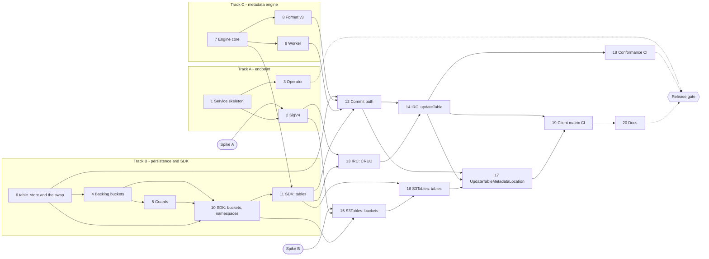

# S3 Tables - implementation plan

Breaks [s3-tables-design.md](s3-tables-design.md) into stories that can each land
as one PR. Section references (§) and test numbers link into the design doc.

## Ground rules

- **Everything lands behind `config.S3_TABLES_ENABLED` (default off)** ([§3.7]). A
  story may merge before its consumers exist; nothing is reachable until the flag is on.
  Users turn it on with the NooBaa CR annotation
  `noobaa.io/enable_s3_tables_dev_preview: "true"` (story 3). **The one exception is
  the backing-bucket guards (story 5)**, which are always on: disabling the feature
  must never leave table data open to deletion ([§10]).
- **Each story ships its own tests.** The [§12] test numbers listed per story are part
  of its definition of done, not a later hardening pass. A story's acceptance criteria
  name only what its own dependencies make executable; a check that needs pieces from
  two tracks - such as cross-protocol visibility - belongs to the story where they join.
- **Facades stay thin.** Storage or authorization calls inside a facade are a review
  defect ([§3.1], [§14]).

## Spikes (no PR)

Short, time-boxed investigations whose findings unblock a story. Details in
[Spike details](#spike-details).

- **[Spike A: SigV4 encoding capture](#spike-a-sigv4-encoding-capture)** - record the
  canonical request PyIceberg, Spark and the `aws s3tables` CLI actually sign for an
  ARN in the path ([§3.6], [§15]). Blocks story 2.
- **[Spike B: AWS catalog client library ARN check](#spike-b-aws-catalog-client-library-arn-check)** -
  point it at a stub endpoint, issue one `CreateNamespace`, confirm which ARN shapes
  the SDK lets through ([§3.5], [§14]). Blocks story 15.

## Overview

| # | Story | Depends on | Design |
|---|---|---|---|
| 1 | [Service skeleton behind the feature flag](#1-service-skeleton-behind-the-feature-flag) | - | [§3.7], [§4] |
| 2 | [SigV4 canonical path for `s3tables`](#2-sigv4-canonical-path-for-s3tables) | 1, Spike A | [§3.6] |
| 3 | [Operator wiring (noobaa-operator)](#3-operator-wiring-noobaa-operator) | 1 | [§3.7], [§11] |
| 4 | [Backing-bucket provisioning and the cross-store lifecycle](#4-backing-bucket-provisioning-and-the-cross-store-lifecycle) | 6 | [§3.2], [§3.4], [§5], [§6.1.3], [§6.4] |
| 5 | [Backing-bucket guards](#5-backing-bucket-guards) | 4 | [§3.2], [§3.7], [§10] |
| 6 | [`table_store`, `table_api`, `table_server` and the swap](#6-table_store-table_api-table_server-and-the-swap) | - | [§3.3], [§3.4], [§5], [§6.3] |
| 7 | [Metadata engine core (v2)](#7-metadata-engine-core-v2) | - | [§8.1] |
| 8 | [Format v3 row lineage](#8-format-v3-row-lineage) | 7 | [§8.2] |
| 9 | [Metadata engine worker](#9-metadata-engine-worker) | 7 | [§8.3] |
| 10 | [`s3_table_sdk`: skeleton, authorization, table buckets, namespaces](#10-s3_table_sdk-skeleton-authorization-table-buckets-namespaces) | 4, 5, 6 | [§6], [§9], [§10] |
| 11 | [`s3_table_sdk`: table CRUD](#11-s3_table_sdk-table-crud) | 7, 10 | [§3.3], [§6.1], [§6.2], [§6.4] |
| 12 | [Commit path (`commit_table`)](#12-commit-path-commit_table) | 6, 8, 9, 11 | [§3.3], [§7] |
| 13 | [IRC facade: config, namespaces, tables](#13-irc-facade-config-namespaces-tables) | 2, 11 | [§3.5], [§7.3], [§9] |
| 14 | [IRC facade: `updateTable`](#14-irc-facade-updatetable) | 12, 13 | [§7], [§7.3] |
| 15 | [S3Tables facade: router, errors, table buckets](#15-s3tables-facade-router-errors-table-buckets) | 2, 10, Spike B | [§7.3], [§10] |
| 16 | [S3Tables facade: namespaces and tables](#16-s3tables-facade-namespaces-and-tables) | 11, 15 | [§6.1] |
| 17 | [`UpdateTableMetadataLocation`](#17-updatetablemetadatalocation) | 12, 14, 16 | [§6.1] |
| 18 | [Differential conformance CI](#18-differential-conformance-ci) | 14 | [§12] |
| 19 | [Client matrix CI](#19-client-matrix-ci) | 14, 17 | [§12] |
| 20 | [User documentation](#20-user-documentation) | 19 | [§3.3], [§8.1], [§10] |

Story names link to the [detailed breakdown](#story-details) at the end.

### Parallel tracks

Stories 1, 6 and 7 depend on nothing, so work can start on three independent
tracks at once:

| Track | Stories | Starting point | Produces |
|---|---|---|---|
| **A. Endpoint** | 1, 2, 3 | 1; then 2 and 3 in parallel (2 also needs Spike A) | A reachable, authenticated TABLES listener |
| **B. Persistence and SDK** | 4, 5, 6, 10, 11 | 6 first - it brings up `table_store`, which holds all three record types; then 4, then 5; 10 after 5; 11 after 10 | Catalog records and the shared logic layer |
| **C. Metadata engine** | 7, 8, 9 | 7; then 8 and 9 in parallel | The pure transform and its worker |

The tracks join in two places:

- **Story 11** needs track C's engine (7) to build a new table's initial metadata.
- **Story 12**, the commit path, needs tracks B (6, 11) and C (8, 9) - v3 row lineage
  included, because the default format-version cap is 3.

Everything after that - the facades (13-17) and hardening (18-20) - builds on the
joined result. Track A only becomes a hard dependency at the facades (13, 15). The
guards (5) come before the SDK's table-bucket operations (10), so no merged path can
provision a backing bucket that the guards do not protect.

### Release gate

The graph orders work; it does not say when the preview may ship. Stories 3
(operator) and 18 (conformance CI) have no downstream story, and nothing in the graph
forces them before the facades work. **The preview is releasable only when all twenty
stories are merged** - in particular 3, 5, 8 and 18 - and [test 7] and [test 1] pass
in CI. Default-off does not protect an installation once someone enables it.

## Stories

### Foundation

**1. Service skeleton behind the feature flag**
- Scope: `TABLES` service type; config keys `ENDPOINT_SSL_TABLES_PORT`,
  `TABLES_SERVICE_CERT_PATH`, `S3_TABLES_ENABLED`, `S3_TABLES_MAX_FORMAT_VERSION`
  ([§3.7]); `certs.TABLES`; TLS-configurable list; listener started only when
  enabled; path router splitting IRC (`/iceberg/v1`, `/v1`) from S3Tables, both
  answering with a protocol-shaped not-implemented error.
- Done when: flag off opens no port; flag on reaches both facades. The listener
  authenticates nothing until story 2, so the flag is not enabled on a real cluster
  before then.

**2. SigV4 canonical path for `s3tables`**
- Scope: service-specific canonical-path branch in `signature_utils` (no `%2F`
  collapse, non-S3 segment encoding) pinned to the spike's findings ([§3.6]);
  authenticate requests on the TABLES listener.
- Done when: [test 6] passes with a real client; S3 and vectors signing unchanged.

**3. Operator wiring** *(noobaa-operator)*
- Scope: NooBaa CR annotation `noobaa.io/enable_s3_tables_dev_preview: "true"` as the
  single toggle ([§3.7]); from it, `tables` Service and Route,
  `noobaa-tables-serving-cert`, endpoint deployment port/volume/mount, and
  `CONFIG_JS_S3_TABLES_ENABLED=true` on both core and endpoints ([§11]). No CRD change.
- Done when: default install has no table endpoint; adding the annotation exposes one;
  removing it disables the feature without deleting data.

### Persistence

**4. Backing-bucket provisioning and the cross-store lifecycle**
- Scope: the backing-bucket marker on the bucket record, the `bucket_api`
  provisioning operations in `bucket_server`, and the `bucketspace_nb` methods that
  combine them with story 6's `table_api` calls ([§6.3]). Name validation - both reserved suffixes, 50-char cap, derived-name
  collision ([§3.2]). Record-first lifecycle over the record and transitions story 6
  provides: `provisioning → ready` on success, `provisioning → aborting` before any
  cleanup, `ready → deleting → removed`, each a conditional update only one actor can
  win ([§6.1.3], [§6.4] rule 2). A creation never adopts an existing record - a stuck
  `provisioning` record is cleared by `DeleteTableBucket`, which acts in any state
  ([§6.1.5]). Both create and delete remove the bucket before the record. No deletion
  token and no lease.
- Done when: [test 12] (failure injection at every step, including the stalled-creation
  cases, asserting on both stores and on the losing creation's response) passes.

**5. Backing-bucket guards**
- Scope: one "is backing bucket" check keyed on the **marker carried by the bucket's
  own `system_store` record** ([§6.4] rule 2), wired into
  every refused operation in the [§3.2] table ([§10]); refuse `CreateBucket` with a
  `--table-s3-nb` suffix; internal bypass for table-bucket deletion. **Not gated on
  the feature flag, and never a catalog lookup** - the guards answer with the catalog
  collections absent ([§3.7]).
- Done when: [test 8] passes on the S3 path and the management RPC path, including
  with the feature disabled.

**6. `table_store`, `table_api`, `table_server` and the swap**
- Scope: all three catalog collections - `table_buckets`, `table_namespaces` and
  `table_pointers` - with their unique partial indexes ([§5]), and every transactional
  store operation over them, including the table-bucket state transitions and the
  `ready`-only read rule ([§6.1.3], [§6.1.5]); the `table_api` schema covers all three
  record types, so story 4 adds no API of its own;
  the pointer keyed `{table_bucket, namespace_name, name}`, naming its
  namespace by name so no read or commit path loads a namespace record, and the
  pointer carrying the current metadata's ETag ([§3.3]);
  `table_api` schema; `table_server` registered through the helper shared by
  `md_server.register_rpc()` and `web_server`, only when the feature flag is on
  ([§3.4], [§3.7]); `table_api: 'md'` route; `bucketspace_nb` namespace/table methods;
  `update_table_metadata_location` with the swapped / not-swapped / not-found contract
  - `rowCount` read directly, zero rows resolved by a fresh read by id - and a distinct
  unknown-outcome error ([§6.3]); uninitialized pointers ([§6.1.3]); transactions with a
  row lock on the parent for every operation that attaches a child, at both levels
  ([§6.1.2]).
- Done when: [test 16] and [test 17] pass; duplicate-key on create/rename maps to
  already-exists; pointer-read and swap plans checked on a populated table
  (`CREATE STATISTICS` if needed, [§14]).

### Metadata engine

**7. Metadata engine core (v2)**
- Scope: `table_metadata.js` and `commit_engine.js` ([§8.1]) - document model,
  initial metadata, requirements, updates, allow-lists; lossless JSON for every
  out-of-range integer, with computed fields required to be safe integers; metadata-log
  trimming (`write.metadata.previous-versions-max`); format-version cap on version
  rises ([§8.2]); `write.data.path` / `write.metadata.path` checks on `set-properties`
  and `set-location` refused unless unchanged ([§6.4] rule 3); 50 MB cap.
- Done when: pure unit tests cover the [§8.1] v2 constants and [test 10].

**8. Format v3 row lineage**
- Scope: `next-row-id` maintenance, `first-row-id` validation, monotonicity
  assertion, safe-integer checks on the row-id fields, upgrade initialization
  ([§8.2]).
- Done when: [test 15] and the v3 part of [test 10] pass.

**9. Metadata engine worker**
- Scope: `commit_worker.js` and `engine.js` ([§8.3]) - lazy per-fork worker with a
  heap limit, transferred buffers, pending map, worker death rejects all pending as
  retryable, per-fork concurrency limit with a bounded queue, all sized from the fork's
  share of the pod's memory (`S3_TABLES_MEM_FRACTION`).
- Done when: death and backlog-rejection tests and the worker half of [test 19] pass;
  the main thread
  never parses.

### SDK

**10. `s3_table_sdk`: skeleton, authorization, table buckets, namespaces**
- Scope: per-request SDK and semantic error classes ([§6], [§6.4] rule 4); [§9]
  action map through `authorize_request_iam_policy_impl(..., 's3tables')` plus the
  table-bucket ownership check; `get_catalog_config`; table-bucket CRUD (delete marked
  `deleting` inside the transaction that counts namespaces, and refused while any
  remain);
  encryption operations (`AES256`, reject `aws:kms` and SSE-C, [§10]); namespace CRUD
  with name validation ([§1.3]) - each parent-touching operation in one transaction
  under a lock on its parent row ([§6.1.2]).
- Done when: unit tests plus [test 14] (authorization matrix) and the `DeleteTableBucket`
  versus `CreateNamespace` part of [test 21] pass.

**11. `s3_table_sdk`: table CRUD**
- Scope: `create_table` (location from backing bucket + table id per [§3.3], initial
  metadata, first `metadata.json` and its ETag, pointer insert, reject `stage-create`
  and a foreign `location`; without a schema, an uninitialized pointer, [§6.1.3]),
  `load_table` (metadata read with `If-Match` on the stored ETag, [§3.3]),
  `get_table_info` (same location string as the metadata, [§6.2]), `list_tables`,
  `delete_table` (pointer only), `rename_table` ([§6.1.5]); create and cross-namespace
  rename in one transaction under a lock on the target namespace ([§6.1.2]).
- Done when: [test 13], the SDK part of [test 20], and the `DeleteNamespace` versus
  `CreateTable` / `RenameTable` part of [test 21] pass; rename moves no bytes; a load
  of an overwritten `metadata.json` fails.

**12. Commit path (`commit_table`)**
- Scope: uncached pointer read → fetch bytes with `If-Match` → worker transform →
  write `metadata.json` → `_swap_pointer` storing the new location and ETag ([§7.1]);
  per-table `KeysSemaphore`; [§7.2] error classification; `commit_conflicts`,
  `orphaned_metadata_writes` and `metadata_integrity_failures` counters ([§7.2],
  [§7.4]).
- Done when: [test 2] (cross-fork), [test 4], [test 5] (SDK level), [test 18] and the
  integrated half of [test 19] pass.

### Facades

**13. IRC facade: config, namespaces, tables**
- Scope: `{prefix}` parsing - permissive in, canonical out ([§3.5]); `getConfig`, all
  namespace and table operations except `updateTable`; `IcebergErrorResponse`
  rendering ([§7.3]); AWS dialect behaviours - multi-level namespace 400, views 501,
  drop without purge 400 ([§9]).
- Done when: PyIceberg creates, loads, lists, renames and drops over the wire.

**14. IRC facade: `updateTable`**
- Scope: `updateTable` → `commit_table`; response built from worker bytes without
  re-parsing ([§7.1] step 9); [§7.3] error rendering.
- Done when: full PyIceberg lifecycle passes (append, schema change, tag, drop);
  [test 5] rows for the IRC facade.

**15. S3Tables facade: router, errors, table buckets**
- Scope: AWS-shaped routing, JSON, pagination and exceptions ([§7.3]);
  `Create/Get/List/DeleteTableBucket`; `Get/Put/DeleteTableBucketEncryption`;
  AWS-shaped `NotImplemented` for every deferred operation family ([§2], [§10]).
- Done when: `aws s3tables` CLI drives the table-bucket lifecycle.

**16. S3Tables facade: namespaces and tables**
- Scope: namespace operations; `Create/Get/List/Delete/RenameTable` - including
  `CreateTable` without metadata - `GetTableMetadataLocation`, `GetTableEncryption`
  ([§6.1.5]).
- Done when: `aws s3tables` CLI drives namespace and table lifecycle; [test 5] rows
  for the S3Tables non-commit operations.

**17. `UpdateTableMetadataLocation`**
- Scope: `set_table_metadata_location` with the full [§6.1.4] location and document
  validation - including `location`, descent from the current metadata and the ETag
  captured by the validation fetch - and the first commit of an uninitialized table,
  joining the same swap; facade operation.
- Done when: [test 20] passes first, then [test 3], [test 11] and the S3Tables commit
  rows of [test 5]; AWS's Spark catalog library creates a table, appends to it and
  reads it back.

### Hardening

**18. Differential conformance CI**
- Scope: [test 1] against the Apache Iceberg REST reference catalog, with the
  known-difference allow-list asserted in CI.

**19. Client matrix CI**
- Scope: [test 7] as a workflow - PyIceberg, Spark and DuckDB over IRC, and the
  `aws s3tables` CLI plus AWS's Spark catalog library over S3Tables; [test 9]
  (backing-bucket data path through the AWS SDK); cross-protocol checks - a table
  created and committed over one protocol is visible and usable over the other, with
  one location reported by both.

**20. User documentation**
- Scope: enabling and disabling the preview through the CR annotation ([§2.1],
  [§3.7]); client configurations with a well-formed ARN placeholder ([§3.5]);
  scheduled `expire_snapshots` as an operational requirement ([§8.1], [§10]); never a
  second writer catalog, and never modifying `metadata.json` over S3 ([§3.3]); no
  compressed metadata ([§6.1.4]); scoped release-note wording ([§10]); NSFS not
  supported ([§2]).

## Spike details

Spikes produce findings, not merged code. Record the results in the design doc
([§3.6], [§3.5] or [§15] as appropriate) and attach captured requests to the story
they unblock, where they become test fixtures.

### Spike A: SigV4 encoding capture

*Blocks: story 2 · Design: [§3.6], [§15] · Time-box: 1-2 days*

Goal: pin the exact canonical URI real clients sign when a percent-encoded table-bucket
ARN appears in the path, so story 2 targets the right encoding instead of guessing.

Work:
- Stand up a capture endpoint that logs full signed requests, using the design's path
  layout (`/iceberg/v1/<ARN>/...` and the S3Tables ARN paths).
- Send signed requests (SigV4 enabled, signing name `s3tables`) from:
  - PyIceberg's REST catalog;
  - Spark with the Iceberg REST catalog;
  - the `aws s3tables` CLI, for operations that carry an ARN in the path.
- For each client, recompute the canonical request both ways - single-encoded and
  double-encoded path - and record which one its signature matches.
- Note any client-specific quirks: `/iceberg` prefix handling, deprecated versus
  current SigV4 configuration properties, signing region.

Done when:
- Each client above has a recorded encoding and at least one captured signed request
  usable as a fixture for [test 6].
- If clients disagree, the disagreement is written down with a proposed tolerance
  approach for story 2.

### Spike B: AWS catalog client library ARN check

*Blocks: story 15 · Design: [§3.5], [§14] · Time-box: half a day*

Goal: confirm that AWS's S3 Tables catalog client library, and the AWS SDK beneath it,
will actually send requests for the ARN shapes the design accepts, before the S3Tables
facade is built around them.

Work:
- Point the library, running in Spark, at a stub HTTPS endpoint that logs requests.
- Configure the warehouse with each candidate ARN shape:
  - well-formed placeholder (`arn:aws:s3tables:us-east-1:000000000000:bucket/<name>`);
  - empty region and account;
  - bare bucket name.
- Issue one `CreateNamespace` per shape; record whether the SDK validates the ARN
  client-side, whether the endpoint override is honoured, and the host, path and
  signing region it produces.
- Repeat the same shapes with the `aws s3tables` CLI.

Done when:
- Every ARN shape is classified as sent or rejected client-side, for both the library
  and the CLI.
- The shape to document and echo back in responses is confirmed, or [§3.5] is updated
  with what the SDK requires.

## Story details

Required work and acceptance criteria per story. Dependencies and design sections are
repeated so each story can be lifted into a ticket on its own.

### 1. Service skeleton behind the feature flag

*Depends on: - · Design: [§3.7], [§4]*

Work:
- Add a `TABLES` endpoint service type, following the vector service's pattern.
- Add configuration: the feature flag (default off, overridable through the existing
  `CONFIG_JS_*` environment mechanism the operator will use), TLS port 15443,
  certificate directory, and the maximum accepted format version (default 3); add
  `TABLES` to the TLS-configurable services.
- Start the HTTPS listener only when the flag is on, with the same certificate
  handling and reload as the existing listeners.
- Route by path: `/iceberg/v1/...` and `/v1/...` to the IRC facade, everything else to
  the S3Tables facade.
- Both facades answer every request with a not-implemented error in their own shape
  (Iceberg error body / AWS exception).

Acceptance criteria:
- Flag off: no port is opened and no table-related startup work runs.
- Until story 2 lands, the flag is enabled only in development and CI: the listener
  does not authenticate yet.
- Flag on: TLS connections on 15443 succeed and each path prefix reaches the right
  facade.
- Existing S3 and vector listeners are unaffected.
- Unit tests cover the path routing.

### 2. SigV4 canonical path for `s3tables`

*Depends on: 1, [Spike A](#spike-a-sigv4-encoding-capture) · Design: [§3.6], [§15]*

Work:
- Pin, from the spike, the path encoding real clients sign for ARN-bearing URLs.
- Add a canonical-path rule for the `s3tables` signing service that keeps encoded
  slashes intact and applies the non-S3 SigV4 encoding rule.
- Authenticate every request on the TABLES listener with SigV4 (signing name
  `s3tables`), resolving the caller the same way the S3 endpoint does. No OAuth, no
  anonymous access.

Acceptance criteria:
- [test 6]: requests from PyIceberg and the `aws s3tables` CLI carrying a
  percent-encoded table-bucket ARN in the path authenticate.
- A wrong key or a tampered path is rejected with a signature error.
- Existing S3 and vector signature tests pass unchanged.

### 3. Operator wiring (noobaa-operator)

*Depends on: 1 · Design: [§3.7], [§11]*

Work:
- Define the NooBaa CR annotation `noobaa.io/enable_s3_tables_dev_preview: "true"` as
  the only user-facing toggle, alongside the existing annotation constants. No CRD
  field.
- While the annotation is set:
  - reconcile the `tables` Service (443 → 15443, type following the existing
    load-balancer setting) with the serving-certificate annotation;
  - reconcile the `tables` Route with re-encrypt termination;
  - extend the endpoint deployment with the container port and the optional
    certificate volume and mount;
  - set `CONFIG_JS_S3_TABLES_ENABLED=true` on **both** the core statefulset and the
    endpoint deployment, so the two never disagree.
- When the annotation is removed, remove the Service and Route and clear the variable.
  Nothing else is deleted.
- No status field or load-balancer subnet entry for the service, unlike vectors.

Acceptance criteria:
- A default install has no tables Service or Route, and the flag is off in both pods.
- Adding the annotation rolls core and endpoints, and a client reaches the catalog
  through the Route with the cluster-issued certificate.
- Removing it rolls the pods, removes the Service and Route, and leaves table-bucket
  records, collections and backing buckets intact; re-adding it brings them back.
- A user-set annotation survives an ocs-operator reconcile of the NooBaa CR.

### 4. Backing-bucket provisioning and the cross-store lifecycle

*Depends on: 6 · Design: [§3.2], [§3.4], [§5], [§6.1.3], [§6.3], [§6.4]*

Work:
- Build the cross-store lifecycle on the `table_buckets` collection and the state
  transitions story 6 provides. The record carries name, owner, derived backing-bucket
  name, backing-bucket id (once it exists), encryption setting, lifecycle state and
  creation time.
- Orchestrate table-bucket create, read, list (per owner, paginated) and delete over the
  `table_api` methods story 6 provides, together with backing-bucket provisioning. Story
  5 must merge before any story that calls them (10).
- Validate names: AWS table-bucket rules, reject the `--table-s3` suffix, cap at 50
  characters, reject when the derived backing-bucket name already exists.
- Provision the backing bucket `<name>--table-s3-nb` through the ordinary bucket
  creation flow, so it inherits standard tiering and encryption.
- Have core stamp the backing-bucket marker - the owning table bucket's id - in the
  same system-store change that creates the bucket ([§6.4] rule 2).
- Order the lifecycle record-first: create the record as *provisioning*, create the
  bucket, mark *ready*. Delete in reverse: mark *deleting*, delete the bucket, remove
  the record. Compensation for a failed creation runs in the same order - bucket, then
  record.
- Set the *deleting* mark inside the transaction that counts namespaces ([§6.1.2]).
  No deletion token and no lease.
- Gate every completing and destructive step on a state transition that only one actor
  can win: `provisioning → ready` completes a creation, `provisioning → aborting` claims
  the right to clean one up, `ready → deleting` claims a deletion. Each is a conditional
  update requiring one matched row; the loser does nothing ([§6.1.3]). Compensation
  flips the state before it touches the bucket, never after.
- Never let a creation adopt an existing record: a name held by a record in any state
  fails already-exists. A creation that loses the `provisioning → ready` transition
  reports failure, never success ([§6.1.3]).
- Make `DeleteTableBucket` the recovery path for a record stuck in *provisioning*: it
  takes the `provisioning → aborting` transition, deletes the marked bucket and removes
  the record, with no namespace count - a record that never reached *ready* has no
  children ([§6.1.5]).
- Make compensation idempotent and retryable, and confirm the backing-bucket identity
  by id before any destructive step.
- Take and return table buckets by id ([§6.4] rule 1).

Acceptance criteria:
- Creating a table bucket yields a ready record and a backing bucket usable over S3.
- With the flag off, `table_store` and `table_api` are not registered and no
  table-bucket operation is reachable; records already written survive and are served
  again when the feature is re-enabled ([§3.7]).
- A crash at any step leaves a *provisioning*, *aborting* or *deleting* record, never a
  marked bucket that no record names. Recovery from a crashed create is
  `DeleteTableBucket` on the name followed by a fresh create, or the original request's
  own compensation - a second create alone always fails already-exists ([§6.1.5]).
- A second create for a name held by a *provisioning* record fails already-exists and
  leaves that record untouched; `DeleteTableBucket` on that name clears it; a delete
  racing a live creation leaves the creation reporting failure, not success.
- Two overlapping deletions of one table bucket end in the same state.
- Invalid names are rejected with a clear error before anything is provisioned.
- [test 12]: a failure injected at each create and delete step leaves a recognisable,
  retryable state; no backing bucket ever exists without an owning record.
- Deleting a table bucket removes both the backing bucket and the record.

### 5. Backing-bucket guards

*Depends on: 4 · Design: [§3.2], [§3.7], [§6.4], [§9.1], [§10]*

Work:
- Add one shared check, "is this bucket backing a table bucket?", answered from the
  marker on the bucket's own system-store record - the id of the table bucket it belongs
  to - stamped when core creates the bucket. The check never reads `table_store`.
- Refuse on backing buckets: bucket deletion (both forms), lifecycle, versioning,
  object lock, replication, encryption, bucket policy and website changes, **and
  rename**. Wire the check by RPC, not by S3 operation name: versioning and rename both
  arrive as `update_bucket`, and `update_buckets` applies them in bulk; lifecycle is
  `set_bucket_lifecycle_configuration_rules`. There is no `set_bucket_versioning`
  handler in `bucket_server`. Rename is a legacy parameter with no in-tree caller on this
  path, still reachable with an admin token, and the guard sits in `update_bucket`
  regardless ([§10]).
- Treat a backing bucket's name as immutable: every absolute path in the tables'
  metadata embeds it.
- Refuse creating any ordinary bucket whose name ends in `--table-s3-nb`.
- Exempt only the internal table-bucket deletion path.
- Leave object operations, multipart, listing, CORS, notification, tagging and public
  access block untouched.
- Keep the guards and the suffix refusal active regardless of the feature flag: the
  marker is part of the bucket record and outlives a disabled feature, when no catalog
  collection exists.
- Do not implement this as a bucket policy on the backing bucket ([§10]).

Acceptance criteria:
- [test 8]: each refused operation, sent over the S3 endpoint and over the management
  RPC path against a backing bucket - including a rename and a versioning change through
  both `update_bucket` and the bulk `update_buckets` - fails and leaves data and
  configuration unchanged, with the feature enabled and again with it disabled.
- A backing bucket is protected from the moment it exists, including while its
  table-bucket record is still *provisioning*.
- The same operations still work on ordinary buckets, including a pre-existing user
  bucket whose name happens to end in the suffix.
- Object I/O on a backing bucket behaves exactly as on any bucket.
- Table-bucket deletion still removes its backing bucket.

### 6. `table_store`, `table_api`, `table_server` and the swap

*Depends on: - · Design: [§3.3], [§3.4], [§3.7], [§5], [§6.3], [§14]*

Work:
- Add three dedicated database collections, outside the in-memory system store: table
  buckets (name, owner, derived backing-bucket name, backing-bucket id, state,
  encryption setting, creation time), namespaces (table bucket, name, properties) and
  table pointers (table bucket, namespace name, name, metadata location, metadata ETag,
  version token, table uuid, kind).
- Add unique partial indexes: table-bucket name per system, namespace name per table
  bucket, table name per namespace name.
- Add an internal API for **table-bucket, namespace and table CRUD** plus the pointer
  swap and the table-bucket state transitions, served in-process in the endpoint when it
  runs its own metadata server, and by core otherwise - registered from the single place
  both paths use, and only when the feature flag is on, so the collections are not
  created on a system that has never enabled the feature.
- Expose all of it through the persistence interface. Story 4 builds the cross-store
  lifecycle on these methods and adds no API of its own.
- Implement the swap as a conditional update on table id and expected version token,
  writing the new metadata location and its ETag and issuing a fresh token on success.
  Return swapped, not swapped, or not found, and keep an unobserved outcome distinct
  from all three.
- Read the update's `rowCount` directly - not through `check_update_one`, which throws
  not-found on any zero-row result. On zero rows, read the record by id: absent or
  deleted means not found, otherwise not swapped. No transaction is needed.
- Support uninitialized pointers - no metadata location, ETag or table uuid - and let
  the swap on such a pointer also store the table uuid ([§6.1.3]).
- Key the pointer on `{table_bucket, namespace_name, name}`, so a table is found in one
  indexed lookup ([§5]). Make every operation addressed by namespace and name - rename
  and delete - conditional on the pointer still carrying the resolved `namespace_name`
  and `name`, requiring one matched row, so a pointer moved by a concurrent rename is
  reported missing rather than written to ([§6.1.2]).
- Implement the table-bucket state transitions as conditional updates, each requiring
  one matched row: `provisioning → ready`, `provisioning → aborting`, `ready → deleting`
  ([§6.1.3]).
- Serve table-bucket reads at `ready` only - get, list and IRC prefix resolution -
  while delete operates on a record in any state ([§6.1.5]).
- Resolve `list_tables` on an empty page with an unlocked namespace existence read, so a
  missing namespace is distinguishable from an empty one ([§6.1.2]).
- Run every operation that attaches a child to a parent as a single PostgreSQL
  transaction through `PgTransaction`, with a row lock on that parent: creating or
  moving a pointer locks its target namespace `FOR SHARE` and checks it is live;
  creating a namespace locks its table bucket `FOR SHARE` and checks it is *ready*;
  deleting a namespace locks it `FOR UPDATE`, counts live pointers and deletes only if
  there are none; deleting a table bucket locks it `FOR UPDATE`, counts live namespaces
  and marks it *deleting* only if there are none ([§6.1.2]).
- Have the persistence implementation declare that it supports the swap.
- Check query plans for the pointer read and the swap on a populated collection; add
  extended statistics if the planner falls back to sequential scans.

Acceptance criteria:
- [test 16]: the table-bucket, namespace, table and swap suite passes with and without
  a local metadata server.
- [test 17]: many forks starting at once against an empty database converge on one set
  of collections and indexes; a fresh installation with the flag off creates none of
  the three collections; disabling an installation that holds tables deletes nothing -
  the collections and their records survive and are served again when it is re-enabled.
- Swap unit tests: matching token swaps and returns a new token; stale token reports
  not swapped, never not found; missing or deleted table reports not found; a database
  error after the update is issued is reported as unknown, never as not swapped; a swap
  on an uninitialized pointer stores the table uuid.
- Store-level locking tests: a pointer insert or move and a namespace delete racing
  across forks never leave a pointer under a deleted namespace, and a process killed
  inside either transaction leaves no partial change.
- Concurrent creates or renames onto the same name produce one winner; the loser gets
  already-exists.
- The pointer read and the swap use index scans with 10,000 tables present.

### 7. Metadata engine core (v2)

*Depends on: - · Design: [§6.4], [§8.1], [§8.2]*

Work:
- Operate on the parsed metadata document directly, with no typed model, so fields the
  engine does not know survive a commit.
- Build initial metadata for a new table from schema, partition spec, sort order and
  properties, using the reference implementation's v2 constants.
- Check all eight Iceberg requirement types.
- Apply the update actions clients send - schema, partition spec, sort order,
  snapshot, ref, property, location and format-upgrade changes - including snapshot
  removal, so engine-driven expiry works from day one.
- Reject unknown requirement or update types as bad requests.
- Keep every integer outside JavaScript's safe range as its exact source text, in any
  field, and write it back unchanged; compare stored-only values such as snapshot ids
  as those exact strings.
- Require the fields the engine computes on (sequence numbers) to be safe integers;
  reject anything else as a bad request.
- Append to the metadata log and trim it to `write.metadata.previous-versions-max`
  (default 100).
- Reject `write.data.path` / `write.metadata.path` outside the table's location, on
  creation and on property updates, using the rule of [§6.1.1]:
  `s3://`, the backing bucket, a `<table-id>/` key prefix, and no empty, `.` or `..`
  segment and no `%`, `\`, `?` or `#` - refused, never normalized.
- Accept `set-location` only when it names the current location; reject any other
  value as a bad request ([§6.4] rule 3).
- Enforce the configured format-version cap on every version rise (creation and
  upgrade) - never on commits to a table already above it - and a 50 MB document
  limit.
- Keep the engine free of I/O.

Acceptance criteria:
- Unit tests cover every requirement and update type, including the §8.1 v2
  constants: sort order id 1, `last-partition-id` 999, null `assert-ref-snapshot-id`
  meaning "ref must not exist", and `add-snapshot` not moving `main`.
- [test 10]: a snapshot id above 2^53 round-trips byte-identical and matches the
  manifest-list filename.
- An out-of-range sequence number is rejected as a bad request.
- A `set-location` to a different location is rejected; to the same location it is a
  no-op.
- An unknown document field is preserved across a commit.
- The metadata log never exceeds the configured maximum.

### 8. Format v3 row lineage

*Depends on: 7 · Design: [§8.2]*

Work:
- Create v3 tables when requested and allowed by the cap; accept upgrading v2 to v3,
  initialising `next-row-id`.
- On each v3 snapshot, require `first-row-id` to equal the table's current
  `next-row-id` (otherwise a commit conflict), then advance `next-row-id` by
  `added-rows`.
- Assert `next-row-id` never decreases.
- Require `first-row-id`, `added-rows` and `next-row-id` to be safe integers before
  any arithmetic, and the computed `first-row-id + added-rows` to be a safe integer
  before it is stored; reject anything else as a bad request.
- Pass new v3 types through unchanged; confirm field-id handling covers them.
- Keep table encryption keys unsupported (bad request).

Acceptance criteria:
- [test 15]: a stale `first-row-id` yields a conflict, and a sequence of v3 commits
  shows monotonic `next-row-id`.
- [test 10] (v3 part): `added-rows` or `first-row-id` above 2^53 - and exactly 2^53 -
  is rejected as a bad request, so is a table whose stored `next-row-id` is itself
  outside the safe range, and so are safe values whose sum exceeds 2^53 - 1, leaving
  `next-row-id`
  unchanged.
- An upgraded table has correct initial row-lineage state.
- With the cap set to 2, v3 creation and upgrade are rejected while existing v3 tables
  keep committing.

### 9. Metadata engine worker

*Depends on: 7 · Design: [§7.2], [§8.3], [§14]*

Work:
- Run the transform in one worker thread per endpoint fork, created lazily on the
  first commit.
- Size everything from the fork's share of the pod: the container memory limit divided
  by the fork count, of which `S3_TABLES_MEM_FRACTION` goes to the worker heap and
  in-flight commit buffers and the rest stays with ordinary S3 work ([§8.3]).
- Start the worker with a heap limit sized from that budget and the worst-case
  document, so heap exhaustion terminates only the worker.
- Pass bytes in and out, transferring buffers rather than copying; the main thread
  never parses metadata.
- Return the serialized document plus the few header fields the caller needs.
- Correlate concurrent requests to their responses.
- On worker error or exit - including running out of heap - fail every pending request
  as a transient, definitely-not-committed failure and start a fresh worker on the next
  commit.
- Add admission control: a per-fork limit on concurrent transforms and a bounded
  queue, sized so in-flight buffers plus worker heap stay inside the fork's budget,
  applied before the request body is buffered, rejecting excess as throttled (`429`).

Acceptance criteria:
- Killing the worker mid-transform fails in-flight requests as retryable, and the next
  commit succeeds.
- [test 19], worker half: a transform exceeding the heap limit kills only the worker and
  fails as retryable, and load beyond the admission limit is rejected rather than
  queued. The integrated half - concurrent commits at the 50 MB cap, spread across every
  fork while ordinary S3 traffic runs - needs the commit path and belongs to story 12.
- Load beyond the limit is rejected rather than queued without bound.
- Main-thread event-loop lag stays in the low tens of milliseconds while a 50 MB
  document is transformed.
- Worker output is identical to running the engine directly.

### 10. `s3_table_sdk`: skeleton, authorization, table buckets, namespaces

*Depends on: 4, 5, 6 · Design: [§3.5], [§6], [§6.4], [§9], [§10]*

Work:
- Add the shared logic layer used by both facades, constructed per request with the
  authenticated caller.
- Define the semantic error set exactly as the [§7.3] table lists it - invalid
  request, unsupported, access denied, not found, already exists, not empty, commit
  conflict, requirement failed, transient failure, metadata integrity, throttled,
  commit state unknown; facades render it.
- Authorize every operation once, here: map each to its `s3tables:` action(s) per
  [§9] and evaluate through the existing IAM policy engine, with table resources named
  by table id (`<table-bucket>/table/<table-id>`, [§3.5]).
- Add the table-bucket ownership check the IAM helper does not make: system owner and
  the table bucket's owner allowed; IAM users and assumed-role sessions of the owner's
  account allowed only when their identity policies allow the action; everyone else
  denied ([§9] ownership table). `ListTableBuckets` returns only the caller's own
  table buckets - all of them for the system owner.
- Add the catalog-configuration operation.
- Add table-bucket operations: create (already-exists for any existing record), get and
  list (*ready* records only), delete - the delete marked *deleting* inside the
  transaction that locks the record `FOR UPDATE` and counts its namespaces, so the mark
  is set only when there are none and is never cleared afterwards ([§6.1.2]); on a record
  that never reached *ready*, the delete instead clears it ([§6.1.5]).
- Add encryption operations: report `AES256`, accept `AES256`, reject `aws:kms` and
  SSE-C explicitly; tables inherit their bucket's setting.
- Add namespace operations: create (single level, AWS naming rules; one transaction
  that locks its table bucket `FOR SHARE`, checks it is *ready* and inserts the
  namespace), get, list (paginated), delete (one transaction that locks the namespace
  `FOR UPDATE` and refuses while tables remain) ([§6.1.2]).
- Allow short caching of table-bucket and namespace record lookups. Every mutation
  carries the ids it resolved and the authoritative store rejects a deleted one
  ([§6.4] rule 1). Never cache authorization decisions - the check runs on every
  request - and never cache the pointer.

Acceptance criteria:
- [test 14]: every caller in the [§9] ownership table gets the stated outcome for
  every action - including an unrelated root account denied and an IAM user of the
  owner denied without an allowing policy - also with the caches warmed by a different
  caller, and after a table bucket is deleted and recreated under the same name by
  another account while another endpoint still caches the old record: every operation
  through the stale record fails as not found and none reaches the new table bucket.
  The system owner's `ListTableBuckets` returns every table bucket; any other caller's
  returns only its own.
- [test 21] (`DeleteTableBucket` versus `CreateNamespace`, with crash points): never a
  namespace under a deleted table bucket; a `CreateNamespace` that loses the race fails
  not found; overlapping `DeleteTableBucket` calls end in the same state; a table bucket
  left *deleting* by a crash is completed by a retry.
- Under `LOCAL_MD_SERVER=true`, no catalog persistence call reaches core; the only core
  calls are the backing-bucket create and delete of story 4.
- Naming violations and non-empty deletes return the right semantic error.
- Requesting `aws:kms` fails instead of being silently recorded.

### 11. `s3_table_sdk`: table CRUD

*Depends on: 7, 10 · Design: [§3.3], [§6.1], [§6.2], [§6.4]*

Work:
- Create table: validate the name, allocate the table id, derive the location from
  the backing bucket and table id, build initial metadata through the engine, write the
  first `metadata.json`, insert the pointer with that object's ETag. Reject staged
  creation, a requested `location` other than the derived one, and write paths
  outside the location.
- Create table without a schema (an S3Tables `CreateTable` with no metadata): insert
  an uninitialized pointer - token only, nothing written ([§6.1.3]). Over IRC such a
  table does not exist yet: load and exists report not found, list omits it, and a
  create of the same name reports already-exists.
- Insert a pointer, and move one in a cross-namespace rename, inside a transaction
  that locks the target namespace `FOR SHARE` and checks it is live; if it is not,
  nothing changes and the operation fails not found ([§6.1.2]). A rename never needs an
  undo: it either commits or never leaves its source. A rename within one namespace, a
  delete and every read take no namespace lock at all.
- Load table: fresh pointer read, then fetch the current `metadata.json` conditional
  on the stored ETag. A mismatch means the file was changed outside the catalog: fail
  the request with a metadata integrity error - `503` on a load; a commit renders it
  as `409` (story 12) - and count it, rather than serving unvalidated bytes.
- Get table info: pointer fields only - warehouse location, metadata location, version
  token, ARN, timestamps.
- List (paginated) - an empty page followed by a namespace existence read, so a missing
  namespace answers not found ([§6.1.2]); delete and rename (pointer only, data kept),
  both conditional on the pointer still carrying the resolved namespace name and table
  name, so a pointer moved by a concurrent rename is reported missing.
- Report the same location string on every path that reports one.

Acceptance criteria:
- [test 13]: a foreign `write.data.path` is rejected on creation and on property
  update, and so is a create naming another `location`.
- [test 20] (SDK part): a table created without a schema reports its warehouse
  location and a token, no metadata location, and is invisible to IRC-style load, exists
  and list.
- [test 21] (`DeleteNamespace` versus `CreateTable` and cross-namespace `RenameTable`,
  two renames racing on one table, and `DeleteTable` racing a cross-namespace rename,
  with the child killed right after its insert or move): never a table under a deleted
  namespace; a failed rename leaves the table in its source namespace under its original
  name; a rename or delete whose pointer moved meanwhile fails not found.
- Listing a namespace that does not exist answers not found; listing an existing empty
  one answers an empty list.
- A new table's `metadata.json` sits at the reported location and is valid Iceberg
  metadata.
- Rename moves no objects and the table ARN stays the same.
- Delete leaves data in place and frees the name.
- Concurrent creates of one name produce a single table.
- Loading a table whose current `metadata.json` was overwritten over S3 fails with the
  metadata integrity error, rendered as `503` ([test 18]).

### 12. Commit path (`commit_table`)

*Depends on: 6, 8, 9, 11 · Design: [§3.3], [§7.1], [§7.2], [§7.4]*

Work:
- Implement the declarative commit: fresh pointer read, fetch current metadata bytes
  conditional on the stored ETag, transform in the worker, write a new uniquely named
  `metadata.json`, swap on the version token - storing the new file's ETag with the
  new location.
- Serialize commits to the same table within a fork, so same-fork races fail before
  writing an orphan.
- Classify every failure per the [§7.2] table. On a commit, `500` only for an
  unobserved swap and never `503` - Iceberg's Java client reads `503` as commit state
  unknown. Provable no-ops are rendered as definitely not committed: `409` for a
  transient failure or a failed ETag match (which also needs operator attention), `429`
  for admission rejection.
- Return the new location and metadata without re-parsing.
- Refuse commits where the persistence layer cannot perform a conditional swap.
- Add counters for commit conflicts, orphaned metadata writes and metadata integrity
  failures.

Acceptance criteria:
- [test 2]: N clients racing over M rounds across forks give exactly one success per
  round; every retry lands; sequence numbers and snapshot log are correct at the end.
- [test 4]: a crash between the metadata write and the swap leaves the table loading at
  the previous version.
- [test 5] (SDK level): every [§7.2] row produces the expected semantic error.
- [test 18]: after the current `metadata.json` is overwritten over S3, both load and
  commit fail with the metadata integrity error and nothing is committed.
- [test 19], integrated half: concurrent commits at the 50 MB cap, spread across every
  fork while ordinary S3 traffic runs, are rejected by admission control before the
  forks together reach the pod's memory limit (the worker half is story 9).
- All three counters increase when their events occur.

### 13. IRC facade: config, namespaces, tables

*Depends on: 2, 11 · Design: [§3.5], [§6.1], [§7.3], [§9]*

Work:
- Serve the IRC protocol under both `/iceberg/v1` and `/v1`.
- Parse `{prefix}` permissively (a percent-decoded table-bucket ARN with optional
  region and account, or a bare name) and echo a well-formed ARN.
- Implement config, namespace (list, create, load, exists, drop) and table (list,
  create, load, exists, drop, rename) operations - all of AWS's IRC profile except
  `updateTable`.
- Use Iceberg request and response shapes, including pagination tokens.
- Render semantic errors as Iceberg error responses per [§7.3].
- Apply AWS dialect behaviours: staged creation, drop without purge and multi-level
  namespaces return 400; views return 501; metadata over 50 MB returns 400.

Acceptance criteria:
- PyIceberg, configured as AWS documents with only the endpoint changed, creates,
  lists, loads, renames and drops namespaces and tables.
- `/iceberg/v1` and `/v1` behave identically.
- Error bodies match the Iceberg REST spec's shape.

### 14. IRC facade: `updateTable`

*Depends on: 12, 13 · Design: [§7], [§7.2], [§7.3]*

Work:
- Route `updateTable` to the commit path.
- Build the response around the worker's bytes without re-parsing.
- Render commit outcomes: conflict, transient failure and metadata integrity failure
  409, throttled 429, unknown state 500, unknown action 400 - never 503.
- Enforce the request size limit before buffering the body.

Acceptance criteria:
- A full PyIceberg lifecycle passes: create, append, scan, append, add column, set
  properties, tag, drop.
- Two PyIceberg writers racing on one table both land after retry.
- [test 5] (IRC): each [§7.2] row returns the expected status and error body, and
  Iceberg Java and PyIceberg raise the expected exception - only an unobserved swap
  surfaces as `CommitStateUnknownException`.

### 15. S3Tables facade: router, errors, table buckets

*Depends on: 2, 10, [Spike B](#spike-b-aws-catalog-client-library-arn-check) · Design: [§3.5], [§7.3], [§10]*

Work:
- Route S3Tables REST operations, including percent-encoded ARNs in paths.
- Use AWS JSON shapes and continuation-token pagination.
- Map semantic errors to AWS exception types per [§7.3], in the form AWS SDKs parse.
- Implement `CreateTableBucket`, `GetTableBucket`, `ListTableBuckets`,
  `DeleteTableBucket` and `Get/Put/DeleteTableBucketEncryption`.
- Return AWS-shaped not-implemented errors for policies, tagging, replication,
  metrics configuration, storage class, record expiration and maintenance.

Acceptance criteria:
- The `aws s3tables` CLI creates, gets, lists and deletes table buckets.
- Encryption reads back `AES256`; setting `aws:kms` fails with a clear error.
- Deferred operations fail cleanly in the CLI.
- Listing pages correctly across more than one page.

### 16. S3Tables facade: namespaces and tables

*Depends on: 11, 15 · Design: [§6.1], [§6.2], [§7.3]*

Work:
- Implement `CreateNamespace`, `GetNamespace`, `ListNamespaces`, `DeleteNamespace`.
- Implement `CreateTable` - with and without metadata; without it the table is
  uninitialized ([§6.1.3]) - `GetTable`, `ListTables` (listing uninitialized tables),
  `DeleteTable`, `RenameTable`, `GetTableMetadataLocation` (no metadata location for an
  uninitialized table), `GetTableEncryption`.
- Honour the optional version token AWS defines on `DeleteTable` and `RenameTable`:
  when given, the operation is conditional on it, and a mismatch fails as
  `ConflictException` ([§6.1.5]). AWS's catalog client relies on this to delete a table
  whose first commit failed.

Acceptance criteria:
- The `aws s3tables` CLI drives namespace and table lifecycle.
- `CreateTable` without metadata, then `GetTableMetadataLocation`, returns the
  warehouse location and a version token with no metadata location.
- `DeleteTable` and `RenameTable` with the current version token succeed; with a stale
  one they fail with `ConflictException` and change nothing.
- [test 5] (S3Tables, non-commit operations): each not-found, already-exists,
  not-empty, invalid-request and access-denied case returns the expected AWS
  exception. The commit rows belong to story 17; cross-protocol checks to story 19.

### 17. `UpdateTableMetadataLocation`

*Depends on: 12, 14, 16 · Design: [§3.3], [§6.1], [§6.3], [§7.2]*

Story 14 is a dependency because the acceptance criteria compare the imperative commit
with the IRC path: IRC visibility, identical rejection, and commits over both
protocols.

Work:
- Implement the imperative commit: the caller supplies a new metadata location and the
  version token.
- Validate the location: inside the table's location by the exact-match containment
  rule of [§6.1.1], a `.metadata.json` name, present, and not compressed - compressed
  metadata is rejected with a bad request, although AWS accepts it.
- Validate the document with the same checks as the IRC path: table uuid, `location`
  equal to the assigned location, write paths, v3 row-lineage invariants - under the
  same size limit and in the worker.
- Accept the first commit of an uninitialized table ([§6.1.3]): the same checks except
  that the document's `table-uuid` is established rather than matched - the swap
  stores it - and its `metadata-log` must be empty instead of naming a predecessor.
- Apply the format-version cap only to a version rise: an unchanged version always
  passes, so lowering the cap never blocks tables already above it.
- Require the new document to descend from the current one - its last metadata-log
  entry must be the pointer's current location - so a caller cannot point the table
  back at an older file and discard history.
- Capture the ETag from the validation fetch and store it with the new location on a
  successful swap.
- Join the same swap and error classification as the declarative commit.

Acceptance criteria:
- [test 20], before any append test: AWS's Spark catalog library creates a table
  (`CreateTable` without metadata, then its own first commit); the table becomes
  visible over IRC only after that commit; a second "first" commit, or one with a
  non-empty `metadata-log` or another `location`, is rejected.
- [test 5] (S3Tables commit rows): each [§7.2] row returns the expected AWS exception.
- [test 11]: each invalid case - foreign write path, a changed `location`, version
  raised above the cap, stale `first-row-id`, compressed metadata, a replayed older
  `metadata.json`, and containment near-misses (`..`, an empty segment, a
  percent-encoded `/`, another scheme or bucket) - is rejected identically over both
  protocols; a commit to a v3 table after the cap is lowered to 2 succeeds.
- [test 3]: one client committing over each protocol to one table serialize
  correctly. A `DeleteTable` without a version token racing a commit resolves in one
  of two orders, both asserted: the swap lands first, so the commit returns success and the delete then
  removes the table; or the delete lands first, so the commit fails as not found.
  Never as a conflict. (A `DeleteTable` carrying the pre-commit token fails with
  `ConflictException` instead and keeps the table - story 16, [test 20].)
- AWS's Spark catalog library creates a table, appends and reads back.

### 18. Differential conformance CI

*Depends on: 14 · Design: [§12]*

Work:
- Run the Apache Iceberg REST reference catalog in CI next to NooBaa.
- Drive both through one identical client scenario.
- Normalize uuids, timestamps, absolute paths and client-random snapshot ids, then diff
  the resulting `metadata.json`.
- Assert the known-difference allow-list.

Acceptance criteria:
- [test 1] passes on the current code.
- A newly introduced divergence fails the job.

### 19. Client matrix CI

*Depends on: 14, 17 · Design: [§3.2], [§12], [§15]*

Work:
- Add a workflow running PyIceberg (Python 3.12), Spark and DuckDB over IRC, and the
  `aws s3tables` CLI and AWS's Spark catalog library over S3Tables.
- Give each client a short lifecycle: create, write, read, evolve, drop.
- Verify that every object request from AWS SDK-based file I/O reaches NooBaa's S3
  endpoint.
- Cross-protocol checks, which need both facades: create and commit over one protocol,
  read and commit over the other.

Acceptance criteria:
- [test 7]: every client in the matrix passes.
- [test 9]: the backing-bucket name is not special-cased by SDK endpoint resolution.
- A table created over one protocol is visible and usable over the other, and the
  S3Tables `warehouseLocation` equals the IRC-reported location.

### 20. User documentation

*Depends on: 19 · Design: [§2], [§2.1], [§3.3], [§3.7], [§6.1], [§8.1], [§10]*

Work:
- Explain enabling the Developer Preview with the NooBaa CR annotation, what it
  exposes, that toggling it restarts core and endpoints, and that disabling it keeps
  all table data and records.
- Give client configurations for each client in the matrix, with a well-formed ARN
  placeholder and the `s3tables` signing name.
- State operational requirements: schedule snapshot expiry, the metadata size limit,
  the endpoint memory per fork that a commit at that limit needs ([§8.3]), and that
  orphaned files and dropped tables' data are not reclaimed.
- State caveats: never a second writer catalog; never modify `metadata.json` files
  over S3 (the table becomes unavailable until an operator intervenes); compressed
  metadata is not supported; tables can be registered elsewhere but not migrated in
  place; names are unique per system; the backing bucket is visible but restricted,
  even while the feature is disabled; no per-table authorization on object I/O, and a
  presigned URL for a table object delegates the signer's access to the whole object.
- Provide release-note wording scoped to what is implemented; NSFS not supported.

Acceptance criteria:
- A new user goes from enabling the feature to a PyIceberg append and read using only
  the documentation.
- Every unsupported operation family and deferred feature is listed.

<!-- Design doc anchors -->
[§1.3]: s3-tables-design.md#13-glossary
[§2]: s3-tables-design.md#2-scope
[§2.1]: s3-tables-design.md#21-what-developer-preview-status-means-here
[§3.1]: s3-tables-design.md#31-layering-one-logic-layer-two-protocol-facades-bucketspace-for-persistence
[§3.2]: s3-tables-design.md#32-the-backing-bucket-model
[§3.3]: s3-tables-design.md#33-where-table-metadata-is-stored
[§3.4]: s3-tables-design.md#34-the-commit-mechanism
[§3.5]: s3-tables-design.md#35-addressing-table-bucket-arns-and-the-irc-prefix
[§3.6]: s3-tables-design.md#36-authentication-and-the-action-vocabulary
[§3.7]: s3-tables-design.md#37-service-name-and-port
[§4]: s3-tables-design.md#4-architecture
[§5]: s3-tables-design.md#5-entities-and-stored-records
[§6]: s3-tables-design.md#6-s3_table_sdk-operations
[§6.1]: s3-tables-design.md#61-operation-catalogue
[§6.1.1]: s3-tables-design.md#611-validating-a-client-supplied-location
[§6.1.2]: s3-tables-design.md#612-parentchild-coordination
[§6.1.3]: s3-tables-design.md#613-lifecycle-states
[§6.1.4]: s3-tables-design.md#614-validating-a-client-supplied-metadata-document
[§6.1.5]: s3-tables-design.md#615-operation-semantics
[§6.2]: s3-tables-design.md#62-how-a-client-learns-where-to-write
[§6.3]: s3-tables-design.md#63-what-bucketspace-gains
[§6.4]: s3-tables-design.md#64-four-rules-for-the-sdk
[§7]: s3-tables-design.md#7-the-commit-path
[§7.1]: s3-tables-design.md#71-the-steps
[§7.2]: s3-tables-design.md#72-error-semantics
[§7.3]: s3-tables-design.md#73-how-each-facade-renders-those-errors
[§7.4]: s3-tables-design.md#74-concurrency-crashes-and-orphaned-files
[§8.1]: s3-tables-design.md#81-structure
[§8.2]: s3-tables-design.md#82-format-version-3
[§8.3]: s3-tables-design.md#83-the-worker-boundary
[§9]: s3-tables-design.md#9-authentication-and-authorization
[§9.1]: s3-tables-design.md#91-why-it-is-safe-to-ship-without-per-table-authorization-on-object-io
[§10]: s3-tables-design.md#10-security-posture
[§11]: s3-tables-design.md#11-operator-and-deployment
[§12]: s3-tables-design.md#12-test-strategy
[§14]: s3-tables-design.md#14-risks
[§15]: s3-tables-design.md#15-open-questions

<!-- Test anchors: §12 is a single table, so every test links to the section -->
[test 1]: s3-tables-design.md#12-test-strategy
[test 2]: s3-tables-design.md#12-test-strategy
[test 3]: s3-tables-design.md#12-test-strategy
[test 4]: s3-tables-design.md#12-test-strategy
[test 5]: s3-tables-design.md#12-test-strategy
[test 6]: s3-tables-design.md#12-test-strategy
[test 7]: s3-tables-design.md#12-test-strategy
[test 8]: s3-tables-design.md#12-test-strategy
[test 9]: s3-tables-design.md#12-test-strategy
[test 10]: s3-tables-design.md#12-test-strategy
[test 11]: s3-tables-design.md#12-test-strategy
[test 12]: s3-tables-design.md#12-test-strategy
[test 13]: s3-tables-design.md#12-test-strategy
[test 14]: s3-tables-design.md#12-test-strategy
[test 15]: s3-tables-design.md#12-test-strategy
[test 16]: s3-tables-design.md#12-test-strategy
[test 17]: s3-tables-design.md#12-test-strategy
[test 18]: s3-tables-design.md#12-test-strategy
[test 19]: s3-tables-design.md#12-test-strategy
[test 20]: s3-tables-design.md#12-test-strategy
[test 21]: s3-tables-design.md#12-test-strategy
