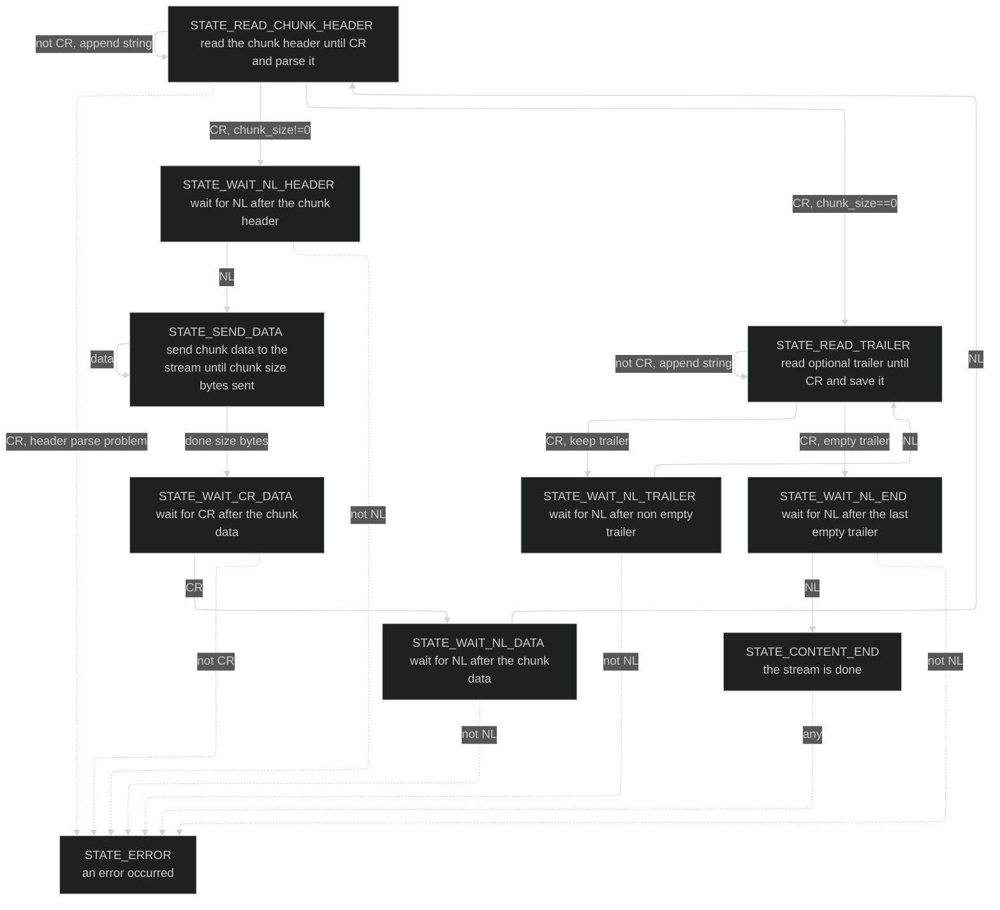

```mermaid
---
config:
  theme: dark
  look: classic
  layout: elk
---
flowchart TD
    A -- not CR, append string --> A["STATE_READ_CHUNK_HEADER <br> read the chunk header until CR and parse it"]
    A -. CR, header parse problem .-> J["STATE_ERROR <br> an error occurred"]
    A -- "CR, chunk_size!=0" --> B["STATE_WAIT_NL_HEADER <br> wait for NL after the chunk header"]
    A -- "CR, chunk_size==0" --> F["STATE_READ_TRAILER <br> read optional trailer until CR and save it"]
    C -- data --> C["STATE_SEND_DATA <br> send chunk data to the stream until chunk size bytes sent"]
    C -- done size bytes --> D["STATE_WAIT_CR_DATA <br> wait for CR after the chunk data"]
    F -- not CR, append string --> F
    F -- CR, keep trailer --> G["STATE_WAIT_NL_TRAILER <br> wait for NL after non empty trailer"]
    F -- CR, empty trailer --> H["STATE_WAIT_NL_END <br> wait for NL after the last empty trailer"]
    D -- CR --> E["STATE_WAIT_NL_DATA <br> wait for NL after the chunk data"]
    H -- NL --> I["STATE_CONTENT_END <br> the stream is done"]
    B -- NL --> C
    E -- NL --> A
    G -- NL --> F
    B -. not NL .-> J
    E -. not NL .-> J
    G -. not NL .-> J
    H -. not NL .-> J
    D -. not CR .-> J
    I -. any .-> J
```
