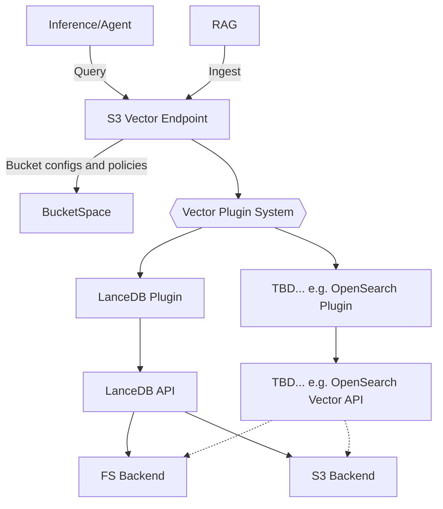

# S3 Vectors for Noobaa

## S3 API
### Vector Buckets and Indexes

1. Needed for minimal POC - create vector bucket, create index, put vector and query vector.
2. MVP requires all get/list/delete API implemented.
1. BucketPolicy is not a must for MVP.
4. Hopefully will be able to reuse current bucket/object implementation with some adaptation.
   1. Eg add "bucket content" field to indicate whether bucket is object or vector instead of creating a new “vector bucket” entity.

### Terminology
#### AWS S3 Vectors
As part of their S3 offering, AWS implements API for interacting with vectors.
This includes creating a "vector bucket", which contains "indexes".
Vectors can be inserted into indexes, and then queried to get a list of vectors closest to query vector.
More in
https://aws.amazon.com/s3/features/vectors/
https://docs.aws.amazon.com/AmazonS3/latest/API/API_Operations_Amazon_S3_Vectors.html

#### LanceDB
Lance is a DB designed for vectors.
It stores vectors in tables, which can be queried.
Lance can store its internal DB files in either on of two storage backends
-A dedicated directory in a filesystem
-A dedicated object bucket in several providers (AWS, Azure, etc).
More in https://lancedb.com/

#### Conflicting Terminology S3 vs. Lance
AWS S3 vectors and lance have the use the same term with different meaning.
In AWS: a "Vector Bucket" hold several "Indexes". An "Index" holds several vectors.
In Lance: a "Table" holds several vectors. An "Index" is created on data to accelerate search, similar to RDBM index.
Lance does not have the concept of "Bucket", S3 vectors does not have the concept of "Table".

In the following description of S3 vectors api design, whenever "Bucket" or "Index" is referred, it should be explicitly mention whether it refers to the AWS or Lance meaning.

#### Noobaa Terminology
This document will refer to some Noobaa-related concept, such as:

Bucketspace - How Noobaa stores information about buckets. There's a single bucketspace in a Noobasystem.
Noobaa Bucketpace - Each bucket is stored as a row in a table in Postgres RDBMS.
Filesystem Bucketspace - Each bucket is stored as a json file in a dedicated directory.

Namespace - How Noobaa stores content of object internally.
S3/FS Namespace - Each object content is stored in a single file in S3 bucket or FS directory.
NamespaceStore - Used to define access to place that can hold object content, either S3 bucket or a directory path (in a mounted FS or PVC).
Note that other similar Noobaa concepts that are not relevant were not mentioned in this section
More in https://github.com/noobaa/noobaa-core/blob/master/docs/bucket-types.md

### Architecture

### Vector Bucket

#### Create
https://docs.aws.amazon.com/AmazonS3/latest/API/API_S3VectorBuckets_CreateVectorBucket.html

This is a NOP for Lance implementation.
Lance requires either an explicit schema or a specific vector in order to create a table.

For NB bucketspace, insert a new row in the VectorBuckets DB table.

For FS bucketspace, create a new json file in the vector_buckets table.

Currently only "vectorBucketName" is used. "encryptionConfiguration" and "tags" are ignored.

Returns the new bucket's ARN.

#### Get
https://docs.aws.amazon.com/AmazonS3/latest/API/API_S3VectorBuckets_GetVectorBucket.html

Returns bucket information according to the relevant bucketspace.

#### List
https://docs.aws.amazon.com/AmazonS3/latest/API/API_S3VectorBuckets_ListVectorBuckets.html

Returns relevant data according to the relevant bucketspace.
"prefix" and "maxResults" are honored and should propagate to the bucketspace level to accelerate handling.
For pagination (nextToken parameter) - 
-For NB bucketspace, we can add an SQL where clause that returns only names that come alphanumerically after the given nextToken.
-For FS bucketspace, we can implement returning only filenames that are alphanumerically greater than nextToken.

#### Delete
https://docs.aws.amazon.com/AmazonS3/latest/API/API_S3VectorBuckets_DeleteVectorBucket.html

Shall propagate delete request to relevant bucketspace.
NB shall add "deleted" field to the relevant db row.
FS shall delete the relevant json file.

For NB, actual deletion will be implemeted in standard "DB Cleaner" BG worker.

### Vector

#### Put
https://docs.aws.amazon.com/AmazonS3/latest/API/API_S3VectorBuckets_PutVectors.html

In Lance:
-Translate vector format from aws to lance. 
-Try to get the table:
--If table does not exist, create it with the given vectors
--Otherwise just insert vectors into table.

#### List
https://docs.aws.amazon.com/AmazonS3/latest/API/API_S3VectorBuckets_ListVectors.html

In Lance:
-create a Lance query.
-add maxResults as limit to Lance query.
-execute query
-translate vectors format from Lance to aws. Add data or metadata as necessary.

Currently without segments (pagination).

#### Query
https://docs.aws.amazon.com/AmazonS3/latest/API/API_S3VectorBuckets_QueryVectors.html

In Lance:
-create a Lance query with the query vector.
-if topK parameter is present, add it as limit to lance query.
-if filter parameter is present, translate it from [AWS format](https://docs.aws.amazon.com/AmazonS3/latest/userguide/s3-vectors-metadata-filtering.html) into lance's [SQL format](https://lancedb.github.io/lancedb/js/classes/VectorQuery/#where).
-execute query
-translate vector format from Lance to aws

#### Delete
https://docs.aws.amazon.com/AmazonS3/latest/API/API_S3VectorBuckets_DeleteVectors.html

In Lance:
-translate keys into Lance "ids in" filter.
-execute delete

### Index
#### Create
https://docs.aws.amazon.com/AmazonS3/latest/API/API_S3VectorBuckets_CreateIndex.html
https://lancedb.github.io/lancedb/js/interfaces/IndexOptions/

In AWS workflow, user create a vector bucket and then creates an index.
In order to keep this order while using Lance, index creation is translated into creating a table in Lance.
New table name is the same as created index name.
We will add a vector index to the lance table with the provided distance metric.
We will retain nonFilterableMetadataKeys as list of field names for which we will not create a (scalar) index.

Will add a new entity (row for NB buckespace, file for FS bucketspace) that is linked to the containing vector bucket.

#### Delete
https://docs.aws.amazon.com/AmazonS3/latest/API/API_S3VectorBuckets_DeleteIndex.html

Deletes an index (along with its vectors).
For Lance, delete the relevant table.
Delete index entity (db row/file) according to bucketspace.

#### List
https://docs.aws.amazon.com/AmazonS3/latest/API/API_S3VectorBuckets_ListIndexes.html

Lists (current) indices that requesting user owns.
List will be taken from bucketspace (ie, plugin is not used).
Parameters prefix, maxResults are implemented.
Pagination (nextToekn) similar to list vector bucket.

#### Get
https://docs.aws.amazon.com/AmazonS3/latest/API/API_S3VectorBuckets_GetIndex.html

Returns the relevant index information from the bucketspace.

### Tags

We can support all of the simple Add/List/Remove tags for vector buckets using in the Bucketspace levels.
For NB, we will add a field 'Tags' in the DB schema of a vector bucket.
Similarly, for FS, we will add a 'Tags' field for the json schema of the vector bucket.
API is a simple CRUD.

### Policy

Will be added as a field 'Policy' of its own schema into vector bucket schema, in both FS and NS case.
Enforcing a policy will be done in vector_rest layer, similarly to S3 bucket schemas.
API is simple CRUD.

## Rest API layer

### Vector REST
As a first layer of handling a vector request, this new http listener will read, parse, validate, authenticate, send down to op handler, and write out result (if any).
Essentially similar to existing s3/iam/sts REST listeners, with different OP handlers.
Particularities of vectors api should be handled here, specifically lack of body's sha256 header, and URL parsing (ie how to get op and vector bucket name from URL).
The endpoint will register this new https listener.
The operator will publish a new endpoint and service.

### Op Handling
#### Op Handler
Each AWS S3 vectors api action listed in
https://docs.aws.amazon.com/AmazonS3/latest/API/API_Operations_Amazon_S3_Vectors.html
that we decide to support shall have a corresponding OP handler to handle it.
An OP handler is supposed to be a thin layer translating HTTP req parameters into an object_sdk method.

#### VectorSDK
A new layer "VectorSDK" shall be added to mediate between Op handlers and vector plugins and bucketspaces.
Conceptually similar to ObjectSDK, paralleling vectors to objects.

VectorSDK shall propagate request to either one or both of-
1. Relevant Bucketspace
2. VectorUtils

#### VectorUtils
VectorUtils shall determine the VectorPlugin used to handle the request.
VectorPlugins instances shall be stored in an LRU cache, creating and connecting a new connection lazily.
VectorUtils shall propagate request to a connected VectorPlugin.

#### VectorPlugin
VectorPlugin is abstract, with a concrete implementation per vector backend (Lance, Davinci, etc).
VectorPlugin translates parameters to vector backend api and calls appropriate apis on vector backend client.

## Vector storage
### NamespaceStore
We need to specify three kinds of independent parameters:
1. A storage connection - Can be an S3 account (endpoint url, secret id, secret key), or a FS based.
This can be the already-existing bucket's namespace.

2. A path within the storage. For S3 this is an object bucket name. For FS it's a path withing the FS.
As default we can use the vector bucket name.

3. Desired vector plugin - currently only Lance, but should be pluggable per-bucket.

A vector bucket can use any combination of the three, eg
-Vector bucket VB1 uses NamespaceStore NS1 with directory /vectors1 and Lance plugin.
-Vector bucket VB2 uses NS1 with directory /vectors2 and Davinci plugin.
-Vector bucket VB3 uses AWS s3 connection S31 with object bucket OB1 and Lance plugin.
-Vector bucket VB4 uses AWS s3 connection S32 with object bucket OB2 and Davinci plugin.
-Vector bucket VB5 that uses NS1, path /path1 and Lance plugin is essentially equivalent to VB1.

### Providing parameters
Need to specify how a vector bucket relates to a vector backend. Some options:

1. Pure s3-compatible: repurpose "tags" parameter of s3 vector bucket creation action to state desired VectorStorage and path.
Eg, {
   "tags": {
      "x-noobaa-vectorStorage" : "NS1",
      "x-noobaa-vectorStoragePath": "/vectors1",
      "x-noobaa-vectorPlugin" : "Lance"
   },
   "vectorBucketName": "VB1"
}

2. Add new fields in new HTTP headers to be sent as part of the create bucket S3 request.
Similar to https://github.com/noobaa/noobaa-core/pull/9271
Not compatible with AWS cli.

3. Use account-level default (similar to account's default resource).
This enables account-level granularity control (not per-bucket as needed).
Can be combine as a default fall-back with above "Pure s3-compatible" option.

4. New actions in operator cli (similar to OB in ODF, manage_nsfs in NSFS). Allows control on parameter names and values. Eg
nb vector-bucket create --vector-storage=NS1 --vector-storage-path='/vectors1' --vector-plugin Lance
We can add a new "VectorBucket" CRD or add fields to existing bucket's CRD.

