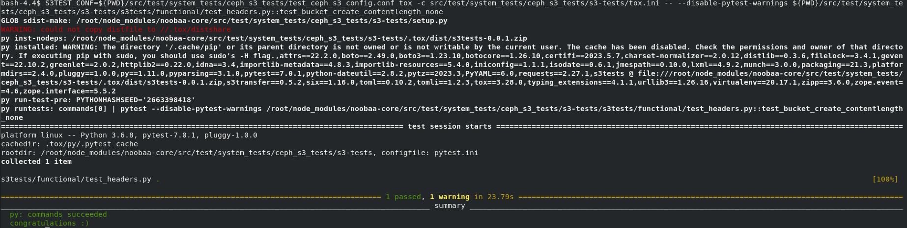
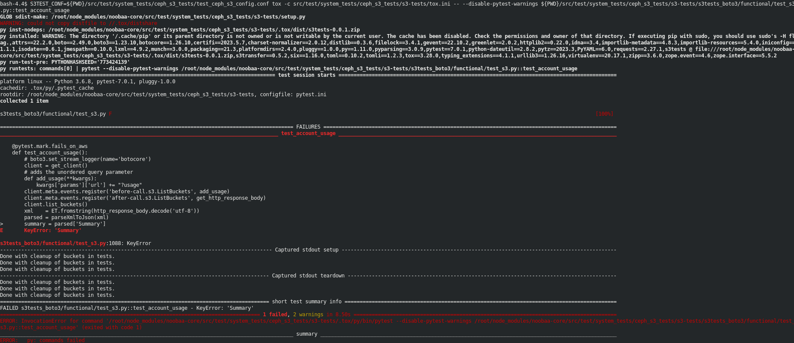
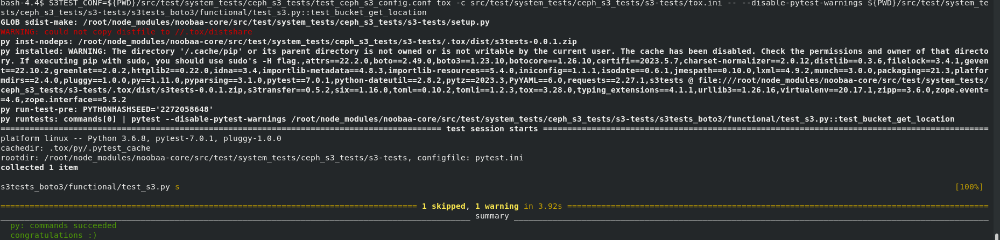

# Ceph S3 Tests Guide
## Introduction
* Ceph S3 tests are unofficial AWS S3 compatibility tests written in Python (for more information see: [ceph/s3-test](https://github.com/ceph/s3-tests) repository on GitHub) that we use in our CI.
* This guide contains:
     1) General Settings For Ceph S3 Tests
     2) Run All Ceph S3 Tests
     3) Run a Single Ceph S3 Test
     4) Debug a Single Ceph S3 Test
     5) Compare to AWS Response (Inside Tester Pod)
     6) Examples
     7) Run a Single Ceph S3 Test in NC deployment Manually
* This guide describes developer steps to run Ceph S3 on a Noobaa system on minikube.

## General Settings For Ceph S3 Tests
We assume that it is not your first deployment of Noobaa system, and you already succeeded with it (If not, please see the guide Deploy Noobaa On Minikube).
We will run the commands in the terminal, you may work with at least two tabs:
1) For noobaa-core repository
2) For noobaa-operator repository

More tabs will be used to view the endpoint logs, connect to the tester pod, etc.
In each step, it is mentioned what tab you should use.

### 1) Before Building The Images (Noobaa-Core Tab)
We will use minikube to run the tests. It is recommended to build all images on the minikube docker daemon. Configure your docker client to use minikube's docker run:
```bash
eval $(minikube docker-env)
```

### 2) Build Operator (Noobaa-Operator Tab)
In order to build the CLI and the operator image run the following:
```bash
. ./devenv.sh
make all
```
Note: the file `devenv.sh` contains the command `eval $(minikube docker-env)`. We run the command `eval $(minikube docker-env)` prior to an image build (whether from noobaa core repository or noobaa operator repository). 

This will build the following:
* noobaa-operator image with tag `noobaa/noobaa-operator:<major.minor.patch>` (for example: `noobaa/noobaa-operator:5.13.0`). this tag is used by default when installing with the CLI.
* noobaa CLI. The `devenv.sh` script is setting an alias `nb` to run the local build of the CLI.

### 3) Build Core And Tester Images (Noobaa-Core Tab)
Run the following to build noobaa core image with the desired tag to build the tester image:
```bash
make tester TESTER_TAG=noobaa-tester:s3-tests
docker tag noobaa:latest noobaa-core:s3-tests
```

### 4) Deploy Noobaa (Noobaa-Operator Tab)
```bash
nb install --mini --noobaa-image='noobaa-core:s3-tests'
# or use the dev flag for higher resources
nb install --dev --noobaa-image='noobaa-core:s3-tests'

```
_Note: We have the alias to `nb` from the step 'Build Operator'._

The installation should take 5-10 minutes.
Once Noobaa is installed please notice that the phase is Ready, you will see it in the CLI logs:

✅ System Phase is "Ready".

You can see something similar to this when getting the pods:
```
> kubectl get pods
NAME                                               READY   STATUS    RESTARTS   AGE
noobaa-core-0                                      1/1     Running   0          51m
noobaa-db-pg-0                                     1/1     Running   0          51m
noobaa-default-backing-store-noobaa-pod-a586c55b   1/1     Running   0          47m
noobaa-endpoint-6cf5cccfc6-rmdrd                   1/1     Running   0          47m
noobaa-operator-5c959d5564-qzgqb                   2/2     Running   0          51m
```

### 5) Wait For Default Backingstore to Be Ready (Noobaa-Operator Tab)
We will use the default backingstore pod to run the tests, we need it to be in phase Ready, run:
```bash
kubectl wait --for=condition=available backingstore/noobaa-default-backing-store --timeout=6m
```

Note that the default backing store might not be up as soon as the noobaa installation completes. For this reason it is advised to run `kubectl get pods` to make sure the default backing store is up. In case its not, wait for it to be up. If you run kubectl wait on the backing store before its up, the command will fail. 

## Run All Ceph S3 Tests

### 1) Prerequisites:
Following the 'General Settings For Ceph S3 Tests' steps.

### 2) Deploy The Tests Job (Noobaa-Core Tab):
```bash
kubectl apply -f src/test/external_tests/ceph_s3_tests/test_ceph_s3_job.yml
```
### 3) View Logs of The Tester Job (New Tab):
```bash
kubectl logs job/noobaa-tests-s3 -f
```

Running all the tests on a local machine takes about 20 minutes. With the current setting, all tests should pass, but there are cases where the endpoint restarts and causes a test to fail. You can also run a single test to be sure that it passes.

#### Skipped tests

We run all the tests except the tests that appear in the lists `src/test/external_tests/ceph_s3_tests/s3-tests-lists` if you would like to add or remove a test you can edit those files (and then repeat the steps starting from 'Build Core And Tester Images (Noobaa-Core)' above).

Some tests are marked to be skipped in the code of ceph/s3-tests repository. Usually, because the environment doesn't support certain criteria. Those tests will appear with a `[WARN]` tag and will be marked as "Test Skipped", for example:
`[WARN] CONSOLE:: Test skipped: s3tests_boto3/functional/test_s3.py::test_lifecycle_transition`

In the test code the function:
`pytest.skip("")` will mark them to be skipped.

## Run a Single Ceph S3 Test

### 1) Prerequisites:
Following the 'General Settings For Ceph S3 Tests' steps.

### 2) Increasing Debug Level (Noobaa-Operator)
Before running a test, you can increase the debug level with Noobaa CLI.
```bash
nb system set-debug-level 1
```
A good level to start with is 1, the higher you go the more verbose and noisy the logs will become (it is recommended using 3 level at the most for those tests).

Tip: If there is an existing printing in a higher level than 1 and you only want to see it (or you wish to add a certain printing) change the debug level of the printing in the code to 0 (repeat the steps starting from 'Build Core And Tester Images (Noobaa-Core)' above), for example:

```diff
-        dbg.log2('message');
+        dbg.log0('message');
```


### 3) Deploy The Tester Deployment (Noobaa-Core Tab)
Use the `test_ceph_s3_deployment.yml` file to install the tester pod. 
Applying this file will result in the deployment of the noobaa tester image in a pod so a developer will be able to run and configure the test from inside of the pod.
```bash
kubectl apply -f src/test/external_tests/ceph_s3_tests/test_ceph_s3_deployment.yml
```

### 4) Setup Test Config (Inside The Tester Pod)
Once the tester pod is up, we can go into it and prepare the environment to run the tests.
both `kubectl` and `oc` can be used:
```bash
# if you have kubectl 
kubectl exec -it <noobaa-tester pod> -- bash
# or with oc
oc rsh <noobaa-tester pod> bash
```

In the tester pod, go to noobaa working directory:
```bash
cd /root/node_modules/noobaa-core/
```

Run the script that will create the necessary accounts in noobaa and update the Ceph S3 tests config file accordingly:
```bash
node ./src/test/external_tests/ceph_s3_tests/test_ceph_s3_config_setup.js
```

For example:

```bash
S3TEST_CONF=${PWD}/src/test/external_tests/ceph_s3_tests/test_ceph_s3_config.conf tox -c src/test/external_tests/ceph_s3_tests/s3-tests/tox.ini -- --disable-pytest-warnings ${PWD}/src/test/external_tests/ceph_s3_tests/s3-tests/s3tests/functional/test_headers.py::test_bucket_create_contentlength_none
```

### 5) Run a Test (Inside The Tester Pod)
To run a test, from noobaa working directory:
```bash
S3TEST_CONF=${PWD}/src/test/external_tests/ceph_s3_tests/test_ceph_s3_config.conf tox -c src/test/external_tests/ceph_s3_tests/s3-tests/tox.ini ${PWD}/src/test/external_tests/ceph_s3_tests/s3-tests/<test_name>
```
This should run the test on the noobaa deployment we've set up.

#### Test Name
You can find a list of tests in the doc inside the file `ceph_s3_tests_list_single_test.txt`. Please notice that the test name has a certain structure: directories are separated with `/`, the files end with the extension `.py` and the function to run (usually with a prefix `test_`) appears after the `::` sign.

In case the test name is incorrect, for example if you add `:` instead of `::` to the test name, the command will fail.
The error will be `file or directory not found` and pytest will exit with error code 4 (which means "pytest command line usage error")

#### Disable pytest warnings
If you want to disable summary warnings add the following flag to the test command:
`-- --disable-pytest-warnings`

Note that every flag that comes after `--` is passed to pytest from tox. so if there is already `--` in the command just put `--disable-pytest-warnings` as part of the flags after it, no need to add another `--` notation.

for example to add --disable-pytest-warnings to the command:
```bash
S3TEST_CONF=${PWD}/src/test/external_tests/ceph_s3_tests/test_ceph_s3_config.conf tox -c src/test/external_tests/ceph_s3_tests/s3-tests/tox.ini -- -m 'not fails_on_rgw' ${PWD}/src/test/external_tests/ceph_s3_tests/s3-tests/s3tests/functional/test_headers.py::test_bucket_create_contentlength_none
```

it should be:
```bash
S3TEST_CONF=${PWD}/src/test/external_tests/ceph_s3_tests/test_ceph_s3_config.conf tox -c src/test/external_tests/ceph_s3_tests/s3-tests/tox.ini -- -m 'not fails_on_rgw' --disable-pytest-warnings ${PWD}/src/test/external_tests/ceph_s3_tests/s3-tests/s3tests/functional/test_headers.py::test_bucket_create_contentlength_none
```

## Debug a Single Test (Inside The Tester Pod)

### 1) Prerequisites:
Following the 'Run a Single Ceph S3 Test' steps.
### 2) View The Test Content 
You can view the test by going to the test file and searching for the test function. e.g. if you are working on test `s3tests_boto3.functional.test_s3:test_set_bucket_tagging` then you should `vim ./src/test/external_tests/ceph_s3_tests/s3-tests/s3tests_boto3/functional/test_s3.py` and search for the function `test_set_bucket_tagging`.

The best place to start investigating is noobaa endpoint pod logs. if you are running with debug level that is higher than 1, you should see log messages of the S3 requests with the prefix `S3 REQUEST`. S3 replies will be with the prefix `HTTP REPLY`.

### 3) Change a Test
Sometimes you would like to change a test: add printing of variables, skip an assertion as needed, or you suspect that it has a faulty and you would like to change the code.

#### A. Temporary change - this change will be saved in the file inside the container, useful when you need a small change.
You can edit a test by going to the test file and editing the test function. See [View The Test Content](#2-view-the-test-content) for how to find the test function.


#### B. Permanent change - this change will be saved in a repo, it is for continues investigating. 
1) Fork and clone the repository [ceph/s3-test](https://github.com/ceph/s3-tests).
2) Create a new branch from the hash number that was set in the file `./src/test/external_tests/ceph_s3_tests/test_ceph_s3_deploy.sh`.
3) Change the code, commit, and push to the remote branch.
4) Inside the file `test_ceph_s3_deploy.sh` (mentioned above) Change the values of `CEPH_LINK` to your remote repository and the `CEPH_TESTS_VERSION` to the newest commit in your repository.
5) Build the tester image again, deploy noobaa, and run the test (repeat the steps starting from 'Build Core And Tester Images (Noobaa-Core)' above).


## Compare to AWS Response (Inside Tester Pod)
Prerequisites:
Following the 'Run a Single Ceph S3 Test' steps until 'Deploy The Tester Deployment (Noobaa-Core Tab)'.

In this section we will do some manual changes that will allow you to check AWS response for a specific test (tests that do not use neither ACL nor tenant group).
1) Copy configuration file - this will allow us to run a test on AWS and then back to NooBaa just by changing the configuration file (we would have 2 configuration files: `test_ceph_s3_config.conf` and `test_ceph_s3_config_aws.conf`):
  ```bash
  cp src/test/external_tests/ceph_s3_tests/test_ceph_s3_config.conf src/test/external_tests/ceph_s3_tests/test_ceph_s3_config_aws.conf
  ```
2) Change the new configuration file to match AWS details:
```bash
vim src/test/external_tests/ceph_s3_tests/test_ceph_s3_config_aws.conf
```
* host = s3.amazonaws.com
* bucket prefix = choose_name

  For example:
  `bucket prefix = foo-bucket` In case the test will fail to delete the bucket, you will need to manually delete it from AWS, and its name will be `foo-bucket1`, it adds suffix of 1.

* access_key, secret_key appears 3 times each in the file.
3) Running tests with the new configuration files will run against AWS:
```bash
S3TEST_CONF=${PWD}/src/test/external_tests/ceph_s3_tests/test_ceph_s3_config_aws.conf tox -c src/test/external_tests/ceph_s3_tests/s3-tests/tox.ini ${PWD}/src/test/external_tests/ceph_s3_tests/s3-tests/<test_name>
```
## Examples

## Running All the Tests

### Prerequisites:
Following the 'Run All Ceph S3 Tests' steps.

### 1) All Running Tested Passed
a snippet from the last part of running all the tests, before the list of skipped and failed tests.
You can see how many tests run and a status for each test.
```
...
Test Passed: s3tests_boto3/functional/test_s3select.py::test_bool_cast_expressions
Test Passed: s3tests_boto3/functional/test_s3select.py::test_output_serial_expressions
Test Passed: s3tests_boto3/functional/test_utils.py::test_generate
Finished Running Ceph S3 Tests
CEPH TEST SUMMARY: Suite contains 779, ran 336 tests, Passed: 310, Skipped: 26, Failed: 0
CEPH TEST SKIPPED TESTS SUMMARY:  26 skipped tests 
s3tests/functional/test_s3.py::test_object_storage_class
s3tests/functional/test_s3.py::test_object_storage_class_multipart
...
```
## Running a Single Test

### Prerequisites:
Following the 'Run a Single Ceph S3 Test' steps.

### 1) Test Pass
For example: 
```bash
S3TEST_CONF=${PWD}/src/test/external_tests/ceph_s3_tests/test_ceph_s3_config.conf tox -c src/test/external_tests/ceph_s3_tests/s3-tests/tox.ini -- --disable-pytest-warnings ${PWD}/src/test/external_tests/ceph_s3_tests/s3-tests/s3tests/functional/test_headers.py::test_bucket_create_contentlength_none
```


Note that there is the warning:
`WARNING: could not copy distfile to //.tox/distshare`
this warning is for tox to use the same dependancies between projects. this feature is deprecated and not used on this project. In order to remove the warning you can modify `src/test/external_tests/ceph_s3_tests/s3-tests/tox.ini` to include the following line in the `[tox]` section: `distshare = /root/node_modules/noobaa-core/.tox/distshare`

### 2) Test Fail
For example:
```bash
S3TEST_CONF=${PWD}/src/test/external_tests/ceph_s3_tests/test_ceph_s3_config.conf tox -c src/test/external_tests/ceph_s3_tests/s3-tests/tox.ini -- --disable-pytest-warnings ${PWD}/src/test/external_tests/ceph_s3_tests/s3-tests/s3tests_boto3/functional/test_s3.py::test_account_usage
```


### 3) Test Skipped
For example:
```bash
S3TEST_CONF=${PWD}/src/test/external_tests/ceph_s3_tests/test_ceph_s3_config.conf tox -c src/test/external_tests/ceph_s3_tests/s3-tests/tox.ini -- --disable-pytest-warnings ${PWD}/src/test/external_tests/ceph_s3_tests/s3-tests/s3tests_boto3/functional/test_s3.py::test_bucket_get_location
```


Notice that even though test commands succeeded the test itself was skipped. The test prints `1 skipped` meaning one test was skipped

## Run a Single Ceph S3 Test in NC deployment Manually

### NC local on your machine
#### Account creation
Create the needed accounts for the Ceph configurations, for example: 
1. ceph (main account)
2. ceph_alt (an account that is used on tests when two different accounts are needed, this is the alternative account - for example I saw it used in one of the bucket policy tests)
3. ceph_tenant  

In cases that you don't need additional account you can simply copy the main account access keys in the ceph configuration file.

To create the accounts in NC with access key and secret key that you chose is by running:  
`sudo node src/cmd/manage_nsfs account add --name ceph --new_buckets_path <new-buckets-path> --access_key <access-key> --secret_key <secret-key> --uid <uid> --gid <gid>`   
(more information can be found in [NooBaa CLI](./../../NooBaaNonContainerized/NooBaaCLI.md))  
for example:  
`sudo node src/cmd/manage_nsfs account add --name ceph --new_buckets_path /private/tmp/nsfs_root1 --access_key <access-key> --secret_key <secret-key> --uid 1001 --gid 1001`.  
Note: before creating the account need to give permission to the `new_buckets_path`, in this example: `mkdir -p /private/tmp/nsfs_root1; sudo chmod 777 /private/tmp/nsfs_root1`.

#### NSFS Server
Start the NSFS server with: `sudo node src/cmd/nsfs --debug 5`  
Note: on every code change you would need to stop the server (ctrl + c) and run it again.

### Ceph S3 repository:
1) Clone the repository [ceph/s3-test](https://github.com/ceph/s3-tests):  
`git clone https://github.com/ceph/s3-tests.git`

2) Edit the attached config, you can rename it and use this config only in the commands that you run, for example:  
`cp s3tests.conf.SAMPLE test_nsfs_ceph_s3_config.conf`, inside the file change the following values `vi test_nsfs_ceph_s3_config.conf`:
  - host = localhost
  - port = 6443
  - is_secure = True
  - ssl_verify = False
  - bucket prefix = your-name-{random}
  - under "[s3 main]" under "main AWS access key" add the ceph account credentials
  - under "[s3 alt]" under "alt AWS access key set in vstart.sh" add the ceph_alt credentials (if your tests do not need it you can copy the ceph credentials)
  - under "[s3 tenant]" under "tenant AWS secret key set in vstart.sh" add 3. ceph_tenant credentials (if your tests do not need it you can copy the ceph credentials)
  - user_id - it depends if your tests uses it and for what purpose, usually you can add the account id, I saw a case where it was for principal in bucket policy and there you can add the account name

3) Run a single test by running:  
`S3TEST_CONF=<configuration-file> tox -- <test-full-name>`  
for example:  
`S3TEST_CONF=test_nsfs_ceph_s3_config.conf tox -- s3tests_boto3/functional/test_s3.py::test_versioning_multi_object_delete_with_marker_create`.  
Make sure that you run it from the Ceph repo: `pwd` will be `<path-to-ceph-S3-repo>/s3-tests`.  
Note: In case you need install boto3 and tox: `python3 -m pip install boto3` and `python3 -m pip install tox`

